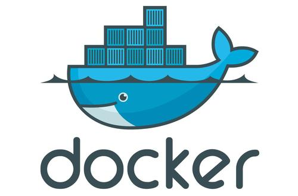
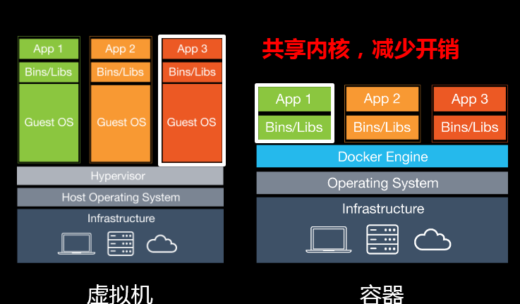
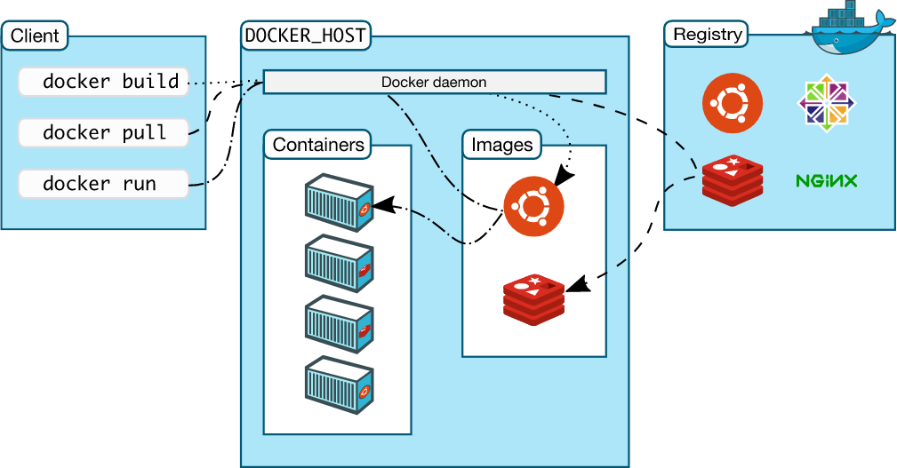
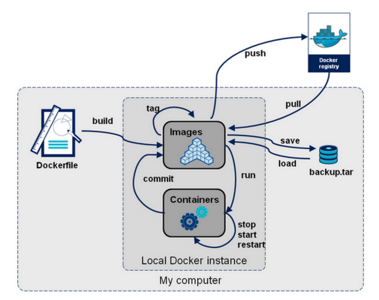

## Docker为什么出现？

一款产品：开发--上线，两套环境

开发--运维。问题：我再我的电脑上可以运行！版本更新，导致服务不可用！对于运维来说，考验就很大。环境配置是十分麻烦的事情，每一个机器都要部署环境，费时费力。

那么自然会想到，发布项目的时候能不能带上相应的开发环境一起打包？

传统：开发jar，运维部署、配置环境。

现在：开发、打包、部署、上线，一套流程做完。

> 例子

手机端：java--apk--发布（应用商店）--张三使用apk--安装即可用！

电脑端：java--jar（环境）--打包项目带上环境（镜像）--（Dokcer仓库：商店）--下载我们发布的镜像--直接运行即可！




## Docker是什么？

Docker 是一个开源的应用容器引擎，让开发者可以打包他们的应用以及依赖包到一个可移植的镜像中，然后发布到任何流行的 Linux或Windows机器上，也可以实现虚拟化，容器是完全使用沙箱机制，相互之间不会有任何接口。

Docker的思想来自于集装箱！

**隔离**：Docker的核心思想！打包装箱！每个箱子（容器）是互相隔离的。

## 为什么使用Docker？

Docker与虚拟机都是为了打包环境，在打包环境上运行特定的应用，但是Docker比虚拟机更轻量化，更快，更好。

**虚拟机技术缺点**：

1. 资源占用十分多（一般10几G，不仅占用硬盘资源，内存资源也需要占用）
2. 冗余步骤多
3. 启动很慢！（因为要虚拟出一套完整的操作系统与虚拟硬件系统还有引导项）



> 容器化技术

**容器化技术不是模拟的一个完整的操作系统**

> 比较Docker与虚拟机的不同：

- 传统虚拟机，虚拟出一套硬件，运行一个完整的操作系统，然后再这个系统上安装和运行软件
- 容器内的应用直接运行在宿主机上，容器没有自己的内核，各容器共用一个内核，无需虚拟硬件，所以更轻便
- 每个容器间相互隔离，每个容器内都有一个属于自己的文件系统，互不影响

> DevOps（开发、运维）

**应用更快速的交付与部署**

传统：一堆帮助文档，安装程序

Docker：打包镜像，发布测试，一键运行

**更便捷的升级和扩缩容**

服务端，即项目团队将项目打包为一个镜像，该镜像可带着环境直接运行在客户端主机上，无需配置环境，若服务端发布更新，客户端可直接重新拉取镜像后运行容器，无需再次配置环境

**更简单的系统运维**

容器化后，我们的开发，测试环境都是高度一致的

**更高效的计算资源利用**

Docker是内核级别的虚拟化，可以在物理机上运行很多容器实例，服务器性能可以被压榨到极致。


## Docker的基本组成




**镜像(image)**

docker镜像就好比一个抽象类或模板，根据这个模板来创建容器服务，Apollo镜像==>run==>Apollo容器（提供服务器），通过这个镜像可以创建多个容器（Apollo1，Apollo2），最终服务运行或者项目运行在容器中。

**容器(container)**

Docker利用容器技术，独立运行一个或者一组应用，容器是通过镜像来创建的。

包含启动，停止，删除等基本命令

目前可以把容器理解为一个简易的linux系统

**仓库(repository)**

仓库就是存放镜像的地方。Docker Hub

仓库分为公有仓库和私有仓库

阿里云，华为云都有容器服务器（配置镜像加速）

## Docker的常用命令

### 帮助命令

```shell
docker version # 显示docker的版本信息
docker info    # 显示docker的系统信息，包含镜像和容器的数量
docker 命令 --help # 万能命令，用于查询具体命令的帮助文档
```

### 镜像命令

**docker images   查看所有本地主机上的镜像**

```shell
# 解释
REPOSITORY  镜像的仓库源
TAG         镜像的标签
IMAGE ID    镜像的ID
CREATED     镜像的创建时间
SIZE        镜像的大小

# 可选项
-a, --all   # 列出所有的镜像
-q, --quiet # 只显示镜像的ID
```

**docker search 搜索镜像**

```
docker search apollo

# 可选项
--filter=STARS=3000 在docker hub上搜索stars超过3000的镜像
```

**docker pull 下载镜像**

```
docker pull apollo
```

**docker rmi 删除镜像**

```shell
docker rmi -f 容器id # 删除指定的容器
docker rmi -f 容器id 容器id ... # 删除多个容器
docker rmi -f $(docker images -aq) # 删除全部的容器
```

### 容器命令

说明：我们有了镜像才可以创建容器

```shell
docker pull apollo
```

**新建容器并启动  docker run [可选参数] image**

```shell
docker run [可选参数] image

# 参数说明
--name="apollo" 容器名字 apollo1，apollo2，用来区分容器
-d              后台方式运行
-it             使用交互方式运行，进入容器查看内容
-p              指定容器的端口 -p 8080:8080
```

**列出所有运行的容器  docker ps**

```shell
docker ps 命令
-a     # 列出当前正在运行的容器+历史运行过的容器
-n=t   # 显示最近创建的t个容器   
-q     # 只显示容器的编号
```

**退出容器**

```shell
exit # 直接退出容器停止并退出
Ctrl + P + Q # 容器不停止退出
```

**删除容器**

```shell
docker rm 容器id  #删除指定容器
docker rm -f $(docker ps -aq) #删除所有容器
docker ps -a -q|xargs docker rm #删除所有的容器
```

**启动和停止容器的操作**

```shell
docker start 容器id    #启动容器
docker restart 容器id  #重启容器
docker stop 容器id     #停止容器
docker kill 容器id     #强制停止当前的容器
```



**docker常用命令详解**

https://www.cnblogs.com/duanxz/p/7905233.html
