# Git笔记

## 版本控制

版本控制（Revision control）是一种在开发的过程中用于管理我们对文件、目录或工程等内容的修改历史，方便查看更改历史记录，备份以便恢复以前的版本的软件工程技术。

- 实现跨区域多人协同开发
- 追踪和记载一个或者多个文件的历史记录
- 组织和保护你的源代码和文档
- 统计工作量
- 并行开发、提高开发效率
- 跟踪记录整个软件的开发过程
- 减轻开发人员的负担，节省时间，同时降低人为错误

**简单说就是用于管理多人协同开发项目的技术**。

没有进行版本控制或者版本控制本身缺乏正确的流程管理，在软件开发过程中将会引入很多问题，如软件代码的一致性、软件内容的冗余、软件过程的事物性、软件开发过程中的并发性、软件源代码的安全性，以及软件的整合等问题。

无论是工作还是学习，或者是自己做笔记，都经历过这样一个阶段！我们就迫切需要一个版本控制工具！

**多人开发就必须要使用版本控制！**

>常见的版本控制工具

我们学习的东西，一定是当下最流行的！

主流的版本控制器有如下这些：

- **Git**
- **SVN**（Subversion）
- **CVS**（Concurrent Versions System）
- **VSS**（Micorosoft Visual SourceSafe）
- **TFS**（Team Foundation Server）
- Visual Studio Online

版本控制产品非常的多（Perforce、Rational ClearCase、RCS（GNU Revision Control System）、Serena Dimention、SVK、BitKeeper、Monotone、Bazaar、Mercurial、SourceGear Vault），现在影响力最大且使用最广泛的是Git与SVN

>版本控制分类

**1、本地版本控制**

记录文件每次的更新，可以对每个版本做一个快照，或是记录补丁文件，适合个人用，如RCS。

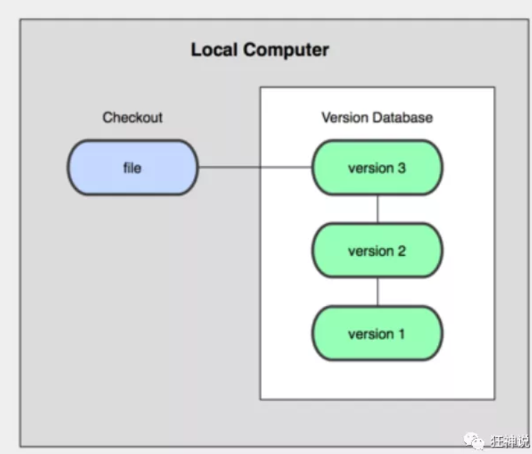

**2、集中版本控制  SVN**

所有的版本数据都存在服务器上，用户的本地只有自己以前所同步的版本，如果不连网的话，用户就看不到历史版本，也无法切换版本验证问题，或在不同分支工作。而且，所有数据都保存在单一的服务器上，有很大的风险这个服务器会损坏，这样就会丢失所有的数据，当然可以定期备份。代表产品：SVN、CVS、VSS


**3、分布式版本控制 	Git**

每个人都拥有全部的代码！安全隐患！

所有版本信息仓库全部同步到本地的每个用户，这样就可以在本地查看所有版本历史，可以离线在本地提交，只需在连网时push到相应的服务器或其他用户那里。由于每个用户那里保存的都是所有的版本数据，只要有一个用户的设备没有问题就可以恢复所有的数据，但这增加了本地存储空间的占用。

不会因为服务器损坏或者网络问题，造成不能工作的情况！

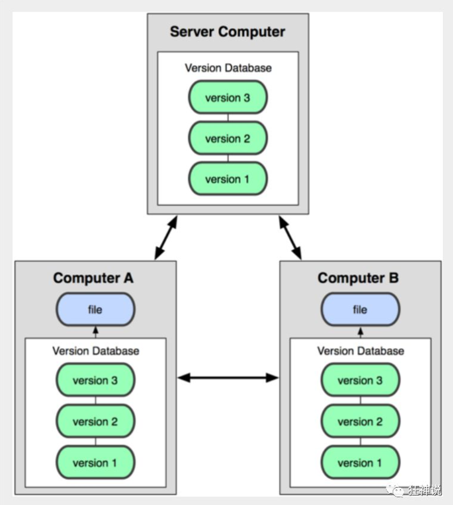

>Git与SVN的主要区别

**SVN是集中式版本控制系统**，版本库是集中放在中央服务器的，而工作的时候，用的都是自己的电脑，所以首先要从中央服务器得到最新的版本，然后工作，完成工作后，需要把自己做完的活推送到中央服务器。**集中式版本控制系统是必须联网才能工作，对网络带宽要求较高**。

**Git是分布式版本控制系统**，没有中央服务器，每个人的电脑就是一个完整的版本库，工作的时候不需要联网了，因为版本都在自己电脑上。协同的方法是这样的：比如说自己在电脑上改了文件A，其他人也在电脑上改了文件A，这时，你们两之间只需把各自的修改推送给对方，就可以互相看到对方的修改了。Git可以直接看到更新了哪些代码和文件！

## Git环境配置

> 软件下载

打开 [git官网] https://git-scm.com/，下载git对应操作系统的版本。

所有东西下载慢的话就可以去找镜像！

官网下载太慢，我们可以使用淘宝镜像下载：http://npm.taobao.org/mirrors/git-for-windows/

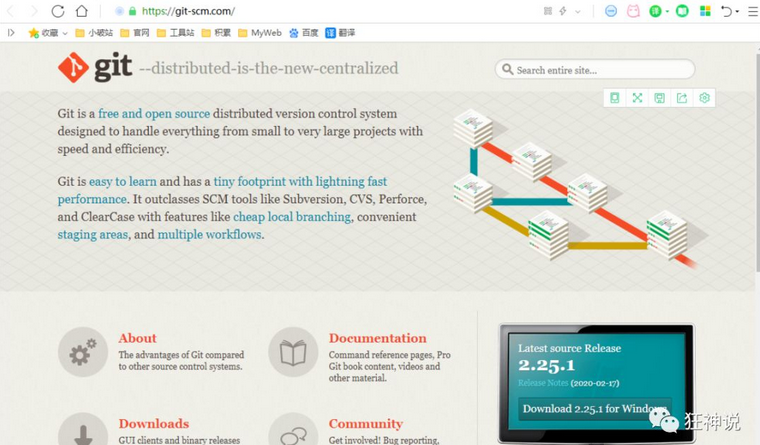

下载对应的版本即可安装！

安装：无脑下一步即可！安装完毕就可以使用了！

> 启动Git

安装成功后在开始菜单中会有Git项，菜单下有3个程序：任意文件夹下右键也可以看到对应的程序！

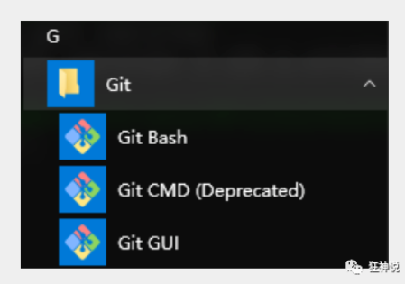

**Git Bash：**Unix与Linux风格的命令行，使用最多，推荐最多

**Git CMD：**Windows风格的命令行

**Git GUI**：图形界面的Git，不建议初学者使用，尽量先熟悉常用命令

> 常用的Linux命令

1）cd : 改变目录。

2）cd . . 回退到上一个目录，直接cd进入默认目录

3）pwd : 显示当前所在的目录路径。

4）ls(ll):  都是列出当前目录中的所有文件，只不过ll(两个ll)列出的内容更为详细。

5）touch : 新建一个文件 如 touch index.js 就会在当前目录下新建一个index.js文件。

6）rm:  删除一个文件, rm index.js 就会把index.js文件删除。

7）mkdir:  新建一个目录,就是新建一个文件夹。

8）rm -r :  删除一个文件夹, rm -r src 删除src目录

```
rm -rf /  切勿在Linux中尝试！删除电脑中全部文件！
```

9）mv 移动文件, mv index.html src index.html 是我们要移动的文件, src 是目标文件夹,当然, 这样写,必须保证文件和目标文件夹在同一目录下。

10）reset 重新初始化终端/清屏。

11）clear 清屏。

12）history 查看命令历史。

13）help 帮助。

14）exit 退出。

15）# 表示注释

> Git配置

所有的配置文件，其实都保存在本地！

查看配置 git config -l


查看不同级别的配置文件：

```
#查看系统config
git config --system --list
　　
#查看当前用户（global）配置
git config --global  --list
```

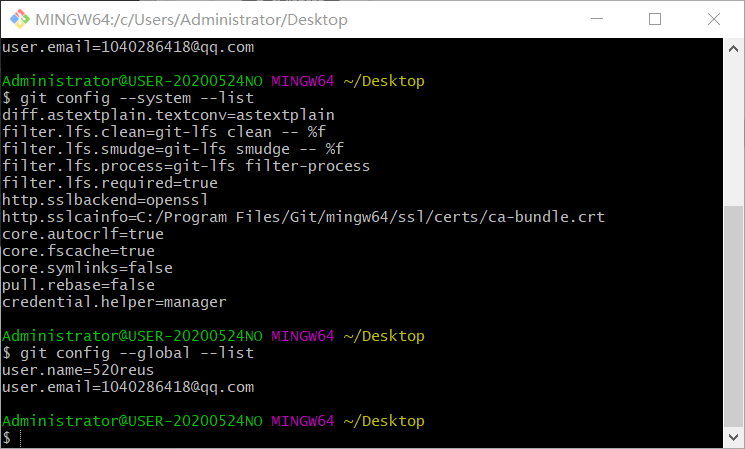

**Git相关的配置文件：**

1）、Git\etc\gitconfig  ：Git 安装目录下的 gitconfig   --system 系统级

2）、C:\Users\Administrator\ .gitconfig   只适用于当前登录用户的配置  --global 全局

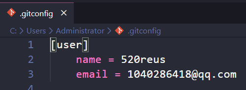

这里可以直接编辑配置文件，通过命令设置后会响应到这里。

>设置用户名与邮箱（用户标识，必要）

当你安装Git后首先要做的事情是设置你的用户名称和e-mail地址。这是非常重要的，因为每次Git提交都会使用该信息。它被永远的嵌入到了你的提交中：

```
git config --global user.name "520reus"  #名称
git config --global user.email 1040286418@qq.com   #邮箱
```

只需要做一次这个设置，如果你传递了--global 选项，因为Git将总是会使用该信息来处理你在系统中所做的一切操作。如果你希望在一个特定的项目中使用不同的名称或e-mail地址，你可以在该项目中运行该命令而不要--global选项。总之--global为全局配置，不加为某个项目的特定配置。

## Git基本理论（重要）

> 三个区域

Git本地有三个工作区域：工作目录（Working Directory）、暂存区(Stage/Index)、资源库(Repository或Git Directory)。如果在加上远程的git仓库(Remote Directory)就可以分为四个工作区域。文件在这四个区域之间的转换关系如下：

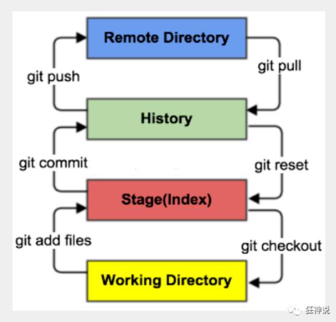

- Workspace：工作区，就是你平时存放项目代码的地方
- Index / Stage：暂存区，用于临时存放你的改动，事实上它只是一个文件，保存即将提交到文件列表信息
- Repository：仓库区（或本地仓库），就是安全存放数据的位置，这里面有你提交到所有版本的数据。其中HEAD指向最新放入仓库的版本
- Remote：远程仓库，托管代码的服务器，可以简单的认为是你项目组中的一台电脑用于远程数据交换

本地的三个区域确切的说应该是git仓库中HEAD指向的版本：

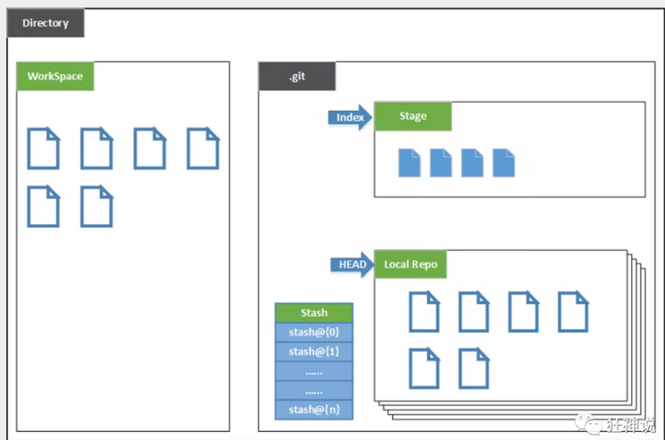

- Directory：使用Git管理的一个目录，也就是一个仓库，包含我们的工作空间和Git的管理空间。
- WorkSpace：需要通过Git进行版本控制的目录和文件，这些目录和文件组成了工作空间。
- .git：存放Git管理信息的目录，初始化仓库的时候自动创建。
- Index/Stage：暂存区，或者叫待提交更新区，在提交进入repo之前，我们可以把所有的更新放在暂存区。
- Local Repo：本地仓库，一个存放在本地的版本库；HEAD会只是当前的开发分支（branch）。
- Stash：隐藏，是一个工作状态保存栈，用于保存/恢复WorkSpace中的临时状态。

> 工作流程

git的工作流程一般是这样的：

１、在工作目录中添加、修改文件；

２、将需要进行版本管理的文件放入暂存区域；

３、将暂存区域的文件提交到git仓库。

因此，git管理的文件有三种状态：已修改（modified）,已暂存（staged）,已提交(committed)

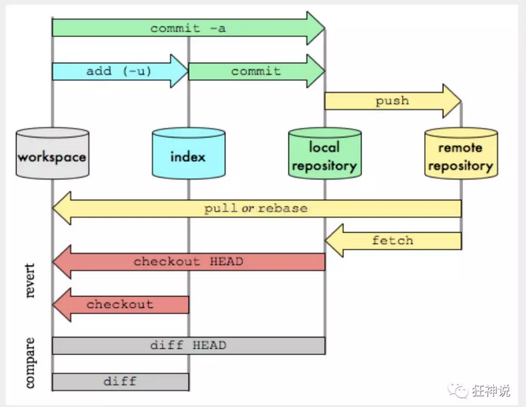

## Git项目搭建

> 创建工作目录与常用指令

工作目录（WorkSpace)一般就是你希望Git帮助你管理的文件夹，可以是你项目的目录，也可以是一个空目录，建议不要有中文。

日常使用只要记住下图6个命令：

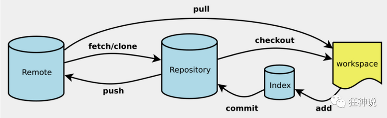

> 本地仓库搭建

创建本地仓库的方法有两种：一种是创建全新的仓库，另一种是克隆远程仓库。

1、创建全新的仓库，需要用GIT管理的项目的根目录执行：

```
# 在当前目录新建一个Git代码库
$ git init
```

2、执行后可以看到，仅仅在项目目录多出了一个.git目录，关于版本等的所有信息都在这个目录里面。

## 克隆远程仓库

1、另一种方式是克隆远程目录，由于是将远程服务器上的仓库完全镜像一份至本地！

```
# 克隆一个项目和它的整个代码历史(版本信息)
$ git clone [url]  # https://gitee.com/kuangstudy/openclass.git
```

2、去 gitee 或者 github 上克隆一个测试！

## Git文件操作

> 文件的四种状态

版本控制就是对文件的版本控制，要对文件进行修改、提交等操作，首先要知道文件当前在什么状态，不然可能会提交了现在还不想提交的文件，或者要提交的文件没提交上。

- Untracked: 未跟踪, 此文件在文件夹中, 但并没有加入到git库, 不参与版本控制. 通过git add 状态变为Staged.
- Unmodify: 文件已经入库, 未修改, 即版本库中的文件快照内容与文件夹中完全一致. 这种类型的文件有两种去处, 如果它被修改, 而变为Modified. 如果使用git rm移出版本库, 则成为Untracked文件
- Modified: 文件已修改, 仅仅是修改, 并没有进行其他的操作. 这个文件也有两个去处, 通过git add可进入暂存staged状态, 使用git  checkout 则丢弃修改过, 返回到unmodify状态, 这个git checkout即从库中取出文件, 覆盖当前修改 !
- Staged: 暂存状态. 执行git commit则将修改同步到库中, 这时库中的文件和本地文件又变为一致, 文件为Unmodify状态. 执行git reset HEAD filename取消暂存, 文件状态为Modified

> 查看文件状态

上面说文件有4种状态，通过如下命令可以查看到文件的状态：

```shell
#查看指定文件状态
git status [filename]

#查看所有文件状态
git status

# git add .                  添加所有文件到暂存区
# git commit -m "消息内容"    提交暂存区中的内容到本地仓库 -m 提交信息
```

> 忽略文件

有些时候我们不想把某些文件纳入版本控制中，比如数据

库文件，临时文件，设计文件等

在主目录下建立".gitignore"文件，此文件有如下规则：

1. 忽略文件中的空行或以井号（#）开始的行将会被忽略。
2. 可以使用Linux通配符。例如：星号（*）代表任意多个字符，问号（？）代表一个字符，方括号（[abc]）代表可选字符范围，大括号（{string1,string2,...}）代表可选的字符串等。
3. 如果名称的最前面有一个感叹号（!），表示例外规则，将不被忽略。
4. 如果名称的最前面是一个路径分隔符（/），表示要忽略的文件在此目录下，而子目录中的文件不忽略。
5. 如果名称的最后面是一个路径分隔符（/），表示要忽略的是此目录下该名称的子目录，而非文件（默认文件或目录都忽略）。

```shell
#为注释
*.txt        #忽略所有 .txt结尾的文件,这样的话上传就不会被选中！
!lib.txt     #但lib.txt除外
/temp        #仅忽略项目根目录下的TODO文件,不包括其它目录temp
build/       #忽略build/目录下的所有文件
doc/*.txt    #会忽略 doc/notes.txt 但不包括 doc/server/arch.txt
```

## 创建一个备份用的Git仓库

目标：建立git项目，实现将本地的git代码或笔记文档定时push到远程仓库（码云）保管，以防丢失，仅个人使用，无需他人协作，因此无需分支，在本地主分支与远程主分支操作即可。

> 步骤

1.在本地新建一个目录

2.在当前目录新建一个Git代码库

```
git init 
```

3.新建一个远程仓库

4.链接本地仓库与远程仓库

```
git remote add origin [远程仓库地址]
```

5.把远程仓库同步到本地，消除差异（第一次pull若发生错误见常见错误）

```
git pull origin master --allow-unrelated-histories
```

6.本地修改后传到远程仓库（第一次push若发生错误见常见错误）

```
git push -u origin master
```

## Git分支

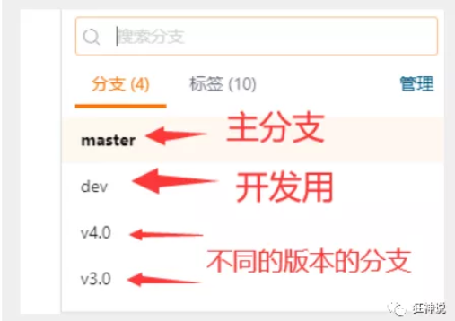

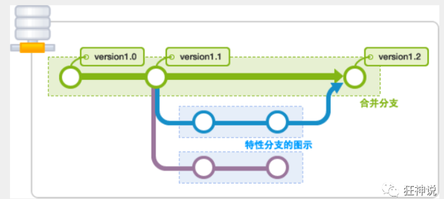

git分支中常用指令：

```
# 列出所有本地分支
git branch

# 列出所有远程分支
git branch -r

# 新建一个分支，但依然停留在当前分支
git branch [branch-name]

# 新建一个分支，并切换到该分支
git checkout -b [branch]

# 合并指定分支到当前分支
$ git merge [branch]

# 删除分支
$ git branch -d [branch-name]

# 删除远程分支
$ git push origin --delete [branch-name]
$ git branch -dr [remote/branch]
```

如果同一个文件在合并分支时都被修改了则会引起冲突：解决的办法是我们可以修改冲突文件后重新提交！选择要保留他的代码还是你的代码！

### Git远程分支与本地分支的作用


**远程主分支应该非常稳定，用来发布新版本，一般情况下不允许在上面工作，工作一般情况下在新建的dev分支上工作，工作完后，比如上要发布，或者说dev分支代码稳定后可以合并到主分支master上来。**

**说白了，新建一个本地副分支就是增加一套新的文件目录，该文件目录用来增加内容，各文件目录都被存放在本地仓库中，通过git checkout切换不同的分支从而切换到不同的文件目录。**

**而本地主分支的作用是负责保持与远程最新公共分支保持同步而存在的，比如每天第一件事就是先把远程分支合并到本地主分支（协同合作远程主分支会发生变化），再合并到本地开发分支；也是为了在开发分支完成工作后先合并到本地主分支，再合并到远程主分支！**

### Git分支操作

本地副分支用来个人开发方便，远程副分支是为了合并代码存在的，下面介绍如何新建本地副分支与远端副分支。

> 1.新建一个本地副分支dev

```
git branch dev
```

> 2.从本地主分支master切换到本地副分支

```
git checkout dev
```

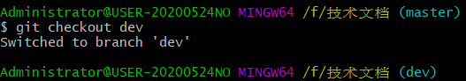

> 3.在dev分支上处理自己负责的内容。**本地分支不同，本地各分支文件夹的内容也不同**，比如我在dev分支上新创建了两个txt文件如图所示

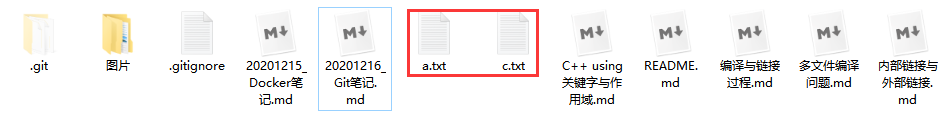

此时我将更改提交到本地仓库，**注：一定要保证提交到本地仓库，即执行到commit指令，只执行到add .指令即只提交到暂存区无法更换分支！**

```
git add . #添加修改到暂存区
git commit -m "new changes" #添加修改到本地仓库，“”一般对修改的内容做说明
git checkout - #回到主分支
```

然后回到主分支查看内容，发现主分支并不会创建在dev分支创建的两个txt文件！所以**在不同的本地分支进行操作具有不同的本地文件内容，会被保存在本地仓库的不同位置，因此使得本地仓库也具有隔离作用！**，因此本地主分支是为了和远程公共分支保持同步而存在的。

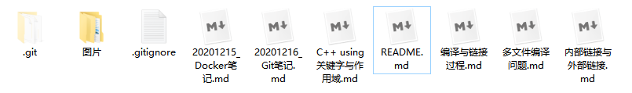

> 4.新建远程副分支(dev)
>
> ```
> git push origin dev:dev #远程分支与本地分支同名，因此想要新建一个远程分支，先新建一个副分支
> ```

### 多人协作流程

因此多人协同开发时，每天早上第一件事是从远程master分支拉取(pull)最新的内容到本地开发分支(dev)：

#### 一：当远程master代码改动了，需要更新本地开发分支（dev）上的代码

```
git checkout master 
git pull # 先将最新的仓库(master)拉取到本地主分支，因为多人协作一天结束后远程master肯定发生变化
git checkout dev # 进入自己的本地开发分支
git merge master  # 用master分支来合并本地分支，即master有新添加内容
git push -u origin dev # 将本地dev分支内容上传到远程dev分支，-u的作用是绑定本地分支与远程分支，这样以后只需要执行git push即可将本地dev分支内容合并到远程dev分支
```

当一天工作结束后，本地开发分支(dev)上的代码达到上线标准后，要合并到远程master分支，使其保持最新的状态

#### 二：本地开发分支（dev）上的代码达到上线的标准后，要合并到远程 master 分支

```
git checkout dev # 首先进入本地开发分支(dev)
git pull # 拉取最新的远程仓库(dev)，先将别人新增的内容合并到本地
git checkout master # 然后进入本地主分支
git merge dev  # 然后将修改后的dev分支内容合并到本地master分支
git push -u origin master # 最后将本地master分支内容push到远程master分支
```

**注：本地同名仓库只能push到的远程同名仓库！**


#### 三：将远程副分支(dev)合并到远程主分支(master)

1. 将远程副分支内容合并到本地副分支
2. 由本地副分支合并到本地主分支
3. 将本地主分支合并到远程主分支

```
git checkout dev # 先进入本地dev分支
git pull origin dev # 将远程dev分支内容合并到本地dev分支
git checkout master # 进入本地主分支
git merge dev # 将本地副分支合并到本地主分支
git push -u origin master # 将本地主分支合并到远程主分支
```


## Git常用命令

### 仓库

```
# 在当前目录新建一个Git代码库
$ git init

# 新建一个目录，将其初始化为Git代码库
$ git init [project-name]

# 下载一个项目和它的整个代码历史
$ git clone [url]
```

### 配置

```
# 显示当前的Git配置
$ git config --list

# 编辑Git配置文件
$ git config -e [--global]

# 设置提交代码时的用户信息
$ git config [--global] user.name "[name]"
$ git config [--global] user.email "[email address]"
```

### 增加/删除文件

```
# 添加指定文件到暂存区
$ git add [file1] [file2] ...

# 添加指定目录到暂存区，包括子目录
$ git add [dir]

# 添加当前目录的所有文件到暂存区
$ git add .

# 添加每个变化前，都会要求确认
# 对于同一个文件的多处变化，可以实现分次提交
$ git add -p

# 删除工作区文件，并且将这次删除放入暂存区
$ git rm [file1] [file2] ...

# 停止追踪指定文件，但该文件会保留在工作区
$ git rm --cached [file]

# 改名文件，并且将这个改名放入暂存区
$ git mv [file-original] [file-renamed]
```

### 代码提交

```
# 提交暂存区到仓库区
$ git commit -m [message]

# 提交暂存区的指定文件到仓库区
$ git commit [file1] [file2] ... -m [message]

# 提交工作区自上次commit之后的变化，直接到仓库区
$ git commit -a

# 提交时显示所有diff信息
$ git commit -v

# 使用一次新的commit，替代上一次提交
# 如果代码没有任何新变化，则用来改写上一次commit的提交信息
$ git commit --amend -m [message]

# 重做上一次commit，并包括指定文件的新变化
$ git commit --amend [file1] [file2] ...
```

### 分支

```
# 列出所有本地分支
$ git branch

# 列出所有远程分支
$ git branch -r

# 列出所有本地分支和远程分支
$ git branch -a

# 新建一个分支，但依然停留在当前分支
$ git branch [branch-name]

# 新建一个分支，并切换到该分支
$ git checkout -b [branch]

# 新建一个分支，指向指定commit
$ git branch [branch] [commit]

# 新建一个分支，与指定的远程分支建立追踪关系
$ git branch --track [branch] [remote-branch]

# 切换到指定分支，并更新工作区
$ git checkout [branch-name]

# 切换到上一个分支
$ git checkout -

# 建立追踪关系，在现有分支与指定的远程分支之间
$ git branch --set-upstream [branch] [remote-branch]

# 合并指定分支到当前分支
$ git merge [branch]

# 选择一个commit，合并进当前分支
$ git cherry-pick [commit]

# 删除分支
$ git branch -d [branch-name]

# 删除远程分支
$ git push origin --delete [branch-name]
$ git branch -dr [remote/branch]
```

### 远程同步

```
# 下载远程仓库的所有变动
$ git fetch [remote]

# 显示所有远程仓库
$ git remote -v

# 显示某个远程仓库的信息
$ git remote show [remote]

# 增加一个新的远程仓库，并命名
$ git remote add [shortname] [url]

# 取回远程仓库的变化，并与本地分支合并
$ git pull [remote] [branch

# 上传本地指定分支到远程仓库
$ git push [remote] [branch]

# 强行推送当前分支到远程仓库，即使有冲突
$ git push [remote] --force

# 推送所有分支到远程仓库
$ git push [remote] --all
```

### 撤销

```
# 恢复暂存区的指定文件到工作区
$ git checkout [file]

# 恢复某个commit的指定文件到暂存区和工作区
$ git checkout [commit] [file]

# 恢复暂存区的所有文件到工作区
$ git checkout .

# 重置暂存区的指定文件，与上一次commit保持一致，但工作区不变
$ git reset [file]

# 重置暂存区与工作区，与上一次commit保持一致
$ git reset --hard

# 重置当前分支的指针为指定commit，同时重置暂存区，但工作区不变
$ git reset [commit]

# 重置当前分支的HEAD为指定commit，同时重置暂存区和工作区，与指定commit一致
$ git reset --hard [commit]

# 重置当前HEAD为指定commit，但保持暂存区和工作区不变
$ git reset --keep [commit]

# 新建一个commit，用来撤销指定commit
# 后者的所有变化都将被前者抵消，并且应用到当前分支
$ git revert [commit]

暂时将未提交的变化移除，稍后再移入
$ git stash
$ git stash pop
```

### 查看信息

```
# 显示有变更的文件
$ git status

# 显示当前分支的版本历史
$ git log

# 显示commit历史，以及每次commit发生变更的文件
$ git log --stat

# 搜索提交历史，根据关键词
$ git log -S [keyword]

# 显示某个commit之后的所有变动，每个commit占据一行
$ git log [tag] HEAD --pretty=format:%s

# 显示某个commit之后的所有变动，其"提交说明"必须符合搜索条件
$ git log [tag] HEAD --grep feature

# 显示某个文件的版本历史，包括文件改名
$ git log --follow [file]
$ git whatchanged [file]

# 显示指定文件相关的每一次diff
$ git log -p [file]

# 显示过去5次提交
$ git log -5 --pretty --oneline

# 显示所有提交过的用户，按提交次数排序
$ git shortlog -sn

# 显示指定文件是什么人在什么时间修改过
$ git blame [file]

# 显示暂存区和工作区的差异
$ git diff

# 显示暂存区和上一个commit的差异
$ git diff --cached [file]

# 显示工作区与当前分支最新commit之间的差异
$ git diff HEAD

# 显示两次提交之间的差异
$ git diff [first-branch]...[second-branch]

# 显示今天你写了多少行代码
$ git diff --shortstat "@{0 day ago}"

# 显示某次提交的元数据和内容变化
$ git show [commit]

# 显示某次提交发生变化的文件
$ git show --name-only [commit]

# 显示某次提交时，某个文件的内容
$ git show [commit]:[filename]

# 显示当前分支的最近几次提交
$ git reflog
```

### 标签

```
# 列出所有tag
$ git tag

# 新建一个tag在当前commit
$ git tag [tag]

# 新建一个tag在指定commit
$ git tag [tag] [commit]

# 删除本地tag
$ git tag -d [tag]

# 删除远程tag
$ git push origin :refs/tags/[tagName]

# 查看tag信息
$ git show [tag]

# 提交指定tag
$ git push [remote] [tag]

# 提交所有tag
$ git push [remote] --tags

# 新建一个分支，指向某个tag
$ git checkout -b [branch] [tag]
```

### 其他

```
# 生成一个可供发布的压缩包
$ git archive
```


## 常见错误

**1.Git使用中报错fatal: The current branch master has no upstream branch.解决方案**

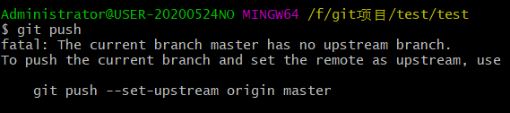

具体原因： 出现这种情况主要是由于远程仓库太多，且分支较多。在默认情况下，`git push`时一般会上传到`origin`下的`master`分支上，然而当repository和branch过多，而又没有设置关联时，git就会产生疑问，因为它无法判断你的push目标。

Git 的 “master” 分支并不是一个特殊分支。 它就跟其它分支完全没有区别。 之所以几乎每一个仓库都有 master 分支，是因为`git init`命令默认创建它，并且大多数人都懒得去改动它。
 远程仓库名字 “origin” 与分支名字 “master” 一样，在 Git 中并没有任何特别的含义一样。origin” 是当你运行git clone时默认的远程仓库名字。 如果你运行 `git clone -o booyah`，那么你默认的远程分支名字将会是 `booyah/master`。

解决办法其实就是确定这两个值，方法有两种：

- 第一种如上图中的提示：`git push --set-upstream origin master`。其中的origin是你在clone远程代码时，git为你创建的指向这个远程代码库的标签，它指向repository。为了能清楚了解你要指向的repository，可以用命令git remote -v进行查看。master是你远程的branch，可以用`git branch -a`查看所有分支，远程分支是红色的部分。然后确定好这两个值后，将值换掉即可。
- 另一种方法是：`git push -u origin master`。同样根据自己的需要，替换origin和master。
   两个命令的区别是第一条命令是要保证你的远程分支存在，如果不存在，也就无法进行关联。而第二条指令即使远程没有你要关联的分支，它也会自动创建一个出来，以实现关联。


**2.Git: There is no tracking information for the current branch.**

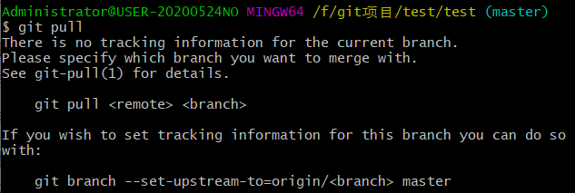

在执行`git pull`的时候，提示当前branch没有跟踪信息：

```
git pull
There is no tracking information for the current branch.
Please specify which branch you want to merge with.
```

对于这种情况有两种解决办法，就比如说要操作master吧，一种是直接指定远程master：

```
git pull origin master
```

另外一种方法就是先指定本地master到远程的master，然后再去pull：

```
git branch --set-upstream-to=origin/master master
git pull
```

这样就不会再出现“There is no tracking information for the current branch”这样的提示了。


**3.git push到GitHub的时候遇到! [rejected] master -> master (non-fast-forward)的问题**

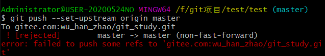

1、git pull origin master --allow-unrelated-histories //把远程仓库同步到本地，消除差异

2、重新add和commit相应文件

3、git push origin master

4、此时就能够上传成功了