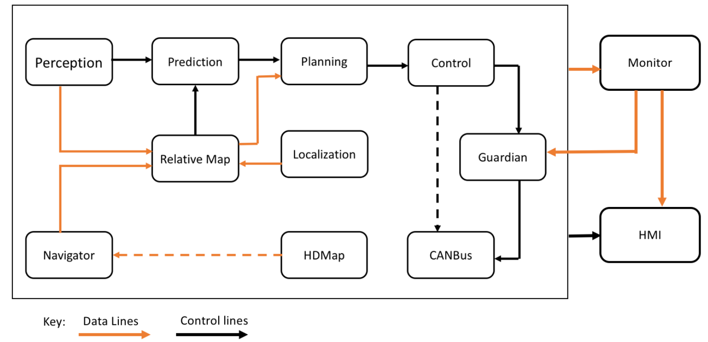

今天学习了github上apollo/docs/specs的内容

Apollo用到的工具

## Doxygen

Doxygen是能够帮助我们从代码注释生成程序的文档

**Graphviz**

Graphviz用来帮助Doxygen生成一些图表，我们不需要直接使用它。


## Apollo 3.0软件架构

自动驾驶Apollo3.0核心软件模块包括：

- **感知** — 感知模块识别自动驾驶车辆周围的世界。感知中有两个重要的子模块：障碍物检测和交通灯检测。
- **预测** — 预测模块预测感知障碍物的未来运动轨迹。
- **路由** — 路由模块告诉自动驾驶车辆如何通过一系列车道或道路到达其目的地。
- **规划** — 规划模块规划自动驾驶车辆的时间和空间轨迹。
- **控制** — 控制模块通过产生诸如油门，制动和转向的控制命令来执行规划模块产生的轨迹。
- **CanBus** — CanBus是将控制命令传递给车辆硬件的接口。它还将底盘信息传递给软件系统。
- **高精地图** — 该模块类似于库。它不是发布和订阅消息，而是经常用作查询引擎支持，以提供关于道路的特定结构化信息。
- **定位** — 定位模块利用GPS，LiDAR和IMU的各种信息源来定位自动驾驶车辆的位置。
- **HMI** — Apollo中的HMI和DreamView是一个用于查看车辆状态，测试其他模块以及实时控制车辆功能的模块.
- **监控** — 车辆中所有模块的监控系统包括硬件。
- **Guardian** — 新的安全模块，用于干预监控检测到的失败和action center相应的功能。 执行操作中心功能并进行干预的新安全模块应监控检测故障。




**HMI**

Apollo中的HMI或DreamView是一个Web应用程序： - 可视化自动驾驶模块的输出，例如，规划轨迹，汽车定位，底盘状态等。 - 为用户提供人机交互界面，以查看硬件状态，打开/关闭模块，以及启动自动驾驶汽车。 - 提供调试工具，如PnC Monitor，以有效跟踪模块问题。

**监控**

包括硬件在内的，车辆中所有模块的监控系统。监控模块从其他模块接收数据并传递给HMI，以便司机查看并确保所有模块都正常工作。如果模块或硬件发生故障，监控会向Guardian（新的操作中心模块）发送警报，然后决定需要采取哪些操作来防止系统崩溃。

**Guardian**

这个新模块根据Monitor发送的数据做出相应决定。Guardian有两个主要功能： - 所有模块都正常工作 - Guardian允许控制模块正常工作。控制信号被发送到CANBus，就像Guardian不存在一样。 - 监控检测到模块崩溃 - 如果监控检测到故障，Guardian将阻止控制信号到达CANBus并使汽车停止。 Guardian有三种方式决定如何停车并会依赖最终的Gatekeeper——超声波传感器， - 如果超声波传感器运行正常而未检测到障碍物，Guardian将使汽车缓慢停止 - 如果传感器没有响应，Guardian会硬制动，使车马上停止。 - 这是一种特殊情况，如果HMI通知驾驶员即将发生碰撞并且驾驶员在10秒内没有干预，Guardian会使用硬制动使汽车立即停止。

```
注意: 
1.在上述任何一种情况下，如果Monitor检测到任何模块或硬件出现故障，Guardian将始终停止该车。
2.监控器和Guardian解耦以确保没有单点故障，并且可以为Guardian模块添加其他行为且不影响监控系统，监控还与HMI通信。
```

