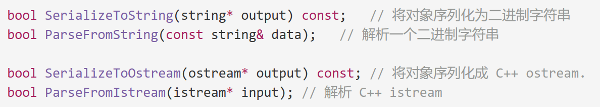
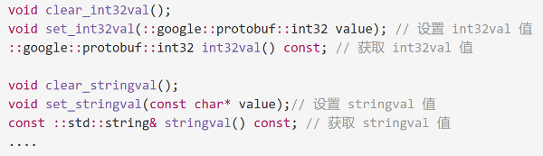

今天学习了用于网络通信和通用数据交换等应用场景中的一些数据存储格式，主要学习谷歌内部使用的protobuf，将其与常用的JSON或XML进行对比。

学习资料来自该作者文档：https://www.jianshu.com/p/a24c88c0526a

**先说JSON**

**JSON（Java Script Object Notation, JS 对象简谱) 是一种轻量级的数据交换格式**。它采用完全独立于编程语言的文本格式来存储和表示数据。简洁和清晰的层次结构使得 JSON 成为理想的数据交换语言。 易于人阅读和编写，同时也易于机器解析和生成，并有效地提升网络传输效率。

**再谈XML**

可扩展标记语言，简称XML，是一种用于标记电子文件使其具有结构性的标记语言。

在电子计算机中，标记指计算机所能理解的信号符号，通过此种标记，计算机之间可以处理包含各种的信息比如文章等。它可以用来标记数据、定义数据类型，是一种允许用户对自己的标记语言进行定义的源语言。它非常适合万维网传输，提供统一的方法来描述和交换独立于应用程序或供应商的结构化数据。是因特网中跨平台的、依赖于内容的技术，也是当今处理分布式结构信息的有效工具。

**序列化协议需要考虑什么**

1. 序列化之后的流大小（占用网络带宽）
2. 序列化和反序列化的性能（CPU+内存资源占用）
3. 是否支持跨语言

# 详解protobuf

## 简介

在网络通信和通用数据交换等应用场景中经常使用的技术是 JSON 或 XML，而在最近的开发中接触到了 Google  的 ProtoBuf。

在查阅相关资料学习 ProtoBuf 以及研读其源码之后，发现其在效率、兼容性等方面非常出色。在以后的项目技术选型中，**尤其是网络通信、通用数据交换等场景应该会优先选择 ProtoBuf。**

### 何为 ProtoBuf

我们先来看看官方文档给出的定义和描述：

- **protocol buffers 是一种语言无关、平台无关、可扩展的序列化结构数据的方法，它可用于（数据）通信协议、数据存储等。**
- **Protocol Buffers 是一种灵活，高效，自动化机制的结构数据序列化方法－可类比 XML，但是比 XML 更小（3 ~ 10倍）、更快（20 ~ 100倍）、更为简单。**
- **你可以定义数据的结构，然后使用特殊生成的源代码轻松的在各种数据流中使用各种语言进行编写和读取结构数据。你甚至可以更新数据结构，而不破坏由旧数据结构编译的已部署程序。**


简单来讲， ProtoBuf 是结构数据**序列化[1]** 方法，可简单**类比于 XML[2]**，其具有以下特点：

- **语言无关、平台无关**。即 ProtoBuf 支持 Java、C++、Python 等多种语言，支持多个平台
- **高效**。即比 XML 更小（3 ~ 10倍）、更快（20 ~ 100倍）、更为简单
- **扩展性、兼容性好**。你可以更新数据结构，而不影响和破坏原有的旧程序

**序列化[1]**：将**结构数据**或**对象**转换成**能够被存储和传输（例如网络传输）的格式**，同时应当要保证这个序列化结果在之后（可能在另一个计算环境中）能够被重建回原来的结构数据或对象。
 **类比于 XML[2]**：这里主要指在数据通信和数据存储应用场景中序列化方面的类比，但个人认为 XML 作为一种扩展标记语言和 ProtoBuf 还是有着本质区别的。

### 使用 ProtoBuf

对 ProtoBuf 的基本概念有了一定了解之后，我们来看看具体该如何使用 ProtoBuf。
 **第一步，创建 .proto 文件，定义数据结构，如下例1所示：**

```protobuf
// 例1: 在 xxx.proto 文件中定义 Example1 message
message Example1 {
    optional string stringVal = 1;
    optional bytes bytesVal = 2;
    message EmbeddedMessage {
        int32 int32Val = 1;
        string stringVal = 2;
    }
    optional EmbeddedMessage embeddedExample1 = 3;
    repeated int32 repeatedInt32Val = 4;
    repeated string repeatedStringVal = 5;
}
```

我们在上例中定义了一个名为 Example1 的 消息，语法很简单，message 关键字后跟上消息名称：

```protobuf
message xxx {

}
```

之后我们在其中定义了 message 具有的字段，形式为：

```protobuf
message xxx {
  // 字段规则：required -> 字段只能也必须出现 1 次
  // 字段规则：optional -> 字段可出现 0 次或1次
  // 字段规则：repeated -> 字段可出现任意多次（包括 0）
  // 类型：int32、int64、sint32、sint64、string、32-bit ....
  // 字段编号：0 ~ 536870911（除去 19000 到 19999 之间的数字）
  字段规则 类型 名称 = 字段编号;
}
```

在上例中，我们定义了：

- 类型 string，名为 stringVal 的 optional 可选字段，字段编号为 1，此字段可出现 0 或 1 次
- 类型 bytes，名为 bytesVal 的 optional 可选字段，字段编号为 2，此字段可出现 0 或 1 次
- 类型 EmbeddedMessage（自定义的内嵌 message 类型），名为 embeddedExample1 的 optional 可选字段，字段编号为 3，此字段可出现 0 或 1 次
- 类型 int32，名为 repeatedInt32Val 的 repeated 可重复字段，字段编号为 4，此字段可出现 任意多次（包括 0）
- 类型 string，名为 repeatedStringVal 的 repeated 可重复字段，字段编号为 5，此字段可出现 任意多次（包括 0）

**第二步，protoc 编译 .proto 文件生成读写接口**

我们在 .proto 文件中定义了数据结构，这些数据结构是面向开发者和业务程序的，并不面向存储和传输。

当需要把这些数据进行存储或传输时，就需要将这些结构数据进行序列化、反序列化以及读写。那么如何实现呢？不用担心， ProtoBuf 将会为我们提供相应的接口代码。如何提供？答案就是通过 protoc 这个编译器。

可通过如下命令生成相应的接口代码：

```php
// $SRC_DIR: .proto 所在的源目录
// --cpp_out: 生成 c++ 代码
// $DST_DIR: 生成代码的目标目录
// xxx.proto: 要针对哪个 proto 文件生成接口代码

protoc -I=$SRC_DIR --cpp_out=$DST_DIR $SRC_DIR/xxx.proto
```

最终生成的代码将提供类似如下的接口：



​																例子-序列化和解析接口.png



​																例子-protoc 生成接口.png

**第三步，调用接口实现序列化、反序列化以及读写**
 针对第一步中例1定义的 message，我们可以调用第二步中生成的接口，实现测试代码如下：

```c++
#include <iostream>
#include <fstream>
#include <string>
#include "single_length_delimited_all.pb.h"

int main() {
    Example1 example1;
    example1.set_stringval("hello,world");
    example1.set_bytesval("are you ok?");

    Example1_EmbeddedMessage *embeddedExample2 = new Example1_EmbeddedMessage();

    embeddedExample2->set_int32val(1);
    embeddedExample2->set_stringval("embeddedInfo");
    example1.set_allocated_embeddedexample1(embeddedExample2);

    example1.add_repeatedint32val(2);
    example1.add_repeatedint32val(3);
    example1.add_repeatedstringval("repeated1");
    example1.add_repeatedstringval("repeated2");

    std::string filename = "single_length_delimited_all_example1_val_result";
    std::fstream output(filename, std::ios::out | std::ios::trunc | std::ios::binary);
    if (!example1.SerializeToOstream(&output)) {
        std::cerr << "Failed to write example1." << std::endl;
        exit(-1);
    }

    return 0;
}
```

### 关于 ProtoBuf 的一些思考

官方文档以及网上很多文章提到 ProtoBuf 可类比 XML 或 JSON。

那么 ProtoBuf 是否就等同于 XML 和 JSON 呢，它们是否具有完全相同的应用场景呢？

个人认为如果要将 ProtoBuf、XML、JSON 三者放到一起去比较，应该区分两个维度。一个是**数据结构化**，一个是**数据序列化**。**这里的数据结构化主要面向开发或业务层面，数据序列化面向通信或存储层面**，当然数据序列化也需要“结构”和“格式”，所以这两者之间的区别主要在于面向领域和场景不同，一般要求和侧重点也会有所不同。**数据结构化侧重人类可读性甚至有时会强调语义表达能力，而数据序列化侧重效率和压缩。**

从这两个维度，我们可以做出下面的一些思考。

XML 作为一种扩展标记语言，JSON 作为源于 JS 的数据格式，都具有**数据结构化**的能力。

例如 XML 可以衍生出 HTML （虽然 HTML 早于 XML，但从概念上讲，HTML 只是预定义标签的 XML），HTML 的作用是标记和表达万维网中资源的结构，以便浏览器更好的展示万维网资源，同时也要尽可能保证其人类可读以便开发人员进行编辑，这就是面向业务或开发层面的**数据结构化**。

再如 XML 还可衍生出 RDF/RDFS，进一步表达语义网中资源的关系和语义，同样它强调**数据结构化**的能力和人类可读。

JSON 也是同理，在很多场合更多的是体现了**数据结构化**的能力，例如作为交互接口的数据结构的表达。在 MongoDB 中采用 JSON 作为查询语句，也是在发挥其数据结构化的能力。

当然，JSON、XML 同样也可以直接被用来**数据序列化**，实际上很多时候它们也是这么被使用的，例如直接采用 JSON、XML 进行网络通信传输，此时 JSON、XML 就成了一种序列化格式，它发挥了数据序列化的能力。但是经常这么被使用，不代表这么做就是合理。实际将 JSON、XML 直接作用数据序列化通常并不是最优选择，因为它们在速度、效率、空间上并不是最优。换句话说它们更适合数据结构化而非数据序列化。

扯完 XML 和 JSON，我们来看看 ProtoBuf，同样的 ProtoBuf 也具有数据结构化的能力，其实也就是上面介绍的 message 定义。我们能够在 .proto 文件中，通过 message、import、内嵌 message 等语法来实现数据结构化，但是很容易能够看出，ProtoBuf 在数据结构化方面和 XML、JSON 相差较大，人类可读性较差，不适合上面提到的 XML、JSON 的一些应用场景。

但是如果从数据序列化的角度你会发现 ProtoBuf 有着明显的优势，效率、速度、空间几乎全面占优，看完后面的 ProtoBuf 编码的文章，你更会了解 ProtoBuf 是如何极尽所能的压榨每一寸空间和性能，而其中的编码原理正是 ProtoBuf 的关键所在，message 的表达能力并不是 ProtoBuf 最关键的重点。所以可以看出 ProtoBuf 重点侧重于**数据序列化** 而非 *数据结构化*。

最终对这些个人思考做一些小小的总结：

- XML、JSON、ProtoBuf 都具有**数据结构化**和**数据序列化**的能力
- XML、JSON 更注重**数据结构化**，关注人类可读性和语义表达能力。ProtoBuf 更注重**数据序列化**，关注效率、空间、速度，人类可读性差，语义表达能力不足（为保证极致的效率，会舍弃一部分元信息）
- ProtoBuf 的应用场景更为明确，XML、JSON 的应用场景更为丰富。

### 开发者指南

protobuf文件后缀名为.proto

这里有一个非常基础的 .proto 文件样例，它定义了一个包含 "person" 相关信息的 message：

```protobuf
message Person {
  required string name = 1;
  required int32 id = 2;
  optional string email = 3;

  enum PhoneType {
    MOBILE = 0;
    HOME = 1;
    WORK = 2;
  }

  message PhoneNumber {
    required string number = 1;
    optional PhoneType type = 2 [default = HOME];
  }

  repeated PhoneNumber phone = 4;
}
```

正如你所见，message 格式很简单 - 每种 message 类型都有一个或多个具有唯一编号的字段，每个字段都有一个名称和一个值类型，其中值类型可以是数字（整数或浮点数），布尔值，字符串，原始字节，甚至（如上例所示）其它 protocol buffer message 类型，这意味着允许你分层次地构建数据。你可以指定 optional 字段，required 字段和 repeated 字段。

**一旦定义了 messages，就可以在 .proto 文件上运行 protocol buffer 编译器来生成指定语言的数据访问类**。这些类为每个字段提供了简单的访问器（如 name()和 set_name()），以及将整个结构序列化为原始字节和解析原始字节的方法 - 例如，如果你选择的语言是 C++，则运行编译器上面的例子将生成一个名为 Person 的类。然后，你可以在应用程序中使用此类来填充，序列化和检索 Person 的 messages。于是你可以写一些这样的代码：

```c
Person person;
person.set_name("John Doe");
person.set_id(1234);
person.set_email("jdoe@example.com");
fstream output("myfile", ios::out | ios::binary);
person.SerializeToOstream(&output);
```

之后，你可以重新读取解析你的 message

```c
fstream input("myfile", ios::in | ios::binary);
Person person;
person.ParseFromIstream(&input);
cout << "Name: " << person.name() << endl;
cout << "E-mail: " << person.email() << endl;
```

你可以在 message 格式中添加新字段，而不会破坏向后兼容性;旧的二进制文件在解析时只是忽略新字段。因此，如果你的通信协议使用 protocol buffers 作为其数据格式，则可以扩展协议而无需担心破坏现有代码。

### 语法指引（proto2）

https://www.jianshu.com/p/6f68fb2c7d19