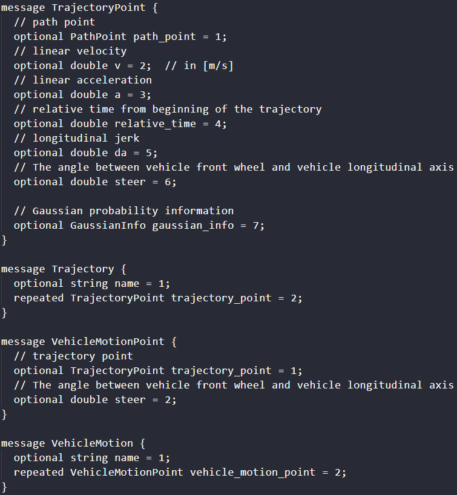
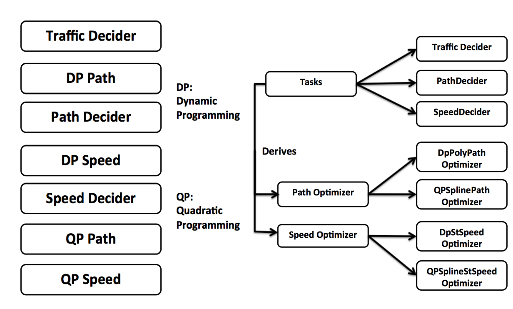
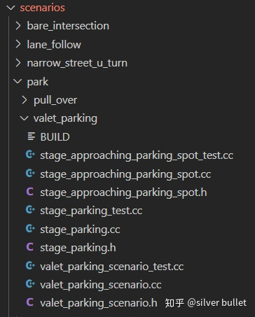

今天学习Apollo5.5的planning模块中的代码

## 文件目录简介

注：以下为3.0版本，与5.5版本目录相差不大

### apollo根目录

 ├── .github/ISSUE_TEMPLATE目录   // 问题记录的文档
 ├── .vscode                     // 启动的一些参数配置
 ├──  docker // docker有关的文件,如启动docker脚本,进入docker容器脚本
 ├──  docs   // 文档模块，有完整英文文档和部分中文文档
 ├──  modules// apollo中各个模块的源代码，如感知，决策，规划等核心模块
 ├──  scripts// 启动脚本，如启动hmi的脚本
 ├──  third_party     // 第三方的库
 └──  tools  // 编译相关配置文件

**Apollo项目是用Bazel来做为代码编译工具，每个源码文件夹下都有一个 BUILD文件即bazel的编译配置文件。**

### modules目录下的子目录

 ├── calibration// 标定模块，现在已经实现自动标定的功能
 ├── canbus     // can总线相关的模块
 ├── common     // 公共源码模块如日志，工厂模式的实现，日志系统，监控模块，数学算法等
 ├── control    // 控制模块，输入规划信息输出油门刹车转向命令给车辆底盘
 ├── data       // 数据的收集，存储和处理
 ├── dreamview  // 可视化模块，查看规划的轨迹及实时的转向刹车油门信息
 ├── drivers    // GNSS设备驱动，包括NovAtel, Applanix, u-blox， velodyne驱动
 ├── e2e        // 端到端模块
 ├── elo        // 利用高精地图的自定位模块
 ├── guardian   // 监护进程，主要是为了安全
 ├── localization // 定位模块，输入GPS和IMU信息输出自车定位信息
 ├── map        // 高精地图模块，输出结构化地图信息，如车道线，十字路口等
 ├── monitor    // 监控模块,监控硬件状态，同时把状态发给hmi
 ├── perception // 感知模块，输入激光点云，高精地图，变换坐标
 ├── planning   // 决策规划模块
 ├── prediction // 预测模块，输出感知的障碍物信息及自定位信息输出障碍物未来的轨迹
 ├── routing    // 全局导航模块，输入包括地图信息各起点终点地址，输出一个全局的导航信息
 ├── third_party_perception // 车辆姿态模拟线程
 └── tools      // 第三方的感知模块


## 规划模块

规划模块的任务是根据输入的路由（全局规划信息）、感知和预测信息、车辆状态与定位信息和高精地图（HD-map）信息来生成一条无碰撞且舒适的轨迹给无人车底层控制模块

### 输出与输入

#### 输出

输出数据定义在modules/planning/proto/planning.proto文件内


**planning.proto**

该proto文件定义了整体规划时间和长度，还有给控制模块执行的实际轨迹数据，为一系列的轨迹点，轨迹点数据定义在modules/common/proto/pnc_point.proto



轨迹点数据包含了路径点数据，并且加入了速度、相对时间、加速度、jerk等信息，路径点信息如下：


除了规划点数据信息，规划模块还输出了

- Estop：Estop是指示错误和异常的命令。 例如，当自动驾驶车辆与障碍物碰撞或不能遵守交通规则时，将发送急停信号。
- DecisionResult： DecisionResult数据主要用于模拟显示，以便开发人员可以更好地了解计划结果。
- Debug information：更详细的数字中间结果存储在调试信息中，并发送给调试。

#### 输入

- Routing
- Perception and Prediction
- Vehicle Status and Localization
- HD-Map

**Routing（路由）模块**

Routing（路由）模块主要负责告诉无人车“Where I want to go”，即负责全局规划，告诉无人车从哪个位置开到哪个位置，数据信息定义在modules/routing/proto/routing.proto，RoutingResponse嵌套包含了RoadSegment信息，展示了从出发点到目的地哪条路需要follow，使用路中的哪个车道来达到最终的目的地。


**perception（感知）模块**

感知模块告诉无人车 “what is surrounding me”，负责感知车辆周围障碍物以及交通环境信息，modules\perception\proto\perception_obstacle.proto定义了车辆感知到的周围障碍物数据；


modules/perception/proto/traffic_light_detection.proto定义了感知到的交通灯状态数据；


除了要感知周围障碍物以及前方交通信号状态，对于规划模块很重要的一点是预测动态障碍物的运动轨迹，因此

嵌套包含了障碍物感知的障碍物轨迹预测信息定义在modules/prediction/proto/prediction.proto里面!


每一个预测轨迹都有一个概率结果，因此一个障碍物可能有多个预测轨迹。除了“where I want to go” 和 “what is surrounding me”,另外一个很重要的便是 “where am I”，该信息由HD-map高精地图信息和定位模块负责。定位和车辆底盘信息集成在modules/common/vehicle_state.proto中


#### 代码结构与类层级


**ReferenceLineInfo**：该类封装了ReferenceLine类，表示输入给规划模块一个平滑的参考轨迹

**Frame**：包含了感知的障碍物信息和它们的预测轨迹信息，和现在车辆的状态。

**HD-Map**:作为规划模块内的一个库，用于特殊形式的地图查询。

**EM Planner**：EM规划器，继承自Planner类，2.0版本中RTK Planner和EM Planner均继承自Planner类


例如，在EM-Planner执行的计划周期内，采用迭代方法，其中三类任务交织在一起。这些“决策器/优化器”类之间的关系如下所示



- **Deciders** ：包括交通决策、路径决策和速度决策
- **Path Optimizers** DP/QP路径优化
- **Speed Optimizers** DP/QP速度优化

计算完成后，将最终的时空离散轨迹并发布，以便下游控制模块能够执行该轨迹。

### 介绍

 在5.5版本之前，阿波罗使用相同的配置和参数来规划不同的驾驶场景。尽管这种方法是线性的，易于实现，但它并不灵活，也不特定于场景。随着阿波罗的成熟，在不同的道路条件和驾驶用例上，我们觉得有必要采取更模块化、特定场景和整体性的方法来规划其轨迹。在这种方法中，每个驾驶用例都被视为不同的驾驶场景。这是有用的，因为现在在特定场景中报告的问题可以在不影响其他场景的工作的情况下得到修复，而不是以前的版本，其中问题修复会影响其他驾驶用例，因为它们都被视为单个驾驶场景。 

 阿波罗5.5主要针对城市道路上的curb-to-curb自动驾驶，引入了两种新的规划方案。 

 阿波罗6.0扩展了数据驱动的方法来解决基于学习模型的轨迹规划问题，并引入了两种新的规划模式：E2E模式和混合模式，展示了动态移动障碍物的新能力。在这两种模式中，还定义了一系列api，开发人员可以在其中生成自己的培训数据并集成自己的模型。 

 注：目前E2E模式的开发还处于早期阶段，在该阶段中，模型是为动态推动场景而训练的，作为研究演示的目的。该模型的能力是有限的，当它在更广泛的场景中进行测试时，它是次优的。E2E模式和混合模式还没有在实际道路上进行测试，而是作为一个基线来促进和鼓励对基于学习的规划的广泛研究。欢迎所有开发人员通过任何方式与我们合作，包括算法、模型和数据。 

### 驾驶场景

1. Lane Follow(default)
2. Intersection
3. Pull-Over
4. Park-and-go
5. Emergency

详见github文档： https://github.com/ApolloAuto/apollo/blob/r5.5.0/modules/planning/README.md

### 模块架构


在Apollo 5.5中，规划模块架构已被修改，以纳入城市道路上新的curb-to-curb驾驶场景。如下图所示，我们有两个新的复杂场景：Emergency和Park-and-go。为了有效地规划这些场景，我们有两个新的决策器——路径重用决策器和限速决策器，并更新了现有的决策器，使得规划架构足够健壮和灵活，能够处理许多不同类型的城市道路驾驶场景。

**每个驱动场景都有一组独特的驱动参数，使其更安全、更高效、更易于定制和调试、更灵活。**


### 代码结构与调用流程

#### Planning模块的结构与调用流程（1）

本文主要围绕 apollo/modules/planning/ 模块分析Apollo5.0是如何组织轨迹规划的实现的。

**1.Planner**

在 apollo/modules/planning/planner/planner.h 文件中，定义了2个类：Planner类和  PlannerWithReferenceLine类。其中，Planner类是所有规划器的基类，重要函数有Init() 和  Plan()。PlannerWithReferenceLine类 也是继承自  Planner类，重要函数有PlanOnReferenceLine()。

planning  模块中有4种规划器，分别为：RTKReplayPlanner，PublicRoadPlanner，NaviPlanner，LatticePlanner。每个规划器针对不同的场景和问题。在这4个规划器中，都实现了继承自Planner类的Plan()函数和继承自PlannerWithReferenceLine类的PlanOnReferenceLine()函数。在执行具体的规划任务时，都是在Plan()中调用PlanOnReferenceLine()，从而获得规划的轨迹结果。也就是说，最底层的规划方法，是在各规划器的PlanOnReferenceLine()中实现。


```cpp
/**
 * @class NaviPlanner
 * @brief NaviPlanner is a planner based on real-time relative maps. It uses the
 * vehicle's FLU (Front-Left-Up) coordinate system to accomplish tasks such as
 * cruising, following, overtaking, nudging, changing lanes and stopping.
 * Note that NaviPlanner is only used in navigation mode (turn on navigation
 * mode by setting "FLAGS_use_navigation_mode" to "true") and do not use it in
 * standard mode.
 */
class NaviPlanner : public PlannerWithReferenceLine { ... }

/**
 * @class PublicRoadPlanner
 * @brief PublicRoadPlanner is an expectation maximization planner.
 */
class PublicRoadPlanner : public PlannerWithReferenceLine { ... }

/**
 * @class RTKReplayPlanner
 * @brief RTKReplayPlanner is a derived class of Planner.
 *        It reads a recorded trajectory from a trajectory file and
 *        outputs proper segment of the trajectory according to vehicle
 *        position.
 */
class RTKReplayPlanner : public PlannerWithReferenceLine { ... }
```

**2. PlannerDispatcher**

在  apollo\modules\planning\planner\planner_dispatcher.h  文件中定义了PlannerDispatcher类，用来根据预先设定的配置文件，选择合适的planner。该类中重要的函数是DispatchPlanner()。

NaviPlannerDispatcher类继承自PlannerDispatcher类，实现了DispatchPlanner()。由下面的代码可知，其从config文件（apollo\modules\planning\conf\planning_config_navi.pb.txt）中读取planner_type，然后创建对应类型的planner。而配置文件中设定planner_type为“NAVI”，对应NaviPlanner。

```cpp
std::unique_ptr<Planner> NaviPlannerDispatcher::DispatchPlanner() {
  PlanningConfig planning_config;
  if (!apollo::cyber::common::GetProtoFromFile(FLAGS_planning_config_file,
                                               &planning_config)) {
    return nullptr;
  }

  auto planner_type = PlannerType::NAVI;
  if (planning_config.has_navigation_planning_config()) {
    planner_type = planning_config.navigation_planning_config().planner_type(0);
  }
  return planner_factory_.CreateObject(planner_type);
}
```

与NaviPlannerDispatcher类相似，OnLanePlannerDispatcher类也是继承自PlannerDispatcher类，实现了DispatchPlanner()。不同的是其config文件（apollo\modules\planning\conf\planning_config.pb.txt）设定了planner_type为“PUBLIC_ROAD”，对应PublicRoadPlanner。


**3. PlanningBase**

在 apollo\modules\planning\planning_base.h 文件中，定义了PlanningBase类。该类有2个重要的函数：RunOnce()和Plan()，还有几个重要的成员变量，这里暂时只关注2个：

```cpp
std::unique_ptr<Planner> planner_;
std::unique_ptr<PlannerDispatcher> planner_dispatcher_;
```

PlanningBase类用来描述规划的执行过程，这样就可以把通用的规划过程（planning）和具体的规划算法（planner）解耦，具有非常强的鲁棒性。

NaviPlanning类继承自PlanningBase类，实现了RunOnce()和Plan()  2个函数。在NaviPlanning类的构造函数中，planner_dispatcher_（从PlanningBase类继承而来）被初始化为了NaviPlannerDispatcher类型的unique_ptr。然后，在NaviPlanning::Init()中，调用DispatchPlanner()  指定要使用的规划器。RunOnce()被计时器周期性的触发和运行，在其中调用了NaviPlanning::Plan()，而NaviPlanning::Plan()中又调用了NaviPlanner::Plan()。

```cpp
//NaviPlanning类的构造函数中设定PlannerDispatcher
NaviPlanning() {
    planner_dispatcher_ = std::make_unique<NaviPlannerDispatcher>();
}
//NaviPlanning::Init()中设定Planner
planner_ = planner_dispatcher_->DispatchPlanner();
```

与NaviPlanning类相似，OnLanePlanning类也是继承自PlanningBase类，实现了RunOnce()和Plan()  2个函数。在OnLanePlanning类的构造函数中，planner_dispatcher_被初始化为了OnLanePlannerDispatcher类型的unique_ptr。然后，在OnLanePlanning::Init()中，调用DispatchPlanner()  指定要使用的规划器。RunOnce()被计时器周期性的触发和运行，在其中调用了OnLanePlanning::Plan()，而OnLanePlanning::Plan()中又调用了PublicRoadPlanner::Plan()。


**4. PlanningComponent**

在apollo\modules\planning\planning_component.h 文件中定义了PlanningComponent类，该类包含一个PlanningBase类型的unique_ptr成员变量。

```cpp
class PlanningComponent final
    : public cyber::Component<prediction::PredictionObstacles, canbus::Chassis,
                              localization::LocalizationEstimate> {
public:
  bool Init() override;
  bool Proc(const std::shared_ptr<prediction::PredictionObstacles>&
                prediction_obstacles,
            const std::shared_ptr<canbus::Chassis>& chassis,
            const std::shared_ptr<localization::LocalizationEstimate>&
                localization_estimate) override;
private:
  std::unique_ptr<PlanningBase> planning_base_;
  ...
}
```

在PlanningComponent::Proc()中，调用了PlanningBase类的RunOnce函数。根据继承与虚函数的多态特性，相对应的planning流程和planner会执行具体的规划任务。

```cpp
ADCTrajectory adc_trajectory_pb;
planning_base_->RunOnce(local_view_, &adc_trajectory_pb);
```


#### Planning模块的结构与调用流程（2）

Apollo5.0的Planning模块是基于Scenario、Stage、Task这样的层次组织的，针对不同的场景设计不同的算法细节。Scenario指一个特定的问题或场景，Stage指在一个Scenario下的规划方法的粗略步骤，Task指一个具体的处理方法。相应地，一个Scenario包含多个Stage，一个Stage包含多个Task。那我们按照由下向上的顺序展开说。

```cpp
//Scenario类中包含Stage
std::unordered_map<ScenarioConfig::StageType,
                     const ScenarioConfig::StageConfig*, std::hash<int>>
      stage_config_map_;

//Stage类中包含Task
std::map<TaskConfig::TaskType, std::unique_ptr<Task>> tasks_;
std::vector<Task*> task_list_;
```

**1. Task**


在apollo/modules/planning/tasks文件夹中，Task分为4类：deciders，optimizers，rss，smoothers。task.h定义了Task基类，其中重要的是2个Execute()函数。

```cpp
virtual common::Status Execute(Frame* frame,
                               ReferenceLineInfo* reference_line_info);
virtual common::Status Execute(Frame* frame);
```

TaskFactory类是为了方便的构造Task对象。


decider.h中定义了Decider类，继承自Task类，对应着继承而来的2个Execute()，分别定义了2个Process()，即Task的执行是通过Decider::Process()运行的。

```cpp
apollo::common::Status Decider::Execute(
    Frame* frame, ReferenceLineInfo* reference_line_info) {
  Task::Execute(frame, reference_line_info);
  return Process(frame, reference_line_info);
}

apollo::common::Status Decider::Execute(Frame* frame) {
  Task::Execute(frame);
  return Process(frame);
}
```

不同的Decider如CreepDecider类等，都是继承自Decider类，分别实现自己的Process()，如CreepDecider::Process()。比较特殊的是PathDecider和SpeedDecider类是直接继承自Task类的，因此要实现自己的Execute()。


Optimizer有3种，都继承自Task类，分别是：PathOptimizer，SpeedOptimizer，TrajectoryOptimizer。这3种Optimizer实现了各自的Execute()，并定义了纯虚函数Process()在Execute()中被调用，由子类实现具体的Process()。不同的优化器，如PiecewiseJerkPathOptimizer是继承自PathOptimizer的，实现自己的Process()。

RssDecider继承自Task类，实现了Execute()。

Smoother是个特例，并没有继承Task类，关键函数Smooth()。


**2. Stage**


scenarios文件夹中包含了多种场景，内部的每个文件夹就是一个scenario的定义和解决。首先看Stage类的定义，主要的处理都在Stage::Process()中（此处是纯虚函数）。

```cpp
class Stage {
 public:
  ...
  /**
   * @brief Each stage does its business logic inside Process function.
   * If the stage want to transit to a different stage after finish,
   * it should set the type of 'next_stage_'.
   */
  virtual StageStatus Process(
      const common::TrajectoryPoint& planning_init_point, Frame* frame) = 0;
  /**
   * @brief The sequence of tasks inside the stage. These tasks usually will be
   * executed in order.
   */
  const std::vector<Task*>& TaskList() const { return task_list_; }  
  ScenarioConfig::StageType NextStage() const { return next_stage_; }

 protected:
  bool ExecuteTaskOnReferenceLine(
      const common::TrajectoryPoint& planning_start_point, Frame* frame);
  bool ExecuteTaskOnOpenSpace(Frame* frame);
  ...
 protected:
  std::map<TaskConfig::TaskType, std::unique_ptr<Task>> tasks_;
  std::vector<Task*> task_list_;  
  ScenarioConfig::StageType next_stage_;
  ...
};
```



这里以scenarios/park/valet_parking举例，定义了继承自Scenario类的ValetParkingScenario类，并注册了2个Stage：VALET_PARKING_APPROACHING_PARKING_SPOT和VALET_PARKING_PARKING，分别对应继承自Stage类的StageApproachingParkingSpot类和StageParking类。即想停车，第一步先将车行驶到接近停车位，第二步停入停车位。我们上面提到了一个Stage包含一个Task  List，是在哪设定的呢？其实是在apollo/modules/planning/conf/scenario/valet_parking_config.pb.txt中。在StageApproachingParkingSpot::Process()中，会调用Stage::ExecuteTaskOnReferenceLine()，而在Stage::ExecuteTaskOnReferenceLine()中，又会遍历Task List，对每一个Task执行task->Execute()。


**3. Scenario** 

再看Scenario类的定义。在Scenario::Process()中，通过调用Stage::Process()来处理该stage所包含的task。当该stage处理完成时，就切换到下一个stage。只要当前的stage不是空、有意义，scenario就是“未完成”的状态，从而可以继续执行接下来的Stage。当前的stage是空，则所有的stage处理完成了，scenario才处理完毕。

```cpp
Scenario::ScenarioStatus Scenario::Process(
    const common::TrajectoryPoint& planning_init_point, Frame* frame) {
  ...
  //在Stage中处理Task List，返回Stage的状态
  auto ret = current_stage_->Process(planning_init_point, frame);
  switch (ret) {
    ...
    case Stage::RUNNING: {
      scenario_status_ = STATUS_PROCESSING;
      break;
    }
    case Stage::FINISHED: {
      auto next_stage = current_stage_->NextStage();      
      ...
      if (current_stage_ != nullptr &&
          current_stage_->stage_type() != ScenarioConfig::NO_STAGE) {
        //只要current_stage_不是空、有意义，scenario_status_就是“未完成”，
        //从而可以继续执行接下来的Stage
        scenario_status_ = STATUS_PROCESSING;
      } else {
        scenario_status_ = STATUS_DONE;
      }
      break;
    }
    ...
  }
  return scenario_status_;
}
```

这里还是以valet_parking为例，给出函数的调用与实际执行的层次、次序。其他情况类似。


**4. ScenarioManager**

ScenarioManager类用来管理各个Scenario的判别和切换，通过ScenarioManager::Update() 进而调用 ScenarioManager::ScenarioDispatch() 来改变当前对应的scenario。