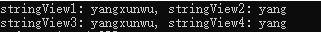
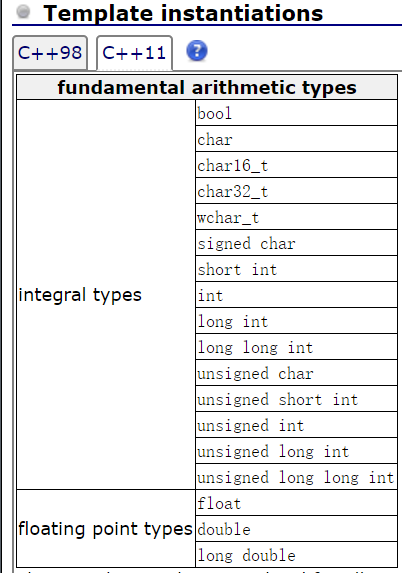
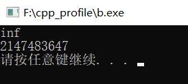

# C++17 std::string_view使用介绍

C++中与字符串有两种风格，分别是C风格的字符串、std::string字符串。C风格的字符串性能更高，但是也不方便操作使用。如下示例：

```c++
#include <iostream>
#include <string>
 
int main()
{
    //C风格字符串总是以null结尾
    char cstr1[] = { 'y', 'a', 'n', 'g', NULL};
    char cstr2[5];
    strcpy(cstr2, cstr1);
    std::cout << cstr2 << std::endl;
 
    //C++风格的字符串操作更方便，但是性能不如C风格字符串
    std::string str = "yang";
    std::string str2 = str;
}
```

C++17中我们可以使用std::string_view来获取一个字符串的视图，字符串视图并不真正的创建或者拷贝字符串，而只是拥有一个字符串的查看功能。std::string_view比std::string的性能要高很多，因为每个std::string都独自拥有一份字符串的拷贝，而std::string_view只是记录了自己对应的字符串的指针和偏移位置。当我们在只是查看字符串的函数中可以直接使用std::string_view来代替std::string。

```c++
#include <iostream>
#include <string>
#include <string_view>
 
int main()
{
 
    const char* cstr = "yangxunwu";
    std::string_view stringView1(cstr);
    std::string_view stringView2(cstr, 4);
    std::cout << "stringView1: " << stringView1 << ", stringView2: " << stringView2 << std::endl;
 
    std::string str = "yangxunwu";
    std::string_view stringView3(str.c_str());
    std::string_view stringView4(str.c_str(), 4);
    std::cout << "stringView3: " << stringView1 << ", stringView4: " << stringView2 << std::endl;
}
```

输出



你可以把原始的字符串当作一条马路，而我们是在马路边的一个房子里，我们只能通过房间的窗户来观察外面的马路。这个房子就是std::string_view，你只能看到马路上的车和行人，但是你无法去修改他们，可以理解你对这个马路是只读的。正是这样std::string_view比std::string会快上很多。

之所以这样时因为std::string在进行操作时会重新分配内存，生成一个对应的std::string副本，大量的new操作。而std::string_view操作，从头到尾其实只有一个字符串数据，其它皆为视图。这也是需要注意的地方，因为std::string_view是原始字符串的视图，如果在查看std::string_view的同时修改了字符串，或者字符串被消毁，那么将是未定义的行为。

# string_view

string_view 是C++17所提供的用于处理只读字符串的轻量对象。这里后缀 view 的意思是只读的视图。

- 通过调用 string_view 构造器可将字符串转换为 string_view 对象。
   string 可隐式转换为 string_view。
- string_view 是只读的轻量对象，它对所指向的字符串没有所有权。
- string_view通常用于函数参数类型，可用来取代 const char* 和 const string&。
   string_view 代替 const string&，可以避免不必要的内存分配。
- string_view的成员函数即对外接口与 string 相类似，但只包含读取字符串内容的部分。
   string_view::substr()的返回值类型是string_view，不产生新的字符串，不会进行内存分配。
   string::substr()的返回值类型是string，产生新的字符串，会进行内存分配。
- string_view字面量的后缀是 sv。（string字面量的后缀是 s）

# .c_str()

.c_str()函数用于将string对象变为c语言的char*数组。目的是为了用传统c语言的函数处理string对象时，需要进相应的字符串格式转换。

```
...
string name = "wuhanzhao";
printf("%s\n",name.c_str());
```

# std::numeric_limits

在C/C++11中，std::numeric_limits为模板类，在库编译平台提供基础算术类型的极值等属性信息，取代传统C语言，所采用的预处理常数。比较常用的使用是对于给定的基础类型用来判断在当前系统上的最大值、最小值。若使用此类，需包含<limits>头文件。它支持的基础算术类型包括如下：



```
cout<<std::numeric_limits<double>::infinity()<<endl;
cout<<INT_MAX<<endl;
```

输出

