本文档总结了Apollo5.5从routing模块生成路由请求到规划出一条舒适安全无碰撞的最优轨迹的整体规划决策过程。 

# 核心框架/流程图与数据结构（放在最前，方便将整个决策规划通路打通）

## 核心框架流图

### 决策规划流图

注重如何生成最终的规划结果ADCTrajectory，ADC即Autonomous Drving Car。

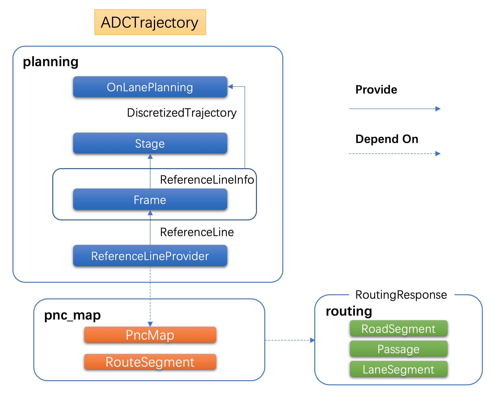

### 整体pipeline

注重于数据流向最终的EM planner

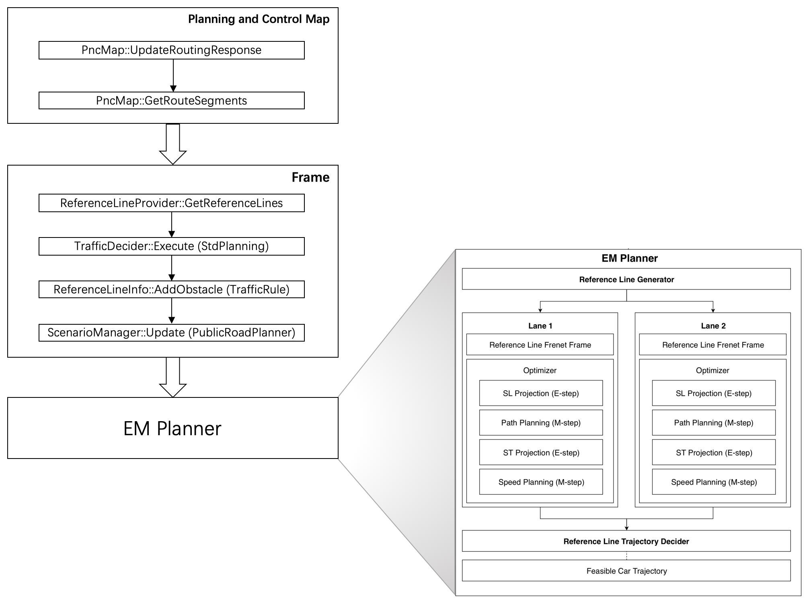

### 规划周期循环planning cycle

注重于整个规划周期需要完成的事情


### planner

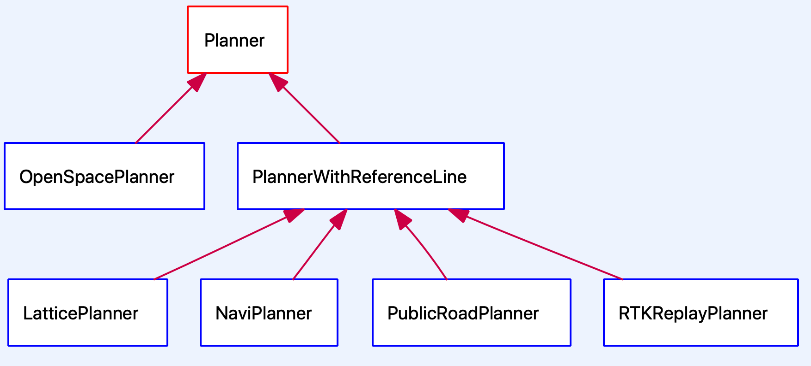

| 名称              | 加入版本 | 类型        | 说明                                                         |
| ----------------- | -------- | ----------- | ------------------------------------------------------------ |
| RTKReplayPlanner  | 1.0      | RTK         | 根据录制的轨迹来规划行车路线。                               |
| PublicRoadPlanner | 1.5      | PUBLIC_ROAD | 实现了EM算法的规划器，这是目前的默认Planner。                |
| LatticePlanner    | 2.5      | LATTICE     | 基于网格算法的轨迹规划器。                                   |
| NaviPlanner       | 3.0      | NAVI        | 基于实时相对地图的规划器。                                   |
| OpenSpacePlanner  | 3.5      | OPEN_SPACE  | 算法源于论文：[《Optimization-Based Collision Avoidance》](https://arxiv.org/pdf/1711.03449.pdf)。 |

### Smoother

为了保证车辆轨迹的平顺，参考线必须是经过平滑的，目前Apollo中包含了这么几个Smoother用来做参考线的平滑：


### **车体旋转角度定义**

**roll**，**pitch**和**yaw**分布描述了车辆在纵向，侧向和垂直方向上的角度，具体如下图所示：

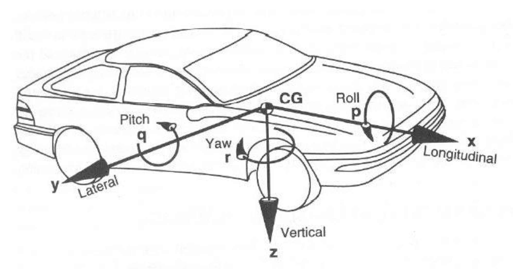

## 重要数据结构

### RoutingResponse

Routing的搜索结果`RoutingResponse`中包含了下面三个层次的结构：

- `RoadSegment`：描述道路，一条道路可能包含了并行的几条通路（`Passage`）。
- `Passage`：描述通路，通路是直连不含变道的可行驶区域。一个通路可能包含了前后连接的多个车道。
- `LaneSegment`：描述车道，车道是道路中的一段，自动驾驶车辆会尽可能沿着车道的中心线行驶。

而pnc_map模块中的`RouteSegments`对应了上面的`Passage`结构，它其中会包含若干个车道信息。

### RouteSegments

而pnc_map模块中的`RouteSegments`对应了上面的`Passage`结构，它其中会包含若干个车道信息。这个类继承自`std::vector<LaneSegment>`。

`RouteSegments`中有如下一些方法值得关注：

- `NextAction()`：车辆接下来要采取的动作。可能是直行，左变道，或者右变道。
- `CanExit()`：当前通路是否可以接续到Routing结果的另外一个通路上。
- `GetProjection()`：将一个点投影到当前通路上。返回`SLPoint`和`LaneWaypoint`。
- `Stitch()`：缝合另外一个`RouteSegments`。即：去除两个`RouteSegments`间重合的多余部分，然后连接起来。
- `Shrink()`：缩短到指定范围。
- `IsOnSegment()`：车辆是否在当前`RouteSegments`上。
- `IsNeighborSegment()`：当前`RouteSegments`是否是车辆的临近`RouteSegments`。

### pnc_map

`PncMap`类负责对接Routing搜索结果的更新。

`PncMap`会根据车辆当前位置，提供车辆周边的`RouteSegments`信息供`ReferenceLineProvider`生成`ReferenceLine`。

**数据结构**

> `RoutingRequest`和`RoutingResponse`两个结构在routing模块中定义。

- `PointENU`：描述了地图上的一个点。定位，感知，预测和决策模块都会使用这个数据结构。目前，Apollo地图使用Universal Transverse Mercator坐标系统。在一些情况下，`z`字段可能会被忽略。

```
# modules/common/proto/geometry.proto

message PointENU {
  optional double x = 1 [default = nan];  // East from the origin, in meters.
  optional double y = 2 [default = nan];  // North from the origin, in meters.
  optional double z = 3 [default = 0.0];  // Up from the WGS-84 ellipsoid, in meters.
}
```

- `SLPoint`：描述了Frenet坐标系上的一个点。`s`表示距离起点的纵向距离，`l`表示距离中心线的侧向距离。

```
# modules/common/proto/pnc_point.proto

message SLPoint {
  optional double s = 1;
  optional double l = 2;
}
```

- `LaneWaypoint`：描述了车道上的点。

```
// modules/map/pnc_map/path.h

using LaneInfoConstPtr = std::shared_ptr<const LaneInfo>;

struct LaneWaypoint {
  LaneWaypoint() = default;
  LaneWaypoint(LaneInfoConstPtr lane, const double s)
      : lane(CHECK_NOTNULL(lane)), s(s) {}
  LaneWaypoint(LaneInfoConstPtr lane, const double s, const double l)
      : lane(CHECK_NOTNULL(lane)), s(s), l(l) {}
  LaneInfoConstPtr lane = nullptr;
  double s = 0.0;
  double l = 0.0;

  std::string DebugString() const;
};
```

- `VehicleState`：描述车辆状态，包含了自车位置，姿态，方向，速度，加速度等信息。

```
# modules/common/vehicle_state/proto/vehicle_state.proto

message VehicleState {
  optional double x = 1 [default = 0.0];
  optional double y = 2 [default = 0.0];
  optional double z = 3 [default = 0.0];
  optional double timestamp = 4 [default = 0.0];
  optional double roll = 5 [default = 0.0];
  optional double pitch = 6 [default = 0.0];
  optional double yaw = 7 [default = 0.0];
  optional double heading = 8 [default = 0.0];
  optional double kappa = 9 [default = 0.0];
  optional double linear_velocity = 10 [default = 0.0];
  optional double angular_velocity = 11 [default = 0.0];
  optional double linear_acceleration = 12 [default = 0.0];
  optional apollo.canbus.Chassis.GearPosition gear = 13;
  optional apollo.canbus.Chassis.DrivingMode driving_mode = 14;
  optional apollo.localization.Pose pose = 15;
}
```

### ReferenceLine

原始参考线，源码位于`planning/reference_line/`目录下。参考线是根据车辆位置相对局部的一个数据，它包含了车辆前后一定范围内的路径信息。在车辆行驶过程中，Planning会在每一个计算周期中生成`ReferenceLine`。在每一次计算循环中，Planning模块都会通过`ReferenceLineProvider`生成ReferenceLine。ReferenceLine由Routing的搜索结果决定。Routing是预先搜索出的全局可达路径，而ReferenceLine是车辆当前位置的前后一段范围。

**直行的情况下，ReferenceLine是一个。而在需要变道的时候，会有多个ReferenceLine。**

这里我们先看一下`ReferenceLine`中主要包含了什么。

下面是`ReferenceLine`类中的数据成员：

```
// modules/planning/reference_line/reference_line.h

uint32_t priority_ = 0;
struct SpeedLimit {
  double start_s = 0.0;
  double end_s = 0.0;
  double speed_limit = 0.0;  // unit m/s
};
std::vector<SpeedLimit> speed_limit_;

std::vector<ReferencePoint> reference_points_;
hdmap::Path map_path_;
```

`priority_`是优先级，不过在`PublicRoadPlanner`中没有用到。`speed_limit_`是限速数据，这两个我们暂时都不用关注。

`reference_points_`其实是从`map_path_`得到，具体见ReferenceLine的构造函数。所以这两个数据的作用其实是一样的。

**ReferencePoint**

`ReferencePoint`由`MapPathPoint`继承而来。下面这幅图是`ReferencePoint`的类继承关系。

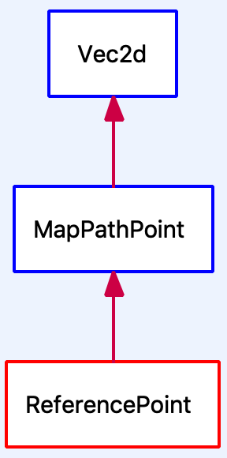

这里的几个类的说明如下：

- ```plaintext
  Vec2d
  ```

  描述一个二维的点，包含的数据成员如下：    

  - `double x_`：描述点的x坐标。
  - `double y_`：描述点的y坐标。

- ```plaintext
  MapPathPoint
  ```

  描述了一个地图上的点，包含的数据成员如下：    

  - `double heading_`：描述点的朝向。
  - `std::vector<LaneWaypoint> lane_waypoints_`：描述路径上的点。有些车道可能会存在重合的部分，所以地图上的一个点可能同时属于多个车道，因此这里的数据是一个`vector`结构。

- ```plaintext
  ReferencePoint
  ```

  描述了参考线中的点，包含的数据成员如下：    

  - `double kappa_`：描述曲线的曲率。
  - `double dkappa_`：描述曲率的导数。

### ReferenceLineInfo

`ReferenceLineInfo`：源码位于`planning/common/`目录下。Planning实现中，逻辑计算的基础数据结构，很多操作都会在这个数据结构上进行（例如：交通规则逻辑，障碍物投影，路径优化，速度决策等）。

`ReferenceLineInfo`由`Frame`根据`ReferenceLine`和`RouteSegments`创建得到。

在每个Planning计算循环的开始，都会创建和初始化一个新的`Frame`，而`Frame`初始化的时候就会创建`ReferenceLineInfo`。当有多个`ReferenceLine`的时候，则意味着需要变道。

**操作ReferenceLineInfo**

主要有下面两个地方会操作ReferenceLineInfo：

- `/modules/planning/traffic_rules`：该目录下是交通规则的实现。不同Rule会向ReferenceLineInfo添加不同的数据，例如：障碍物，红绿灯等等。
- `/modules/planning/tasks`：该目录下是许多的决策器和优化器，是EM planner的具体实现。决策规划完成后将速度信息、路径信息保存在ReferenceLineInfo结构中。

对于ReferenceLineInfo的操作，主要是修改该类的以下三个字段：

- `PathData path_data_`：包含了路径相关的数据，逻辑实现位于`modules/planning/common/path/`中。
- `SpeedData speed_data_`：包含了速度相关的数据，逻辑实现位于`modules/planning/common/speed/`。路径和速度最终将组合起来使用，以生成行车轨迹（见下文）。
- `PathDecision path_decision_`：这个字段中包含了障碍物的决策信息。

障碍物在Planning模块中通过`apollo::planning::Obstacle`描述。

障碍物分为横向障碍物和纵向障碍物。**横向障碍物将可能导致车辆的nudge行为。而纵向障碍物可能导致车辆出现：stop，yield，follow，overtake行为。这几个行为的优先级从左到右依次递减**。

> 预测模块对于同一个障碍物可能会有多个预测轨迹。此时在Planning模块中，会多个`apollo::planning::Obstacle`对象分别对应每一个轨迹。

### LocalView

在`Frame`中有一个数据结构值得我们重点关于一下，那就是`LocalView`。这个类在前面我们也已经提到过。它的定义如下：

```
struct LocalView {
  std::shared_ptr<prediction::PredictionObstacles> prediction_obstacles;
  std::shared_ptr<canbus::Chassis> chassis;
  std::shared_ptr<localization::LocalizationEstimate> localization_estimate;
  std::shared_ptr<perception::TrafficLightDetection> traffic_light;
  std::shared_ptr<routing::RoutingResponse> routing;
  bool is_new_routing = false;
  std::shared_ptr<relative_map::MapMsg> relative_map;
};
```

从这个定义中可以看到，这个结构中包含了这些信息：

- 障碍物的预测信息
- 车辆底盘信息
- 大致定位信息
- 交通灯信息
- 导航路由信息
- 相对地图信息

### ADCTrajectory

`Trajectory`：在planning的proto文件夹中有好几个结构用来描述轨迹。它们在不同的场合下使用。这其中，`ADCTrajectory`是Planning模块的输出。是最终往外发出给控制模块的数据结构，它是Planning模块一次计算循环中，处理了所有逻辑的最终结果，包含了车辆行驶需要的所有信息。因此，这个数据将直接影响到自动驾驶车辆的行车行为。

### 一次规划执行的planning

```c++
Status OnLanePlanning::Plan(
    const double current_time_stamp,
    const std::vector<TrajectoryPoint>& stitching_trajectory,
    ADCTrajectory* const trajectory_pb) {
  ...
  auto status = planner_->Plan(stitching_trajectory.back(), frame_.get());  ①

  ptr_debug->mutable_planning_data()->set_front_clear_distance(
      EgoInfo::Instance()->front_clear_distance());

  const auto* best_ref_info = frame_->FindDriveReferenceLineInfo();  ②
  ...
  trajectory_pb->mutable_latency_stats()->MergeFrom(
      best_ref_info->latency_stats());
  // set right of way status
  trajectory_pb->set_right_of_way_status(best_ref_info->GetRightOfWayStatus());
  for (const auto& id : best_ref_info->TargetLaneId()) {
    trajectory_pb->add_lane_id()->CopyFrom(id); ③
  }

  trajectory_pb->set_trajectory_type(best_ref_info->trajectory_type());

  if (FLAGS_enable_rss_info) {
    trajectory_pb->mutable_rss_info()->CopyFrom(best_ref_info->rss_info());
  }

  best_ref_info->ExportDecision(trajectory_pb->mutable_decision());

  ...
  last_publishable_trajectory_.reset(new PublishableTrajectory(
      current_time_stamp, best_ref_info->trajectory())); ④
  ...

  if (FLAGS_enable_stitch_last_trajectory) {
    last_publishable_trajectory_->PrependTrajectoryPoints(
        std::vector<TrajectoryPoint>(stitching_trajectory.begin(),
                                     stitching_trajectory.end() - 1));
  }

  last_publishable_trajectory_->PopulateTrajectoryProtobuf(trajectory_pb); ⑤

  best_ref_info->ExportEngageAdvice(trajectory_pb->mutable_engage_advice());

  return status;
}
```

这段代码中的几个点说明如下：

1. `planner_->Plan`是执行每个Planner的主体算法逻辑。
2. 在有多个`ReferenceLineInfo`的情况下，选取最合适的一条。
3. 记录`ReferenceLineInfo`包含的lane id。
4. 将轨迹的数据格式转换成`PublishableTrajectory`类型并记录到`last_publishable_trajectory_`中。
5. 导出成最终格式：`ADCTrajectory`。Apollo 3.5已经改用新的框架Cyber RT，最终轨迹的发出是在Cyber Component的实现`PlanningComponent`发出。相关代码如下：

```
  ADCTrajectory adc_trajectory_pb;
  planning_base_->RunOnce(local_view_, &adc_trajectory_pb);
  auto start_time = adc_trajectory_pb.header().timestamp_sec();
  common::util::FillHeader(node_->Name(), &adc_trajectory_pb);

  // modify trajectory relative time due to the timestamp change in header
  const double dt = start_time - adc_trajectory_pb.header().timestamp_sec();
  for (auto& p : *adc_trajectory_pb.mutable_trajectory_point()) {
    p.set_relative_time(p.relative_time() + dt);
  }
  planning_writer_->Write(std::make_shared<ADCTrajectory>(adc_trajectory_pb));
```

至此，决策规划模块的任务就完成了。接下来就是由控制模块按照这里发出的轨迹来控制车辆的行驶。


# 整体pipeline

首先打通从路由请求到planning模块生成最优轨迹的pipeline，涉及到routing、common、localization、map/pnc_map、prediction、perception、planning等模块。具体了解routing、map/pnc_map、planning这三个模块。把握整体后再深入细节，后面介绍相关具体内容。

**Apollo软件模块架构**

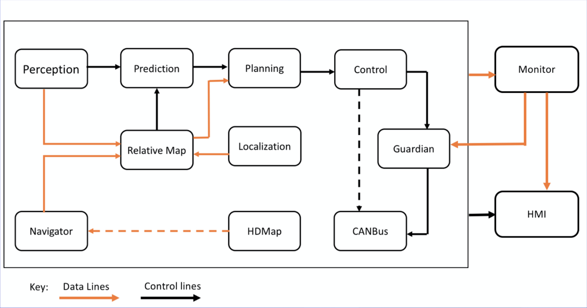

## Routing（路由）模块

### 模块介绍

Routing模块根据请求生成导航信息。

模块输入：

- 地图数据
- 请求，包括：开始和结束位置

模块输出：

- 路由导航信息，具体如下

Routing的搜索结果由RoutingResponse描述，RoutingResponse中的属性说明如下：

| 名称            | 说明                         |
| --------------- | ---------------------------- |
| header          | 消息头                       |
| road            | 具体的路径信息，最重要的数据 |
| measurement     | 距离                         |
| routing_request | 原始请求                     |
| map_version     | 地图版本                     |
| status          | 状态位                       |

很显然，这里的`RoadSegment road`是最重要的数据。这个数据其实是一个三层的结构体嵌套，它们的说明如下：

- `RoadSegment`：描述道路，一条道路可能包含了并行的几条通路（`Passage`）。
- `Passage`：描述通路，通路是直连不含变道的可行驶区域。一个通路可能包含了前后连接的多个车道。
- `LaneSegment`：描述车道，车道是道路中的一段，自动驾驶车辆会尽可能沿着车道的中心线行驶。

### Routing模块结构一览

我们通过一幅图来描述Routing模块中的主要组件以及它们的交互关系。

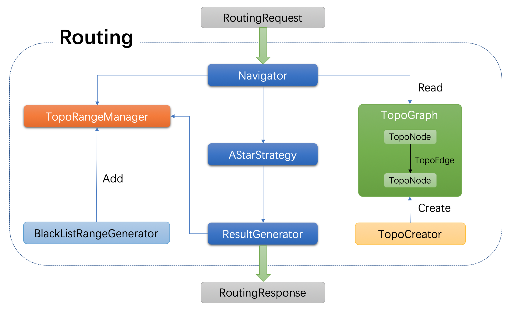

## map/pnc_map子模块

pnc全称是Planning And Control。这是Planning用来对接Routing搜索结果的子模块。主要负责规划与控制所需要的地图信息，负责读取和处理Routing搜索结果。

`PncMap`类负责对接Routing搜索结果的更新。

`PncMap`会根据车辆当前位置，提供车辆周边的`RouteSegments`信息供`ReferenceLineProvider`生成`ReferenceLine`。“车辆周边”与车辆的纵向和横向相关，具体如下：

## planning模块

### 模块简介

#### 1.模块概述

决策规划模块的主要责任是：**根据导航信息以及车辆的当前状态，在有限的时间范围内（通常为车辆当前位置未来8s或200m的轨迹），计算出一条合适的轨迹供车辆行驶**。

这里有好几个地方值得注意：

1. 车辆的行驶路线通常由Routing模块提供，Routing模块会根据目的地以及地图搜索出一条代价尽可能小的路线。
2. 车辆的当前状态包含了很多因素，例如：车辆自身的状态（包括姿态，速度，角速度等等），当前所处的位置，周边物理世界的静态环境以及交通状态等等。
3. Planning模块的响应速度必须是稳定可靠的（当然，其他模块也是一样）。正常人类的反应速度是300ms，而自动驾驶车辆想要做到安全可靠，其反应时间必须短于100ms。所以，Planning模块通常以10Hz的频率运行着。如果其中某一个算法的时间耗费了太长时间，就可能造成其他模块的处理延迟，最终可能造成严重的后果。例如：没有即时刹车，或者转弯。
4. ”合适的轨迹“有多个层次的含义。首先，”轨迹“不同于“路径”，“轨迹”不仅仅包含了行驶路线，还要包含每个时刻的车辆的速度，加速度，方向转向等信息。其次，这条轨迹必须是底层控制可以执行的。因为车辆在运动过程中，具有一定的惯性，车辆的转弯角度也是有限的。在计算行驶轨迹时，这些因素都要考虑。最后，从人类的体验上来说，猛加速，急刹车或者急转弯都会造成非常不好的乘坐体验，因此这些也需要考虑。这就是为什么决策规划模块需要花很多的精力来优化轨迹，Apollo系统中的实现自然也不例外。

#### 2.模块架构

Apollo的之前版本，包括3.0都是用了相同的配置和参数规划不同的场景，这种方法虽然线性且实现简单，但不够灵活或用于特定场景。随着Apollo的成熟并承担不同的道路条件和驾驶用例，Apollo项目组采用了更加模块化、适用于特定场景和整体的方法来规划其轨迹。

在这个方法中，每个驾驶用例都被当作不同的驾驶场景。这样做非常有用，因为与先前的版本相比，现在在特定场景中报告的问题可以在不影响其他场景的工作的情况下得到修复，其中问题修复影响其他驾驶用例，因为它们都被当作单个驾驶场景处理。

Apollo 3.5中Planning模块的架构如下图所示：

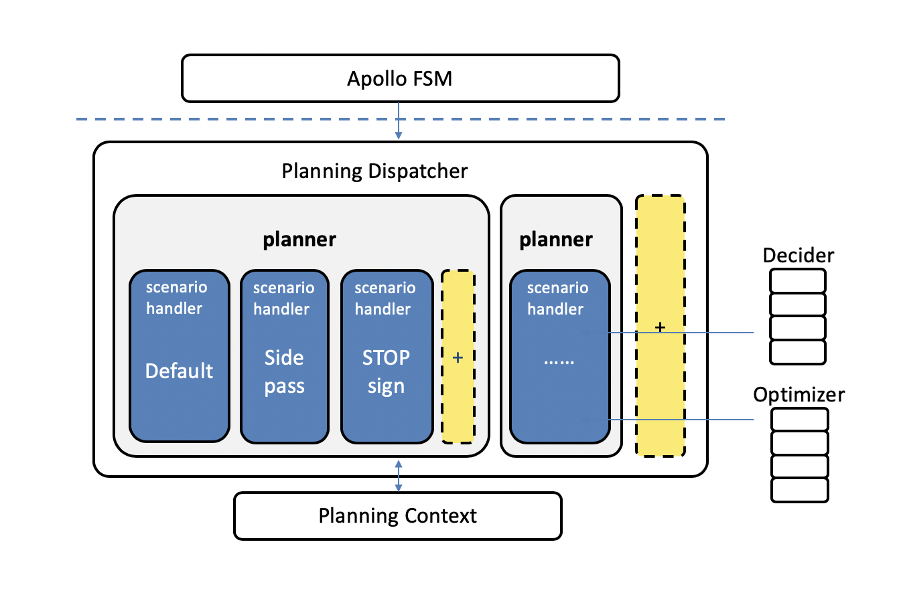

这其中主要的组件包括：

- Apollo FSM：一个有限状态机，与高清地图确定车辆状态给定其位置和路线。
- Planning Dispatcher：根据车辆的状态和其他相关信息，调用合适的Planner。
- Planner：获取所需的上下文数据和其他信息，确定相应的车辆意图，执行该意图所需的规划任务并生成规划轨迹。它还将更新未来作业的上下文。
- Deciders和Optimizers：一组实现决策任务和各种优化的无状态库。优化器特别优化车辆的轨迹和速度。决策者是基于规则的分类决策者，他们建议何时换车道、何时停车、何时爬行（慢速行进）或爬行何时完成。
- 黄色框：这些框被包含在未来的场景和/或开发人员中，以便基于现实世界的驱动用例贡献他们自己的场景。

#### 3.整体pipeline

决策规划模块的主体实现通常都是较为复杂的。Apollo系统中的实现自然也不例外，这里先通过一幅图说明其整体的Pipeline。


这里有三个主要部分需要说明：

- `PncMap`：全称是Planning and Control Map。这个部分的实现并不在Planning内部，而是位于`/modules/map/pnc_map/`目录下。但是由于该实现与Planning模块紧密相关，因此这里放在一起讨论。该模块的主要作用是：根据Routing提供的数据，生成Planning模块需要的路径信息。
- `Frame`：Frame中包含了Planning一次计算循环中需要的所有数据。例如：地图，车辆状态，参考线，障碍物信息等等。`ReferenceLine`是车辆行驶的参考线，`TrafficDecider`与交通规则相关，这两个都是Planning中比较重要的子模块，因此会在下文中专门讲解。
- `EM Planner`：下文中我们会看到，Apollo系统中内置了好几个Planner，但目前默认使用的是EM  Planner，这也是专门为开放道路设计的。该模块的实现可以说是整个Planning模块的灵魂所在。

#### 4.Planning与Planner

planning与planner都不止一个，通过多态性调用不同的类，planning描述了一个概括的决策规划流程，而planner则描述了具体的决策规划方法。

#### 5.Planning

Apollo 3.5废弃了原先的ROS，引入了新的运行环境：Cyber RT。

Cyber RT以组件的方式来管理各个模块，组件的实现会基于该框架提供的基类：`apollo::cyber::Component`。

在`PlanningComponent`的实现中，会根据具体的配置选择Planning的入口。Planning的入口通过`PlanningBase`类来描述的。

PlanningBase只是一个抽象类，该类有三个子类：

- OpenSpacePlanning
- NaviPlanning
- StdPlanning

> 注：5.5版本StdPlanning由OnLanePlanning取代

`PlanningComponent::Init()`方法中会根据配置选择具体的Planning入口：

```
bool PlanningComponent::Init() {
  if (FLAGS_open_space_planner_switchable) {
    planning_base_ = std::make_unique<OpenSpacePlanning>();
  } else {
    if (FLAGS_use_navigation_mode) {
      planning_base_ = std::make_unique<NaviPlanning>();
    } else {
      planning_base_ = std::make_unique<StdPlanning>();
    }
  }
```

目前，`FLAGS_open_space_planner_switchable`和`FLAGS_use_navigation_mode`的配置都是false，因此最终的Planning入口类是：`StdPlanning`。

下面这幅图描述了上面说到的这些逻辑：

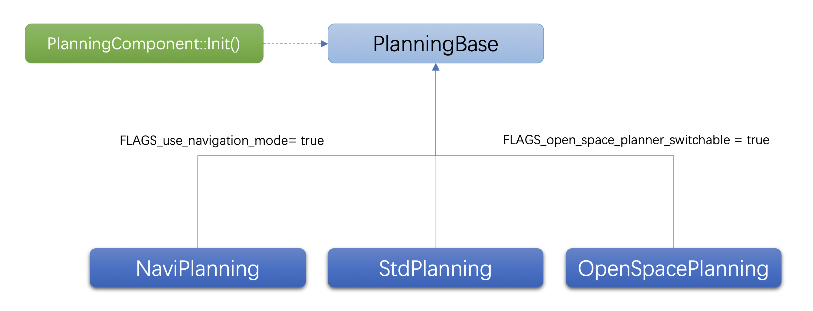

所以接下来，我们只要关注StdPlanning的实现即可。在这个类中，下面这个方法是及其重要的：

```
/**
* @brief main logic of the planning module,
* runs periodically triggered by timer.
*/
void RunOnce(const LocalView& local_view,
             ADCTrajectory* const trajectory_pb) override;
```

方法的注释已经说明得很清楚了：这是Planning模块的主体逻辑，会被timer以固定的间隔调用。每次调用就是一个**规划周期**。

#### 6.PlanningCycle

很显然，接下来我们重点要关注的就是`StdPlanning::RunOnce`方法的逻辑。该方法的实现较长，这里就不贴出代码了，而是通过一幅图描述其中的逻辑：

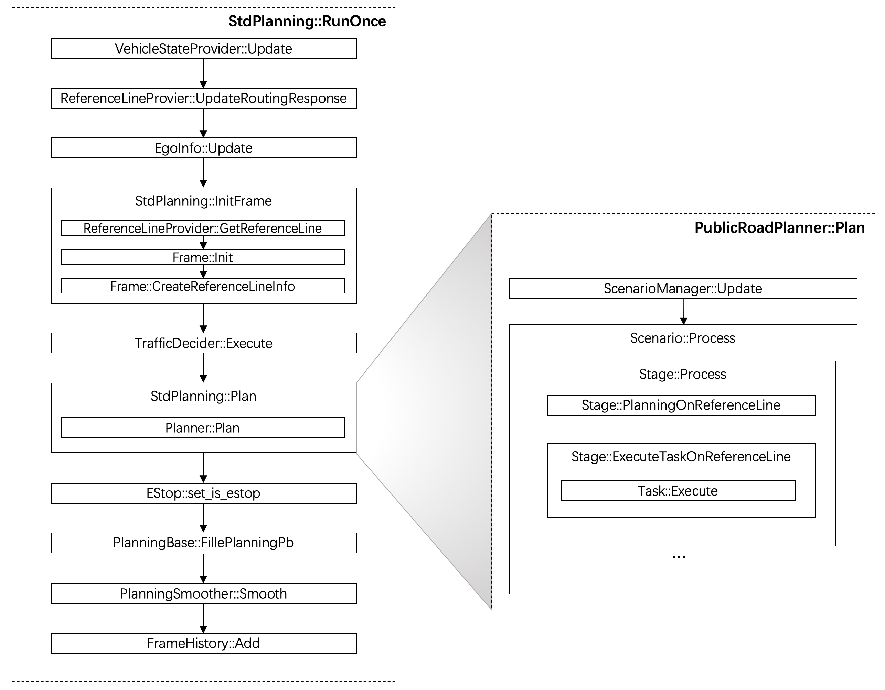

#### 7.planner

最新的Apollo源码中，一共包含了5个Planner的实现。它们的结构如下图所示：

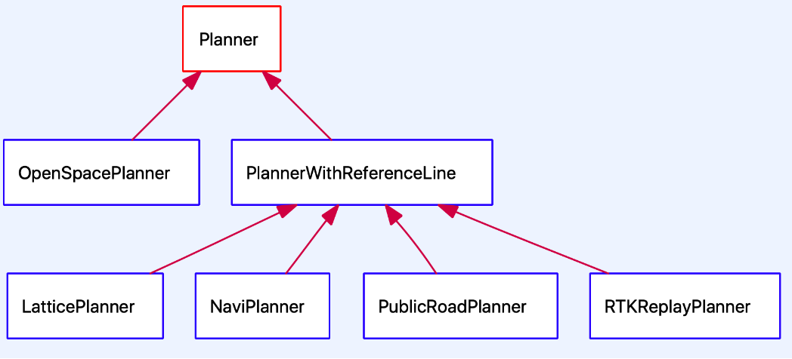

每个Planner都会有一个字符串描述的唯一类型，在配置文件中通过这个类型来选择相应的Planner。

这5个Planner的说明如下表所示：

| 名称              | 加入版本 | 类型        | 说明                                                         |
| ----------------- | -------- | ----------- | ------------------------------------------------------------ |
| RTKReplayPlanner  | 1.0      | RTK         | 根据录制的轨迹来规划行车路线。                               |
| PublicRoadPlanner | 1.5      | PUBLIC_ROAD | 实现了[EM算法](https://arxiv.org/abs/1807.08048)的规划器，这是目前的默认Planner。 |
| LatticePlanner    | 2.5      | LATTICE     | 基于网格算法的轨迹规划器。                                   |
| NaviPlanner       | 3.0      | NAVI        | 基于实时相对地图的规划器。                                   |
| OpenSpacePlanner  | 3.5      | OPEN_SPACE  | 算法源于论文：[《Optimization-Based Collision Avoidance》](https://arxiv.org/pdf/1711.03449.pdf)。 |

RTKReplayPlanner基于录制的轨迹，是比较原始的规划器，所以不用多做说明。最新加入的两个规划器（NaviPlanner和OpenSpacePlanner）目前看来还需要更多时间的验证，我们暂时也不会过多讲解。

Apollo公开课里对两个较为成熟的Planner：EM Planner和Lattice Planner做了对比，我们可以一起来看一下：

| EM Planner                    | Lattice Planner    |
| ----------------------------- | ------------------ |
| 横向纵向分开求解              | 横向纵向同时求解   |
| 参数较多（DP/QP, Path/Speed） | 参数较少且统一     |
| 流程复杂                      | 流程简单           |
| 单周期解空间受限              | 简单场景解空间较大 |
| 能适应复杂场景                | 适合简单场景       |
| 适合城市道路                  | 适合高速场景       |

后面的内容中尽可能集中在EM Planner算法上。

**planner配置**

Planner的配置文件路径是在`planning_gflags.cc`中指定的，相关内容如下：

```
// /modules/planning/common/planning_gflags.cc

DEFINE_string(planning_config_file,
              "/apollo/modules/planning/conf/planning_config.pb.txt",
              "planning config file");
```

接下来我们可以看一下`planning_config.pb.txt`中的内容：

```
// modules/planning/conf/planning_config.pb.txt

standard_planning_config {
  planner_type: PUBLIC_ROAD
  planner_type: OPEN_SPACE
  planner_public_road_config {
     scenario_type: LANE_FOLLOW
     scenario_type: SIDE_PASS
     scenario_type: STOP_SIGN_UNPROTECTED
  }
}
```

这里设置了两个Planner，最终选择哪一个由下面这个函数决定：

```
std::unique_ptr<Planner> StdPlannerDispatcher::DispatchPlanner() {
  PlanningConfig planning_config;
  apollo::common::util::GetProtoFromFile(FLAGS_planning_config_file,
                                         &planning_config);
  if (FLAGS_open_space_planner_switchable) {
    return planner_factory_.CreateObject(
        planning_config.standard_planning_config().planner_type(1));
  }
  return planner_factory_.CreateObject(
      planning_config.standard_planning_config().planner_type(0));
}
```

`open_space_planner_switchable`决定了是否能够切换到OpenSpacePlanner上。但目前这个配置是`false`：

```
// /modules/planning/common/planning_gflags.cc

DEFINE_bool(open_space_planner_switchable, false,
            "true for std planning being able to switch to open space planner "
            "when close enough to target parking spot");
```

**PublicRoadPlanner**

`PublicRoadPlanner`是目前默认的Planner，它实现了EM（Expectation Maximization）算法。

Planner的算法实现依赖于两个输入：

- 车辆自身状态：通过`TrajectoryPoint`描述。该结构中包含了车辆的位置，速度，加速度，方向等信息。
- 当前环境信息：通过`Frame`描述。前面我们已经提到，`Frame`中包含了一次Planning计算循环中的所有信息。

在`Frame`中有一个数据结构值得我们重点关于一下，那就是**`LocalView`**。这个类在前面我们也已经提到过。它的定义如下：

```
struct LocalView {
  std::shared_ptr<prediction::PredictionObstacles> prediction_obstacles;
  std::shared_ptr<canbus::Chassis> chassis;
  std::shared_ptr<localization::LocalizationEstimate> localization_estimate;
  std::shared_ptr<perception::TrafficLightDetection> traffic_light;
  std::shared_ptr<routing::RoutingResponse> routing;
  bool is_new_routing = false;
  std::shared_ptr<relative_map::MapMsg> relative_map;
};
```

从这个定义中可以看到，这个结构中包含了这些信息：

- 障碍物的预测信息
- 车辆底盘信息
- 大致定位信息
- 交通灯信息
- 导航路由信息
- 相对地图信息

对于每个Planner来说，其主要的逻辑都实现在`Plan`方法中。`PublicRoadPlanner::Plan`方法的实现逻辑如下：

```
Status PublicRoadPlanner::Plan(const TrajectoryPoint& planning_start_point,
                               Frame* frame) {
  DCHECK_NOTNULL(frame);
  scenario_manager_.Update(planning_start_point, *frame); ①
  scenario_ = scenario_manager_.mutable_scenario(); ②
  auto result = scenario_->Process(planning_start_point, frame); ③

  ...
  if (result == scenario::Scenario::STATUS_DONE) {
    scenario_manager_.Update(planning_start_point, *frame); ④
  } else if (result == scenario::Scenario::STATUS_UNKNOWN) {
    return Status(common::PLANNING_ERROR, "scenario returned unknown");
  }
  return Status::OK();
}
```

这段代码的几个关键步骤是：

1. 确定当前Scenario：因为Frame中包含了当前状态的所有信息，所以通过它就可以确定目前是处于哪一个场景下。
2. 获取当前Scenario。
3. 通过Scenario进行具体的处理。
4. 如果处理成功，则再次通过ScenarioManager更新。

Scenario是Apollo 3.5上新增的驾驶场景功能。前面在模块架构中我们已经提到过，接下来我们就详细看一下这方面内容

#### 8.Scenario

最上层的驾驶场景，一个scenario包含多个阶段，称为stage，每个stage又对应多个具体实现，称为task。

Apollo3.5主要包含以下三个主要的驾驶场景：

1. 车道保持

   车道保持场景是默认的驾驶场景，它不仅仅包含单车道巡航。同时也包含了：

   - 换道行驶
   - 遵循基本的交通约定
   - 基本转弯

2. Side Pass

   在这种情况下，如果在自动驾驶车辆（ADC）的车道上有静态车辆或静态障碍物，并且车辆不能在不接触障碍物的情况下安全地通过车道，则执行以下策略：

   - 检查邻近车道是否接近通行
   - 如果无车辆，进行绕行，绕过当前车道进入邻道
   - 一旦障碍物安全通过，回到原车道上

3. 停止标识

**场景实现**

场景的实现主要包含三种类：

- `ScenarioManager`：场景管理器类。负责注册，选择和创建`Scenario`。
- `Scenario`：描述一个特定的场景（例如：Side Pass）。该类中包含了`CreateStage`方法用来创建`Stage`。一个Scenario可能有多个Stage对象。在Scenario中会根据配置顺序依次调用`Stage::Process`方法。该方法的返回值决定了从一个Stage切换到另外一个Stage。
- `Stage`：如上面所说，一个Scenario可能有多个Stage对象。场景功能实现的主体逻辑通常是在`Stage::Process`方法中。

**场景确定**

下面这个函数用来确定当前所处的场景。前面我们已经说了，确定场景的依据是`Frame`数据。

```
void ScenarioManager::Update(const common::TrajectoryPoint& ego_point,
                             const Frame& frame) {
```

#### **9.Stage**

Scenario的子集

#### **10.Task**

Stage的子集，一直到Apollo 3.5版本为止，Planning模块最核心的算法就是其EM Planner（实现类是`PublicRoadPlanner`），而EM Planner最核心的就是其决策器和优化器。

Planning中这部分逻辑实现位于`tasks`目录下，无论是决策器还是优化器都是从`apollo::planning::Task`继承的。该类具有下面这些子类：

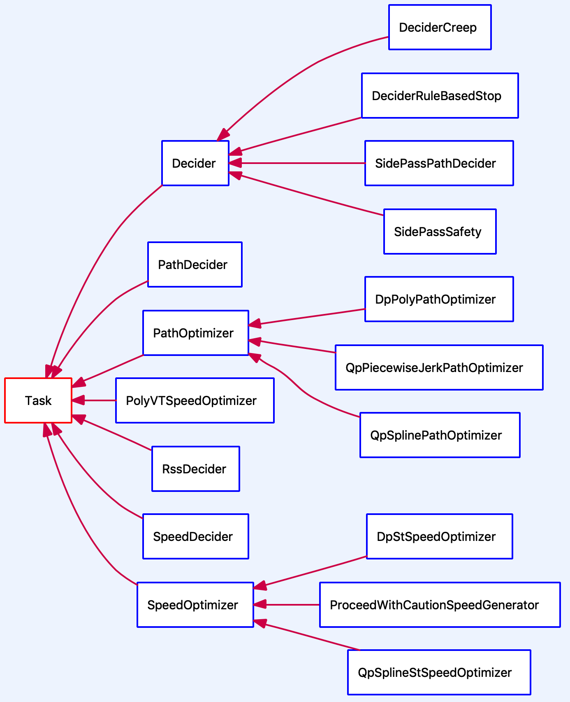

`Task`类提供了`Execute`方法供子类实现，实现依赖的数据结构就是`Frame`和`ReferenceLineInfo`。

```
Status Task::Execute(Frame* frame, ReferenceLineInfo* reference_line_info) {
  frame_ = frame;
  reference_line_info_ = reference_line_info;
  return Status::OK();
}
```

可以通过阅读子类的`Execute`方法来了解算法实现。

**Task配置**

上文中我们已经提到，场景和Task配置是在一起的。这些配置在下面这些文件中：

```
// /modules/planning/conf/scenario
.
├── lane_follow_config.pb.txt
├── side_pass_config.pb.txt
├── stop_sign_unprotected_config.pb.txt
├── traffic_light_protected_config.pb.txt
└── traffic_light_unprotected_right_turn_config.pb.txt
```

一个Scenario可能有多个Stage，每个Stage可以指定相应的Task，下面是一个配置示例：

```
// /modules/planning/conf/scenario/lane_follow_config.pb.txt

scenario_type: LANE_FOLLOW
stage_type: LANE_FOLLOW_DEFAULT_STAGE
stage_config: {
  stage_type: LANE_FOLLOW_DEFAULT_STAGE
  enabled: true
  task_type: DECIDER_RULE_BASED_STOP
  task_type: DP_POLY_PATH_OPTIMIZER
  ...

  task_config: {
    task_type: DECIDER_RULE_BASED_STOP
  }
  task_config: {
    task_type: QP_PIECEWISE_JERK_PATH_OPTIMIZER
  }
  task_config: {
    task_type: DP_POLY_PATH_OPTIMIZER
  }
  ...
}
```

这里的`task_type`与Task实现类是一一对应的。

#### 11.Smoother

为了保证车辆轨迹的平顺，参考线必须是经过平滑的，目前Apollo中包含了这么几个Smoother用来做参考线的平滑：

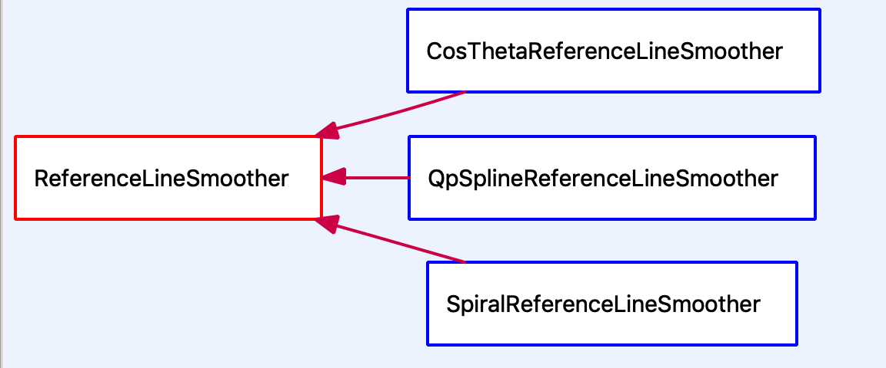

#### **12.TrafficRule**

行驶在城市道路上的自动驾驶车辆必定受到各种交通规则的限制。在正常情况下，车辆不应当违反交通规则。

另外，交通规则通常是多种条例，不同城市和国家地区的交通规则可能是不一样的。

如果处理好这些交通规则就是模块实现需要考虑的了。目前Planning模块的实现中，有如下这些交通规则的实现：

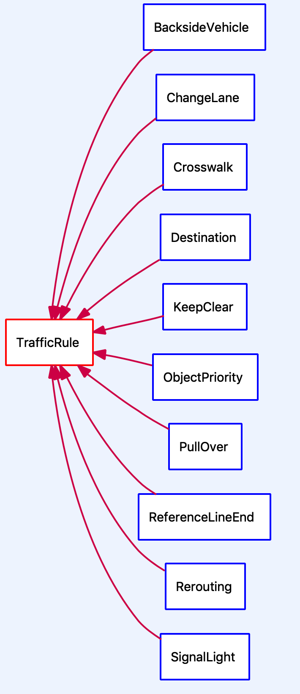

### 参考线与轨迹

我们先介绍一下参考线在整个Planning模块中所处的位置：

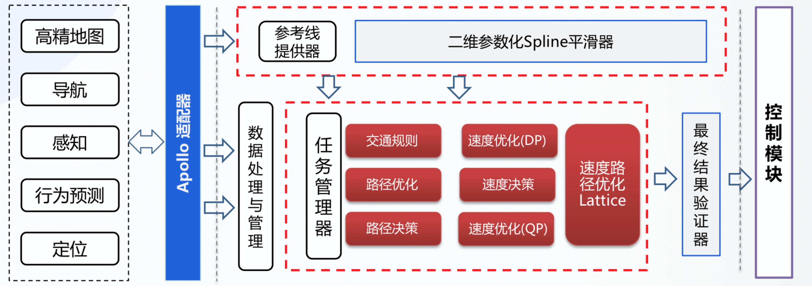

决策规划模块负责生成车辆的行驶轨迹。要做到这一点，决策规划模块需要从宏观到局部经过三个层次来进行决策。

- 第一个层次是Routing的搜索结果。Routing模块的输入是若干个按顺序需要达到的途径点（也可能只有一个起点和终点）。Routing模块根据地图的拓扑结构搜索出可达的完整路线来，这个路线的长度可能是几公里甚至几百公里。因此这个是最为宏观的数据。另外，Routing的搜索结果是相对固定的。在没有障碍物的情况下，车辆会一直沿着原先获取到的Routing路线行驶。只有当车辆驶出了原先规划的路线之外（例如：为了避障），才会重新发送请求给Routing模块，以重新计算路线。
- 第二个层次就是参考线。决策规划模块会实时的根据车辆的具体位置来计算参考线。参考线的计算会以Routing的路线为基础。但同时，参考线会考虑车辆周边的动态信息，例如：障碍物，交通规则等。参考线是包含车辆所在位置周边一定的范围，通常是几百米的长度。相较于Routing结果，它是较为局部的数据。
- 第三个层次是轨迹。轨迹是决策规划模块的最终输出结果。它的依据是参考线。在同一时刻，参考线可能会有多条，例如：在变道的时候，自车所在车道和目标车道都会有一条参考线。而轨迹，是在所有可能的结果中，综合决策和优化的结果，最终的唯一结果。因此它是更为具体和局部的数据。轨迹不仅仅包含了车辆的路线，还包含了车辆行驶这条路线时的详细状态，例如：车辆的方向，速度，加速度等等。

在Planning模块一文中我们已经提到：参考线是整个决策规划算法的基础。在Planning模块的每个计算循环中，都会先生成参考线，然后在这个基础上进行后面的处理，例如：交通规则逻辑，障碍物投影，路径优化，速度决策等等。可以说，参考线贯穿了整个Planning模块的实现。

下面这幅图描述了本文所涉及的主要内容。建议读者先大致浏览一下这幅图，在阅读完本文之后再回顾一遍会比较好。

从这幅图中可以看出，这里涉及到三个模块：

- **routing**模块，这部分内容已经在[Routing模块一文](https://paul.pub/apollo-routing/)中讲解过，本文不再赘述。
- **pnc_map**模块：负责读取和处理Routing搜索结果。
- **planning**模块：根据Routing结果和车辆的实时状态（包括周边环境）生成参考线和轨迹。

在Planning模块中有以下三个数据结构将是本文关注的重点：

- `ReferenceLine`：原始参考线，源码位于`planning/reference_line/`目录下。根据Routing的搜索结果生成。
- `ReferenceLineInfo`：源码位于`planning/common/`目录下。Planning实现中，逻辑计算的基础数据结构，很多操作都会在这个数据结构上进行（例如：交通规则逻辑，障碍物投影，路径优化，速度决策等）。本文中的“参考线”一词将不区分`ReferenceLine`和`ReferenceLineInfo`两个结构。
- `Trajectory`：下文中我们将看到，有好几个结构用来描述轨迹。它们在不同的场合下使用。这其中，`ADCTrajectory`是Planning模块的输出。它是Planning模块[一次计算循环](https://paul.pub/apollo-planning/#id-planningcycle)中，处理了所有逻辑的最终结果，包含了车辆行驶需要的所有信息。因此，这个数据将直接影响到自动驾驶车辆的行车行为。


#### 细节见下网址

https://paul.pub/apollo-reference-line/


### Planning的结构与调用流程

本章节主要围绕 apollo/modules/planning/ 模块分析Apollo5.0是如何组织轨迹规划的实现的。原文链接：

https://zhuanlan.zhihu.com/p/100282876

https://zhuanlan.zhihu.com/p/100488133

#### 1. Planner

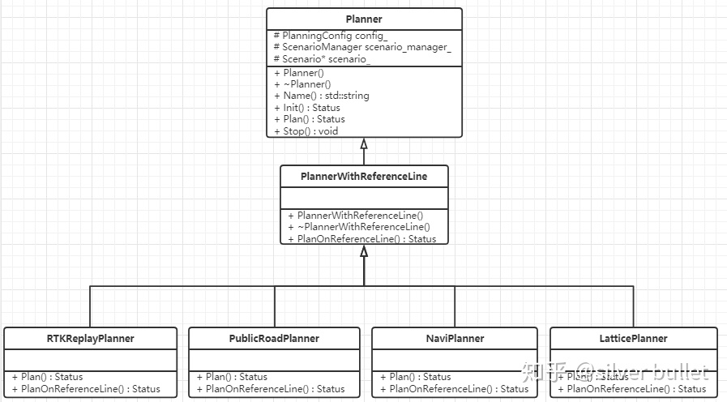

#### 2. PlannerDispatcher

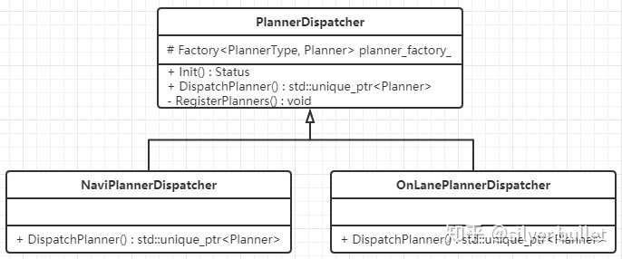

#### 3. PlanningBase

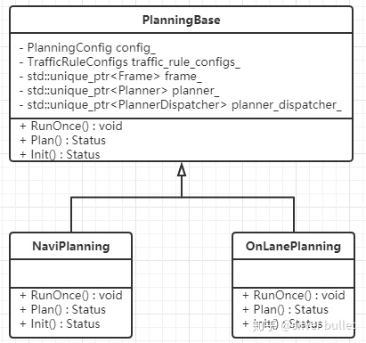

#### 4. PlanningComponent

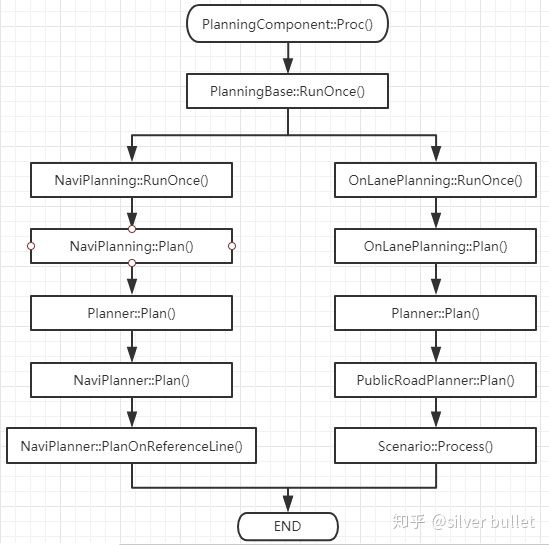

**5.Task**

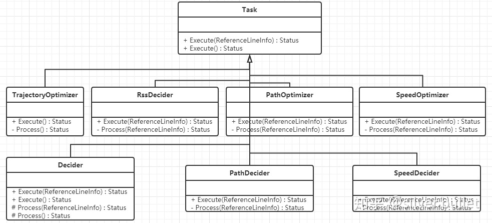

**6.Stage**

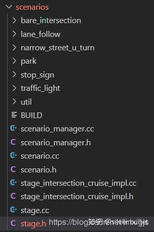

scenarios文件夹中包含了多种场景，内部的每个文件夹就是一个scenario的定义和解决。首先看Stage类的定义，主要的处理都在Stage::Process()中（此处是纯虚函数）。

**7.Scenario **

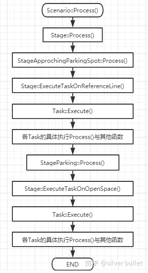


## 尚未解决的问题

1. referenceline为什么在变道的时候就要有多条？然后对每条分别进行一次决策规划，最后在决策最优的轨迹？我理解的是在routing的过程中就已经给出了一条唯一的全局参考轨迹，然后EM planner工作的时候也是根据车辆附近的一段参考线进行DP+QP优化的。目前我的理解是：无法确定换道是否是最优的，所以只要涉及换道就把需要换到的道路也纳入进来，这样从原来的一条参考线变成两条，分别针对这两条参考线进行决策规划，最终再通过referenceLine Trajectory Decider选择出最合适的轨迹。

   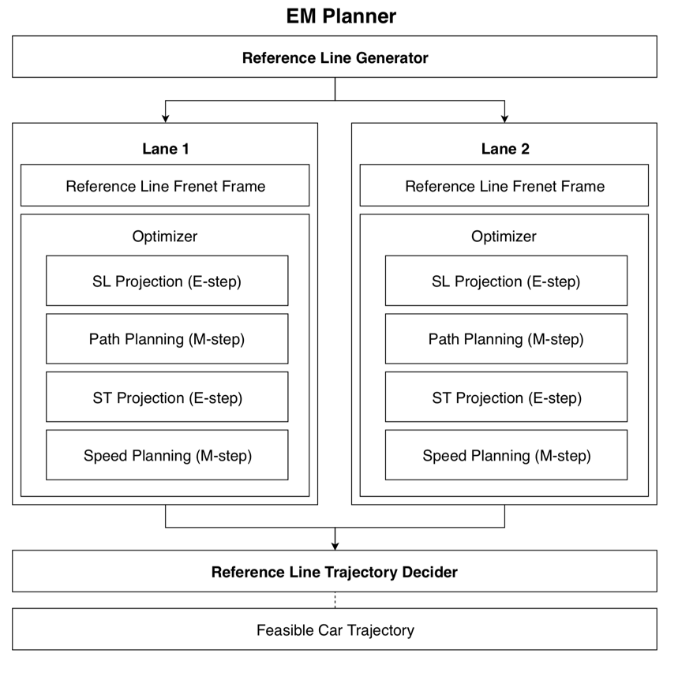

2. ReferenceLineInfo结构为什么还包含了决策信息以及轨迹信息？轨迹不是根据参考线与车辆周围环境决策出来的么？还是说保存下来给下一个规划周期用？

