# OSI七层协议大白话解读

互联网的本质就是**一系列的网络协议**，这个协议就叫OSI协议（一系列协议），按照功能不同，分工不同，人为的分层七层。实际上这个七层是不存在的。没有这七层的概念，只是人为的划分而已。区分出来的目的只是让你明白哪一层是干什么用的。

每一层都运行不同的协议。协议是干什么的，协议就是标准。

实际上还有人把它划成五层、四层。

**七层**划分为：**应用层、表示层、会话层、传输层、网络层、数据链路层、物理层**。

**五层**划分为：**应用层、传输层、网络层、数据链路层、物理层**。

**四层**划分为：**应用层、传输层、网络层、网络接口层**。

**物理层：**

字面意思解释：物理传输、硬件、物理特性。在深圳的你与北京的朋友聊天，你的电脑必须要能上网，物理体现是什么？是不是接一根网线，插个路由器，北京的朋友那边是不是也有根网线，也得插个路由器。也就是说计算机与计算机之间的通信，必须要有底层物理层方面的连通，就类似于你打电话，中间是不是必须得连电话线。

中间的物理链接可以是**光缆、电缆、双绞线、无线电波**。中间传的是电信号，即010101...这些二进制位。

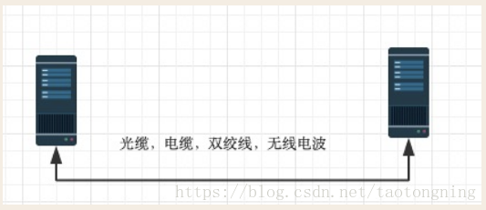

底层传输的010010101001...这些二级制位怎么才能让它有意义呢？

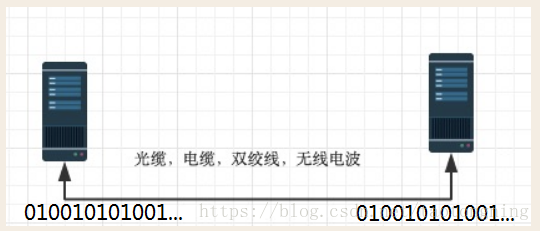

要让这些010010101001...有意思，人为的分组再适合不过了，8位一组，发送及接收都按照8位一组来划分。接收到8位为一组的话，那么就可以按照这8位数来做运算。如果没有分组，对方接收的计算机根本就不知道从哪一位开始来做计算，也解析不了收到的数据。我发了16位你就按照16位来做计算吗？我发100位你就按照100位做计算吗？没什么意义是吧。因此要想让底层的电信号有意义，必须要把底层的电信号做分组。我做好8位一组，那么我收到数据，我就知道这几个8位做一组，这几个8位做一组。那么每个8位就可以得到一个确定的数。**分组是谁干的活呢？物理层干不了，这个是数据链路层干的。**

**数据链路层**

早期的时候，**数据链路层就是来对电信号来做分组的**。以前每个公司都有自己的分组方式，非常的乱，后来形成了统一的标准（标准就是协议），即以太网协议Ethernet。

Ethernet规定

一组电信号称之为一个数据包，或者叫做一个**“帧”**

- 每一数据帧分成：报头head和数据data两部分

head包含：（固定18个字节）

- 发送者（源地址，6个字节）
- 接收者（目标地址，6个字节）
- 数据类型（6个字节）

data包含：（最短46字节，最长1500字节）

- 数据包的具体内容

head长度+data长度=最短64字节，最长1518字节，超过最大限制就分片发送。

这就像写信，发送者的地址（源地址）就是你家的地址，接收者地址（目标地址）就是对方的收信地址，你家的路由器就相当于邮局。其实在计算机通信中的源地址和目标地址指的是**mac地址**。

Mac地址的由来：

head中包含的源和目标地址由来：Ethernet规定接入Internet的设备都必须具备网卡，发送端的和接收端的地址便是指网卡的地址，即Mac地址。

每块网卡出厂时都被烧录上一个实际上唯一的Mac地址，长度为48位2进制，通常由12位16进制数表示，（前六位是厂商编码，后六位是流水线号）

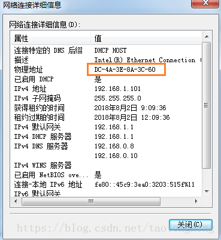

有了mac地址以后，计算机就可以通信了，假设一个教室就是一个局域网（隔离的网络），这个教室里面有几台计算机，计算机的通信和人的通信是一个道理，把教室里面的人都比作一个个计算机，假设教室里面的人都是瞎子，其实计算机就是瞎子的，计算机通信基本靠吼，现在我要找教室里面的飞哥要战狼2的片，然后我就吼一声，说我要找飞哥要战狼2的片，战狼2的片就属于我的数据，但是我在发的时候我是不是要标识我是谁，我要找谁，我是谁就是我的mac地址，我要找谁就是飞哥的mac地址，这两个地址做数据包的头部，再加上数据战狼2的片就构成了一个数据帧。

这个数据包封装好以后就往外发，到物理层以后就全部转成二级制，往外发是怎么发的呢？就是靠吼。即“我是Edison，我找飞哥要战狼2的片”。这么吼了一嗓子以后，全屋子的人都能听到，这就是广播。

计算机底层，只要在一个教室里（一个局域网），都是靠广播的方式，吼。

局域网的理解：什么是互联网，互联网就是由一个个局域网组成，局域网内的计算机不管是对内还是对外都是靠吼，这就是数据链路层的工作方式-----广播。

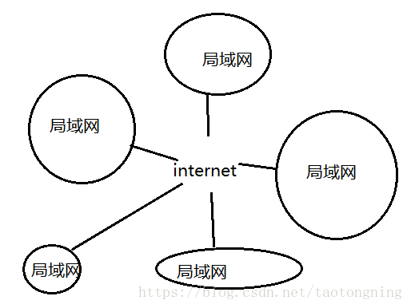

广播出去以后，所有人都听得见，所有人都会拆开这个包，读发送者是谁，接收者是谁，**只要接收者不是自己就丢弃掉**。对计算机来说，它会看自己的Mac地址，飞哥收到以后，他就会把片发给我，发送回来同样采用广播的方式了，靠吼。

同一个教室（同一个局域网）的计算机靠吼来通信，那不同教室的计算机又如何？

比如说局域网1的pc1与局域网2的pc10如何通信？**你在教室1（局域网1）吼，教室2（局域网2）的人肯定是听不见的。这就是跨网络进行通信，数据链路层就解决不了这个问题了，这就得靠网络层出面了。**

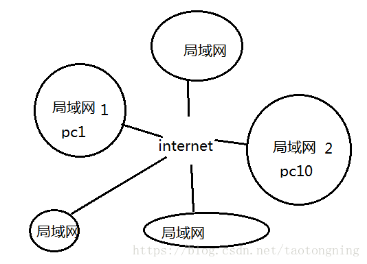

在讲网络层之前，其实基于广播的这种通信就可以实现全世界通信了，你吼一声，如果全世界是一个局域网，全世界的计算机肯定可以听得见，从理论上似乎行得通，如果全世界的计算机都在吼，你想一想，这是不是一个灾难。因此，全世界不能是一个局域网。于是就有了网络层。

**网络层：**

网络层定义了一个IP协议，

你想，我是这个教室的一个学生，我想找隔壁教室一个叫老王的学生，我也不认识老王，那怎么办，我吼？老王在另外一个教室肯定是听不到的。找教室的负责人，这个教室的负责人就负责和隔壁教室的负责人说话，说我们教室的有个学生要找你们教室的老王。往外传的东西交给负责人就可以了，内部的话上面已经提到，通过广播的方式，对外的东西广播失效。**教室的负责人就是网关，网关即网络关口的意思。**

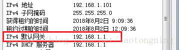

**Mac地址**是用来标识你这个教室的某个位置，**IP地址**是用来标识你在哪个教室（哪个局域网）。你要跨网络发包你是不是要知道对方的IP地址，比如你要访问百度，你肯定得知道百度服务器的IP地址。计算机在发包前，会判断你在哪个教室，对方在哪个教室，如果在一个教室，基于mac地址的广播发包就OK了；如果不在一个教室，即跨网络发包，那么就会把你的包交给教室负责人（网关）来转发。**Mac地址及IP地址唯一标识了你在互联网中的位置。**

数据链路层中会把网络层的数据包封装到数据链路层的数据位置，然后再添加上自己的包头，再发给物理层，物理层发给网关，网关再发给对方教室的网关，对方教室的网关收到后在那个教室做广播。

在数据链路层看，数据封装了两层，跟玩俄罗斯套娃有点类似，一层套了一层。

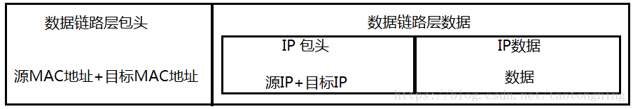

最终变成

现在来看另一个问题，在吼之前怎么知道对方的Mac地址？这就得靠ARP协议。

ARP协议的由来：在你找飞哥要片之前，你的先干一件事，想办法知道飞哥的Mac地址。即你的机器必须先发一个ARP包出去，ARP也是靠广播的方式发，ARP发送广播包的方式如下：

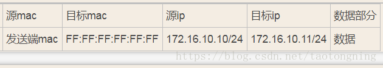

局域网中怎么获取对方的Mac地址：

肯定要知道对方的IP地址，这是最基本的，就像你要访问百度，肯定得知道百度的域名，域名就是百度的IP地址。自己的IP可以轻松获得，自己的Mac也轻松获取，目标Mac为12个F，我们叫广播地址，表达的意思是我想要获取这个目标IP地址172.16.10.11的机器的Mac地址。Mac为12个F代表的是一种功能，这个功能就是获取对方的MAC地址，计算机的Mac永远不可能是12个F。假设是在本教室广播，一嗓子吼出去了，所有人开始解包，只有IP地址是172.16.10.11的这个人才会返回他的Mac地址，其他人全部丢弃。发回来源Mac改成飞哥自己的Mac地址，同时把飞哥的Mac地址放在数据部分。

跨网络怎么获取对方的Mac地址：

通过IP地址区分，计算机运算判断出飞哥不在同一个教室，目标IP就变成了网关的IP了。网关的IP在计算机上配死了，可以轻松获取。

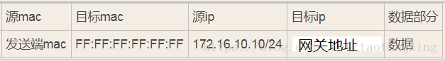

这样网关就会把它的Mac地址返回给你，然后正常发包

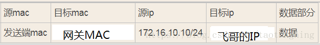

网关帮你去找飞哥，但对用户来说，我们根本就感觉不到网关的存在。

**传输层**

传输层的由来：网络层的ip帮我们区分子网，以太网层的mac帮我们找到主机，然后大家使用的都是应用程序，你的电脑上可能同时开启qq，暴风影音，等多个应用程序，

那么我们通过ip和mac找到了一台特定的主机，如何标识这台主机上的应用程序，答案就是端口，端口即应用程序与网卡关联的编号。

传输层功能：建立端口到端口的通信

补充：端口范围0-65535，0-1023为系统占用端口

tcp协议：

可靠传输，TCP数据包没有长度限制，理论上可以无限长，但是为了保证网络的效率，通常TCP数据包的长度不会超过IP数据包的长度，以确保单个TCP数据包不必再分割。

| 以太网头 | ip 头 | tcp头 | 数据 |
| -------- | ----- | ----- | ---- |
|          |       |       |      |

 

udp协议：

不可靠传输，”报头”部分一共只有8个字节，总长度不超过65,535字节，正好放进一个IP数据包。

| 以太网头 | ip头 | udp头 | 数据 |
| -------- | ---- | ----- | ---- |
|          |      |       |      |

 

 

**应用层**

应用层由来：用户使用的都是应用程序，均工作于应用层，互联网是开发的，大家都可以开发自己的应用程序，数据多种多样，必须规定好数据的组织形式 。

应用层功能：规定应用程序的数据格式。

例：TCP协议可以为各种各样的程序传递数据，比如Email、WWW、FTP等等。那么，必须有不同协议规定电子邮件、网页、FTP数据的格式，这些应用程序协议就构成了”应用层”。

 

#  详细解读

OSI 七层模型通过七个层次化的结构模型使不同的系统不同的网络之间实现可靠的通讯，因此其最主要的功能就是帮助不同类型的主机实现数据传输 。

完成中继功能的节点通常称为中继系统。在OSI七层模型中，处于不同层的中继系统具有不同的名称。  

 

一个设备工作在哪一层，关键看它工作时利用哪一层的数据头部信息。网桥工作时，是以MAC头部来决定转发端口的，因此显然它是数据链路层的设备。
 具体说:
 物理层：网卡，网线，集线器，中继器，调制解调器

数据链路层：网桥，交换机

网络层：路由器

网关工作在第四层传输层及其以上

集线器是物理层设备,采用广播的形式来传输信息。

交换机就是用来进行报文交换的机器。多为链路层设备(二层交换机)，能够进行地址学习，采用存储转发的形式来交换报文.。

路由器的一个作用是连通不同的网络，另一个作用是选择信息传送的线路。选择通畅快捷的近路，能大大提高通信速度，减轻网络系统通信负荷，节约网络系统资源，提高网络系统畅通率。 

**交换机和路由器的区别**

交换机拥有一条很高带宽的背部总线和内部交换矩阵。交换机的所有的端口都挂接在这条总线上，控制电路收到数据包以后，处理端口会查找内存中的地址对照表以确定目的MAC（网卡的硬件地址）的NIC（网卡）挂接在哪个端口上，通过内部交换矩阵迅速将数据包传送到目的端口，目的MAC若不存在则广播到所有的端口，接收端口回应后交换机会“学习”新的地址，并把它添加入内部MAC地址表中。 
 使用交换机也可以把网络“分段”，通过对照MAC地址表，交换机只允许必要的网络流量通过交换机。通过交换机的过滤和转发，可以有效的隔离广播风暴，减少误包和错包的出现，避免共享冲突。 
  交换机在同一时刻可进行多个端口对之间的数据传输。每一端口都可视为独立的网段，连接在其上的网络设备独自享有全部的带宽，无须同其他设备竞争使用。当节点A向节点D发送数据时，节点B可同时向节点C发送数据，而且这两个传输都享有网络的全部带宽，都有着自己的虚拟连接。假使这里使用的是10Mbps的以太网交换机，那么该交换机这时的总流通量就等于2×10Mbps＝20Mbps，而使用10Mbps的共享式HUB时，一个HUB的总流通量也不会超出10Mbps。 
总之，交换机是一种基于MAC地址识别，能完成封装转发数据包功能的网络设备。交换机可以“学习”MAC地址，并把其存放在内部地址表中，通过在数据帧的始发者和目标接收者之间建立临时的交换路径，使数据帧直接由源地址到达目的地址。

从过滤网络流量的角度来看，路由器的作用与交换机和网桥非常相似。但是与工作在网络物理层，从物理上划分网段的交换机不同，路由器使用专门的软件协议从逻辑上对整个网络进行划分。例如，一台支持IP协议的路由器可以把网络划分成多个子网段，只有指向特殊IP地址的网络流量才可以通过路由器。对于每一个接收到的数据包，路由器都会重新计算其校验值，并写入新的物理地址。因此，使用路由器转发和过滤数据的速度往往要比只查看数据包物理地址的交换机慢。但是，对于那些结构复杂的网络，使用路由器可以提高网络的整体效率。路由器的另外一个明显优势就是可以自动过滤网络广播。

**集线器与路由器在功能上有什么不同?** 

  首先说HUB,也就是集线器。它的作用可以简单的理解为将一些机器连接起来组成一个局域网。而交换机（又名交换式集线器）作用与集线器大体相同。但是两者在性能上有区别：集线器采用的式共享带宽的工作方式，而交换机是独享带宽。这样在机器很多或数据量很大时，两者将会有比较明显的。而路由器与以上两者有明显区别，它的作用在于连接不同的网段并且找到网络中数据传输最合适的路径。路由器是产生于交换机之后，就像交换机产生于集线器之后，所以路由器与交换机也有一定联系，不是完全独立的两种设备。路由器主要克服了交换机不能路由转发数据包的不足。 

 总的来说，路由器与交换机的主要区别体现在以下几个方面： 

 （1）工作层次不同 
 最初的的交换机是工作在数据链路层，而路由器一开始就设计工作在网络层。由于交换机工作在数据链路层，所以它的工作原理比较简单，而路由器工作在网络层，可以得到更多的协议信息，路由器可以做出更加智能的转发决策。 

 （2）数据转发所依据的对象不同 
  交换机是利用物理地址或者说MAC地址来确定转发数据的目的地址。而路由器则是利用IP地址来确定数据转发的地址。IP地址是在软件中实现的，描述的是设备所在的网络。MAC地址通常是硬件自带的，由网卡生产商来分配的，而且已经固化到了网卡中去，一般来说是不可更改的。而IP地址则通常由网络管理员或系统自动分配。 

 （3）传统的交换机只能分割冲突域，不能分割广播域；而路由器可以分割广播域 
  由交换机连接的网段仍属于同一个广播域，广播数据包会在交换机连接的所有网段上传播，在某些情况下会导致通信拥挤和安全漏洞。连接到路由器上的网段会被分配成不同的广播域，广播数据不会穿过路由器。虽然第三层以上交换机具有VLAN功能，也可以分割广播域，但是各子广播域之间是不能通信交流的，它们之间的交流仍然需要路由器。 

 （4）路由器提供了防火墙的服务 
 路由器仅仅转发特定地址的数据包，不传送不支持路由协议的数据包传送和未知目标网络数据包的传送，从而可以防止广播风暴。

 

**物理层**
 在OSI参考模型中，物理层（Physical Layer）是参考模型的最低层，也是OSI模型的第一层。
 物理层的主要功能是：利用传输介质为数据链路层提供物理连接，实现比特流的透明传输。
 物理层的作用是实现相邻计算机节点之间比特流的透明传送，尽可能屏蔽掉具体传输介质和物理设备的差异。使其上面的数据链路层不必考虑网络的具体传输介质是什么。“透明传送比特流”表示经实际电路传送后的比特流没有发生变化，对传送的比特流来说，这个电路好像是看不见的。

**数据链路层**
 数据链路层（Data Link Layer）是OSI模型的第二层，负责建立和管理节点间的链路。该层的主要功能是：通过各种控制协议，将有差错的物理信道变为无差错的、能可靠传输数据帧的数据链路。
 在计算机网络中由于各种干扰的存在，物理链路是不可靠的。因此，这一层的主要功能是在物理层提供的比特流的基础上，通过差错控制、流量控制方法，使有差错的物理线路变为无差错的数据链路，即提供可靠的通过物理介质传输数据的方法。
 该层通常又被分为介质访问控制（MAC）和逻辑链路控制（LLC）两个子层。

MAC子层的主要任务是解决共享型网络中多用户对信道竞争的问题，完成网络介质的访问控制；

LLC子层的主要任务是建立和维护网络连接，执行差错校验、流量控制和链路控制。
 数据链路层的具体工作是接收来自物理层的位流形式的数据，并封装成帧，传送到上一层；同样，也将来自上层的数据帧，拆装为位流形式的数据转发到物理层；并且，还负责处理接收端发回的确认帧的信息，以便提供可靠的数据传输。

**网络层**
 网络层（Network Layer）是OSI模型的第三层，它是OSI参考模型中最复杂的一层，也是通信子网的最高一层。它在下两层的基础上向资源子网提供服务。其主要任务是：通过路由选择算法，为报文或分组通过通信子网选择最适当的路径。该层控制数据链路层与传输层之间的信息转发，建立、维持和终止网络的连接。具体地说，数据链路层的数据在这一层被转换为数据包，然后通过路径选择、分段组合、顺序、进/出路由等控制，将信息从一个网络设备传送到另一个网络设备。
 一般地，数据链路层是解决同一网络内节点之间的通信，而网络层主要解决不同子网间的通信。例如在广域网之间通信时，必然会遇到路由（即两节点间可能有多条路径）选择问题。 

在实现网络层功能时，需要解决的主要问题如下：
  寻址：数据链路层中使用的物理地址（如MAC地址）仅解决网络内部的寻址问题。在不同子网之间通信时，为了识别和找到网络中的设备，每一子网中的设备都会被分配一个唯一的地址。由于各子网使用的物理技术可能不同，因此这个地址应当是逻辑地址（如IP地址）。
  交换：规定不同的信息交换方式。常见的交换技术有：线路交换技术和存储转发技术，后者又包括报文交换技术和分组交换技术。
  路由算法：当源节点和目的节点之间存在多条路径时，本层可以根据路由算法，通过网络为数据分组选择最佳路径，并将信息从最合适的路径由发送端传送到接收端。
  连接服务：与数据链路层流量控制不同的是，前者控制的是网络相邻节点间的流量，后者控制的是从源节点到目的节点间的流量。其目的在于防止阻塞，并进行差错检测。

**传输层**
 OSI下3层的主要任务是数据通信，上3层的任务是数据处理。而传输层（Transport Layer）是OSI模型的第4层。因此该层是通信子网和资源子网的接口和桥梁，起到承上启下的作用。
  该层的主要任务是：向用户提供可靠的端到端的差错和流量控制，保证报文的正确传输。传输层的作用是向高层屏蔽下层数据通信的细节，即向用户透明地传送报文。该层常见的协议：TCP/IP中的TCP协议、Novell网络中的SPX协议和微软的NetBIOS/NetBEUI协议。
  传输层提供会话层和网络层之间的传输服务，这种服务从会话层获得数据，并在必要时，对数据进行分割。然后，传输层将数据传递到网络层，并确保数据能正确无误地传送到网络层。因此，传输层负责提供两节点之间数据的可靠传送，当两节点的联系确定之后，传输层则负责监督工作。综上，传输层的主要功能如下：
 传输连接管理：提供建立、维护和拆除传输连接的功能。传输层在网络层的基础上为高层提供“面向连接”和“面向无接连”的两种服务。
 处理传输差错：提供可靠的“面向连接”和不太可靠的“面向无连接”的数据传输服务、差错控制和流量控制。在提供“面向连接”服务时，通过这一层传输的数据将由目标设备确认，如果在指定的时间内未收到确认信息，数据将被重发。
监控服务质量。
**会话层**
 会话层（Session  Layer）是OSI模型的第5层，是用户应用程序和网络之间的接口，主要任务是：向两个实体的表示层提供建立和使用连接的方法。将不同实体之间的表示层的连接称为会话。因此会话层的任务就是组织和协调两个会话进程之间的通信，并对数据交换进行管理。
 用户可以按照半双工、单工和全双工的方式建立会话。当建立会话时，用户必须提供他们想要连接的远程地址。而这些地址与MAC（介质访问控制子层）地址或网络层的逻辑地址不同，它们是为用户专门设计的，更便于用户记忆。域名（DN）就是一种网络上使用的远程地址例如：[www.3721.com](http://student.csdn.net/link.php?url=http://www.3721.com%2F)就是一个域名。会话层的具体功能如下：
 会话管理：允许用户在两个实体设备之间建立、维持和终止会话，并支持它们之间的数据交换。例如提供单方向会话或双向同时会话，并管理会话中的发送顺序，以及会话所占用时间的长短。
  会话流量控制：提供会话流量控制和交叉会话功能。
 寻址：使用远程地址建立会话连接。l
 出错控制：从逻辑上讲会话层主要负责数据交换的建立、保持和终止，但实际的工作却是接收来自传输层的数据，并负责纠正错误。会话控制和远程过程调用均属于这一层的功能。但应注意，此层检查的错误不是通信介质的错误，而是磁盘空间、打印机缺纸等类型的高级错误。
**表示层**
 表示层（Presentation  Layer）是OSI模型的第六层，它对来自应用层的命令和数据进行解释，对各种语法赋予相应的含义，并按照一定的格式传送给会话层。其主要功能是“处理用户信息的表示问题，如编码、数据格式转换和加密解密”等。表示层的具体功能如下：
 数据格式处理：协商和建立数据交换的格式，解决各应用程序之间在数据格式表示上的差异。
 数据的编码：处理字符集和数字的转换。例如由于用户程序中的数据类型（整型或实型、有符号或无符号等）、用户标识等都可以有不同的表示方式，因此，在设备之间需要具有在不同字符集或格式之间转换的功能。
 压缩和解压缩：为了减少数据的传输量，这一层还负责数据的压缩与恢复。
 数据的加密和解密：可以提高网络的安全性。

**应用层**
 应用层（Application  Layer）是OSI参考模型的最高层，它是计算机用户，以及各种应用程序和网络之间的接口，其功能是直接向用户提供服务，完成用户希望在网络上完成的各种工作。它在其他6层工作的基础上，负责完成网络中应用程序与网络操作系统之间的联系，建立与结束使用者之间的联系，并完成网络用户提出的各种网络服务及应用所需的监督、管理和服务等各种协议。此外，该层还负责协调各个应用程序间的工作。
  应用层为用户提供的服务和协议有：文件服务、目录服务、文件传输服务（FTP）、远程登录服务（Telnet）、电子邮件服务（E-mail）、打印服务、安全服务、网络管理服务、数据库服务等。上述的各种网络服务由该层的不同应用协议和程序完成，不同的网络操作系统之间在功能、界面、实现技术、对硬件的支持、安全可靠性以及具有的各种应用程序接口等各个方面的差异是很大的。应用层的主要功能如下：
 用户接口：应用层是用户与网络，以及应用程序与网络间的直接接口，使得用户能够与网络进行交互式联系。
 实现各种服务：该层具有的各种应用程序可以完成和实现用户请求的各种服务。

 OSI7层模型的小结
 由于OSI是一个理想的模型，因此一般网络系统只涉及其中的几层，很少有系统能够具有所有的7层，并完全遵循它的规定。
  在7层模型中，每一层都提供一个特殊的网络功能。从网络功能的角度观察：下面4层（物理层、数据链路层、网络层和传输层）主要提供数据传输和交换功能，即以节点到节点之间的通信为主；第4层作为上下两部分的桥梁，是整个网络体系结构中最关键的部分；而上3层（会话层、表示层和应用层）则以提供用户与应用程序之间的信息和数据处理功能为主。简言之，下4层主要完成通信子网的功能，上3层主要完成资源子网的功能。
     

 

 

以下是TCP/IP分层模型
     ┌────------────┐┌─┬─┬─-┬─┬─-┬─┬─-┬─┬─-┬─┬─-┐
 　　│　　　　　　　　││Ｄ│Ｆ│Ｗ│Ｆ│Ｈ│Ｇ│Ｔ│Ｉ│Ｓ│Ｕ│　│
 　　│　　　　　　　　││Ｎ│Ｉ│Ｈ│Ｔ│Ｔ│Ｏ│Ｅ│Ｒ│Ｍ│Ｓ│其│
 　　│第四层，应用层　││Ｓ│Ｎ│Ｏ│Ｐ│Ｔ│Ｐ│Ｌ│Ｃ│Ｔ│Ｅ│　│
 　　│　　　　　　　　││　│Ｇ│Ｉ│　│Ｐ│Ｈ│Ｎ│　│Ｐ│Ｎ│　│
 　　│　　　　　　　　││　│Ｅ│Ｓ│　│　│Ｅ│Ｅ│　│　│Ｅ│它│
 　　│　　　　　　　　││　│Ｒ│　│　│　│Ｒ│Ｔ│　│　│Ｔ│　│
 　　└───────------─┘└─┴─┴─-┴─┴─-┴─┴─-┴─┴─-┴─┴-─┘
 　　┌───────-----─┐┌─────────-------┬──--------─────────┐
 　　│第三层，传输层　││　　　ＴＣＰ　　　│　　　　ＵＤＰ　　　　│
 　　└───────-----─┘└────────-------─┴──────────--------─┘
 　　┌───────-----─┐┌───----──┬───---─┬────────-------──┐
 　　│　　　　　　　　││　　　　　│ＩＣＭＰ│　　　　　　　　　　│
 　　│第二层，网间层　││　　　　　└──---──┘　　　　　　　　　　│
 　　│　　　　　　　　││　　　　　　　ＩＰ　　　　　　　　　　　 │
 　　└────────-----┘└────────────────────-------------─-┘
 　　┌────────-----┐┌─────────-------┬──────--------─────┐
 　　│第一层，网络接口││ＡＲＰ／ＲＡＲＰ　│　　　　其它　　　　　│
 　　└────────------┘└─────────------┴─────--------──────┘
 　　　　　　 TCP/IP四层参考模型

 　　TCP/IP协议被组织成四个概念层，其中有三层对应于ISO参考模型中的相应层。ICP/IP协议族并不包含物理层和数据链路层，因此它不能独立完成整个计算机网络系统的功能，必须与许多其他的协议协同工作。
 　　TCP/IP分层模型的四个协议层分别完成以下的功能：
 　　第一层:网络接口层
  　包括用于协作IP数据在已有网络介质上传输的协议。实际上TCP/IP标准并不定义与ISO数据链路层和物理层相对应的功能。相反，它定义像地址解析协议(Address Resolution Protocol,ARP)这样的协议，提供TCP/IP协议的数据结构和实际物理硬件之间的接口。
 　　第二层:网间层
 　　对应于OSI七层参考模型的网络层。本层包含IP协议、RIP协议(Routing Information  Protocol，路由信息协议)，负责数据的包装、寻址和路由。同时还包含网间控制报文协议(Internet Control Message  Protocol,ICMP)用来提供网络诊断信息。
 　　第三层:传输层
 　　对应于OSI七层参考模型的传输层，它提供两种端到端的通信服务。其中TCP协议(Transmission Control Protocol)提供可靠的数据流运输服务，UDP协议(Use Datagram Protocol)提供不可靠的用户数据报服务。
 　　第四层:应用层
  　对应于OSI七层参考模型的应用层和表达层。因特网的应用层协议包括Finger、Whois、FTP(文件传输协议)、Gopher、HTTP(超文本传输协议)、Telent(远程终端协议)、SMTP(简单邮件传送协议)、IRC(因特网中继会话)、NNTP（网络新闻传输协议）等

# 举例

在QQ之间发送消息的传递过程

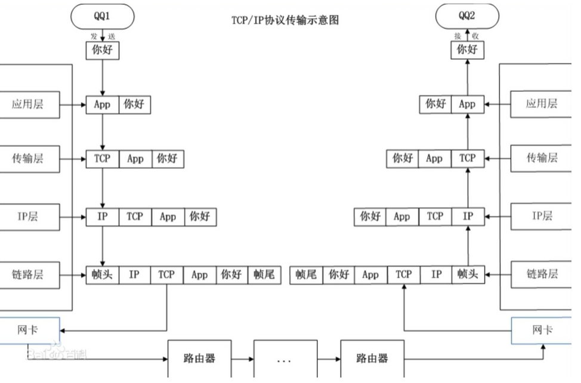