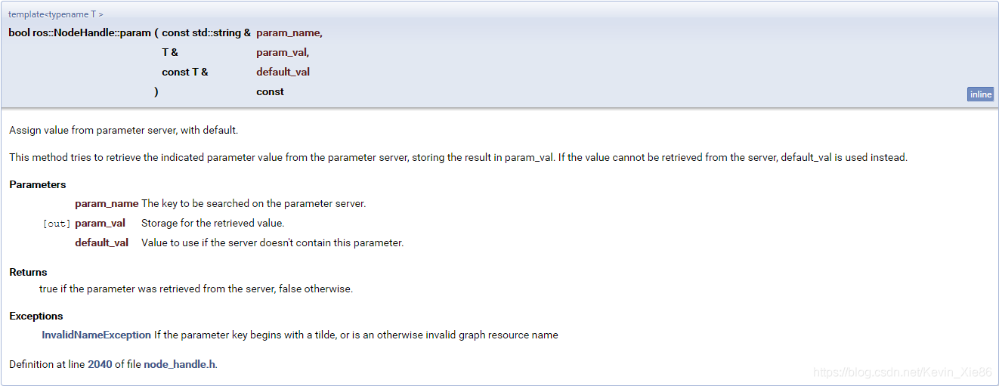

# ROS Nodehandle句柄

## 1、句柄可以让你通过构造函数指定命名空间

ros::NodeHandle nh("my_namespace");

这使得使用该句柄的任何相对名字都是相对<node_namespace>/my_namespace，而不是只相对<node_namespace>

你也可以指定一个父句柄和追加的命名空间

ros::NodeHandle nh1("ns1");

ros::NodeHandle nh2(nh1,"ns2");

这将把nh2放入到<node_namespace>/ns1/ns2命名空间

## 2、也可以指定全局名字

ros::NodeHandle nh("/my_global_namespace");

这种做法并不推荐，因为这样会使得节点无法被放入别的命名空间。只是有时在代码中使用全局名字有用。

## 3、私有名字

使用私有名字比直接调用有私有名的句柄方法更有技巧，你可以在一个私有命名空间中直接创建一个新的句柄。

ros::NodeHandle nh("~my_private_namespace");

ros::Subscriber sub = nh.subscribe("my_private_topic",....);

以上例子会订阅<**node_name**>/my_private_namespace/my_private_topic

注意：理解的重点上文中黑色标注的部分，node_namespace和node_name是两回事！

node_name = node_namespace + nodename

补充demo

// launch 文件中 ns=="node_namespace"

ros::init(argc, argv, "node_name"); // node name

ros::NodeHandle n; //n 命名空间为/node_namespace

ros::NodeHandle n1("sub"); // n1命名空间为/node_namespace/sub

ros::NodeHandle n2(n1,"sub2");// n2命名空间为/node_namespace/sub/sub2

ros::NodeHandle pn1("~"); //pn1 命名空间为/node_namespace/node_name

ros::NodeHandle pn2("~sub"); //pn2 命名空间为/node_namespace/node_name/sub

ros::NodeHandle pn3("~/sub"); //pn3 命名空间为/node_namespace/node_name/sub

ros::NodeHandle gn("/global"); // gn 命名空间为/global

## ros::NodeHandle::param()

param()函数从参数服务器取参数值给变量。如果无法获取，则将默认值赋给变量。这个函数的功能和getParam()函数类似，区别是param()函数还提供了一个默认值。

