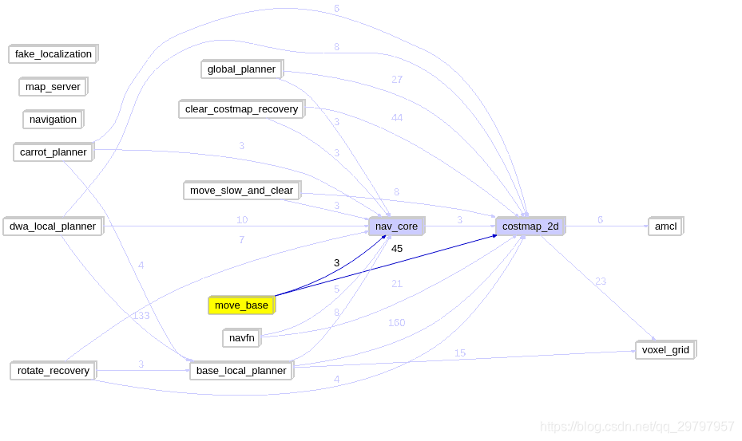

# 软件包关系梳理

https://blog.csdn.net/qq_29797957/article/details/108122697

对navigation的两个分支做一个简单的对比：

```
1. melodic在kinetic的基础上淘汰了tf的使用，替换成了tf2;
2. melodic在某些Velocity参数设置做了一些相应的修改，参数名等方面;
3. costmap2D上增加了某些细节；
4. 在核心算法上好像并没有做出太大改进；
5. 如果后续发现新的不同，将在此补充， 若大家有新的发现也欢迎留言告诉我.
```

##  1. 软件包按功能分类

**navigation库中各个软件包的调用关系图**



navigation库中所包含功能包的树状图（仅目录）

```
"注意: 在后续的阐述中全部采用序号来代替相对应的软件包名称"

├── 1. amcl
├── 2. base_local_planner
├── 3. carrot_planner
├── 4. clear_costmap_recovery
├── 5. costmap_2d
├── 6. dwa_local_planner
├── 7. fake_localization
├── 8. global_planner
├── 9. map_server
├── 10. move_base
├── 11. move_slow_and_clear
├── 12. nav_core
├── 13. navfn
├── 14. navigation
├──     README.md
├── 15. robot_pose_ekf
├── 16. rotate_recovery
└── 17. voxel_grid


从上可以看出一共有17个软件包， 其中:
(1、7、15)为提高机器人定位辅助包 ;
（9）为加载和保存地图辅助包 ;
(4、11、16)为导航修复辅助包(ps: 当机器人出现意外无法到达指定位置时所采取的修复行为
(17)为体素定义辅助包。

除了上述辅助包之外， 剩下的都是核心软件包， 主要包括以下几种:
核心控制枢纽软件包: 10 (move_base)
中间中转站(数据交换接口): 5(costmap2d)、 12(nav_core)
全局路径规划器: 3 、8、 13
局部路径规划器: 2、 6
```

navigation包的核心就是10(move_base),它通过两个核心数据传输接口costmap2d、nav_core来维护整个导航框架的运行

## 2.源码阅读预备知识点

- ROS语法

```
1. ROS-Topic的订阅和发布
2. ROS-msg的高级创建和使用 	
3. ROS-srv的高级创建和使用     
4. actionlib 		        
5. pluginlib           	    
6. tf库                      
7. ROS的消息打印种类         
```

- C++语法

```
1. 共享指针
2. 线程锁
3. 多线程并行
4. 虚函数
5. enum 枚举
```

