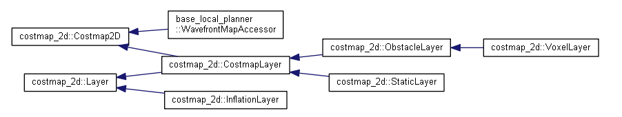
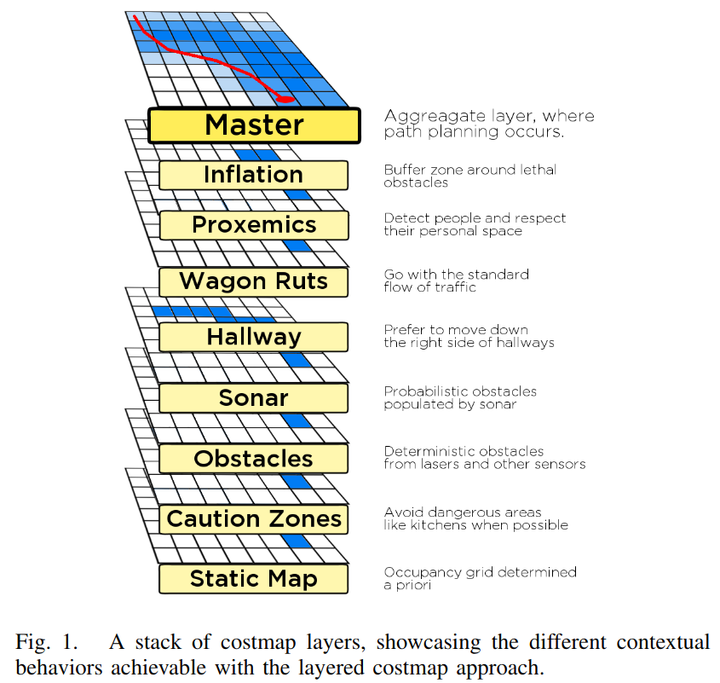
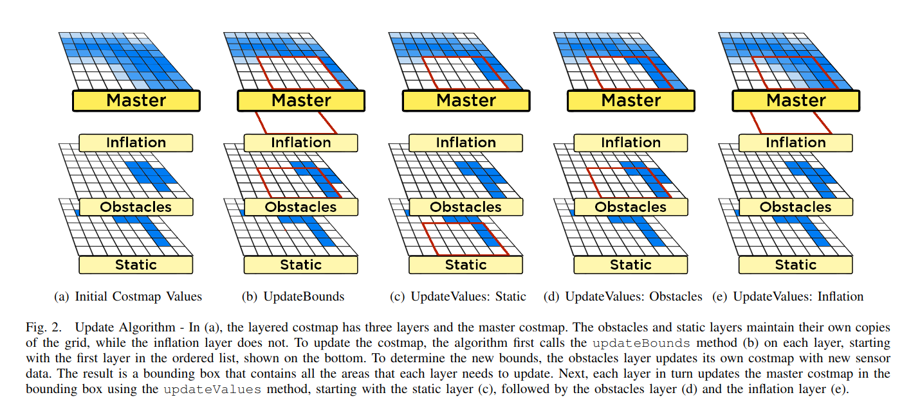

#  costmap2D类接口总结

## 昨日学习感想

昨天之前想弄明白一个源码文件，都是先看h文件，再看cpp文件，有时候看着看着就忘了。今天找到了一个新的方法，即先总体看一遍h文件的结构，弄清结构与重要变量都有哪些，然后再根据h的函数声明跳转（ctrl+鼠标左键）到cpp文件看对应函数，这样逐个击破。

## 简介

costmap2D类用于集成定位与传感器感知信息、根据需求生成相应的二维栅格地图，提供给全局规划器与局部规划器使用。

amcl包研究完了，下面就是规划了，由于规划的基础是地图，所以要先研究costmap_2d这个包。

跟amcl包相比，costmap_2d更加庞大，代码行数达到9000行，比amcl包还多3000。光看costmap_2d的include目录就让人绝望了：头文件都有17个。显然，这个时候略读都不太现实，我们需要一个更高效的方式来抓住costmap_2d的主干。

### 类图

这个时候我们就需要类继承图。以前光听书上吹类的概念的好处，并没有实际的体会，现在碰到这种大工程才懂。**用doxygen+graphviz解析整个navigation stack**，找到costmap_2d的继承图如下：




看到这个图后我终于明白了整个costmap_2d的设计。以doxygen生成的文档为大纲，先读了下layer，发现这个类整个就是一个虚类，提供了最重要的两个接口，updateCosts跟updateBounds，updateBounds计算打算更新的范围，updateCosts就是更新cost了。接口这个概念说起来也没啥，就是规定了下名字，实现了下多态嘛。但是，正因为有接口这个东西，costmap_2d才能实现插件化地图，也就是继承了layer的那几个staicLayer / obstacleLayer /  inflationLayer。插件化地图的概念有一篇论文讲的很清楚，在ros的注释当中也推荐了，Layered Costmaps for  Context-Sensitive Navigation，比较懒的看下论文的图就行：)







所以，看上去接口让代码更多，其实理解起来变得更简单，不管后面的类有多少函数，主要看updateCosts跟updateBounds这两个就行。layer类中还使用到了LayeredCostmap，用来将各个层聚合在一起。LayeredCostmap类中主要的更新函数是updateMap，可以看到在udpateMap里利用到前面提到的多态，遍历调用了所有层的两个核心函数。不得不吐槽LayeredCostmap这个名字起的一点都不好，这哪里看得出来是用来聚合的。

基类中还有一个costmap2D，这个类读下来感觉没啥核心功能，就换算下坐标啊，找多边形框起来了哪些点啊。可以认为是一个打杂的类，现在暂时不用管，因为我们的目标是找到最有价值的部分。唯一值得注意的是costmap2D里面有个unsigned char* costmap_;这个应该就是之后继承了costmap2D的各种层的实体了。

然后就是继承了layer跟costmap2D的costmapLayer了。costmaplayer其实就定义了几个更新cost的方法，比如不同层同一点的cost是覆盖 相加 还是选最大。不得不再吐槽一句这个名字起的也不好，一个类的名字至少要能看出来这个类打算干啥吧。

### 其他

这样一来整个costmap_2d的整体框架就清楚了，对照着Include目录，还有这么几个类没提到：

observation  observationBuffer，就是记录点云的，一次观测得到一堆点云，存到observation类的pcl::PointCloud<pcl::PointXYZ>* cloud_里，多次观测得到的一系列点云存到observationBuffer的std::list<Observation>  observation_list_里。

costmap2dROS，封装整个功能，对外提供简洁的接口。这个名ROS_INFO("OriginX:%f",costmap_->getOriginX());
  ROS_INFO("OriginY:%f",costmap_->getOriginY());字起的很好，在所有的包里，带ROS后缀的都是封装功能用的，可以理解为加精。

OK，现在各个类的功能都清楚了，下一步就可以往自己的方向深挖了。

### top down

costmap_2d这个包更偏向工程，不像amcl包有一个核心的算法。所以，在清楚了整个大框架的基础上，研究costmap_2d最好抓住它是如何使用的，一步一步往下走，搞清楚整个的流程以便以后改写。costmap2dROS封装好了全部的功能，从costmap2dROS看是最有效率的。

costmap2dROS的头文件还是很长的，我们要抓住重点，先排除掉不用看的：

private不用看，因为肯定是被调用的；含有get的函数不用看，因为就是读取下变量的；含有footprint不用看，这是处理底座的。剩下来的函数有：start stop pause resume updatemap resetlayers.

start stop pause  resume可以看到仅仅在调用layeredCostmap激活每层；updatemap也是调用layeredCostmap更新地图，resetlayers还是在调用layeredCostmap。可见主要的工作都是layeredCostmap这个包工头在干，layeredCostmap拿到命令后叫手下各层小弟干活，然后合起来发给costmap2dROS。

稍微读下layeredCostmap，可以看到它包工头的气质展现地淋漓尽致：声明一个插件集合std::vector<boost::shared_ptr<Layer> >  plugins_;在每个函数里面都是遍历这个插件集合然后调用每一层的具体函数。这样插件化的设计让地图的可扩展性很强。这样一来从上到下的调用结构就打通了，我们可以开始看真正干活的几个类了。

### layers

staticLayer处理的是事先建好的地图。除了所有Layer都有的updateBounds updateCosts外，staticLayer还有两个独有的incomingMap  incomingUpdate，也就是接收到地图就更新，这里更新的是staticlayer的costmap，之后调用的updateCosts才真正反应到结果上。

obstacleLayer稍微复杂点，因为它需要根据雷达信息实时更新。obstacleLayer用了4个函数来处理不同的信息类型：laserScanCallback laserScanValidInfCallback pointCloudCallback    pointCloud2Callback，这些函数在初始化的时候跟扫描数据直接绑定，所以一拿到数据地图就可以更新，等到updateCost的时候反映到结果上。所有的信息都会被处理变成ObservationBuffer类型，也就是一系列三维点云：std::list<Observation> observation_list_;obstacle之后的所有计算都是基于这个类型的。

obstacleLayer里面利用这个ObservationBuffer的方法有点绕。首先，它定义了三个ObservationBuffer的集合：

```cpp
std::vector<boost::shared_ptr<costmap_2d::ObservationBuffer> > observation_buffers_;  ///< @brief Used to store observations from various sensors
std::vector<boost::shared_ptr<costmap_2d::ObservationBuffer> > marking_buffers_;  ///< @brief Used to store observation buffers used for marking obstacles
std::vector<boost::shared_ptr<costmap_2d::ObservationBuffer> > clearing_buffers_;  ///< @brief Used to store observation buffers used for clearing obstacles
```

定义成集合的目的是为了使用不同传感器的数据，但其实初始化只放了一个。marking_buffers_是为了记录标记为障碍的点云，但在初始化的时候是直接指向了所有的观测数据observation_buffers_。既然这样为啥要这么麻烦？这是因为在obstacleLayer还定义了个直接插入数据的函数用来测试，所以需要另起炉灶来个marking_buffers_。

clearing_buffers_是为了将小车到障碍物之间的距离都标记为可行，这个也是直接指向观测数据，也有用来测试的插入数据的函数。在updateBounds里面有两个循环来处理这两个buffer，更新obstacleLayer内部的costmap。同样，这个costmap更新后不是直接反映到结果，而是在updateCost里面再读出来。

inflationLayer就很好理解了，它的主要部分都在udpateCosts里。比较有意思的是inflationLayer存了两个缓存，根据离圆心的距离存了一个cost，一个dist，一格格往外膨胀的时候直接查就行了。实现一格格膨胀的效果用到的方法跟之前amcl包建立地图的occ_dist属性一模一样。

voxelLayer是对付三维情况的，这里没用到，就不说了。整个看下来这个costmap_2d设计的还是挺不错的，这种接口化然后包工头的设计思路值得学习。

相关文档

https://blog.csdn.net/feidaji/article/details/103180205

## 重要接口/变量

### 坐标转化

costmap_是该类中最重要的变量，用于把二维栅格图存储在一个一维字符数组中。

若想把全局地图存储到costmap需要进行两个转化，第一步即从全局坐标(wx,wy)转化到地图坐标(mx,my);第二步即从地图坐标转化到一维数组索引。这两步转化分别涉及到以下三个函数。

#### getIndex（）

costmap是存储在一个一维数组中的，所以每次索引二维(x,y)坐标对应的cell时都需要转化到一维索引

```
  /**
   * @brief  Given two map coordinates... compute the associated index
   * @param mx The x coordinate
   * @param my The y coordinate
   * @return The associated index
   */
  inline unsigned int getIndex(unsigned int mx, unsigned int my) const
  {
    return my * size_x_ + mx;
  }
```

#### indexToCells（）

#### mapToWorld()

地图坐标转化到全局坐标

#### worldToMap()

全局坐标转化到局部坐标

| 0    | 4    | 8    |
| ---- | ---- | ---- |
| 1    | 5    | 9    |
| 2    | 6    | 10   |
| 3    | 7    | 11   |

在代码中可以看出，一维数组是这样存储二维索引的对应关系的，表从0开始，假设共有4行3列，则size_x=4,size_y=3，根据getIndx（）

my*size_x+mx，假设索引数字6，即表中的第7个数字，则对应二维数组(mx,my)=(2,1),所以1x4+2=6. 

## **未学习过的语法**

### **类中定义类**

**该类中还包含MarkCell、PolygonOutlineCells两个子类，即用到了嵌套类。涉及到C++的嵌套类和局部类，相关文章跳转以下链接：**

**https://blog.csdn.net/liyuanbhu/article/details/43897979?utm_medium=distribute.pc_relevant.none-task-blog-BlogCommendFromMachineLearnPai2-1.control&dist_request_id=&depth_1-utm_source=distribute.pc_relevant.none-task-blog-BlogCommendFromMachineLearnPai2-1.control**

### **memset**

**memset是计算机中C/C++语言初始化函数。作用是将某一块内存中的内容全部设置为指定的值， 这个函数通常为新申请的内存做初始化工作。**

**函数介绍**

**void *memset(void *s, int ch, size_t n);**

**函数解释：将s中当前位置后面的n个字节 （typedef unsigned int size_t ）用 ch 替换并返回 s 。**

**origin_x_ memset：作用是在一段内存块中填充某个给定的值，它是对较大的结构体和数组进行清零操作的一种最快方法。**

**memset()函数原型是extern void *memset(void *buffer, int c, int count) buffer：为指针或是数组,c：是赋给buffer的值,count：是buffer的长度.**

## 栅格地图数据格式

```
命令：rosmsg show nav_msgs/OccupancyGrid 

消息格式：
std_msgs/Header header          // 数据的消息头
  uint32 seq                    // 数据的序号
  time stamp                    // 数据的时间戳
  string frame_id               // 地图的坐标系
nav_msgs/MapMetaData info       // 地图的一些信息
  time map_load_time            // 加载地图的时间
  float32 resolution            // 地图的分辨率，一个格子代表着多少米，一般为0.05，[m/cell]
  uint32 width                  // 地图的宽度[m]
  uint32 height                 // 地图的高度 [m]
  geometry_msgs/Pose origin     // 地图左下角的格子对应的物理世界的坐标，[m, m, rad]
    geometry_msgs/Point position
      float64 x
      float64 y
      float64 z
    geometry_msgs/Quaternion orientation
      float64 x
      float64 y
      float64 z
      float64 w
// 地图数据，优先累加行，从（0,0）开始。占用值的范围为[0,100]，未知为-1。
int8[] data 

```


## **未解决的问题**

2.  **内部嵌套的MarkCell、PolygonOutlineCells两个子类作用未知**
3. **一维索引是怎么和二维索引对应的？是从0开始还是1开始？`ostmap_ = new unsigned char[size_x * size_y];`**
4. 


