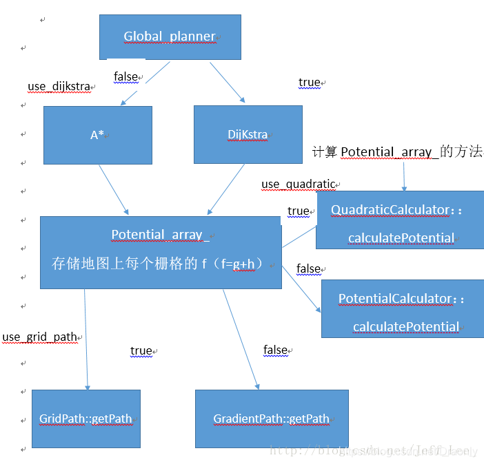

#  global_planner的A*算法源码分析

相关文档：

https://blog.csdn.net/Draonly/article/details/103706653

## A*算法介绍

A*算法是一种图搜索算法，不像BFS与dijkstra，Astar无法保证找到一条全局最优路径，原因在于启发式函数h(n)只是**估计**了当前节点与目标节点的距离，只有满足h(n)<=h(n)_opt的时候才能保证是最优的，因此对Astar算法的优化有以下几点：


1. 选择合适的启发式函数h(n)

   通常采用欧式距离、L0、L无穷范数，都能保证Astar找到全局最优解，但是这时候是比较松的满足，因此


1. 对于规则化的栅格地图，可以解析的找到一个h(n)，比如对角函数


1. Tie breaker打破对称性，减少node的扩展搜索，加快运行速度


A*算法需要维护一个优先级队列，涉及以下三个操作：

1. **remove** a node from container based on f(n)=g(n)+h(n)
2. **expand** the neighbors of this node
3. **push** the nodes into the container

直到container中不存在节点（找不到全局路径）或者达到目标节点为止


**wighted A***

选择节点的依据为f(n)=a·g(n)+b·h(n)

1. a=0,b=1:贪心算法
2. a=1,b=0:dijkstra
3. a=1,b=1:标准Atar,可以保证找到全局最优路径
4. a=1,b>1:此时A*运行的更快，但是无法保证h(n)<=h(n)_opt，故无法保证找到全局最优路径


## global_planner架构



## 涉及语法

源代码中用vector<Index>queque_来作为容器存储节点

其中Index结构体有两个成员,Index.i为当前节点的一维索引,Index.cost为节点间边的代价

源码中利用std::pop_heap()、push_heap()建立一个小顶堆，用法如下：

c++中的make_heap(), pop_heap()的头文件为algorithm。作用与priority_queue中的成员函数相同，可以单独使用。

### std::**make_heap**()

在容器范围内，就地建堆，保证最大值在所给范围的最前面，其他值的位置不确定

### **std::pop_heap**()

将堆顶(所给范围的最前面)元素移动到所给范围的最后，并且将新的最大值置于所给范围的最前面

### std::**push_heap**()

当已建堆的容器范围内有新的元素插入末尾后，应当调用push_heap将该元素插入堆中。

### std::fill()

```
    std::fill(iterator start, iterator end, value);
```

**fill()函数**是**算法**标头的库函数，用于将值分配给容器给定范围内的所有元素，它接受指向容器中开始和结束位置的迭代器以及要分配的值给定范围内的元素，并分配值。 


## 未解决的问题

1. 为什么cost是unsigned char的格式？为什么不是float？如何与potential相加？

   答：unsigned char的范围是0-255，正好对应了像素取值范围0-255，因此cost的最大值是255

   ```
   static const unsigned char NO_INFORMATION = 255;
   static const unsigned char LETHAL_OBSTACLE = 254;
   static const unsigned char INSCRIBED_INFLATED_OBSTACLE = 253;
   static const unsigned char FREE_SPACE = 0;
   ```

2. potential是什么？

   答：potential是当前节点到起始节点的累加cost，即accumulate cost

3. lethal_cost_, neutral_cost_，cost_factor参数的意义是什么？


4.这里不懂


5.为什么不用closedlist？

​	答：源码通过从终点开始向原点回溯，计算周围potential，即g(n)最小的node，然后加入path，就完成了path的创建，无需closedlist了

6.共三个问题


4,5,6已解决，详见源代码注释