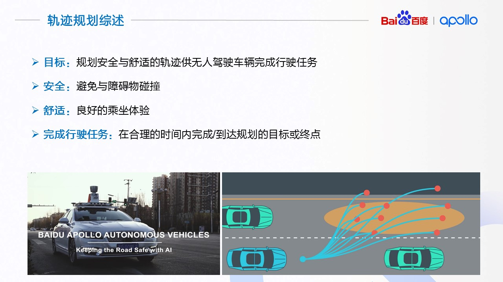
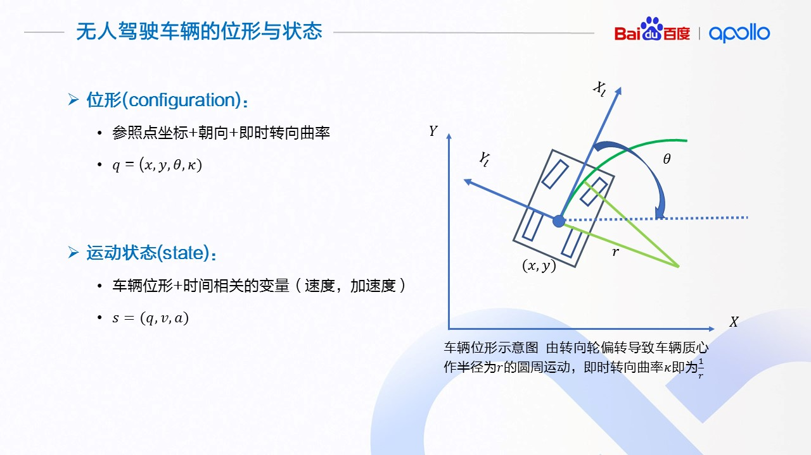
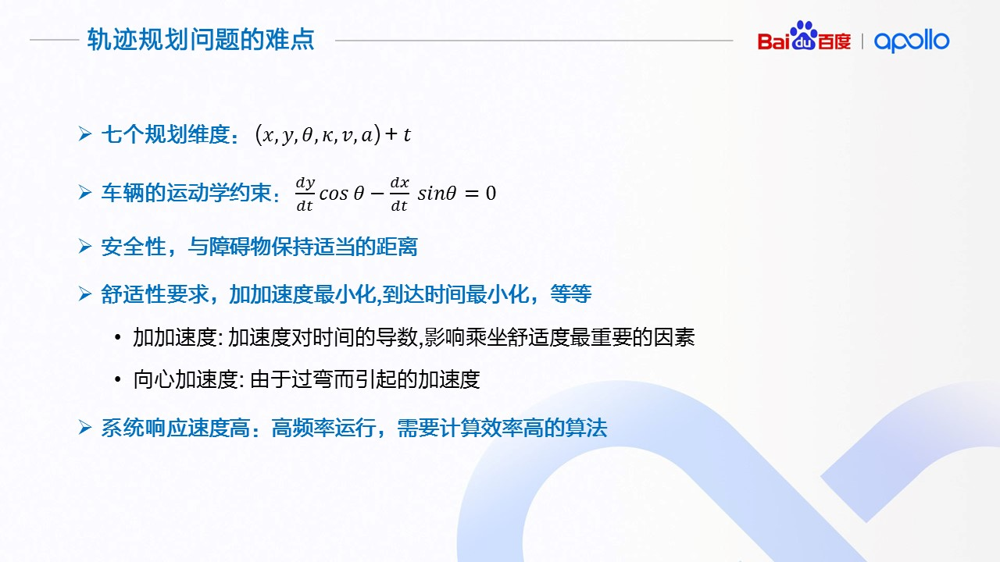
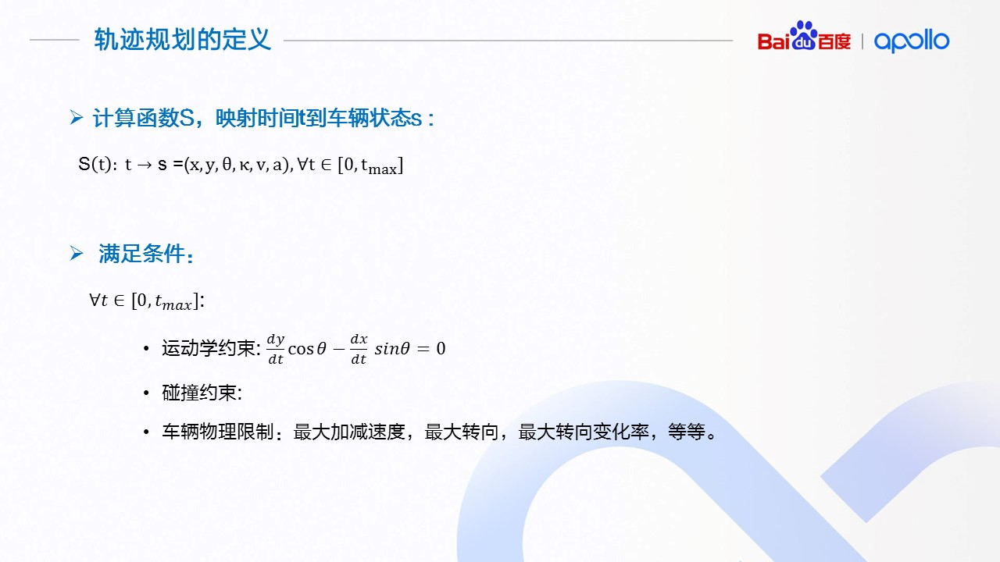
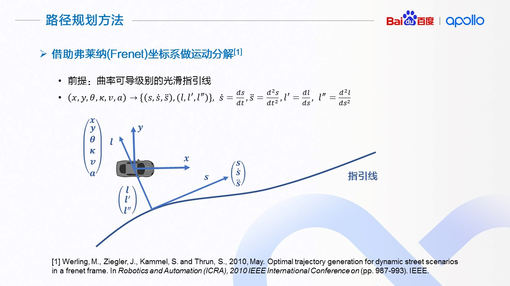
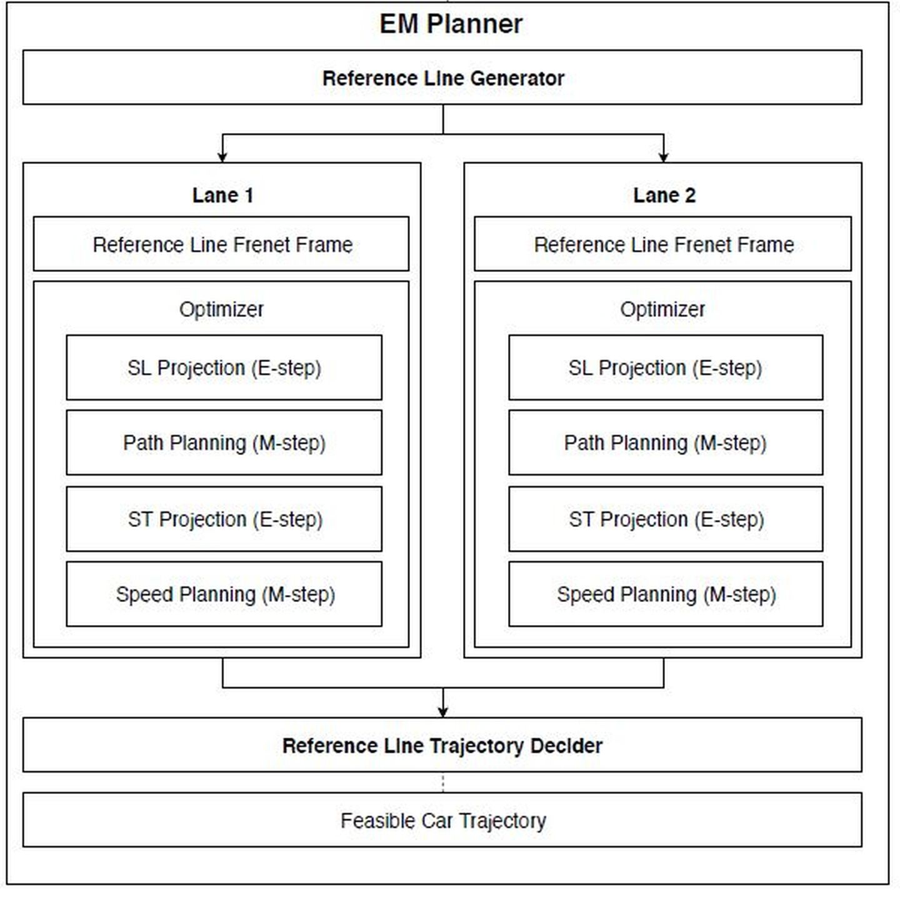
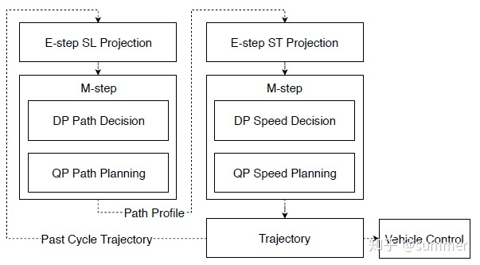
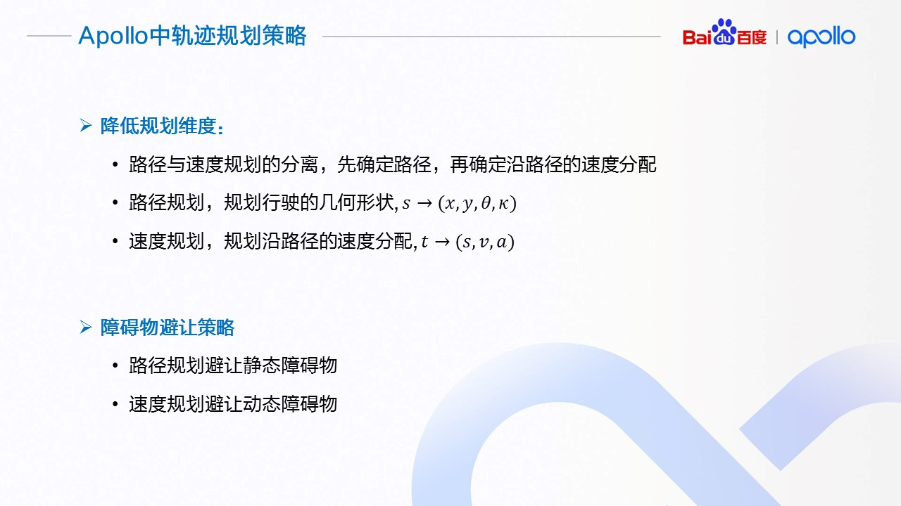
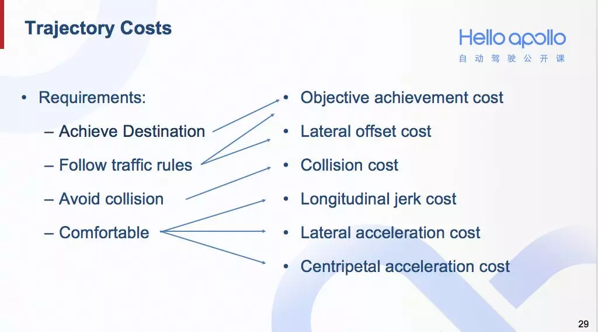

# 百度Apollo运动规划算法总结

## 轨迹规划综述

对于规划，最重要的几点：

1. 安全，与障碍物保持适当距离
2. 实时
3. 符合车辆动力学约束
4. 符合交通规则
5. 舒适（轨迹是平滑的），避免过急的加减速度，在弯道避免过大的向心加速度 
6. 考虑的足够长远（百度考虑8s或200m的轨迹规划）

## 无人驾驶的位形与状态

## 轨迹规划问题的难点

## 轨迹规划的定义

## 路径规划的目标

在 Apollo 平台中采用了路径/速度分离的策略，在路径规划时也需要考虑到当前车辆的运动状态而适当的调整车辆的几何形状。比如在做较大的横向运动的时候，低速和高速下，我们需要不同的几何形状来保证横向运动的舒适性

## 路径规划方法

## 规划结构

自动驾驶一般都是把横向与纵向解耦，分别解决横纵规划，然后合并轨迹，横向规划对应路径规划，目标是找到一条path；纵向规划对应速度规划，目标是给path求解一个速度曲线velocity profile，即横向上求解L(s),纵向上求解s(t),利用s把两者结合，最后合并生成轨迹。 

**横向上可以进行的动作为：**

1. nudge left/right，即左右转动方向盘
2. change lane，当微小调整方向盘无法满足时，需要换道

**纵向：**

1. cruise，巡航
2. overtake/yield，超车/跟车
3. stop，停车

## Apollo中轨迹规划的策略

**Apollo由于是做公路自动驾驶，所以是在结构化道路上做规划，因此很重要的一点是以下三个planner工作的前提都是要在结构化道路上，即有明显车道线、道路边界的前提下！**

### 1.EM planner

EM planner采用迭代+采样+优化的思想。

下图为车道线级别的EM算法，在一个规划周期中包括两个E-step和两个M-step。

在第一个E-step中，将障碍物投影Lane  Frenet上。该投影包括静态障碍物投影和动态障碍物投影。静态障碍物将直接基于笛卡尔-Frenet坐标系变换进行投影。在Apollo  架构中，动态障碍物的意图是通过障碍物运动轨迹来描述的。考虑到上一个周期规划轨迹，评估动态障碍物和本车在每个时间点的位置。然后，将动态障碍物与本车在每个时间点的重叠映射到Frenet坐标系中。此外，路径优化过程中出现的动态障碍最终会导致轻推。因此，出于安全考虑，动态障碍物的SL投影只考虑低速的障碍物。对于高速的障碍物，EM  Planner的平行变道策略将涵盖这种情况。在第二步的E-step中，基于生成的路径曲线，对高速、低速的障碍物进行评估。如果障碍物轨迹与规划路径有重叠，则生成相应占位区域。

采用动态规划和二次规划相结合的方法，在两个E-step内生成路径和速度曲线。虽然我们在SL和ST上投影障碍物，但最优路径和速度的解仍然是非凸空间问题。因此，我们使用动态规划首先得到一个粗糙解;同时，该解决方案还可以提供跟随、避让和超车等决策。

### 2.On Lane planner

该算法是apollo在EM planner后面推出的新的运动规划算法，主要利用决策+优化的思想。它在路径规划时考虑静态障碍物，使得path可以保证躲避规划范围内的所有静态障碍物，然后在path上进行速度规划，使确定的path可以躲避动态障碍物。路径与速度规划分别利用分段加加速度平滑算法，同EM的QP平滑一样，该算法也是运用优化的思想，其约束来自上层决策，决策层需要决定规划的范围。而EM planner是利用DP作为QP的“热启动”上层，DP决策出粗略的解空间，然后用QP优化求精确解。

### 3.Lattice planner

lattice主要利用采样的思想，先在道路范围内采样生成一簇候选轨迹，横向用五次多项式插值，纵向用四次多项式插值，然后给每条轨迹赋cost，所有轨迹过一遍障碍物碰撞检测与动力学约束检测，再在筛选后的轨迹束中选择cost最小的作为最优轨迹。

#### 横向采样

首先介绍如何采样横向轨迹。横向轨迹的采样需要涵盖多种横向运动状态。现在Apollo的代码中设计了三个末状态横向偏移量，-0.5，0.0和0.5，以及四个到达这些横向偏移量的纵向位移，分别为10，20，40，80。用两层循环遍历各种组合，再通过多项式拟合，即可获得一系列的横向轨迹。

#### 纵向采样

**1.巡航**如果有多个障碍物，就对这些障碍物分别采样超车和跟车所对应的末状态。

对于巡航状态，通过两层循环来完成采样。外层循环将速度从零到上限值按等间隔均匀遍历。内层循环遍历到达末状态速度的时间，从1秒到8秒按1秒的间隔均匀遍历。由于巡航状态不需要指明到达末状态的S值，所以这里只需要用四次多项式拟合即可。

**2.停车**

如果有多个障碍物，就对这些障碍物分别采样超车和跟车所对应的末状态。如果有多个障碍物，就对这些障碍物分别采样超车和跟车所对应的末状态。如果有多个障碍物，就对这些障碍物分别采样超车和跟车所对应的末状态。如果有多个障碍物，就对这些障碍物分别采样超车和跟车所对应的末状态。在停车状态中，给定停车点，末状态的速度和加速度都是零，所以末状态是确定的。那么我们只需用一层循环来采样到达停车点的时间即可。

**3.跟车/超车**

采样末状态时，就可以分别在S-T图中障碍物对应的阴影区域的上方和下方分别采样。上方的末状态对应超车，下方的末状态对应跟车。

如果有多个障碍物，就对这些障碍物分别采样超车和跟车所对应的末状态。如果有多个障碍物，就对这些障碍物分别采样超车和跟车所对应的末状态。如果有多个障碍物，就对这些障碍物分别采样超车和跟车所对应的末状态。

采样末状态时，就可以分别在S-T图中障碍物对应的阴影区域的上方和下方分别采样。上方的末状态对应超车，下方的末状态对应跟车。

#### cost

#### lattice的问题

一套参数不能适用多个场景，甚至每个场景都有一套甚至没有一套合适的参数能够保证搜索到一条轨迹。lattice的采样间隔若设置较大，则当周围障碍物变多时，很容易出现找不到解的致命问题，若间隔设置很密则搜索时间指数增长不满足实时性。

## 参考文章

**EM planner**

https://zhuanlan.zhihu.com/p/163815169

https://blog.csdn.net/yuxuan20062007/article/details/83629595#commentBox

https://blog.csdn.net/weixin_44809980/article/details/105506762

**on lane planner**

https://www.cnblogs.com/liuzubing/p/11051390.html

**lattice planner**

Apollo社区
https://mp.weixin.qq.com/s/YDIoVf20kybu8JEUY3GZWg

 知乎大佬
https://zhuanlan.zhihu.com/p/266901715
https://www.zhihu.com/people/xin-de-zha/posts
https://zhuanlan.zhihu.com/p/146367865
知乎大佬
https://blog.csdn.net/weixin_34945803/article/details/107592706?spm=1001.2014.3001.5501
最全面的Apollo决策规划讲解博客——保罗的酒吧
https://paul.pub/apollo-planning/#id-planner%E6%A6%82%E8%BF%B0

