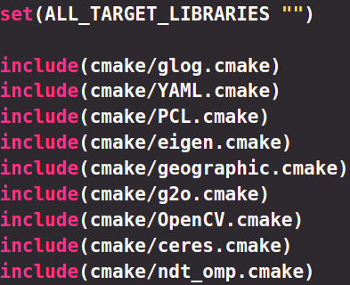
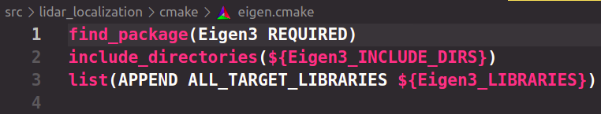
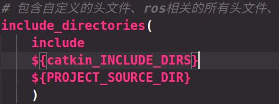
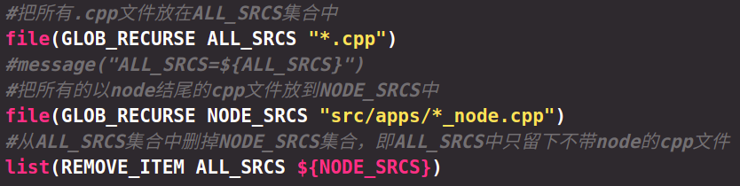
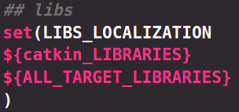
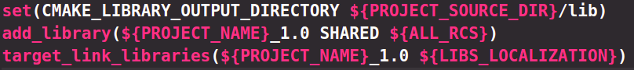
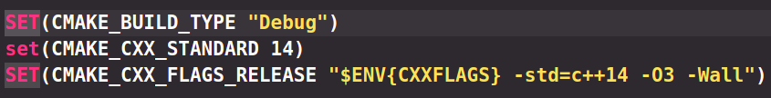
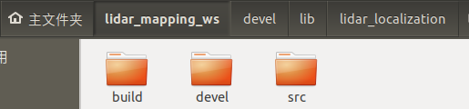
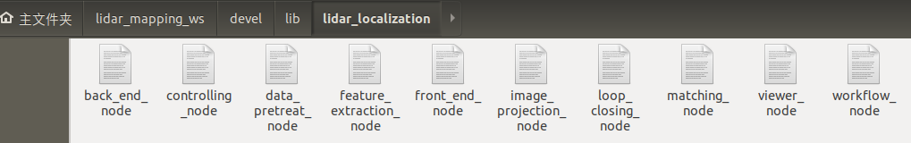

# 嘉兴出差之旅学习总结

## lidar_localization功能包笔记

### 安装依赖的第三方库

该包依赖很多库，比如下图中的几个库


第一步就是学会安装第三方库到本地，拿一个举例


这是g2o这个库的所有文件，第一步就是从github上下载对应库源码

一般都会有build文件夹，这个文件夹是用来存放编译生成的中间文件的，首先要明白有两种构建方式：内部构建、外部构建

内部构建就是在上图文件夹目录下执行`cmake`，这样生成的中间文件会放在该文件夹目录下，造成文件结构混乱，因此都采用外部构建，即建立一个文件夹，一般叫做build，进入该文件夹下再执行`cmake ..`，这样编译中间文件都会存放在build文件夹中，结构清晰。

一般从github下git clone下来的库文件夹都有一个build文件夹，所以需要进入build文件夹删除所有文件，`sudo rm -rf *`

`cmake ..`的作用是根据文件夹目录下的CMakeLists生成Makefiles，然后在build文件夹下执行`make`，即根据MakeFiles编译源代码与链接库生成可执行文件

最后一步十分关键！即相当于加入环境变量，将库安装到本地路径'/usr/local/lib'，将头文件安装到本地路径'/usr/local/include',使得任何自己的代码都能使用该库，`sudo make install`,这一步一般需要你有 **root 权限**（因为要向系统写入文件）,所以需要加sudo前缀

```bash
//安装第三方库的步骤
git clone "需要的库的github官方网址", //这里以g2o库举例
cd g2o/build
sudo rm -rf *
cmake ..
make 
sudo make install
```

### 代码目录结构


cmake：存放库的CmakeLists子文件

config：存放yaml文件，每一个yaml包含很多全局参数

include：存放头文件

launch：存放节点启动文件，里面会包含config定义的yaml或者param全局参数，从这里将全局参数读入程序

lib：存放自定义生成的库文件

log：存放google的log日志

msg：存放自定义消息

rviz：存放添加好所需组件的可视化rviz文件

src：存放源文件

​	apps：这里存放节点，即每一个真实运行的进程，每一个节点都利用了src定义的各种类结构

srv：存放自定义服务

urdf：存放统一机器人描述模型


### CMakeLists

该包的逻辑是这样的，首先把自定义的类文件与模块流程文件都编译成库,**库是源文件的集合，所以不仅需要链接库，还需要包含库相应的头文件,include_directories()就是用来告诉源文件它包含的头文件夹在计算机的哪个位置，这样在#include的时候就不用写绝对路径了**，然后将节点（每一个节点中都有一个main函数与while循环执行对应模块的逻辑，比如喷洒农药流程）编译成可执行文件，因为节点使用了自定义类文件与模块流程文件，所以再将可执行文件与自己生成的动态库做链接，最终在launch文件中启动这些节点即可完成多模块协同工作的机器人完整工作流程。

1.将整体流程需要的所有第三方库依赖放在变量ALL_TARGET_LIBRARIES中



下图为一个库对应的子cmake，其中将Eigen3_LIBRARIES加入到了集合ALL_TARGET_LIBRARIES中，其余库也是这样，并且包含相应库的头文件



2.包含需要的所有头文件




2.将所有除了以_node结尾的源文件编译成动态库（以__node结尾的文件是节点，需要生成可执行文件再与库做链接）



第一句把功能包内的cpp文件全部放到ALL_SRCS集合中，第二句把_node结尾的cpp文件全部放到NODE_SRCS中

第三句把ALL_SRCS集合删去NODE_SRCS集合，剩下的即为需要生成库的类文件以及工作流程文件

3.设置链接库，包含ros相关库与本工程需要的所有第三方库



4.生成本工程动态库，链接所需库



首先设置库的生成路径，为当前CMakeLists所在目录下的lib文件夹，然后生成动态库，最后链接第三方库

5.生成可执行文件（节点），链接本工程动态库


> 一篇文章教你理解什么是静态库和动态库
>
> https://blog.csdn.net/weixin_42039389/article/details/109191385
>
> linux下生成静态库和动态库
>
> https://blog.csdn.net/qq_39584315/article/details/80311454
>
> include_directories和find_package
>
> https://blog.csdn.net/weixin_39393741/article/details/85070299

### 代码工作流程

1.类文件，每一个类是一个模块，比如`class SprayWorkFlow`主要处理喷洒农药的逻辑，每一个类都有类似的结构，都有一个Run()最外层逻辑处理函数、类内定义数据处理函数与该模块需要的发布者、订阅者、数据结构。数据结构也是一个自定义类。


2.节点文件，用一个指针来指向上面生成的模块类，调用Run()函数执行相关逻辑。每一个模块对应一个节点文件，利用多线程技术使得机器人系统的多个模块同时执行多项任务。


3.yaml文件,用于设置ros全局参数，便于通过launch将在yaml定义的参数加载到程序的相关变量中


4.launch启动文件，利用param设置单个ros全局参数，或者rosparam加载yaml文件，这样就通过文件的方式设置了机器人系统各模块需要的全部参数，然后分别启动各节点，使各模块同时运行，rviz节点用于加载设置好的可视化rviz


### VSCODE调试ROS节点

**具体步骤**

1.如果想要用GDB断点调试首先需要在CMakeLists中设置为"Debug"模式！否则无法启动调试



2.vscode打开ROS工作空间，比如lidar_mapping_ws,ctrl+J打开终端，执行`catkin_make`生成可执行文件



可执行文件放在devel/lib/功能包名 下面



3.按F5，选择g++调试，生成launch文件


4.配置launch文件，注释preLaunchTask，修改可执行文件路径

${workspaceFolder}为当前打开的文件夹全局路径，比如当前打开的文件夹为功能包lidar_mapping_ws，则${workspaceFolder}等价于

/home/wu/lidar_mapping_ws

当前调试的可执行文件的全局路径为：`/home/wu/lidar_mapping_ws/devel/lib/lidar_localization/spray_workflow_node`


### 组合导航与定位

东南毕业生来现场帮忙调试GPS信号问题，解决了我之前调阿波罗小车时遇到的组合导航相关问题，现记录如下：

1.从开阔地方进入棚内可以持续10s左右的精度，因为被遮挡后无法收到卫星信号，此时惯性导航起作用，可以航迹推算保持稳定的定位

2.高程精度比水平低一倍，与有无遮挡无关

3.单天线只能定位，不能定向，一个天线接收是散点图，再加一个天线相当于增加了一个散点图，这样可以定向了，因此采用双天线（一个主天线，一个副天线），所以增加一个天线并不能提高定位精度，只是为了能够定向

4.单点定位米级，差分可以做到厘米级

5.gps初始化10s到20s左右

6.小车后面的那个磁吸的线是4g信号接收线，不是卫星信号线

7.组合惯导如果用到差分就需要4g网卡提供网络，因为附近的基站信号是通过网络传输差分数据到小车的组合惯导上的

8.移动两个天线的位置或组合惯导的位置会影响定位精度，因为一开始需要测量杆臂值，然后将杆臂值通过串口工具cutecom配置到组合导航中

