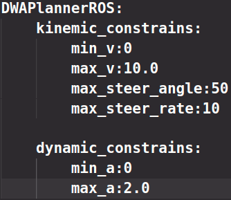

# roslaunch总结

一 node标签

在`<node>`标签指定一个ROS 节点，这是最常见的`roslaunch标签`，因为它支持最重要的功能：启动和关闭节点。

`roslaunch不保证节点开始的顺序`。因为没有办法从外部知道节点何时被完全初始化，所以所有被启动的节点必须是稳健的，以便以任何顺序启动。

 二 示例

```
<node name =“listener1”pkg =“rospy_tutorials”type =“listener.py”args =“ -  test”respawn =“true”/>
```

启动`“listener1” 节点，`使用`listener.py`从可执行`rospy_tutorials 包`与所述命令行参数`--test`。如果节点死亡，它将自动重新生成。

```
<node name =“bar1” pkg =“foo_pkg” type =“bar” args =“$（find baz_pkg）/resources/map.pgm”/>
```

从`foo_pkg`包中启动bar1节点。此示例使用替换参数将可移植引用传递到`baz_pkg / resources / map.pgm`。 

三 属性

- `pkg =“mypackage”`

  - 节点包。

  `type =“nodetype”`

  - 节点类型。必须有一个具有相同名称的相应可执行文件。

  `name =“nodename”`

  - 节点基名称。注意：**name不能包含命名空间**。请改用`ns`属性。

  `args =“arg1 arg2 arg3” （可选）`

  - 传递参数到节点。

  `machine =“machine-name” `*（可选）*

  - 在指定机器上启动节点。

  `respawn =“true” `*（可选）*

  - 如果节点退出，则自动重新启动节点。

  `respawn_delay =“30” `*（可选，默认为0）*ROS indigo中的新功能

  - 如果`respawn`为`true`，请在尝试重新启动之前检测到节点故障后等待`respawn_delay`秒。

  `required =“true” `*（可选）*

  - **ROS 0.10**：如果节点死亡，杀死整个roslaunch。

  `ns =“foo” `*（可选）*

  - 在“foo”命名空间中启动节点。

  `clear_params =“true | false” `*（可选）*

  - 在启动前删除节点的私有命名空间中的所有参数。

  `output =“log | screen” `*（可选）*

  - 如果'screen'，stdout / stderr从节点将被发送到屏幕。如果是“log”，stdout / stderr输出将被发送到$ ROS_HOME/ log中的日志文件，stderr将继续发送到屏幕。默认值为“log”。

  `cwd =“ROS_HOME | node” `*（可选）*

  - 如果为“node”，则节点的工作目录将设置为与节点的可执行文件相同的目录。在C Turtle中，默认值为“ROS_HOME”。在Box Turtle（ROS 1.0.x）中，默认值是'ros-root'。使用'ros-root'在C Turtle中已被弃用。

  `launch-prefix =“prefix arguments” `*（可选）*

  - 用于预先添加到节点的启动参数的命令/参数。这是一个强大的功能，使您能够启用`gdb`，`valgrind`，`xterm`，`漂亮`或其他方便的工具。

四 元素

您可以在`<node>`标记中使用以下XML 标签：

- [](http://wiki.ros.org/roslaunch/XML/env)

  - 为节点设置环境变量。

  [](http://wiki.ros.org/roslaunch/XML/remap)

  - 为此节点设置重新映射参数。

  [](http://wiki.ros.org/roslaunch/XML/rosparam)

  - 将[rosparam](http://wiki.ros.org/rosparam)文件加载到此节点的`〜` / local命名空间中。

  [](http://wiki.ros.org/roslaunch/XML/param)

  - 在节点的`〜` / local命名[空间](http://wiki.ros.org/Parameters)中设置一个参数。

## 实例

结合catkin_test_ws/src/dynamic_tutorials这个功能包

`server_node.launch`


`param.launch`


`dwa_planner.config`



在config里面也可以设置变量的名称空间，具体结果见下图

**输出结果**


