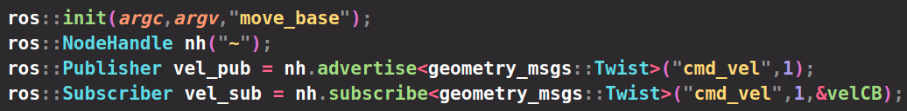

# ros命名空间

## **1.全局命名空间**

/rosout前面的反斜杠“/”表明该节点名称属于全局命名空间。之所以叫做全局名称因为它们在任何地方（包括代码、命令行工具、图形界面工具等的任何地方）都可以使用。无论这些名称用作众多命令行工具的参数还是用在节点内部，它们都有明确的含义。这些名称从来不会产生二义性，也无需额外的上下文信息来决定名称指的哪个资源。如/turtle1/cmd_vel 由斜杠分开的一系列命名空间（**namespace**），每个斜杠代表一级命名空间。命名空间用于将相关的计算图源（节点、话题、服务和参数统称为计算图源，而每个计算图源由一个叫计算图源名称（graph resource name）的短字符串识）归类在一起。

为了指明一个计算图源，需要完整列出其所属的命名空间，尤其是有时候命名空间层次比较多，这可能会让你抓狂。这时，一个主要替代方案是让ROS为计算图源提供一个默认的命名空间，具有此特征的名称叫做相对计算图源名称（**ralative graph resource name**），或简称为相对名称（**relative name**）。 

## **2.相对名称**

相对名称的典型特征是它缺少全局名称带有的前斜杠“/”。例如：cmd_vel 及 count_and_log/set_logger_level理解相对名称的关键是，如果不知道ROS 解析某个计算图源时所使用的默认命名空间，相对名称并不能和特定计算图源匹配。

解析相对名称：**将相对名称转化为全局名称的过程相当简单。ROS将当前默认的命名空间的名称加在相对名称的前面，从而将相对名解析为全局名称。**比如，如果我们在默认命名空间为/turtle1 的地方使用相对名称cmd_vel，那么ROS 通过组合方法得 /turtle1 + cmd_vel ⇒ /turtle1/cmd_vel  

相对名称也可以以一系列的命名空间开始，这些命名空间被看作是默认命名空间中的嵌套空间。举个例子，如果我们在默认命名空间为/a/b/c/d/e/f 的地方使用相对空间g/h/i/j/k，ROS 将会将其进行组合为全局命名空间/a/b/c/d/e/f /g/h/i/j/k/l 得到的全局名称就可以用于确定一个特定的计算图源，就像前面介绍全局名称的使用时一样。

当一个节点内的计算图源全部使用相对名称时，这本质上给用户提供了一种非常简单的移植手段，即用户能方便地将此节点和话题移植到其他的（比如用户自己程序的）  命名空间，而节点的原设计者并不一定参与这个过程。这种灵活性可以使得一个系统的组织结构更清晰，更重要的是能够防止在整合来自不同来源的节点发生名称冲突。作为对比，如果所有节点都使用全局名称命名自己的计算图源， 就很难实现这种高效资源整合。所以，除非一些特殊情况有特殊要求，否则编写节点时并不推荐使用全局名称。

## **3.私有名称**

私有名称，以一个波浪字符（~）开始，是第三类也是最后一类计算图源名称。和相对名称一样，私有名称并不能完全确定它们自身所在的命名空间，而是需要ROS 客户端库将这个名称解析为一个全局名称。与相对名称的主要差别在于，私有名称不是用当前默认命名空间，而是用的它们节点名称作为命名空间。例如，有一个节点，它的全局名称是 /sim1/pubvel，ROS 将其私有名称∼max_vel 转换至如下全局名称：/sim1/pubvel +  ~max_vel⇒ /sim1/pubvel/max_vel 这种命名方式适用的地方是每个节点内部都有这样一些资源，这些资源只与本节点有关，而不会与其他节点打交道，这些资源就可以使用私有名称，与松耦合性相对的。私有名称的关键字“private”仅仅表示其他节点不会使用它们所在的命名空间，也就是仅在命名空间层面上有意义。对于其他节点来讲，只要知道私有名称解析后的全局名称，都可以通过其全局名称访问这些计算图源。这和C++等其他类似编程语言中的关键字“private”是不同的，在这些编程语言中，系统中的其他部分是不能访问某个类的私有成员变量的。

## 网上的例子

我们先运行一个小乌龟：

rosrun turtlesim turtlesim_node 

turtlesim是一个包名，turtlesim_node是执行文件名，可以与节点名相同，也不可以不同。这里的节点名是 /turtlesim。说明可能初始化的时候是这样的,为什么是可能，因为重映射可以改变：

ros::init(argc, argv, "turtlesim");

节点名前面加个“/”,这意味这个节点是全局空间的。另外说下，节点是有类型的，节点的类型就是节点所在包名和可执行文件名的加。一般的定义节点句柄:

ros::NodeHandle n;

NodeHandle是一个类，然后我们实例化的一个对象n.这种情况默认n这个节点是全局命名空间下的。你可以认为"/"这个斜杠就是全局名空间。现在我们来改变这个节点的名空间，通过重映射，我们先用重映射，以后再讲。

你会发现，这个节点的名变为/my/turtlesim，此时，节点所在的空间发生了变化，我们把这个节点从全局名空间放进了一个/my的名空间下。于是节点内的所有参数，服务，话题也都放在了/my的命名空间下。

你会发现，它所发布的和订阅的话题，服务都在这个名空间，这意味着它现在只会订阅和发布这个名空间下的话题。

这个时候运行rosrun turtlesim turtle_teleop_key ，是不会控制小乌龟的，因为它只会发布/turtel1/cmd_vel话题，不会发布/my/turtel1/cmd_vel。

这个时候你可能懂一点了，节点，话题，服务，包括参数都是有名空间的，这个名空间约束着是它们的范围。这个时候你可能会想，那不在一个名空间节点是不是就无法通信了，显然这种想法是错误的，这违背了我们通信的初衷，我们通过重映射和参数服务器，很容易让不同命名空间的节点都能通信。好吧，先简单的通过重映射使他们通信，具体下一篇文再讲，这一篇主要记录命名空间。

看到没，重映射不仅可以把命名空间改变，还可以将发布的话题给改变（还可改变参数的空间），这样/my空间下的乌龟就可以移动了。当然你也可以直接将这个节点的名空间改为/my，这样他们在同一个命名空间，当然可以直接通信了。

上面说的是全局命名空间，还有一个相对命名空间，/turtle1/cmd_vel就是相对命名空间，它在/my的命名空间下，发布/turtle1/cmd_vel话题，解析器会把它解析成/my/turtle1/cmd_vel话题。发布的/turtle1/cmd_vel话题相对/my空间下是/turtle1/cmd_vel话题，对于全局它是/my/turtle1/cmd_vel话题。

ros::init(argc, argv, "my_node_name");
ros::NodeHandle nh("/my_node_handle_namespace");

**我们创建节点句柄nh时，指明了它的命名空间，所以nh的命名空间为/my_node_handle_namespace，**

**所以这个节点里的所有的参数，话题前面都应该有/my_node_handle_namespace**

最后一种命名空间是私有命名空间，私有名称，以一个波浪字符（~）开始。和相对名称一样，私有名称并不能完全确定它们自身所在的命名空间，而是需要ROS 客户端库将这个名称解析为一个全局名称。与相对名称的主要差别在于，**私有名称不是用当前默认命名空间，而是用的它们节点名称作为命名空间。**

ros::init(argc, argv, "my_node_name");
ros::NodeHandle nh1("~");
ros::NodeHandle nh2("~foo");

 ros::Subscriber sub1 = nh1.subscribe("my_private_topic", ...);

 ros::Subscriber sub2 = nh2.subscribe("my_private_topic", ...);

sub1订阅的话题是my_node_name/my_private_topic

sub2订阅的话题是my_node_name/foo/my_private_topic

## 我写的例子

### 1.无launch文件

首先不写launch文件（不写重映射与ns=""、name="")，节点源文件名为namespace_node.cpp,节点名称为move_base,**注：这里的节点名称不能加/，因为ros已经将其解析成全局名称**

定义一个发布者发布名为"cmd_vel"的话题，另外定义一个订阅者订阅该话题

#### 1.定义为私有命名空间

若定义为私有命名空间，则将节点名作为命名空间

输出

若在私有空间后面加上自定义的命名空间，则该节点的所有参数、话题都将加上该子命名空间

#### 2.定义为相对命名空间

若定义为相对命名空间，则不会向定义私有命名空间时加上节点名作为一级命名空间

**注：定义为相对命名空间后，话题名一定不要加/，因为相对命名空间本来就是会自动加上节点名作为一级命名空间，/为全局名称，这样会使得订阅者得不到对应消息，可以通过重映射解决该问题**

#### 3.定义为全局命名空间

若定义nh对象时不加任何参数，则定义为全局命名空间

### 2.有launch文件

#### 1.定义为全局命名空间

如果在launch文件中定义name="",则会覆盖掉ros::init()里面定义的节点名

#### 2.定义为私有命名空间

定义ns="",会将节点名与所有参数、话题前加上ns定义的一级命名空间

如果发布者与订阅者的话题名相同，但命名空间不同，则无法通信

直接更改订阅者与发布者的话题名为全局路径，依然可以通信

加重映射，可以将某个节点的一些话题名映射到自定义话题名，通常是将较长的名称变为全局名称，比如/veddha/namespace_node/cmd_vel  => /cmd_vel

