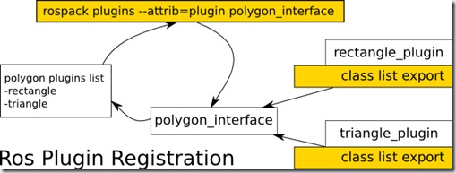

# ros plugin插件总结

结合自己写的功能包理解：/home/wu/catkin_test_ws/src/tutorial_plugin

相关文章网址：

https://www.guyuehome.com/920

在ROS的开发中，常常会接触到一个名词——插件（plugin）。这个名词在计算机软件开发中是常常会提到的，具体含义可以参考百度百科的[插件](http://baike.baidu.com/link?url=ivZnI9Lswpctt6L7vfAnkB6oulIbU9rK_-kFssX0yk7TgZ-JVAewcf9Yn96edPqu5J6lH_K4TdU2MWNm9VghayObcw1fZuslxvGBwraeP2a)词条。在ROS中，插件的概念类似，简单来讲，ROS中的插件（plugin）就是可以动态加载的扩展功能类。ROS中的[pluginlib](http://wiki.ros.org/pluginlib)功能包，提供了加载和卸载plugin的C++库，开发者在使用plugin时，不需要考虑plugin类的链接位置，只需要将plugin注册到pluginlib中，即可直接动态加载。这种插件机制非常方便，开发者不需要改动原本软件的代码，直接将需要的功能通过plugin进行扩展即可。本文带你走近plugin，探索如何实现一个简单的plugin。

## 一、示例

我们首先通过下边这张图来了解一下pluginlib的工作原理。

假设ROS的功能包中已经存在一个polygon的基类（polygon_interface_package），我们可以通过plugin来实现两种polygon的功能支持：rectangle_plugin（rectangle_plugin_package）和triangle_plugin（triangle_plugin_package），在这两个功能包的package.xml中，需要声明polygon_interface_package中的基类polygon，然后在编译的过程中，会把插件注册到ROS系统，用户可以直接通过rospack的命令进行全局的插件查询，也可以在开发中直接使用这些插件了。

 

## 二、如何实现一个插件

pluginlib利用了C++多态的特性，不同的插件只要使用统一的接口，就可以替换使用，用户在使用过程中也不需要修改代码或者重新编译，选择需要使用的插件即可扩展相应的功能。一般来讲，实现一个插件主要需要以下几个步骤：

1. 创建基类，定义统一的接口。如果是基于现有的基类实现plugin，则不需要这个步骤。  
2. 创建plugin类，继承基类，实现统一的接口。  
3. 注册插件  
4. 编译生成插件的动态链接库  
5. 将插件加入ROS系统