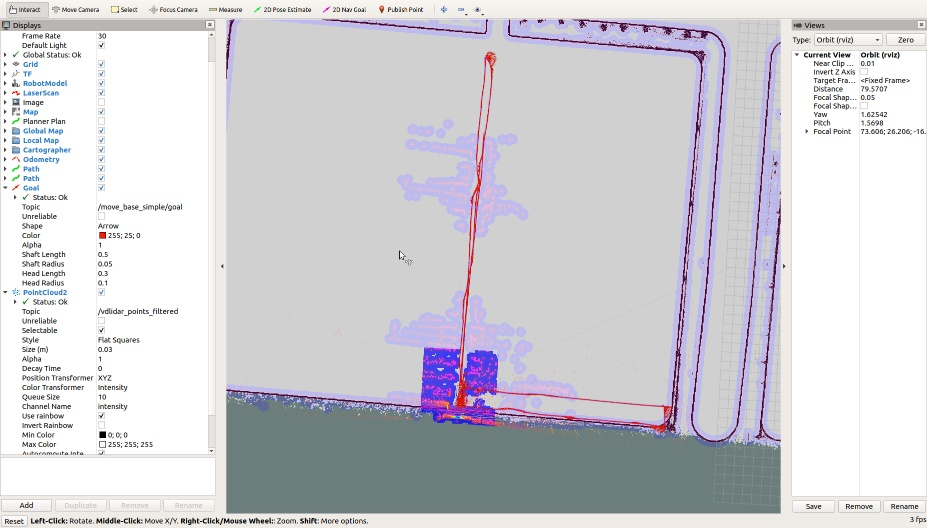
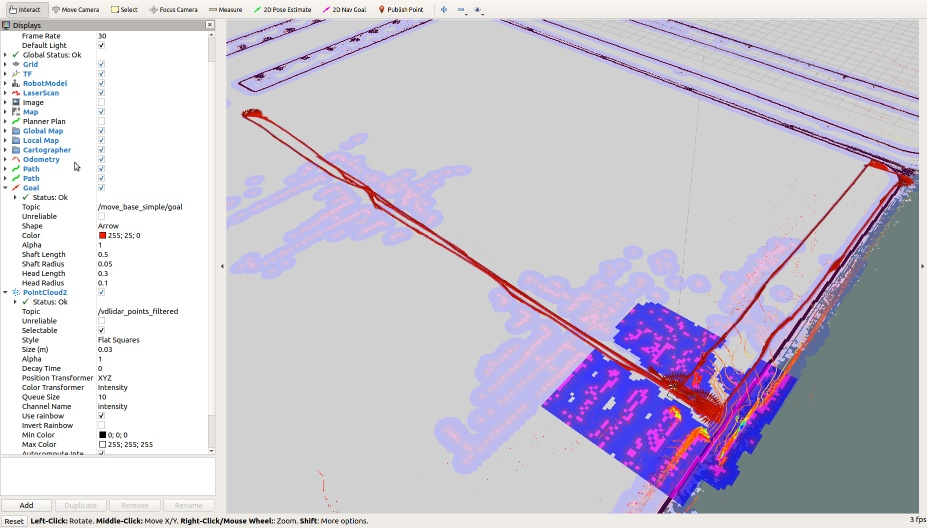

# 嘉兴小车底盘规划控制问题

目前维大的小车与大车底盘的规划控制都是调用ros的        move_base包，区别是大车是阿克曼转向结构，小车是差速转向结构，因此大车是采用TEB的局部规划器，而小车采用DWA局部规划器。

.jpg)

## 1.规划

下图为棚内的可视化效果图

规划目前的问题：

1. 维大写了一个全局规划器，实际上就是一个读取GPS数据点然后转化为move_base的全局规划路径点系列发送给局部规划器，相当于做了一层循迹的封装，不是严格意义上的全局规划器。
2. 目前小车上的局部规划器利用的是ros的DWA局部规划器，该规划器输入上层全局规划的路径点系列、定位信息、全局地图、局部地图、障碍物信息，DWA在控制空间内采样，直接输出控制指令cmd_vel，因此也不是严格意义上的运动规划或轨迹规划
3. 规划参数还没有完全调通，目前只调了全局规划频率、局部规划频率、最大纵向速度、最大角速度、最大纵向加速度、最大角加速度对小车控制效果的影响
4. 任务规划逻辑有问题 

## 2.控制

目前控制指令是由move_base发出的cmd_vel，数据结构为：

即三轴线速度与三轴角速度，然后发给下层CAN解析为电机转速。存在以下控制问题：

1. 目前cmd_vel => motor_rpm这个映射关系不准确
2. cmd_vel这个控制指令的发送频率对小车控制影响很大，目前设置为2HZ，效果可接受，但是没有测试是否为最佳控制频率
3. 底层控制器维大那边写的，仅仅是将cmd_vel转化到电机转速，是开环控制
4. 没有针对差速机器人这个被控对象的闭环控制器