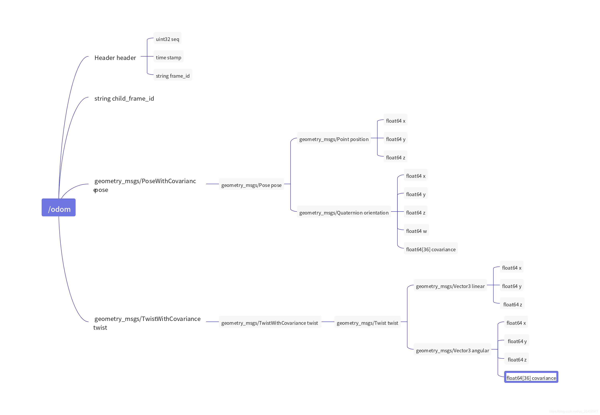
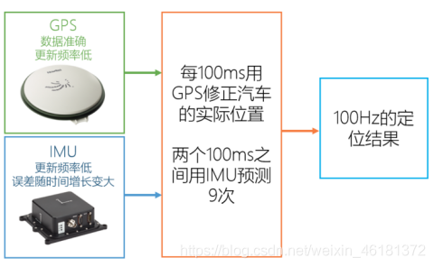
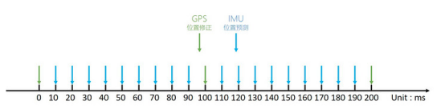

# 位姿与轮式里程计、IMU、GPS

对于一个机器人来说，在建立了URDF或xacro之后，即可通过robot_state_publisher节点发布tf关系，得到车体上各零件相对于base_link的相对位姿。若加入地图后，即可得到map坐标系，而连接车体坐标系与车身坐标系的纽带就是odom里程计坐标系。odom坐标系是虚拟出来的坐标系，若无累计误差则odom与map重合，不过一般里程计都是有累计误差的因此odom与map不重合。

因此一般tf tree的关系如下：

map

​	odom

​		base_footprint

​			base_link

​				imu

​				rslidar

​				gps

​				...

## odom里程计信息

里程计信息包含位姿与速度，共12个量，即三轴位置、三轴姿态，三轴线速度、三轴角速度

一般里程计的获取可以有很多种，一般有组合惯导（gps、imu）、轮式里程计、视觉里程计、激光里程计或**多传感器融合**等，各硬件提供的里程计信息与精度不同，下面介绍如何利用组合惯导（gps、imu）、轮式里程计等硬件获取odom里程计信息。

## 位姿

位姿有六个量，即位置(XYZ)与姿态(RPY)：横滚角roll，俯仰角pitch，偏航角yaw

## 轮式里程计

轮式里程计原理：https://blog.csdn.net/u013468614/article/details/106724804/（**本文还介绍了阿克曼转向与差速转向，还介绍了阿阿克曼结构小车的动力学标定方法，非常优秀！**）

轮式里程计由轮速测量单元组成，可提供车体速度（由后轴轮速计算得到）、车体转向角速度（由后轴左右轮速与后轴距），其只能在二维平面内使用！在一个平面上行驶的地面移动机器人，知道线速度v与角速度ω，便可以在线推演出它在二维平面上的位置(XYZ)与姿态（PRY）。

轮式里程计一般利用编码器测量小车左右轮的车轮转速，即在左轮与右轮分别安装一个编码器，左右轮速相加再除2即可得到车体的车速，其与其他传感器对比来说，**不考虑打滑、漂移时提供的速度一般是最准的**。打滑、漂移时IMU提供的车速更准。

## GPS里程计

GPS可提供位置(XYZ)信息与姿态中的偏航角yaw（单天线无法提供航向信息，双天线可提供航向信息）

GPS定位的基本原理是，测量出已知位置的卫星到地面GPS接收器之间的距离，然后接收器通过与至少**4颗**卫星通讯，计算与这些卫星间的距离，就能确定其在地球上的具体位置。普通的单点定位精度为米级。加入RTK信息可以将精度提高到厘米级。（RTK即利用附近的基站将误差信息传给GPS，由于基站位置是精确已知的，基站再获取GPS定位信息与精确位置对比获得误差，自车GPS再抵消掉这个误差即可减小误差。）

**GPS提供的三轴位置(XYZ)一般是最准的（室外）**。因为其他里程计的位置信息都是推算出来的。GPS直接获取WGS84坐标系下的经度、纬度、高度信息，再转换到全局坐标系（横轴墨卡托投影坐标系）。

### WGS84坐标系与横轴墨卡托投影坐标系

这是两种坐标系，前者是地理坐标系，后者是投影坐标系。而投影坐标系都是根据地理坐标系转换而来的，简单来说墨卡托投影准确的表述方式应该是84坐标系下的墨卡托。地理坐标系单位为经纬度，投影坐标系一般为米；不过一般可以动态转换。

## IMU里程计

IMU技术的出现弥补了GPS定位的不足，两者相辅相成，可以让自动驾驶汽车获得最准确的定位信息。

IMU全称inertial measurement unit，即惯性测量单元，它由三个单轴的加速度计和三个单轴的陀螺仪组成，加速度计检测物体在载体坐标系统独立三轴的加速度信号，而陀螺仪检测载体相对于导航坐标系的角速度信号，对这些信号进行处理之后，便可解算出物体的姿态。

值得注意的是，**IMU提供的是一个相对的定位信息**，它的作用是测量**相对于起点**物体所运动的路线，所以它并**不能提供你所在的具体位置的信息，因此，它常常和GPS一起使用**，当在某些GPS信号微弱的地方时，IMU就可以发挥它的作用，可以让汽车继续获得绝对位置的信息，不至于“迷路”。

IMU提供的加速度信息主要用于标定。

### IMU组成（三轴、六轴、九轴的区别）

 3轴IMU即只有3轴陀螺仪的IMU，其因为只有一个3轴陀螺仪，所以只能感知载体roll、pitch、yawl共3个自由度的姿态信息。
 6轴IMU在3轴IMU的基础上加装了3轴加速度计，因此在感知载体姿态的基础上，还能感知载体3个自由度上的加速度信息。
 9轴IMU在6轴IMu的基础上加装了3轴磁强计，由于3轴陀螺仪只能估计载体自身的相对位姿变化（通过加速度计也可获得载体的绝对roll和pitch），单凭3轴陀螺仪无法获取载体的全部姿态信息，而通过3轴磁强计就可以，本质上磁强计的感知原理类似于指南针。

## 组合惯导（GPS+IMU）

组合惯导结合了GPS与IMU的优点，其将GPS与IMU信息进行融合再输出位姿与速度等里程计需要的信息，而不是谁比谁准就单纯用谁（比如位置我用GPS，速度我用IMU）。

在无人驾驶系统中，GPS的更新频率一般为10Hz，IMU的更新频率一般为100Hz。

两个传感器共同工作时，可以给出频率100Hz的定位输出。下图是两传感器数据融合的原理图:

跑在控制器上的软件对信息的处理流程在时间维度上类似下图。在0~100ms的周期中，使用IMU进行9次位置的估计，待新的GPS定位数据进来时，则进行修正，以此实现高频率的定位结果输出。

