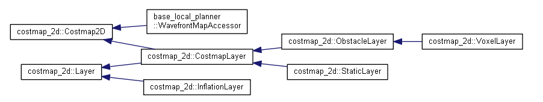
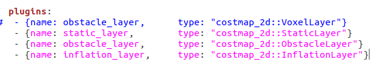
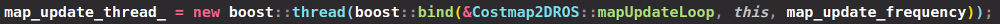
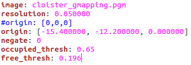
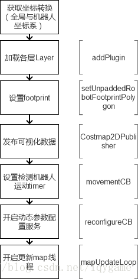
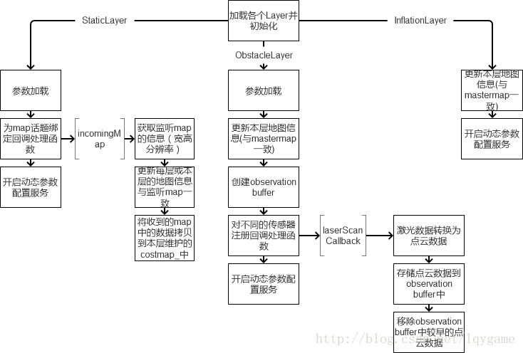
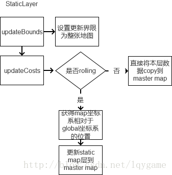
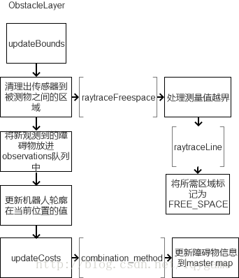
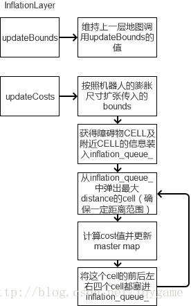

# costmap_2d功能包总结

这个包提供了一种2D代价地图的实现方案，该方案利用输入传感器数据，构建数据2D或者3D（依赖于是否使用基于voxel的实现） **占用珊格**，以及基于占用珊格和用户定义膨胀半径的2D代价地图的 **膨胀代价**。 此外，该包也支持利用map_server初始化代价地图，支持滚动窗口的代价地图，支持参数化订阅和配置传感器主题。

costmap_2d功能包类继承图



## 1.引言

导航规划使用到的地图是二维占用栅格图，即costmap2d。costmap2d是由多层地图合成在一起的。Master即costmap2d的合成结果，一般是由静态层、障碍物层、膨胀层这三个地图融合在一起的，至于融合方法在CostmapLayer这个类中实现，分别有三层地图在同一个cell取最大值、累加、覆盖等方法。下面分别介绍该功能包的各个类的作用、从外向内分析调用流程以及costmap2d这个功能包涉及的所有基本概念。


## 2.costmap_2d功能包结构以及各类的作用

首先看这个功能包的头文件，一共有17个头文件，下面自底向上阐述各类的作用


costmap_2d.h声明了最底层的地图类Costmap2D，该类最重要的成员变量为`unsigned* char* costmap_`，为真正的地图数据，该功能包用一维数组存储二维地图。该类主要功能是对底层地图的一些操作，比如world坐标与map索引坐标的转换与map resize等。

layerd_costmap.h声明了包工头LayeredCostmap类，之所以叫做**包工头**是因为这个类是真正操作各个插件图层进行更新地图等操作的上层类，其成员变量`Costmap2D costmap_`即融合输出的主地图master map；成员变量`std::vector<boost::shared_ptr<Layer>> plugins_`是插件队列，维护了所有具体干活的插件集合。

layer.h声明了一个接口Layer，用来被插件继承与改写，其也包含了包工头指针`LayeredCostmap*`，用于被插件类继承，这样每个插件都拥有相同的包工头指针，这样就可以在插件类中对LayeredCostmap中的master map进行融合。

costmap_layer.h声明了CostmapLayer这个类，该类用于融合更新多个插件图层在同一个master map的cell上的cost，融合方法有取最大、累加、覆盖等，该类继承自Layer与Costmap2D，继承Layer是需要Layer中定义的包工头指针，这样被它继承的插件就可以操作LayeredCostmap中定义的master map了；继承Costmap2D是为了使插件可以维护自己的地图，所以该类就是继承两个类、然后被插件类继承，可以将其理解为提供服务的**中间商**。

static_layer.h、inflation_layer.h、obstacle_layer.h、voxel_layer.h，这四个类是具体的插件图层类，继承自CostmapLayer，分别实现基类定义的onInitialize()、activate()、updatebounds()与updateCosts()等

costmap_2d_ros.h声明了最外层的封装类Costmap2DROS，该类封装了这个功能包的全部功能，因此后面的move_base以及全局规划、局部规划都用到了Costmap2DROS这个类，其重要成员变量为包工头指针`LayeredCostmap*`

剩下的类声明不是核心，先不讨论。到900

## 3.自底向上说概念

 costmap_2d包提供了一种可配置框架来维护机器人在占用珊格应该如何导航的信息。 代价地图使用来自传感器的数据和来自静态地图中的信息，costmap_2d::Costmap2DROS给用户提供了纯2D的接口，这意味着查询障碍只能在列上进行。**即该包用一维数组存储二维地图信息。**

#### 障碍物标记和清除

  代价地图自动订阅传感器发布的主题并基于数据进行相应自我更新。  对每个传感器来说，其可以用来执行mark（将障碍物信息插入到代价地图），也可以用来执行clear（从代价地图移除障碍物）或者二者都执行。marking操作就是索引到数组内修改cell的代价。然而对于clearing操作，每次观测报告都需要传感器源向外发射线，由射线穿过的珊格组成。 如果存储的障碍物信息是3D的，需要将每一列的障碍物信息投影成2D后才能放入到代价地图。   

#### 空间状态（Occupied, Free, and Unknown） 

  虽然代价地图中每个cell可用255个不同值中任何一个值，可是下层数据结构仅需要3个值。 具体来说在这种下层结构中，每个cell仅需要3个值来表示cell的3种状态：free，occupied，unknown。 当投影到代价地图时候，每种状态被赋一个特定的代价值。 如果列有一定量的占用就被赋代价值**`costmap_2d::LETHAL_OBSTACLE`**， 如果列有一定量的unknown cells 就被赋代价值**`costmap_2d::NO_INFORMATION`**, 剩余其它列赋代价值为**`costmap_2d::FREE_SPACE`**。

#### 地图更新

  代价地图以参数update_frequency 指定的周期进行地图更新。每个周期传感器数据进来后，都要在代价地图底层占用结构上执行标记和清除障碍操作，并且这种结构会被投影到代价地图附上相应代价值。 这完成之后，对代价赋值为`costmap_2d::LETHAL_OBSTACLE`的每个cell执行障碍物的膨胀操作，即从每个占用cell向外传播代价值，直到用户定义的膨胀半径为止。

#### tf

  为了把来自传感器源的数据插入到代价地图，costmap_2d::Costmap2DROS要大量使用tf。costmap_2d::Costmap2DROS 假定全局坐标系，基座坐标系和传感器源之间的转换有联系且是最新的。转换transform_tolerance 参数指定这些转换之间的最大延迟。 如果 [tf](http://wiki.ros.org/tf) 树没有以期望速度被更新，那么导航功能包集将会让机器人停止。

#### 膨胀


膨胀就是从占用cell向外传播代价值的过程，随着传播距离增加代价值会递减。 为实现这个过程，为代价值定义了5种特定表示符号：

- "Lethal" cost：意思是cell内有障碍物，因此如果机器人中心位于那个cell，很显然机器人会碰到障碍
- "Inscribed" cost：意思是cell到障碍物的距离小于机器人内切圆半径。 因此如果机器人中心在cell（或者代价>=内切代价），机器人与障碍物肯定有冲突
- "Possibly circumscribed"  cost：类似于内切，但是使用机器人外接圆作为截止距离。因此，如果机器人中心位于cell上（或者代价>=外接代价），那么它与障碍物是否冲突依赖于机器人方位。使用术语“可能”意思是这不一定是一个真正障碍cell，但是有些用户喜欢放特定的代价值进去为特定目的。 例如，如果用户要表示机器人应该尝试避开建筑物某特定区域，  它们可以在代价地图上为那个与任何障碍毫无关系的区域（该区域本来就不是障碍区）插入代价值。注意，虽然上图示例中使用了代价值128，但是实际由于代价值受内切圆半径和外接圆半径的影响，真正实际值并不一定是128。
- "Freespace" cost： 假定为0，意思是没啥东西会阻碍机器人到那里
- "Unknown" cost：意思是cell上没有信息
- All other costs： 被赋值为"Freespace"和"Possibly circumscribed"之间的一个值，取决于到 "Lethal" cell的距离以及用户定义的衰减函数

### 分层插件地图

每个地图层都是通过插件的形式加载到costmap2DROS中LayeredCostmap对象定义的插件队列的。

**使用插件plugin的好处**

**pluginlib**是一个C++库，可以实现为一个ROS包**动态的加载和卸载**插件。这里的插件通常是一些**功能类**，**且以运行时可动态加载的库（如共享对象，动态链接库）的形式存在**。借助pluginlib的帮助，用户不必关心自己的应用程序该如何链接包含自己想使用的的class的库（如定义class的头文件在哪里，如何定义的），因为pluginlib会在你调用时自动打开你需要的插件库（Note：需要提前将插件库注册到pluginlib）。使用插件来扩展或者修改应用程序的功能非常方便，不用改动源码重新编译应用程序，通过插件的动态加载即可完成功能的扩展和修改。

由此可见，插件利用了C++中的多态性，实现插件并存入插件库中，使用插件时可以很灵活的加载或卸载来完成扩展。

#### 创建一个插件

首先实现基类与功能类，在功能类的开头声明插件宏,第一个参数是功能类名，第二个参数为基类名（需要加命名空间）


然后编译生成动态链接库


然后创建插件描述文件，将插件加入ROS系统，使其可识别和管理


再注册插件到ROS系统。为确保pluginlib可以查到ROS系统所有插件，定义插件的package必须显式的指定哪个包导出了什么插件。

这通常在package.xml文件中定义


### 插件图层：一个相同的LayeredCostmap（维护Master map）与一个不同的costmap（维护当前插件图层的map）

每一个插件图层都继承自layer，分别实现onInitialize（），updateCosts（），updateBounds（）这三个重要函数，拿static_layer举例，从继承图可以看出static_layer插件图层继承自costmap2D类与Layer抽象类，先说前者，costmap2D这个类主要负责对地图进行操作，其中最重要的数据是真正的地图数据


在costmap2d中是利用一维数组存储二维地图，因此可用char*类型的指针指向它。因为插件继承了costmap2D，所以每个插件图层都有一个不同的地图数据。

而后者的类对象有一个LayeredCostmap指针，因此被继承它的插件图层继承下来，所有每个不同的插件都有一个LayeredCostmap指针，即指向同一个LayeredCostmap对象，而该对象在Costmap2DROS这个封装costmap全部功能的类的构造函数中创建该对象。


同样在构造函数中，创建完LayeredCostmap这个包工头对象后，从参数服务器（一般从yaml中获得）中读取需要添加的插件信息,



然后创建插件对象并用共享指针指向它，


并将其push到LayeredCostmap中定义的插件队列中，


Costmap2DROS构造函数的最后通过多态完成各插件地图的初始化


initialize()函数是在基类中实现的，被每个插件图层调用，然后每个插件分别实现onInitialize()，读取对应插件的配置文件来完成初始化


由此可以看出，每个插件图层都有一个地图，并且从总体上由LayeredCostmap来管理各个插件，通过插件的多态性来完成对每个插件图层的初始化与更新地图以及更新cost。而LayeredCostmap这个包工头类也有一个Costmap2D对象，而这个地图就是多个插件融合后的Master地图！！

## 4.自顶向下谈调用流程

这样就清晰明了了，最外层Costmap2DROS封装类定义了一个LayeredCostmap*指针，而LayeredCostmap类中有一个costmap2D对象，即Master map，所有插件更新cost都通过一定的融合方法（取最大、累加、覆盖等）最终都体现到Master map上，所以该图是最终输出给规划的地图。

首先，在Costmap2DROS的构造函数中new出一个LayeredCostmap对象，用类成员指针LayeredCostmap*指向它，这样就在堆区建立了一个对插件队列以及融合主地图进行操作的“包工头”对象。


### **调用各层插件地图实现融合地图master map输出的调用流程**

创建一个用于更新地图的子线程



在mapUpdateLoop子线程函数中，调用了LayeredCostmap_的更新地图函数updateMap()


在updateMap()中，都是先对每个插件图层执行getBounds()，即得到图层对应的操作区域，即从map中取车辆所在map中周围的一块子图，然后执行updateCosts对范围内的区域cell进行cost更新。


调用LayeredCostmap_的插件队列，对每个插件都执行对应插件实现的updateCosts，每对一个插件进行一次操作，就在Master map上进行了一次融合。


### 插件图层都干了什么？

拿static_layer这个插件图层举例，每个插件都需要实现从Layer继承的updateBounds()与updateCost()。首先通过订阅/map消息获取原始地图信息，然后将map中的信息赋值给costmap_中，该对象是对应插件的地图static map。


然后，static map不需要rolling window，即地图不需要随着小车运动而运动。在其实现的updateCost()中，按照规定的融合方法将本层地图static map融合到主地图master map中。


如果设置了rolling window，也有对应的处理逻辑,先获取tf，再进行tf变换，转换到变换后的map中再设置cost。


## 5.如何把地图传递给规划器？

在研究全局规划中的plan_node.cpp这个节点时候懵住了，因为它只声明了一个Costmap2DROS的对象然后传给了全局规划器对象，


那么在哪里获取地图呢？因为全局规划类GlobalPlanner几乎全是对地图的get操作，即读操作，没有set，即写入信息。


后来在与别人交流的时候在move_base中找到了答案（果然要多与人交流经验呀！！！）首先在move_base的构造函数中new了两个Costmap2DROS，分别是全局规划地图与局部规划地图


然后在下面对两个地图封装类调用start(),可以看到注释上也说了是在这里读取了传感器数据与地图信息，最终写入到costmap中，下面看看start()做了什么


在start()中对各插件执行activate()函数，继续剥洋葱，看看activate()干了啥，这里以static_layer举例


好吧..继续剥洋葱


最终在static_layer的onInitialzie（）中找到了答案，里面有一个订阅者，如果订阅到map topic就进入incomingMap函数进行地图写入


## 6.对地图的进一步说明

上面介绍了costmap这个功能包涉及的基本概念、调用流程，对costmap真正的地图介绍还比较少，所以接下来主要介绍Costmap2D这个类涉及的地图概念,下图为地图类的所有成员变量


既然是地图，首先要有图片，图片来自map_server加载的pgm文件，每个pgm文件都跟随一个yaml配置文件


yaml中最重要的三个参数一个是地图分辨率，一个是origin数组，还有一个negate。首先说地图分辨率resolution



#### resolution

resolution=长度/像素，单位为m/pixel。即表示一个像素代表实际多长的位移。这样就可以将图片与真实地图建立联系。

#### origin

origin数组的三个值分别为[x,y,yaw]，即map的起点，单位是m

所以这个文件被map_server加载后将origin数组的值赋给costmap2D中的origin_x_和origin_y\_。以该yaml文件举例，则

```
origin_x_  =  -15.4
origin_y_ = -12.2
```

这样地图起点就确定了，而地图中其他点都是相对map原点的相对坐标，比如此时在map坐标系的右上角附近给一个goal目标点，则其全局坐标为[1,1]，即相对map原点的坐标，由此可见map中的全局坐标不是真实的世界坐标系，比如GPS经纬度点，而是相对的坐标点。这一点一定要注意！

如果将yaml中的origin设置为[0,0,0]，则会将小车放到地图的左下角，


因此一般需要设置origin原点数组，将小车移动到期望的地图中的起点。


costmap2d里面的size_x_，size_y\_，表示地图的x方向像素个数，即图片的长；与y方向像素个数，即图片的宽

所以[mx,my]表示地图中对应点的像素索引，单位是pixel。而[wx,wy]表示地图中对应点相对map原点的真实坐标，单位是m。

#### negate

nagate用于对像素取反，因为costmap是cell的像素值越大，表示障碍物的可能性越大，而灰度图的0是黑色，255是白色，因此我们希望255是黑色，表示障碍物，与cost值最大相对应；0是白色，表示可通行区域，与cost值最小对应，因此需要将negate设置为0。如果negate设置为1，则都是障碍物，无法进行规划！


## 7.再次梳理——costmap初始化与各层的工作流程

梳理完所有细节后，下面再整体过一遍costmap的初始化与各层工作流程，（本节来自第8节中的参考文档）

在navigation的主节点move_base中(costmap隶属于navigation包，或者说是navigation的一个子模块)，建立了两个costmap。其中planner_costmap_ros_是用于全局导航的地图，controller_costmap_ros_是用于局部导航用的地图。下图为costmap的初始化流程。



 （1）Costmap初始化首先获得全局坐标系和机器人坐标系的转换  
 （2）加载各个Layer，例如StaticLayer，ObstacleLayer，InflationLayer。  
 （3）设置机器人的轮廓  
 （4）实例化了一个Costmap2DPublisher来发布可视化数据。  
 （5）通过一个movementCB函数不断检测机器人是否在运动  
 （6）开启动态参数配置服务，服务启动了更新map的线程。 

## **3.3 costmap中各层的更新** 

简单整理了下costmap初始化过程中的各层加载的调用过程：

  

在move_base刚启动时就建立了两个costmap，而这两个costmap都加载了三个Layer插件，它们的初始化过程如上图所示。

StaticLayer主要为处理gmapping或者amcl等产生的静态地图。 
ObstacLayer主要处理机器人移动过程中产生的障碍物信息。 
InflationLayer主要处理机器人导航地图上的障碍物信息膨胀（让地图上的障碍物比实际障碍物的大小更大一些），尽可能使机器人更安全的移动。 
costmap在mapUpdateLoop线程中执行更新地图的操作，每个层的工作流程如下： 
(1)StaticLayer工作流程 

  
  

  上图是StaticLayer的工作流程，updateBounds阶段将更新的界限设置为整张地图，updateCosts阶段根据rolling参数（是否采用滚动窗口）设置的值，如果是，那静态地图会随着机器人移动而移动，则首先要获取静态地图坐标系到全局坐标系的转换，再更新静态地图层到master map里。  
(2)ObstacleLayer工作流程  

  
  

 上图是ObstacleLayer的工作流程，updateBounds阶段将获取传感器传来的障碍物信息经过处理后放入一个观察队列中，updateCosts阶段则将障碍物的信息更新到master map。  
(3)inflationLayer工作流程  

  

  上图是inflationLayer的工作流程，updateBounds阶段由于本层没有维护的map，所以维持上一层地图调用的Bounds值（处理区域）。updateCosts阶段用了一个CellData结构存储master  map中每个grid点的信息，其中包括这个点的二维索引和这个点附近最近的障碍物的二维索引。改变每个障碍物CELL附近前后左右四个CELL的cost值，更新到master map就完成了障碍物的膨胀。

## 8.参考文档

**ROS基础教程--CostMap_2D包的一些理解**

https://blog.csdn.net/jinking01/article/details/79455962