# move_base——global_planner总结

## 文件目录


## 函数入口

主函数位于plan_node.cpp

## 整体解析

在目前的ROS版本中，机器人全局路径规划使用的是navfn包，这在move_base的默认参数中可以找到 base_global_planner  (string, default: "navfn/NavfnROS")。而在navigation的源代码中还有一个global_planner的包，该包的源文件夹(navigation-hydro-devel\global_planner\src )下已经有了A*,Dijkstra等算法的实现。可是navfn的源程序中也有这两个算法的实现，貌似根本就没用到global_planner这个文件夹下的源程序。因此最开始直接看用于move_base全局导航的程序时有点一头雾水，为什么有两个用于全局导航的包在ROS里面？到底这两个包navfn和global_planner是什么关系？

可以将**navfn包和global_planner包理解成一个并列关系**，**因为他们两个都是用来做全局规划的，两个包里面也都实现了A*,Dijkstra算法**。那是不是意味着这两者中的一个包就是多余的呢？其实不是，早期的开发中是用navfn包做导航的，那时候并没有global_planner这个包，并且在navfn的源代码里可以看到这个包默认是使用Dijkstra做全局路径规划，并且有A\*的代码，那为什么没有使用A*呢？也引来了众开发者回答：

根据12年bhaskara的回答，意思是navfn里的A*算法存在bug，没人有时间去弄（在ros的各种答案里经常可以看到开发者说没时间弄，他们确实也相当的忙），直到13年David Lu 才完成了这部分工作，重新发布了global_planner包，修改好的代码封装性更强，更清晰明了。因此，也可以认为global_planner是navfn的替代者。也有人问David Lu**为什么没用global_planner替代掉navfn？他的回答是为了和以前兼容**。**因此可以看到源代码中两个包都在，并且move_base的那个全局变量参数默认的是navfn，也就是说没用global_planner。那么如何使用global_planner包而不是navfn包呢？按理来说，只要将move_base的参数base_global_planner用global_planner/PlannerCore替代就行了**。如：

```
<nodepkg="move_base" type="move_base" respawn="false"name="move_base" output="screen">

 <param name="base_global_planner"value="global_planner/GlobalPlanner"/>
```

   可是实际使用的时候(14年1月以前)，却提示this planner is not registered，意思是这个包没有注册。幸好有人发现这个是bgp_plugin.xml里的bug，后来安装的ROS版本应该修复了这个问题。如果有这个错误，请按照github上的修复修改cmakelist.txt和bgp_plugin.xml就可以了。

   看到这，不得不提一个问题？这个文件是干嘛的，为啥要在这里面加上那几句。

   按照文件的名字就知道这是个跟插件有关。讲到这里，就有必要顺带了解一下move_base是如何调用各种global或者local planner的，思路是使用ROS的插件机制。**在自己写的global或者local planner算法里开头加上一句特定的程序(PLUGINLIB_EXPORT_CLASS(.....))就能注册插件机制，然后在xx_plugin.xml等文件里描述下这个插件，在package.xml显式的表明这个插件用来通知ROS我们将使用它**，具体过程见官方wiki(ROS的插件机制)。弄完插件机制以后，我们就可以像上面一样将其用参数的形式直接传过去了。之前的bgp_plugin.xml有bug，因此就出现了那个问题。

   可是，我随便按照自己的思路去写global 或者local planner的函数就行吗？显然ROS有一个标准。你必须按照它提供给你的模板去实现你自己的算法，这些模板就是基类。如果觉得抽象，可以先通过官方的文档来了解插件是如何工作的？

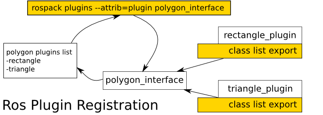


​     在上图的这个例子中，假设你想使用一个形状画图模块，ROS的官方包中已经有了polygon_interface这个基类，它已经提供了标准的接口函数，并且有两个子类：矩形插件包rectangle_plugin package 和三角形插件包 triangle_plugin package。要想使用这两个子类你只要在相应文件中将它们注册为插件，告诉ROS我将使用这两个插件就行了。这个图中一个关键的中心点就是polygon_interface基类。

   联系到我们自己要写global 或者local planner的插件，这个图就告诉**我们并不能天马行空的按照自己的方式编写相关的类或者函数，而必须按照ROS提供的模板去实现，而这正是nav_core这个包存在的意义**。在navigation的源代码中你会看到这个nav_core包中仅仅只有几个头文件，正是这些头文件提供了多个模板： nav_core::BaseGlobalPlanner，nav_core::BaseLocalPlanner， nav_core::RecoveryBehavior，在官方的wiki文档里可以看到他们的相关介绍。所**以按照这些模板的标准形式去写自己的planner算法就行了**。

   了解了这些，也十分有助于我们去看别人写的各种planner的插件，如使用遗传算法的global planner，sbql global planner以及eband local planner等，当然也包括官方提供的用来完善之前遗留程序问题的插件包global_planner包和dwa_local_planner包。

### 进入导航的核心---规划

导航包里有一个nav_core，是一个纯粹的接口，里面规定了核心的几个类应该有的样子。BaseGlobalPlanner是全局导航的接口，规定了一个功能makePlan，也就是给定起始跟目标，输出一系列pose走过去；BaseLocalPlanner规定了一个核心功能computeVelocityCommands，就是计算局部地图下一步的控制指令；还有一个RecoveryBehavior，规定一个runBehavior，也就是小车卡住情况下如何运动恢复到正常的导航。

global_planner插件化设计的脉络清晰可见，以下三张图可以说明：

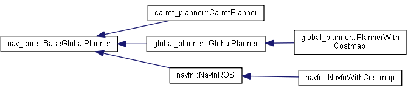


首先，作为BaseGlobalPlanner的具体实现，自然要继承BaseGlobalPlanner；expander这个就不用解释了吧，看到A* D...就懂了，这种设计可以实现随时替换核心算法；traceback是不同的轨迹类型，在[global_planner - ROS Wiki](https://link.zhihu.com/?target=http%3A//wiki.ros.org/global_planner)上可以直观的看到区别；另外在global_planner的include目录里，除了这些还有两个calculator，这个在wiki上也提到了，“Slightly different calculation for the  potential”。还有一个OrientationFilter，这个可以理解为给path“顺毛”，因为A*算法规划的path只能保证路线的连续性，还要保证拐弯的角度别变得太快。

可以看到，这种接口化的设计能让我们不用读几行代码就能掌握整个框架，有一种什么感觉呢，嗯，我觉得**庖丁解牛**这个词特别贴切。

expander规定了calculatePotentials的接口，根据costmap跟起始终止点计算网格的potential。关于算法，D..就不看了，A*比D...要好。A*算法youtube([A*](https://link.zhihu.com/?target=https%3A//www.youtube.com/watch%3Fv%3D-L-WgKMFuhE%26index%3D1%26list%3DLL_c30gcSb-_2yR7H_3eqx2A%26t%3D491s))上有个视频讲解地特别棒，这里我就不多说了。

Traceback规定了getpath接口，根据potential把路径找出来，输出一系列轨迹点（std::vector<std::pair<**float**, **float**> >&  path）。轨迹点找出来就好办了，在GlobalPlanner::makePlan里调用GlobalPlanner::getPlanFromPotential，把path简单转换下变成std::vector<geometry_msgs::PoseStamped>& plan，然后makePlan再用OrientationFilter顺下毛，最后发布出去。

## 全局规划核心——A*算法

## A*算法介绍

A*算法是一种图搜索算法，不像BFS与dijkstra，Astar无法保证找到一条全局最优路径，原因在于启发式函数h(n)只是**估计**了当前节点与目标节点的距离，只有满足h(n)<=h(n)_opt的时候才能保证是最优的，因此对Astar算法的优化有以下几点：

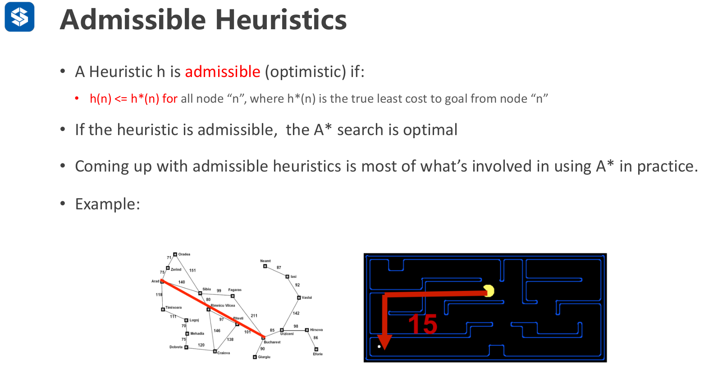

1. 选择合适的启发式函数h(n)

   通常采用欧式距离、L0、L无穷范数，都能保证Astar找到全局最优解，但是这时候是比较松的满足，因此

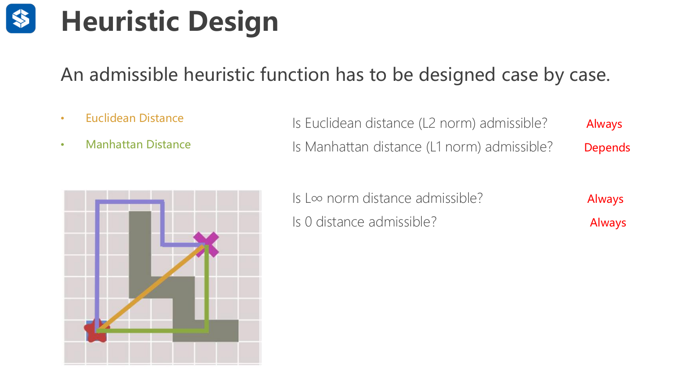

1. 对于规则化的栅格地图，可以解析的找到一个h(n)，比如对角函数

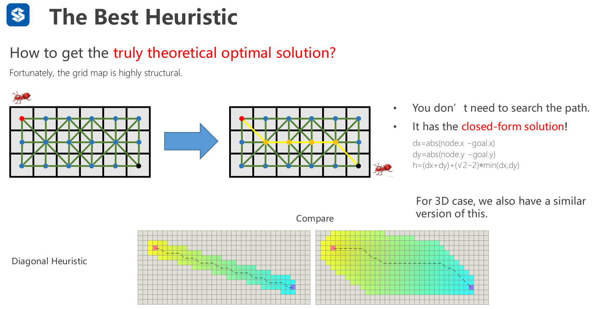

1. Tie breaker打破对称性，减少node的扩展搜索，加快运行速度

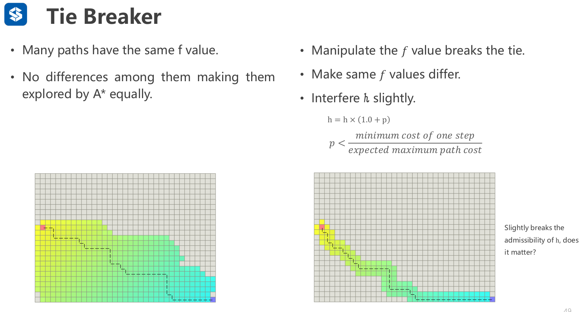

A*算法需要维护一个优先级队列，涉及以下三个操作：

1. **remove** a node from container based on f(n)=g(n)+h(n)
2. **expand** the neighbors of this node
3. **push** the nodes into the container

直到container中不存在节点（找不到全局路径）或者达到目标节点为止

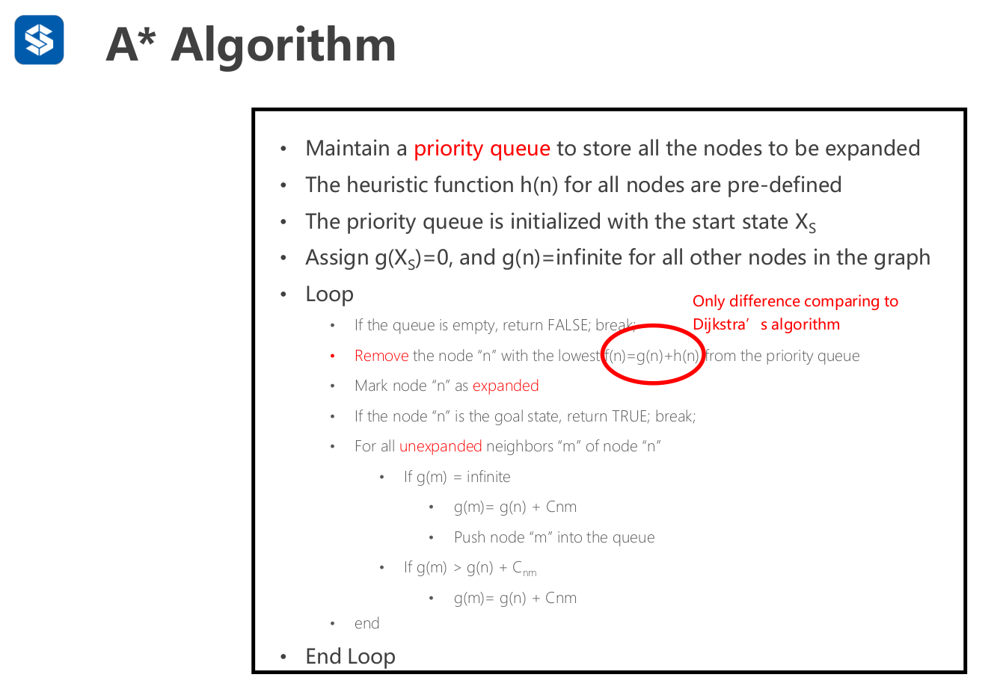

**wighted A***

选择节点的依据为f(n)=a·g(n)+b·h(n)

1. a=0,b=1:贪心算法
2. a=1,b=0:dijkstra
3. a=1,b=1:标准Atar,可以保证找到全局最优路径
4. a=1,b>1:此时A*运行的更快，但是无法保证h(n)<=h(n)_opt，故无法保证找到全局最优路径

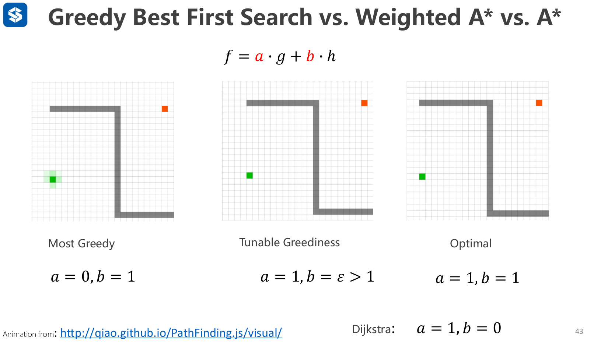

### global_planner架构

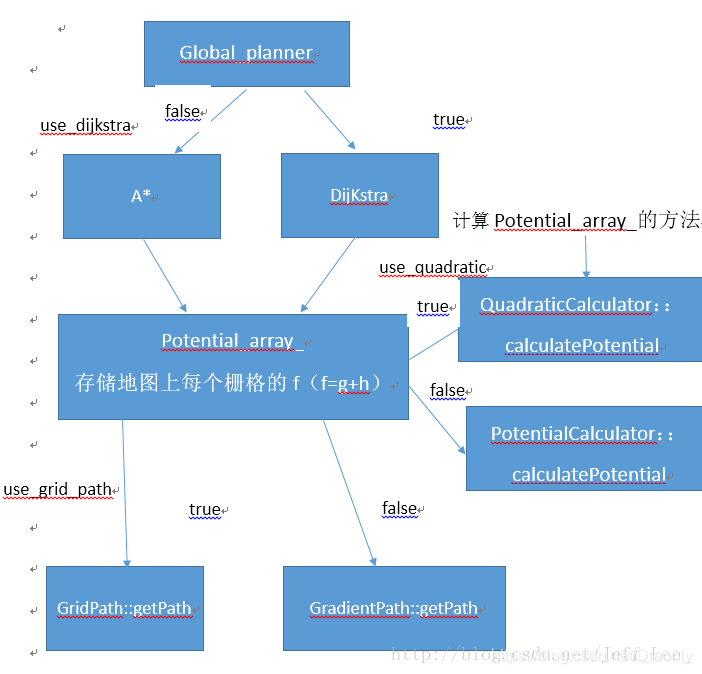

### 涉及语法

源代码中用vector<Index>queque_来作为容器存储节点

其中Index结构体有两个成员,Index.i为当前节点的一维索引,Index.cost为节点间边的代价

源码中利用std::pop_heap()、push_heap()建立一个小顶堆，用法如下：

c++中的make_heap(), pop_heap()的头文件为algorithm。作用与priority_queue中的成员函数相同，可以单独使用。

#### std::**make_heap**()

在容器范围内，就地建堆，保证最大值在所给范围的最前面，其他值的位置不确定

#### **std::pop_heap**()

将堆顶(所给范围的最前面)元素移动到所给范围的最后，并且将新的最大值置于所给范围的最前面

#### std::**push_heap**()

当已建堆的容器范围内有新的元素插入末尾后，应当调用push_heap将该元素插入堆中。

#### std::fill()

```
    std::fill(iterator start, iterator end, value);
```

**fill()函数**是**算法**标头的库函数，用于将值分配给容器给定范围内的所有元素，它接受指向容器中开始和结束位置的迭代器以及要分配的值给定范围内的元素，并分配值。 


## 细致解析

在ROS navigation stack中，关于机器人全局路径规划BaseGlobalPlanner的plugin有三种实现，分别是：

```
"navfn/NavfnROS","global_planner/GlobalPlanner","carrot_planner/CarrotPlanner"
```

gobal_planner main函数的入口，核心代码行是：global_planner::PlannerWithCostmap pppp("planner", &lcr);

```c++
int main(int argc, char** argv) {
    ros::init(argc, argv, "global_planner");
 
    tf2_ros::Buffer buffer(ros::Duration(10));
    tf2_ros::TransformListener tf(buffer);
 
    costmap_2d::Costmap2DROS lcr("costmap", buffer);
 
    global_planner::PlannerWithCostmap pppp("planner", &lcr);
 
    ros::spin();
    return 0;
}
```

PlannerWithCostmap构造方法如下：

```c++
PlannerWithCostmap::PlannerWithCostmap(string name, Costmap2DROS* cmap) :
        GlobalPlanner(name, cmap->getCostmap(), cmap->getGlobalFrameID()) 
{
    ros::NodeHandle private_nh("~");
    cmap_ = cmap;
    make_plan_service_ = private_nh.advertiseService("make_plan", &PlannerWithCostmap::makePlanService, this);
    pose_sub_ = private_nh.subscribe<rm::PoseStamped>("goal", 1, &PlannerWithCostmap::poseCallback, this);
}
```

第一：发布一个make_plan的service，一旦有请求，就回调PlannerWithCostmap::makePlanService方法，执行makePlan(req.start, req.goal, path); 如果makePlan成功，将vector<PoseStamped> path 赋值到resp.path中，并返回true。

```c++
bool PlannerWithCostmap::makePlanService(navfn::MakeNavPlan::Request& req, navfn::MakeNavPlan::Response& resp) {
    vector<PoseStamped> path;
 
    req.start.header.frame_id = "map";
    req.goal.header.frame_id = "map";
    bool success = makePlan(req.start, req.goal, path);
    resp.plan_found = success;
    if (success) {
        resp.path = path;
    }
 
    return true;
}
```

第二: 订阅一个goal的topic，一旦收到goal的发布，就回调PlannerWithCostmap::poseCallback方法，根据机器人当前所在地图的位置和目标goal的位置，执行makePlan(global_pose, *goal, path)，计算出vector<PoseStamped> path数据。

```c++
void PlannerWithCostmap::poseCallback(const rm::PoseStamped::ConstPtr& goal) {
    geometry_msgs::PoseStamped global_pose;
    cmap_->getRobotPose(global_pose);
    vector<PoseStamped> path;
    makePlan(global_pose, *goal, path);
}
```

第三：主要的逻辑部分在于class GlobalPlanner中初始化函数initialize和路径规划函数makePlan。

GlobalPlanner(name, cmap->getCostmap(), cmap->getGlobalFrameID())

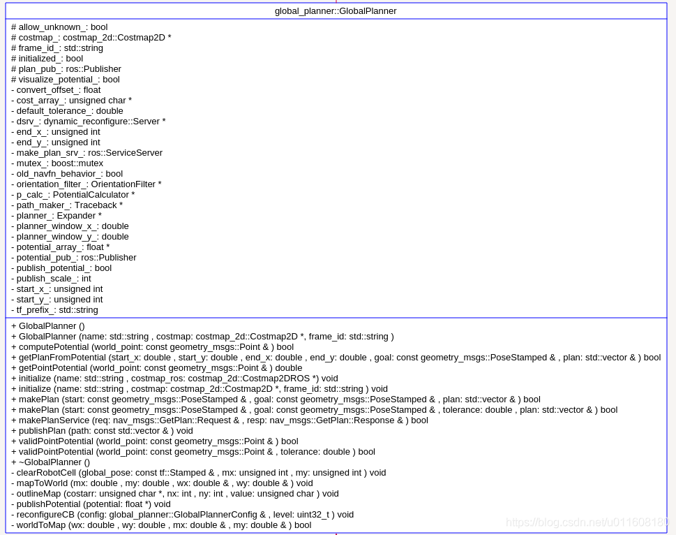

GlobalPlanner的构造方法有：

```c++
GlobalPlanner::GlobalPlanner() :
        costmap_(NULL), initialized_(false), allow_unknown_(true) {
}
```

或者：

```c++
GlobalPlanner::GlobalPlanner(std::string name, costmap_2d::Costmap2D* costmap, std::string frame_id) :
        costmap_(NULL), initialized_(false), allow_unknown_(true) {
    //initialize the planner
    initialize(name, costmap, frame_id);
}
```

初始化函数initialize

```c++
void GlobalPlanner::initialize(std::string name, costmap_2d::Costmap2D* costmap, std::string frame_id) {
    if (!initialized_) {
        ros::NodeHandle private_nh("~/" + name);
        costmap_ = costmap;
        frame_id_ = frame_id;
 
        unsigned int cx = costmap->getSizeInCellsX(), cy = costmap->getSizeInCellsY();
 
        private_nh.param("old_navfn_behavior", old_navfn_behavior_, false);
        if(!old_navfn_behavior_)
            convert_offset_ = 0.5;
        else
            convert_offset_ = 0.0;
 
        bool use_quadratic;
        private_nh.param("use_quadratic", use_quadratic, true);
        if (use_quadratic)
            p_calc_ = new QuadraticCalculator(cx, cy);
        else
            p_calc_ = new PotentialCalculator(cx, cy);
 
        bool use_dijkstra;
        private_nh.param("use_dijkstra", use_dijkstra, true);
        if (use_dijkstra)
        {
            DijkstraExpansion* de = new DijkstraExpansion(p_calc_, cx, cy);
            if(!old_navfn_behavior_)
                de->setPreciseStart(true);
            planner_ = de;
        }
        else
            planner_ = new AStarExpansion(p_calc_, cx, cy);
 
        bool use_grid_path;
        private_nh.param("use_grid_path", use_grid_path, false);
        if (use_grid_path)
            path_maker_ = new GridPath(p_calc_);
        else
            path_maker_ = new GradientPath(p_calc_);
 
        orientation_filter_ = new OrientationFilter();
 
        plan_pub_ = private_nh.advertise<nav_msgs::Path>("plan", 1);
        potential_pub_ = private_nh.advertise<nav_msgs::OccupancyGrid>("potential", 1);
 
        private_nh.param("allow_unknown", allow_unknown_, true);
        planner_->setHasUnknown(allow_unknown_);
        private_nh.param("planner_window_x", planner_window_x_, 0.0);
        private_nh.param("planner_window_y", planner_window_y_, 0.0);
        private_nh.param("default_tolerance", default_tolerance_, 0.0);
        private_nh.param("publish_scale", publish_scale_, 100);
 
        make_plan_srv_ = private_nh.advertiseService("make_plan", &GlobalPlanner::makePlanService, this);
 
        dsrv_ = new dynamic_reconfigure::Server<global_planner::GlobalPlannerConfig>(ros::NodeHandle("~/" + name));
        dynamic_reconfigure::Server<global_planner::GlobalPlannerConfig>::CallbackType cb = boost::bind(
                &GlobalPlanner::reconfigureCB, this, _1, _2);
        dsrv_->setCallback(cb);
 
        initialized_ = true;
    } else
        ROS_WARN("This planner has already been initialized, you can't call it twice, doing nothing");
 
}
```

## **全局规划模块分析**

 GlobalPlanner为BaseGlobalPlanner的插件 

1、PlannerWithCostmap继承于GlobalPlanner，GlobalPlanner继承于BaseGlobalPlanner接收goal，并且在poseCallback函数中，调用makePlan函数

 2、costmap： 通过Costmap2DROS实例化，在Costmap2DROS的构造函数中，new了LayeredCostmap类，并且进行了一系列初始化，并且会进行Costmap2DPublisher的创建，LayeredCostmap会通过plugin_loader进行多层地图的创建以及加载进行footprint的接收 3、costmap和goal都塞在了GlobalPlanner中，costmap是初始化，goal是接收别的模块的发送 

4、GlobalPlanner的构造函数中，存储外部new的costmap，并且进行类的Initialize，初始化函数中，进行全局规划算法的选择，dijkstra或者astar，存在成员变量planner_中，为在BaseGlobalPlanner中的成员变量 

5、GlobalPlanner中的makePlan函数：进行规划，并且发布plan 

6、makePlan解析：

​	a) 将start和goal世界坐标转化成costmap中的序号索引坐标worldToMap

​	b) 设置各种规划器尺寸 setSize（nx,ny）

​	c) 设置规划地图边框：outlineMap

​	d) 计算Potentials，根据具体路径规划算法比如AStar，Dijkstra进行

​	e) 根据初始位置，目标位置，potential，根据具体路径类型，继承于TraceBack的路径类型，计算路径

## 参数配置

参数一：old_navfn_behavior （若在某些情况下,想让global_planner完全复制navfn的功能,那就设置为true,但是需要注意navfn是非常旧的ROS系统中使用的,现在已经都用global_planner代替navfn了,所以不建议设置为true.）

    private_nh.param("old_navfn_behavior", old_navfn_behavior_, false);
    if(!old_navfn_behavior_)
      convert_offset_ = 0.5;
    else
      convert_offset_ = 0.0;

参数二：use_quadratic （设置为true,将使用二次函数近似函数,否则使用更加简单的计算方式,这样节省硬件计算资源.）

    bool use_quadratic;
    private_nh.param("use_quadratic", use_quadratic, true);
    if (use_quadratic)
       p_calc_ = new QuadraticCalculator(cx, cy);
    else
       p_calc_ = new PotentialCalculator(cx, cy);

参数三：use_dijkstra （设置为true,将使用dijkstra算法,否则使用A*算法.）

    bool use_dijkstra;
    private_nh.param("use_dijkstra", use_dijkstra, true);
    if (use_dijkstra)
    {
        DijkstraExpansion* de = new DijkstraExpansion(p_calc_, cx, cy);
        if(!old_navfn_behavior_)
            de->setPreciseStart(true);
        planner_ = de;
    }
    else
        planner_ = new AStarExpansion(p_calc_, cx, cy);

参数四：use_grid_path （如果设置为true,则会规划一条沿着网格边界的路径,偏向于直线穿越网格,否则将使用梯度下降算法,路径更为光滑点.）

    bool use_grid_path;
    private_nh.param("use_grid_path", use_grid_path, false);
    if (use_grid_path)
        path_maker_ = new GridPath(p_calc_);
    else
        path_maker_ = new GradientPath(p_calc_);

 参数五：allow_unknown（是否允许规划器规划穿过未知区域的路径,只设计该参数为true还不行,还要在costmap_commons_params.yaml中设置track_unknown_space参数也为true才行。）

参数六：planner_window_x，planner_window_y

参数七：default_tolerance（当设置的目的地被障碍物占据时,需要以该参数为半径寻找到最近的点作为新目的地点.）

参数八：publish_scale

参数九：lethal_cost  致命代价值,默认是设置为253,可以动态来配置该参数.

参数十：neutral_cost  中等代价值,默认设置是50,可以动态配置该参数.

参数十一：cost_factor  代价地图与每个代价值相乘的因子.

参数十二：publish_potential  是否发布costmap的势函数.

参数十三：orientation_mode  如何设置每个点的方向（None = 0,Forward = 1,Interpolate = 2,

                  ForwardThenInterpolate = 3,Backward = 4,Leftward = 5,Rightward = 6）（可动态重新配置）

参数十四：orientation_window_size  根据orientation_mode指定的位置积分来得到使用窗口的方向.默认值1,可以动态重新配置.

发布两个topic： plan , potential ，一个service ：make_plan，并且回调makePlanService方法，执行makePlan函数。

    plan_pub_ = private_nh.advertise<nav_msgs::Path>("plan", 1);
    potential_pub_ = private_nh.advertise<nav_msgs::OccupancyGrid>("potential", 1);

make_plan_srv_ = private_nh.advertiseService("make_plan", &GlobalPlanner::makePlanService, this);

 路径规划函数makePlan()

    reconfigureCBbool GlobalPlanner::makePlan(const geometry_msgs::PoseStamped& start, const geometry_msgs::PoseStamped& goal,
                               double tolerance, std::vector<geometry_msgs::PoseStamped>& plan) {
        boost::mutex::scoped_lock lock(mutex_);
        if (!initialized_) {
            ROS_ERROR(
                    "This planner has not been initialized yet, but it is being used, please call initialize() before use");
            return false;
        }
     
        //clear the plan, just in case
        plan.clear();
     
        ros::NodeHandle n;
        std::string global_frame = frame_id_;
     
        //until tf can handle transforming things that are way in the past... we'll require the goal to be in our global frame
        if (goal.header.frame_id != global_frame) {
            ROS_ERROR(
                    "The goal pose passed to this planner must be in the %s frame.  It is instead in the %s frame.", global_frame.c_str(), goal.header.frame_id.c_str());
            return false;
        }
     
        if (start.header.frame_id != global_frame) {
            ROS_ERROR(
                    "The start pose passed to this planner must be in the %s frame.  It is instead in the %s frame.", global_frame.c_str(), start.header.frame_id.c_str());
            return false;
        }
     
        double wx = start.pose.position.x;
        double wy = start.pose.position.y;
     
        unsigned int start_x_i, start_y_i, goal_x_i, goal_y_i;
        double start_x, start_y, goal_x, goal_y;
     
        if (!costmap_->worldToMap(wx, wy, start_x_i, start_y_i)) {
            ROS_WARN(
                    "The robot's start position is off the global costmap. Planning will always fail, are you sure the robot has been properly localized?");
            return false;
        }
        if(old_navfn_behavior_){
            start_x = start_x_i;
            start_y = start_y_i;
        }else{
            worldToMap(wx, wy, start_x, start_y);
        }
     
        wx = goal.pose.position.x;
        wy = goal.pose.position.y;
     
        if (!costmap_->worldToMap(wx, wy, goal_x_i, goal_y_i)) {
            ROS_WARN_THROTTLE(1.0,
                    "The goal sent to the global planner is off the global costmap. Planning will always fail to this goal.");
            return false;
        }
        if(old_navfn_behavior_){
            goal_x = goal_x_i;
            goal_y = goal_y_i;
        }else{
            worldToMap(wx, wy, goal_x, goal_y);
        }
     
        //clear the starting cell within the costmap because we know it can't be an obstacle
        clearRobotCell(start, start_x_i, start_y_i);
     
        int nx = costmap_->getSizeInCellsX(), ny = costmap_->getSizeInCellsY();
     
        //make sure to resize the underlying array that Navfn uses
        p_calc_->setSize(nx, ny);
        planner_->setSize(nx, ny);
        path_maker_->setSize(nx, ny);
        potential_array_ = new float[nx * ny];
     
        outlineMap(costmap_->getCharMap(), nx, ny, costmap_2d::LETHAL_OBSTACLE);
     
        bool found_legal = planner_->calculatePotentials(costmap_->getCharMap(), start_x, start_y, goal_x, goal_y,
                                                        nx * ny * 2, potential_array_);
     
        if(!old_navfn_behavior_)
            planner_->clearEndpoint(costmap_->getCharMap(), potential_array_, goal_x_i, goal_y_i, 2);
        if(publish_potential_)
            publishPotential(potential_array_);
     
        if (found_legal) {
            //extract the plan
            if (getPlanFromPotential(start_x, start_y, goal_x, goal_y, goal, plan)) {
                //make sure the goal we push on has the same timestamp as the rest of the plan
                geometry_msgs::PoseStamped goal_copy = goal;
                goal_copy.header.stamp = ros::Time::now();
                plan.push_back(goal_copy);
            } else {
                ROS_ERROR("Failed to get a plan from potential when a legal potential was found. This shouldn't happen.");
            }
        }else{
            ROS_ERROR("Failed to get a plan.");
        }
     
        // add orientations if needed
        orientation_filter_->processPath(start, plan);
     
        //publish the plan for visualization purposes
        publishPlan(plan);
        delete potential_array_;
        return !plan.empty();
    }

worldToMap 将start坐标点和goal的坐标点转换到map上；

clearRobotCell 清除Costmap中的起始单元格，因为我们知道它不会成为障碍。

outlineMap 将costmap的四个边的全部cell都设置为LETHAL_OBSTACLE

calculatePotentials 计算potential，调用的是：

    virtual bool calculatePotentials(unsigned char* costs, double start_x, double start_y, double end_x, double end_y,
                                            int cycles, float* potential) = 0;

getPlanFromPotential 提取plan数据

```
virtual bool getPath(float* potential, double start_x, double start_y, double end_x, double end_y, std::vector<std::pair<float, float> >& path) = 0;
```


## 未解决的问题

1. 为什么cost是unsigned char的格式？为什么不是float？如何与potential相加？

   答：unsigned char的范围是0-255，正好对应了像素取值范围0-255，因此cost的最大值是255

   ```
   static const unsigned char NO_INFORMATION = 255;
   static const unsigned char LETHAL_OBSTACLE = 254;
   static const unsigned char INSCRIBED_INFLATED_OBSTACLE = 253;
   static const unsigned char FREE_SPACE = 0;
   ```

2. potential是什么？

   答：potential是当前节点到起始节点的累加cost，即accumulate cost

   3.这里不懂

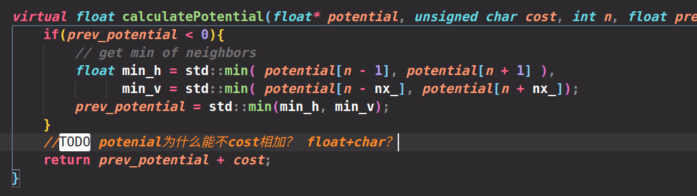

 4.为什么不用closedlist？

​	答：源码通过从终点开始向原点回溯，计算周围potential，即g(n)最小的node，然后加入path，就完成了path的创建，无需closedlist了

 5.共三个问题

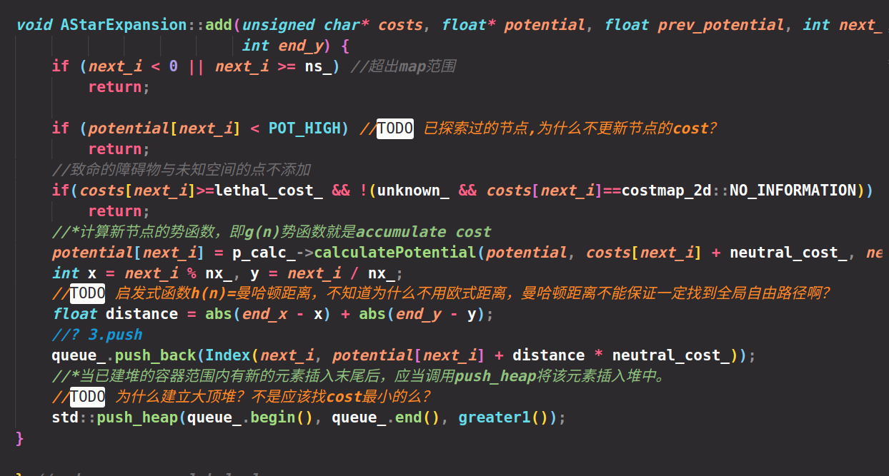

3,4,5已解决，详见源代码注释

6.在plan_node.cpp中为什么在订阅者与服务器中都要make plan?

答：提供了两种全局规划方式，一种是简单的话题通信，即给一个目标，然后一直到规划出结果，返回最终的结果；第二种是利用actionlib的CS服务通信，即规划过程中是可以实时feedback工作进度的。

