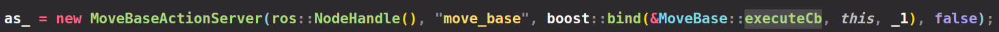
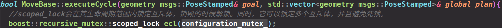
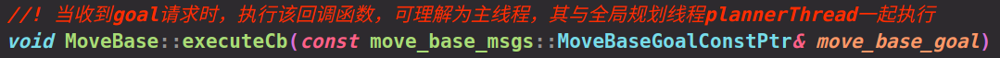

# Move_base总结

## 导航规划栈大致工作流程

该包是导航规划栈的最外层,是整个navigation stack当中进行宏观调控的看得见的手。它主要干的事情是这样的：
维护一张全局地图（基本上是不会更新的，一般是静态costmap类型），维护一张局部地图（实时更新，costmap类型），维护一个全局路径规划器global_planner完成全局路径规划的任务， 维护一个局部路径规划器base_local_planner完成局部路径规划的任务。
然后提供一个对外的服务，负责监听nav_msgs::goal类型的消息，然后调动全局规划器规划全局路径，再将全局路径送进局部规划器，局部规划器结合周围障碍信息（从其维护的costmap中查询），全局路径信息，目标点信息采样速度并评分获得最高得分的轨迹（即是采样的最佳速度），然后返回速度值，由move_base发送Twist类型的cmd_vel消息上，从而控制机器人移动，完成导航任务。

## 调用流程

move_base开放的功能函数：  

Action Server：   

​		executeCb  主线程

Thread：   

​		planThread  全局规划子线程

Sub CallBack ：  

​		goalCB  

Srv Callback：  

​		planService 

​		clearCostMapService  

reconfigureCB  

move_base中是通过actionlib服务器来接收目标点请求的，当接收到目标点请求后，进入executeCb回调函数，即主线程。

executeCb负责接收新目标点，并设置别是否进行全局规划的标志位（planThread函数中），之后具体的任务在executeCycle中进行



发送目标点请求有两种方法，第一种是通过rviz，第二种是写一个actionlib客户端脚本。

另外move_base还创建了一个子线程用于全局规划生成全局路径点序列:


**为什么要把全局规划单独放到一个线程中？**

为什么不能把全局规划放到executeCB中呢？因为是先有的全局规划，输出一个全局路径后才能进行局部规划的呀。今天中午想明白了，因为全局规划与局部规划的频率一般上是不一致的，它们又都小于控制频率。（move_base将局部规划与控制放到了一起）比如全局规划周期是1s，局部规划是200ms，频率的不一致就不能将它们放到同一个处理函数中依次执行，所以将全局规划放到一个子线程，局部规划和控制放到主线程，然后再通过多线程技术统筹这两个线程即可。

多开一个线程意味着时间效率的提升，但是付出的是代码的复杂度，需要增加很多变量来统筹这两个线程。

**导航实际流程**

进行全局路径规划，在进行局部路径规划，然后发布速度全局路径规划

在makePlan函数中，该函数中调用了planner\_的makePlan和empty接口。

planner\_为继承于BaseGlobalPlanner的实例，由pluginlib通过具体类的名字进行装载。

之后，调用tc\_的setPlan接口，对局部路径规划器进行全局路径设置，然后，调用tc\_的isReached接口进行判断，然后调用tc\_的computeVelocityCommands接口，进行速度计算，然后进行速度下发。

tc\_为继承于BaseLocalPlanner的实例，也是由pluginlinb通过具体类的名字进行装载。

下面带来两个问题，planner\_怎么进行路径规划，以及tc_如何计算速度。

planner\_在初始化时候，被塞入了planner_costmap_ros_tc\_在初始化时，被塞入了controller_costmap_ros\_，这样每个规划器都传入一个costmap2DROS，分别有一个layeredCostmap用于管理主地图与分层地图，所以每个规划器就有了一套完整的地图用于全局路径规划与局部轨迹规划。

## move_base中的多线程

### 1.相关成员

move_base类中涉及了一个全局规划子线程。两个多线程互斥体，分别用于全局规划以及动态配置。一个互斥变量。


### 2.递归互斥体——boost::recursive_mutex  configuration_mutex_

#### **先导概念**

**互斥体与锁**

| API                   | C++标准 | 说明                                             |
| --------------------- | ------- | ------------------------------------------------ |
| mutex                 | C++11   | 提供基本互斥设施                                 |
| timed_mutex           | C++11   | 提供互斥设施，带有超时功能                       |
| recursive_mutex       | C++11   | 提供能被同一线程递归锁定的互斥设施               |
| recursive_timed_mutex | C++11   | 提供能被同一线程递归锁定的互斥设施，带有超时功能 |
| shared_timed_mutex    | C++14   | 提供共享互斥设施并带有超时功能                   |
| shared_mutex          | C++17   | 提供共享互斥设施                                 |

很明显，在这些类中，`mutex`是最基础的API。其他类都是在它的基础上的改进。所以这些类都提供了下面三个方法，并且它们的功能是一样的：

| 方法     | 说明                                 |
| -------- | ------------------------------------ |
| lock     | 锁定互斥体，如果不可用，则阻塞       |
| try_lock | 尝试锁定互斥体，如果不可用，直接返回 |
| unlock   | 解锁互斥体                           |

这三个方法提供了基础的锁定和解除锁定的功能。使用`lock`意味着你有很强的意愿一定要获取到互斥体，而使用`try_lock`则是进行一次尝试。这意味着如果失败了，你通常还有其他的路径可以走。

在这些基础功能之上，其他的类分别在下面三个方面进行了扩展：

- **超时**：`timed_mutex`，`recursive_timed_mutex`，`shared_timed_mutex`的名称都带有`timed`，这意味着它们都支持超时功能。它们都提供了`try_lock_for`和`try_lock_until`方法，这两个方法分别可以指定超时的时间长度和时间点。如果在超时的时间范围内没有能获取到锁，则直接返回，不再继续等待。
- **可重入**：`recursive_mutex`和`recursive_timed_mutex`的名称都带有`recursive`。可重入或者叫做可递归，是指在同一个线程中，同一把锁可以锁定多次。这就避免了一些不必要的死锁。
- **共享**：`shared_timed_mutex`和`shared_mutex`提供了共享功能。对于这类互斥体，实际上是提供了两把锁：一把是共享锁，一把是互斥锁。一旦某个线程获取了互斥锁，任何其他线程都无法再获取互斥锁和共享锁；但是如果有某个线程获取到了共享锁，其他线程无法再获取到互斥锁，但是还有获取到共享锁。这里互斥锁的使用和其他的互斥体接口和功能一样。而共享锁可以同时被多个线程同时获取到（使用共享锁的接口见下面的表格）。共享锁通常用在[读者写者模型](https://en.wikipedia.org/wiki/Readers–writers_problem)上。

使用共享锁的接口如下：

| 方法            | 说明                                   |
| --------------- | -------------------------------------- |
| lock_shared     | 获取互斥体的共享锁，如果无法获取则阻塞 |
| try_lock_shared | 尝试获取共享锁，如果不可用，直接返回   |
| unlock_shared   | 解锁共享锁                             |

**通用互斥管理**

- 主要API

| API         | C++标准 | 说明                                   |
| ----------- | ------- | -------------------------------------- |
| lock_guard  | C++11   | 实现严格基于作用域的互斥体所有权包装器 |
| unique_lock | C++11   | 实现可移动的互斥体所有权包装器         |
| shared_lock | C++14   | 实现可移动的共享互斥体所有权封装器     |
| scoped_lock | C++17   | 用于多个互斥体的免死锁 RAII 封装器     |

| 锁定策略    | C++标准 | 说明                                                |
| ----------- | ------- | --------------------------------------------------- |
| defer_lock  | C++11   | 类型为 `defer_lock_t`，不获得互斥的所有权           |
| try_to_lock | C++11   | 类型为`try_to_lock_t`，尝试获得互斥的所有权而不阻塞 |
| adopt_lock  | C++11   | 类型为`adopt_lock_t`，假设调用方已拥有互斥的所有权  |

互斥体（`mutex`相关类）提供了对于资源的保护功能，但是手动的锁定（调用`lock`或者`try_lock`）和解锁（调用`unlock`）互斥体是要耗费比较大的精力的，我们需要精心考虑和设计代码才行。因为我们需要保证，在任何情况下，解锁要和加锁配对，因为假设出现一条路径导致获取锁之后没有正常释放，就会影响整个系统。如果考虑方法还可以会抛出异常，这样的代码写起来会很费劲。

鉴于这个原因，标准库就提供了上面的这些API。它们都使用了叫做RAII的编程技巧，来简化我们手动加锁和解锁的“体力活”。

#### 联系到move_base

该互斥体用于动态参数配置，**引入它是为了防止executeCB任务回调主线程与reconfigure回调函数同时对共享数据进行操作**。move_base中设置了动态参数服务器`dynamic_reconfigure`,在构造函数中初始化它


当接收到外部的参数调整时，进入reconfigureCB，进入后立马用scoped_lock锁住动态配置互斥体。


同样地，在进入executeCycle执行循环时也立马锁住动态配置互斥体，原因是动态参数调整大概率是发生在程序循环运行时的，而reconfigureCB回调函数会重新改写move_base对象中的很多基本且重要的成员变量，所以为了避免两个函数同时对共享字段操作，需要在两个函数的头部用scoped_lock锁住对应互斥体，函数执行完后解锁。

> 补充：scoped_lock是C++17标准提出的一种通用互斥管理方法，scoped_lock会在其生命周期范围内锁定互斥体，销毁的时候解锁。同时，它可以锁定多个互斥体，并且避免死锁。同时在创建时自动锁住，无需再调用configuration_mutex_.lock(),详见保罗的酒馆：https://paul.pub/cpp-concurrency/



### 3.递归互斥体——boost::recursive_mutex  planner_mutex_

该互斥体用于全局规划，**引入它是为了防止规划子线程与executeCB主线程同时对共享数据进行操作**。主线程为：



全局规划子线程为：


全局规划涉及的变量为：

```
bool runPlanner_;
boost::recursive_mutex planner_mutex_;
boost::condition_variable_any planner_cond_;
geometry_msgs::PoseStamped planner_goal_;   //通过这个值将goal在MoveBase::executeCb与MoveBase::planThread()之间传递
std::vector<geometry_msgs::PoseStamped>* planner_plan_; //一般保存规划器中新鲜出炉的路径，然后将其给latest_plan_
std::vector<geometry_msgs::PoseStamped>* latest_plan_;//作为一个桥梁，在MoveBase::executeCycle中传递给controller_plan_
std::vector<geometry_msgs::PoseStamped>* controller_plan_;
```

planner_mutex_第一次是在reconfigureCB中用到的：


从注释中也可以看到，当程序运行时调整了动态参数进入reconfigureCB后，需要等待全局规划子线程解锁planner_mutex_后才能重新对全局规划对应变量进行重置。

planner_mutex_还在executeCB、executeCycle、resetState中用到，上面已经说了，当规划子线程与主线程中涉及对全局规划变量进行操作时就需要锁住它。

### 4.条件变量——boost::condition_variable_any  planner_cond_

#### **先导概念**

| API                       | C++标准 | 说明                                         |
| ------------------------- | ------- | -------------------------------------------- |
| condition_variable        | C++ 11  | 提供与 std::unique_lock 关联的条件变量       |
| condition_variable_any    | C++ 11  | 提供与任何锁类型关联的条件变量               |
| notify_all_at_thread_exit | C++ 11  | 安排到在此线程完全结束时对 notify_all 的调用 |
| cv_status                 | C++ 11  | 列出条件变量上定时等待的可能结果             |

**何时使用条件变量？**

这在很多业务中是很常见的一个需求：每一次操作都要正确执行，如果条件不满足就停下来等待，直到条件满足之后再继续。而不是直接返回。

条件变量提供了一个可以让多个线程间同步协作的功能。这对于[生产者-消费者模型](https://en.wikipedia.org/wiki/Producer–consumer_problem)很有意义。在这个模型下：

- 生产者和消费者共享一个工作区。这个区间的大小是有限的。
- 生产者总是产生数据放入工作区中，当工作区满了。它就停下来等消费者消费一部分数据，然后继续工作。
- 消费者总是从工作区中拿出数据使用。当工作区中的数据全部被消费空了之后，它也会停下来等待生产者往工作区中放入新的数据。

从上面可以看到，无论是生产者还是消费者，当它们工作的条件不满足时，它们并不是直接报错返回，而是停下来等待，直到条件满足。

#### **联系到move_base**

多开一个线程意味着时间效率的提升，但是付出的是代码的复杂度，需要增加很多变量来统筹这两个线程。在全局规划子线程中，并不是一定按照规划频率执行，而是通过一个布尔变量runPlanner_来作为是否需要运行规划子线程的状态值，在主线程中，当有诸如收到新的目标点请求、新目标点抢占等需要全局规划任务时，就将其置为true；不需要时，就置为false。


在全局规划子线程中，通过两个变量，即wait_for_wake与runPlanner\_来确认该线程是否需要阻塞等待，如果条件满足，则进入循环，条件变量调用wait进行等待...此处后解锁互斥体，并让当前线程等待，解锁这一点非常重要，因为只有这样才能让主线程获得互斥体，进行对runPlanner_的写入。

当主线程中有需要使用全局规划的时候，将runPlanner_置为true，并且调用notify_one,通知正在等待的全局规划子线程，此时调用了wait的所有线程都会再次唤醒，然后尝试获取锁（只有一个线程可以获取到），并再次判断条件是否满足。


在上面的while循环中，当主线程调用notify_one（）后，执行wait后面的内容，即将wait_for_wake置为false，此时不在进入循环，而是执行下面的makePlan进行全局规划


在规划子线程的最后首先判断规划频率是否大于0，然后按照规定的规划频率（通过设置的ros定时器）唤醒planner，并将wait_for_wake置为true，是为了下一个规划周期顺利运行，即帮助其再次进入上述while等待循环。


## 参考文献

### 保罗的酒馆——并发技术与多线程编程（多线程概念总结十分完整，读这篇就够了！）

https://paul.pub/cpp-concurrency/

### move_base整体分析

http://www.mamicode.com/info-detail-545985.html