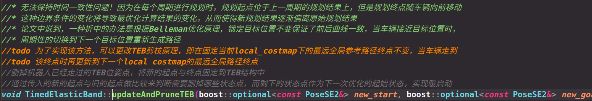

# TEB planner

把teb算法处理局部规划的方法学到手

teb_localplanner是以优化的方法进行局部导航的软件包。基于timed elastic band 方法进行轨迹生成。考虑了运动时的轨迹执行时间、避障、运动学、动力学的约束等条件。此笔记是对teb包的源代码进行学习的一个记录。

## 学习目标

1. teb是如何处理静态障碍物与动态障碍物的？
2. 如何把局部规划问题转化为图优化问题求解？
3. teb是如何给路径生成速度曲线的？
4. teb是如何解决局部极小问题的？
5. teb是如何将local_costmap中的obstacle cell转化为几何线、面、多边形来加速问题求解的？（ans：costmap_converter）
6. teb中的distinctive Topologies是什么？（ans：teb是利用软约束替代硬约束，所以不可避免的会陷入局部极小，因此teb利用distinctive Topologies来帮助teb生成多条轨迹，避免发生碰撞，会进行**可行性检查**）
7. teb是如何处理小车的运动学模型的？(重点关注car like，即阿克曼结构的小车)
8. teb是如何考虑车辆在地图中的几何表示的？(小车的footprint类型直接决定了能否绕过实际障碍物，并影响算法速度)
9. teb是如何处理倒车的？

下面先不深入源码，首先来结合ros wiki的官方文档，运行`roslaunch teb_local_planner test_optim_node.launch`,看看参数对轨迹的影响。

ros wiki teb local planner: http://wiki.ros.org/teb_local_planner/Tutorials

### 实际调试过程中哪些参数可以显著影响生成轨迹的形状

1. min_obstacle_dist：与障碍物之间的最小期望距离（以米为单位）
2. inflation_dist：惩罚成本不为零的障碍物周围的缓冲区（应大于min_obstacle_dist才能生效）。  另请参阅权重weight_inflation。
3. weight_inflation：通胀惩罚的优化权重（应该很小）。
4. include_dynamic_obstacles：如果将此参数设置为true，则将通过等速模型在优化过程中预测并考虑速度为非零的障碍物的运动（通过用户在主题〜/障碍物上提供的障碍物或从costmap_converter获得）。
5. penalty_epsilon：为惩罚函数增加一个小的安全余量，以实现硬约束近似
6. dt_ref：轨迹的所需时间分辨率（由于时间分辨率是优化的一部分，因此轨迹不固定为dt_ref，但是如果违反dt_ref + -dt_hysteresis，则将在迭代之间调整轨迹的大小。
7. dt_hysteresis：用于根据当前时间分辨率自动调整大小的磁滞，通常大约为 建议使用dt_ref的10％

局部规划器的输入：

1. teb配置参数
2. 障碍物序列
3. 机器人模型
4. 可视化
5. 路标点(optional)

## Timed Elastic Band(TEB)算法

### 轨迹规划综述


**轨迹规划的目标**是计算出安全、舒适的轨迹供无人驾驶车辆完成预定的行驶任务。**安全**意味着车辆在行驶过程中与障碍物保持适当的距离，避免碰撞；舒适意味着给乘客提供**舒适的乘坐体验**，比如避免过急的加减速度，在弯道时适当减速避免过大的向心加速度等等；最后，完成行驶任务指规划出的轨迹要完成给定的行驶任务，不能因为过于保守的驾驶导致不可接受的行驶时间。

#### 轨迹规划搜索维度


对于无人驾驶车辆来讲，最简单的位形描述需要使用**3个变量**：车辆某个参照点的坐标(x,  y)，以及车辆的朝向θ来表达车辆的构型，这也是很多参考文献中，对于非和谐车辆系统的位形表达方式。对于我们专门为有人乘用的无人驾驶车辆作轨迹规划的问题来讲，更好的位形组成在上面的3个变量基础上加入车辆的**即时转向曲率 κ**：如果车辆的导向轮保持一定的角度，车辆会做圆周运动。这个圆周运动的半径就是即时转向曲率 κ 。加入 κ，有助于控制模块获得更准确的控制反馈，设计更为**精细平稳的控制器**。

#### 轨迹规划的定义


轨迹规划的正式定义，计算一个以时间 t 为参数的函数 S ，对于定义域内（[0, t_max]）的每一个 t ，都有满足条件的状态 s ：满足目标车辆的**运动学约束**，**碰撞约束**，以及车辆的**物理极限**。

#### 轨迹规划问题的难点

轨迹规划是一个复杂的问题，首先，规划上加入了速度与时间的信息，增加了**规划的维度**。其次，由于车辆是非和谐系统，具有特殊的运动学约束条件。举个例子，车辆不能独立的横向移动，需要纵向移动的同时才能获得**横向偏移**。躲避障碍物，特别是高速动态障碍物，也是一个比较困难的问题。对于搭载乘客的无人驾驶车辆来说，非常重要的一个要求是舒适性，规划出的轨迹必须做到**平滑**，将影响乘客舒适度的因素，比如加速度、向心加速度等等，保持在能够容忍的范围。

另外，对于无人驾驶车辆来讲，为了处理多变的行车环境，轨迹规划算法需要**以短周期高频率运行**，对算法的计算效率也提出了要求。


**下面将细致阐述TEB算法是如何解决以上提出的规划问题的难点**

**TEB区别于百度在Frenet坐标上解耦成横向与纵向，再分别进行路径规划与速度规划，而是直接在笛卡尔坐标系上进行规划**

### Timed Elastic Band——时间弹性带

**elastic band method**：连接起始、目标点，并让这个路径可以变形，变形的条件就是将所有约束当做橡皮筋的外力。关于time eletic band的简述：起始点、目标点状态由用户/全局规划器指定，中间插入N个控制橡皮筋形状的控制点（机器人姿态），当然，为了显示轨迹的运动学信息，我们在点与点之间定义运动时间Time，即为Timed-Elastic-Band算法。

#### 数学建模过程

TEB算法是用优化的方法来进行规划的。轨迹规划的本质是一个高维空间（7个搜索维度——$车辆状态s(t):[x,y,\theta,\kappa,v,a,t]$）内的带多种等式约束与不等式约束的搜索问题，且对搜索时间有很高的要求。即：
$$
{\forall}t\in[0,t_{max}]: \\
				s^*(t)=\mathop{\arg\min}_{s(t)}\ J(s(t)) \\
			subject\ to:\ \ \ \ \ \ \ \ \ \ \ \ \ \ \ \ 车辆非完整型约束(\frac{\mathrm{d} y }{\mathrm{d} t}\cos{\theta}-\frac{\mathrm{d} x }{\mathrm{d} t}\sin{\theta}=0)\\
			障碍物碰撞约束\\
			动力学约束（最大速度、最大加速度）\\
			转向约束(最大转向半径、最大转向变化率)\\
			最短时间约束\\
			最短路径约束\\
$$
TEB将该问题建模为一个图优化问题，将待优化的变量，即空间搜索维度——车辆位姿$SE2:[x,y,\theta]$+时间搜索维度——位姿间的时间间隔$\Delta T$抽象为图结构中的顶点，将碰撞约束、车辆非完整型约束、动力学约束（速度、加速度限制）、最大转向半径、最大转向变化率、最短时间、最短路径等一系列的约束作为图结构中的边。利用g2o框架求解该图优化问题，得到最优的车辆状态序列$S(t):[x.y,\theta,\Delta T]$

TEB为了解决前述轨迹规划的难点，即多约束下的高维搜索问题无解或难找到解，其将硬约束转化为软约束，将全部约束项以误差项的形式加入到目标函数中，这样就把多目标优化问题转化为非线性最小二乘问题，进而将待优化变量与约束项转化为图结构中的顶点与边，调用g2o即可求解该轨迹规划问题。

因此TEB的建模过程可表示为：多目标优化->非线性最小二乘->图优化

TEB的轨迹规划非线性最小二乘问题框架：
$$
x {\forall}t\in[0,t_{max}]: \\            \qquad\qquad\qquad\qquad   J(s(t))= \sum_kE_k(s(t))^T\Omega_kE_k(s(t)) \\
 \qquad\qquad\qquad\qquad s^*(t)= \mathop{\arg\min}_{s(t)}J(s(t))
$$
约束目标函数$E_k(s(t))$的定义，即误差函数penalty function如下，作者采用分段连续，可微分的代价函数计算破坏约束的惩罚值。以速度约束举例：


$x$表示速度，$e_\Gamma$表示误差，$x_r$表示约束界限，$\epsilon$表示安全裕度，$n$表示阶次,$S$表示缩放因子。这里假设最大速度为0.4，安全裕度为0.1，则当速度大于0.3时就产生误差cost，且超出bound越大，产生的误差越大，惩罚就越大。这样就把约束条件建模为误差项，再作为软约束加入到非线性最小二乘的目标函数中，即$e_\Gamma=f(s(t))$。再将其他约束做类似处理，再与对应的权重因子相乘，即完成了对所有约束条件的建模过程。


如果可以搜索出局部的最优位姿点+时间间隔序列:$[x,y,\theta,\Delta T]$，那么就可以进而求解对应的轨迹曲率$\kappa,$速度$v$与加速度$a$，并且是满足车辆动力学约束条件的。这样就完成了局部轨迹规划任务。

#### 待优化变量——图优化的顶点

**位姿**

经典的elastic band算法描述为一系列的车辆位姿$q_i=(x_i,y_i,\beta_i)^T\in\mathbb{R}^2\times S^1$,则位姿顶点集为：
$$
Q=\{{x_i}\}_{i=0...n} \qquad n\in\mathbb{N}
$$
**时间间隔**

每两个位姿之间用时间间隔$\Delta T_i$表示，则时间间隔顶点集为：
$$
\tau=\{\Delta T_i\}_{i=0...n-1}
$$
则一个TEB状态可以表示为位姿与时间间隔的组合：
$$
S=(Q,\tau)
$$
下图为全局坐标系下的时间弹性带TEB的状态序列


有了状态$S$（待优化变量）的定义，搜索空间就确定了，下面就是定义误差项$f_k(S)$（约束条件），然后抽象为一个带软约束的多目标优化问题：
$$
f(S)= \sum_k\gamma_kf_k(S)
\\S^*= \mathop{\arg\min}_{s}f(S)
$$
最后将待优化变量（状态）与误差项（边）抽象为图结构,再将多目标优化问题转化为非线性最小二乘通过调用g2o框架解决规划问题。

**注：**需要注意的是大多数误差项都是局部的，即只含有整段局部轨迹的几个状态，而不是整个band，因此导致系统矩阵是很稀疏的，从而使得大规模数据优化方法求解高效迅速！

#### 约束条件误差项——图优化的边


**1.跟随航迹点与避障约束**

约束主要有两个目标：跟随航迹点和避障。两个目标函数均十分相似，航迹点施力将elastic bands拉向航迹点，而避障约束施力使得elastic bands远离障碍物。$Q$序列航迹点或障碍物$z_j$的最近距离记为$d{min,j}$，如图所示。


跟随航迹目标以航迹点距全局路径的允许最大距离$r_{pmax}$作为约束，避障目标以$Q$序列距障碍物的允许最小距离$r_{omin}$作为约束。**约束误差函数以惩罚函数实现，惩罚函数即为上述$e_\Gamma$函数**，则有：


值得注意的是，目标函数的梯度可视为对elastic band施加的外力。

**2.速度约束**

**（1）线速度**

位姿点的线速度计算方法有两种，当两个最优位姿点的航向差为0，则运动为直线，则有：
$$
v_i=\frac{\Delta s_i}{\Delta T_i}=\frac{\sqrt{(x_{i+1}-x_i)^2+(y_{i+1}-y_i)^2}}{\Delta T_i}
$$
当航向差不为0时，两点之间可用圆弧近似，认为两点间的运动的转向半径$R$不变，则有：
$$
v_i=\Delta \theta\cdot R =(\theta_{i+1}-\theta_i)\cdot\frac{\sqrt{(x_{i+1}-x_i)^2+(y_{i+1}-y_i)^2}}{2sin\frac{\theta_{i+1}-\theta_i}{2}}
$$
线速度约束误差函数以允许的最大线速度${v_{max}}$作为约束，则有：
$$
f_{vel}=e_{\Gamma}(v_i,{v_{max},\epsilon,S,n})
$$
**（2）角速度**

位姿点的角速度计算方法如下：
$$
\omega_i=\frac{\Delta \theta_i}{\Delta T_i}=\frac{\theta_{i+1}-\theta_i}{\Delta T_i}
$$
角速度约束误差函数以允许的最大角速度$\omega_{max}$作为约束，则有：
$$
f_{\omega}=e_{\Gamma}(\omega_i,{\omega_{max},\epsilon,S,n})
$$
**3.加速度约束**

**（1）线加速度**

当前位姿点的线加速度由当前位姿点及其前后两个位姿点以及它们的两个时间间隔求得：
$$
a_i=\frac{2(v_{i+1}-v_i)}{\Delta T_i+\Delta T_{i+1}}
$$


线加速度约束误差函数以允许的最大线加速度${a_{max}}$作为约束，则有：
$$
f_{acc}=e_{\Gamma}(a_i,{a_{max},\epsilon,S,n})
$$
**（2）角加速度**

角加速度与线加速度类似：
$$
a_i =\frac{2(\omega_{i+1}-\omega_i)}{\Delta T_i+\Delta T_{i+1}}
$$


角加速度约束误差函数以允许的最大角加速度${\omega_{max}}$作为约束，则有：
$$
f_{acc}=e_{\Gamma}(\omega_i,{\omega_{max},\epsilon,S,n})
$$


**4.非完整型约束**


车辆的非完整型约束表现为车辆不能单独横向运动，而是由纵向运动引起的。这种约束使得机器人以若干弧线段组成的平滑的轨迹运动，假设相邻两个位姿在一个半径不变的圆弧上，则当前位姿与下一位姿与运动方向$d_{i,i+1}$的夹角保持不变，即：
$$
\theta_i=\theta_{i+1}
$$


方向向量：
$$
d_{i,i+1}=\begin{pmatrix}
x_{i+1}-x_i\\
y_{i+1}-y_i
\end{pmatrix}
$$


并且设当前位姿的前进方向单位向量为:
$$
\begin{pmatrix}
cos\beta_i\\
sin\beta_i
\end{pmatrix}
$$
则对应叉乘是相反数有：
$$
\begin{pmatrix}
cos\beta_i\\
sin\beta_i
\end{pmatrix}\times\mathbf{ d}_{i,i+1}=\mathbf{ d}_{i,i+1}\times
\begin{pmatrix}
cos\beta_{i+1}\\
sin\beta_{i+1}
\end{pmatrix}
$$
非完整约束误差函数：
$$
f_{nh}= \parallel\begin{bmatrix}
\begin{pmatrix}
cos\beta_i\\
sin\beta_i
\end{pmatrix}+\begin{pmatrix}
cos\beta_{i+1}\\
sin\beta_{i+1}
\end{pmatrix}
\end{bmatrix}\times d_{i,i+1}\parallel^2
$$
其与0越接近表示非完整约束满足的越好。


**5.最短路径约束**

最短路径约束误差函数为最小化位姿点之间的欧式距离：
$$
f_{min_{path}}=\sum_{i=1}^{n-1}\sqrt{(x_{i+1}-x_i)^2+(y_{i+1}-y_i)^2}
$$


**6.最短时间约束**

最短时间约束误差函数为最小化时间间隔序列之和：
$$
f_{time}=\sum_{i=1}^n\Delta T_i
$$
最后整个TEB序列构成的超图如下所示，也可以从图中看到大多数约束误差函数仅与整个序列的几个局部状态有关，因此系统矩阵是稀疏的。


#### 算法流程

再来回顾一下何为Timed Elastic Band算法，其继承了Elastic Band的思想，即局部轨迹的初始节点与终止节点是固定的！而除了头尾两个节点外，其他待优化节点都是不固定的，每增加一个误差项，就相当于对这条固定头尾的带子施加一个“外力”，比如在band的上方附近如果有一个障碍物，相当于给带子施加一个向下的力，使得带子往下方弯曲，故名弹性带。而TEB在Elastic Band的基础上引入了时间间隔这个搜索维度，使得其在$S=[x,y,\theta,\Delta T]$四个维度上进行优化求解，速度与加速度可以通过优化后的状态变量求得，进而完成轨迹规划的任务。

TEB需要输入一个全局轨迹作为参考轨迹，比如规划循环可表示为：

1. 根据车辆定位匹配当前与车辆最近的全局轨迹上的点，固定该点为TEB优化起始点
2. 根据配置参数选择该点往后一段路径的点，固定该点作为TEB优化的终止点
3. 将误差项映射成超图，调用g2o优化求解状态集$S=[x,y,\theta,\Delta T]$
4. 可行性检查，避免陷入局部极小
5. 对TEB状态序列剪枝，删掉已经走过的状态点，重新选择并固定TEB起点终点，并利用已优化过但还没走过的节点，这样可以暖启动，即利于下一次循环的优化求解，也满足了时间一致性问题。

算法流程图如下：


**TEB建模优点**

1.求解迅速

许多误差项都是局部的，比如障碍物碰撞约束仅考虑局部轨迹距离障碍物最近的几个状态，这样黑塞矩阵就是稀疏的，求解会很迅速。

2.无解的概率变小

因为局部规划是动态进行的，硬约束下当环境复杂很容易出现无解的情况，这样只能再次进行re-plan。而teb将硬约束转化为软约束，找到解的概率就增大很多，即使其无法保证严格遵守约束条件，但是可以通过在约束条件中加上一点安全裕度来保证约束条件的满足。

2.方便通用

误差项与对应权重相乘，通过调节权重即可改变对某个约束项的重视程度

3.利于扩展

比如现在考虑对TEB加上平滑性约束，那么直接将约束项建模为误差项加入目标函数中，再抽象为图结构中的边即可。 


## 源码总结

### 头文件

teb_local_planner头文件目录如下：


以下头文件与distinctive topology有关，均为了生成多簇局部轨迹、避免optimal_planner生成的teb轨迹陷入局部极小与障碍物发生碰撞 

```
equivalence_relations.h
graph_search.h
h_signature.h
homotopy_class_planner_h
homotopy_class_planner.hpp
```

以下头文件声明teb中的障碍物数据结构、障碍物碰撞检测、几何距离计算

```
distance_calculations.h
obstacles.h
```

以下头文件声明teb中的planner

```
planner_interface.h //planner抽象基类
optimal_planner.h    //1.teb默认planner，算法核心
homotopy_class_planner_h //2.同源类planner，算法核心
```

以下头文件声明teb节点的数据结构、局部轨迹的数据结构、所需的参数、机器人轮廓模型

```
pose_se2.h
timed_elastic_band.h
timed_elastic_band.hpp
teb_config.h
robot_footprint_model.h
```

以下头文件声明与ros的接口

```
teb_local_planner_ros.h // 继承nav_core::BaseLocalPlanner,实现ros定义的局部规划器接口
recovery_behaviors.h 
visualization.h        //可视化节点
visualization.hpp
```

以下头文件是一个杂项类

`misc.h`

include文件夹中的g2o_types文件夹专门用来存放teb算法与g2o的接口，即将teb中的多个目标函数转化为图优化中的边；teb中的待优化变量，即局部轨迹的位姿序列与两个位姿之间的时间间隔转化为图优化中的节点


### 1.障碍物

teb对障碍物结构的声明放在了Obstacle.h中		

teb共定义了5种障碍物，声明均在Obstacle.h头文件中，分别为：


障碍物外形可分别为圆形、线形、线圆结合形、点形、多边形

每个障碍物类都继承抽象基类Obstacle


#### 1.Obstacle

头文件首先定义Obstacle抽象基类

**类成员变量**

基类共有两个成员变量：

```
bool dynamic_;             //动态障碍物标志
Eigen::Vector2d centroid_velocity_;        //质心速度
```

第一个变量声明障碍物是否是动态的，第二个变量用来表示障碍物的质心速度[vx,vy]

**类成员函数**

下面函数用于获得障碍物质心坐标


下面函数用于判断各种类型的障碍物是否与给定点发生碰撞，获取给定点与障碍物之间的最短距离以及最短点坐标


下面函数用于获得使用恒速模型获得估计的到移动障碍物的最小时空距离，判断是否运动、设置质心速度


下面函数用于将障碍物转换为多边形信息


另外定义了三个智能指针，第一个为障碍物父类指针、第二个是父类常量指针、第三个是障碍物集合


#### 2.PointObstacle

**成员变量**

PointObstacle除了从基类继承的动态标志位、质心速度外，还定义了一个pos\_用于存储障碍物位置坐标

```
bool dynamic_;                                                  //动态障碍物标志位
Eigen::Vector2d centroid_velocity_;        //质心速度
Eigen::Vector2d pos_;                                    //质心坐标
```

#### 3.CircularObstacle

**成员变量**

PointObstacle除了从基类继承的动态标志位、质心速度外，还定义了一个pos\_用于存储障碍物位置坐标和一个radius_用于存储圆形障碍物的半径

```
bool dynamic_;                                                  //动态障碍物标志位
Eigen::Vector2d centroid_velocity_;        //质心速度
Eigen::Vector2d pos_;                                    //质心（原心）坐标
double radius_ = 0.0;                                     //圆形障碍物半径
```

#### 4.LineObstacle

**成员变量**

LineObstacle除了从基类继承的动态标志位、质心速度外，还定义了线段的起点与终点坐标、以及线段的中点坐标

```
bool dynamic_;                                                  //动态障碍物标志位
Eigen::Vector2d centroid_velocity_;        //质心速度
Eigen::Vector2d start_;                                  //线段起点坐标
Eigen::Vector2d end_;	                                //线段终点坐标
Eigen::Vector2d centroid_;                          //线段中点坐标
```

#### 5.PillObstalce

**成员变量**

```
bool dynamic_;                                                  //动态障碍物标志位
Eigen::Vector2d centroid_velocity_;        //质心速度
Eigen::Vector2d start_;                                  //线段起点坐标
Eigen::Vector2d end_;	                                //线段终点坐标
Eigen::Vector2d centroid_;                          //线段中点坐标
double radius_ = 0.0;                                     //圆半径
```

#### 6.PolygonObstacle

**成员变量EquivalenceClassContainerEquivalenceClassContainer**

```
bool dynamic_;                                                  //动态障碍物标志位
Eigen::Vector2d centroid_velocity_;        //质心速度
Point2dContainer vertices_;                        //存储所有的多边形节点
Eigen::Vector2d centroid_;                           //多边形质心坐标
bool finalized_;                                                  //多边形节点是否添加完成
```

#### 碰撞检测

**点在多边形内检测**

https://blog.csdn.net/weixin_33840661/article/details/94599492

**2d碰撞检测**

https://www.spieleprogrammierer.de/wiki/2D-Kollisionserkennung#Kollision_Kreis-Strecke

**计算多边形质心**

*http://de.wikipedia.org/wiki/Geometrischer_Schwerpunkt#Polygon*

**点到线的最短距离**

https://blog.csdn.net/weixin_41316824/article/details/90699499

#### 动态障碍物处理


### 2.timed_elastic_band

该文件定义了teb中的局部规划最优轨迹的数据结构

**两个别名**

```c++
//! Container of poses that represent the spatial part of the trajectory ，轨迹的空间点序列
typedef std::vector<VertexPose*> PoseSequence; 
//! Container of time differences that define the temporal of the trajectory 轨迹的时间点序列
typedef std::vector<VertexTimeDiff*> TimeDiffSequence;
```

**成员变量**

```c++
PoseSequence pose_vec_;               //存储最优轨迹位姿点序列
TimeDiffSequence timediff_vec_;  //存储时间间隔点序列
```


### 3.robot_footprint_model

该文件定义了机器人的几何轮廓模型，用于teb优化求解中的**碰撞检测**与rviz可视化。其与costmap中的footprint model不完全一样。轮廓模型类型与参数可以在teb的配置文件中进行配置

轮廓模型类继承关系如下：


轮廓模型分为：

1. 圆（重要）
2. 线
3. 点
4. 多边形（重要）
5. 两个圆的组合

机器人底盘轮廓模型可大致近似为圆（turtlebot）与多边形（无人驾驶车辆），故这两种轮廓模型比较常用。

#### 1.BaseRobotFootprintModel——机器人底盘几何轮廓抽象基类

机器人轮廓模型基类，无成员变量，内有两个用于碰撞检测的纯虚函数需要被每一个子类实现：

第一个函数用于计算机器人在当前轮廓模型、当前位姿下与障碍物的距离

第二个函数用于计算机器人在当前轮廓模型、当前位姿下与**动态障碍物**在**t时刻**的距离


该头文件声明了两个指向抽象基类的共享指针：

```c++
//! Abbrev. for shared obstacle pointers
typedef boost::shared_ptr<BaseRobotFootprintModel> RobotFootprintModelPtr;
//! Abbrev. for shared obstacle const pointers
typedef boost::shared_ptr<const BaseRobotFootprintModel> RobotFootprintModelConstPtr;
```

#### 2.PointRobotFootprint——点轮廓模型

最简单、也是最没用的一种轮廓模型，除非机器人足够小、小到相对局部地图可以看做一个点...实际上基本上是不可能的

点轮廓模型对上面提到了两个用于碰撞检测的纯虚函数的实现是通过obstacles.h中的距离计算函数进行的：


可以看到，这些轮廓模型都是通过障碍物的多态性进行碰撞检测的，即参数是Obstacle父类指针、传入子类对象，即让父类指针指向子类对象，即可满足点轮廓模型对任意类型障碍物进行距离计算！其他轮廓模型的实现是类似的。

#### 3.CircularRobotFootprint——圆轮廓模型

针对圆形底盘的机器人很适用

该类内有个rviz可视化函数,需要用自己的成员变量，即radius_对visualization_msgs::Marker的信息进行写入，这样如果发布对应消息就能在rviz中看到机器人的圆轮廓模型了


#### 4.TwoCirclesRobotFootprint——双圆组合轮廓模型

当车体的前后轮距不一致时可以采用这种模型


#### 5.LineRobotFootprint——线段轮廓模型

线机器人对于在纵向和横向上表现出不同扩展/长度的机器人很有用。


需注意在配置文件中写入线段轮廓模型时，其认为车辆质心在原点[0,0]，故模型参数可配置为：

```
TebLocalPlannerROS:
 footprint_model: # types: "point", "circular", "line", "two_circles", "polygon"
 type: "line"
 line_start: [-0.3, 0.0] 
 line_end: [0.3, 0.0] 
```


#### 6.PolygonRobotFootprint——多边形轮廓模型

阿克曼结构、自动驾驶车辆一般采用这种模型，尤其是矩形外形。

需注意在配置文件中写入线段轮廓模型时，其认为车辆质心在原点[0,0]，故模型参数可配置为：

```
TebLocalPlannerROS:
 footprint_model: # types: "point", "circular", "line", "two_circles", "polygon"
 type: "polygon"
vertices: [[-1,-1],[-1,1],[1,1],[1,-1] ] 
```

注：按顺序写多边形顶点，因为默认两个顶点间存在边，且不用闭合，即默认最后一个节点与第一个节点之间存在边

从代码中可以看到，每增加一个节点（边）就增加了算法时间复杂度，因此轮廓模型的顶点不要太多，这里认为4个就够了，即矩形轮廓。


### 4.planner_interface

该文件定义了TEB规划接口，其与ros导航栈的nav_core定义的BaseLocalPlanner不太一样，扩展了一些TEB需要的功能函数。


其被两个TEB planner继承，其中一个是标准TEB planner，另外一个为同伦类planner，用于生成多条备选轨迹避免陷入局部极小。


通过配置文件选择需要的planner


### 5.optimal_planner

这是真正的TEB planner实现，继承自规划接口PlannerInterface


本文件是TEB算法的核心，包含以下内容：

1. 初始化g2o优化器、注册TEB算法转化为图结构后的顶点和边，添加节点和边、构造图与清除图，优化求解

   注：待优化变量(顶点)是TimedElasticBand类定义的位姿序列与时间间隔序列，优化求解后即保持在TimedElasticBand teb_中，方便后续调用与可视化

2. 结果可视化

3. 获取优化后的速度曲线、整条优化轨迹

4. 轨迹可行性检查

### 6.teb_local_planner_ros


本文件是teb的ros封装类，通过实现nav_core定义的BaseLocalPlanner接口函数完成功能对接。另外一些TEB相关的功能函数，比如需要更新障碍物容器根据costmap、costmapConverter等等..


最重要的当然是对computeVelocityCommands函数的实现，因为它才是局部规划循环执行的函数，下面进入该函数一探究竟：

#### **computeVelocityCommands**

该函数执行一次就完成一次局部规划，最终计算出控制量cmd_vel,结构类型为Twist，包含线速度与角速度。

**1.重置cmd_vel**


声明的seq数据序列号是一个静态变量，只要teb planner存在，该变量就一直存在，因此它不会随本次局部规划循环结束而消失。将线速度全部置零，然后goal_reached置false，因为只要再进入一次局部规划循环就还没有到达终点，该函数后面会判断是否到达终点。

**2.更新机器人位姿、速度**


根据costmap_ros_这个变量获取当前机器人全局坐标位姿

根据odom_helper_获得当前机器人坐标系下的速度


**3.全局轨迹剪枝**

TEB是在全局规划路径的基础上（A*的结果）进行局部规划的，所以如果当机器人经过一段全局路径后，就将之前的路径点删掉，这样减少了计算量


**4.只取local costmap内的一段全局规划路径作为TEB全局参考路径**


**5.检查是否到达终点**


**6.清楚障碍物集合，更新局部障碍物容器**


**7.万事俱备，进行真正的teb局部规划**

首先锁住配置线程锁，防止其在规划途中发生改变，然后根据转换到局部代价地图坐标系下的全局规划路径，机器人当前速度等进行teb局部规划。


**8.轨迹可行性检查**

首先根据配置决定机器人轮廓模型是否是动态变化的，如果变化则在可行性检查之前先更新轮廓模型。

因为teb是通过数值优化的方法进行局部规划的，所以可能与障碍物发生碰撞，因此可行性检查函数主要进行障碍物碰撞检测。

如果没有通过可行性检查，记录最后一条控制指令作为调试信息，发出警告。并且清除当前teb planner，再次进行规划...


**9.根据teb优化变量计算速度曲线**

完成teb优化后，根据两个连续的最优位姿与它们的最优时间间隔来计算当前点的速度


**10.处理饱和的速度值**

因为teb是将硬约束转化为软约束，即使有安全裕度也有可能超出范围，因此这里再次对饱和速度进行处理。


**11.计算前轮转角(阿克曼结构)**

因为ros里的控制指令是以线速度与角速度的方式给出的，但是车辆实际上需要的是前轮转角与加速度，因此这里将角速度指令转换为前轮转角。


**12.结果可视化**


## 调试记录

### 倒车问题

- 在local costmap中设置与车辆朝向相反的车辆后面的一个全局位置，则可以实现直接倒车，但是超过local costmap的范围就无法直接倒车，而是TEB规划器试图先转向90再转向90

1.全局目标点设置在local costmap内


2.全局目标点设置在local costmap外


但是实际上local costmap范围很小，全局目标位置大概率不会在local costmap内，如果无法处理该情况就想办法改进。

目标点选在local costmap外倒车很低效与规划逻辑有关，因为在跟踪全局路径的过程中都会以局部全局路径段作为参考，并且选取其终点作为局部目标


#### **TEB跟踪全局路径原理**

现在已经知道TEB是固定起点与终点来进行优化求解规划轨迹的，但是起点与终点在哪？是不是一直变化的？下面就根据代码解决该问题。

需注意global costmap与local costmap的frame是相同的！本来局部代价地图就是从全局代价地图中抠出来的一小块，因此它们的全局坐标系都是map，车身坐标系是base_link。


teb接收全局路径规划结果，并保存在变量globa_plan_中。在TEB封装类TebLocalPlannerROS中重写了局部规划类函数setPlan，该函数用于接收全局规划路径。


首先全局规划路径结果保存在latest_plan_中，


再把它传递给controller_plan_，因此TEB局部规划器的global_plan\_就是一个完整的全局规划路径结果。


但是随着局部规划的进行，TEB将车辆身后的全局路径点删掉了，因为其对局部规划没有作用了。代码实现为在重写的computeVelocityCommands函数中执行了全局规划路径剪枝操作：


在全局路径剪枝函数中还执行了从全局到局部的坐标变换，但由于全局与局部的代价地图global frame都是map，因此相当于并没有做坐标变换


然后只截取local costmap内的全局规划路径，即transformed_plan_，作为TEB的全局参考路径，**因此每次TEB执行局部规划循环,TEB的起点与终点都在随车辆的运动而变化！**


有了当前时刻的全局参考路径与起点终点，下面就开始执行真正的teb 规划循环：


在teb局部规划循环中，也是先初始化一条轨迹，如果初始化完成后也进行剪枝操作，TEB会根据新的起点删除已经走过的航迹点，并添加新的起点与终点，新的起点与终点就是前述随着车辆运动而变化的local costmap内的起点与终点，这样车辆就可以循环执行TEB状态序列的优化了。


同样TEB的剪枝操作也是有问题的，即时间一致性问题



目前TEB算法并没有处理倒车这个问题，因此如果全局目标点选在local costmap外面那么初始化轨迹的时候是无法生成一条直接倒车轨迹的！就像上图一样先拐弯倒车，再拐好，当全局目标点进入local costmap中再生成直接倒车轨迹，这显然是有问题的，尤其是在狭窄道路环境中，因为希望车辆是直接倒车的。

修改位置：代码作者也在TimedElasticBand::initTrajectoryToGoal()函数中写了todo标签，即我们在这里加入关于车辆直接倒车的初始化轨迹生成代码！


## 对TEB的改进或作者在论文中没有提到的点（论文创新点）

### idea

**目前选取特定场景下，即狭窄道路下的轨迹规划，利用TEB并对其进行改进来完成窄路通行任务就是我论文要解决的实际问题。**

1. teb未考虑位姿点序列整体的平滑性，考虑将平滑代价作为误差项封装成g2o的超图的边进行图优化。实验结果可以对比优化前后的点序列的曲率（创新）

2. 时间不一致是基于优化求解的曲线生成方法普遍存在的问题，而在狭窄道路场景中，时间不一致导致车辆在每个规划周期的规划结果都无法与上一周期保持一致，随着规划的进行，车辆实际运行的路线与第一时刻的规划结果之间将出现越来越大的误差，在狭窄道路环境下规划失效的概率将大大增加，从而导致发生碰撞等安全问题。

   updateAndPruneTEB剪枝方法虽然能够提供下一规划周期的暖启动，因为在每个周期进行规划时，规划起点位于上一周期的规划结果上，但是规划终点随车辆向前移动，这种边界条件的变化将导致最优化计算结果的变化，从而使得新规划结果逐渐偏离原始规划结果。

   论文中提到，一种折中的办法是根据Belleman优化原理，锁定目标位置不变保证了前后曲线一致，当车辆接近目标位置时，周期性的切换到下一个目标位置重新生成路径。

   为了实现该方法，可以更改TEB剪枝原理，即在固定当前local costmap下的最远全局参考路径终点不变，当车辆走到该终点时再更新到下一个local costmap的最远全局路径终点。

   除了固定终点，还可以参考前述apollo在处理轨迹拼接遇到时间一致性问题是如何选取下一帧规划起点的。

   另外可以通过多个规划周期路径点坐标的变化来衡量时间一致性满足的程度，比如我观察10s的TEB局部规划结果，然后对这10s的相邻规划路径坐标作差，然后取和，作为衡量时间一致性的指标。（创新）

3. 速度的正方向判断（未提到）

4. 调试记录所述倒车问题

5. 结合问题2与4，可以类似局部目标点的概念，即**暂时固定**不变的点，比如中继点，这个概念可以同时解决问题2与4。中继点概念的解释：行军中为变换路线而设置的点。先走到那里，再到目的地。

6. 中继点概念的提出同时解决了时间一致性的问题与倒车问题，扩展了TEB的应用场景，可以仅利用一个局部规划器来完成大地图导航、狭窄路段倒车、掉头、倒车避障等多个场景的导航的任务，这样就不用再利用上层状态机来切换不同场景下的局部规划器，使得鲁棒性与安全性增强。

### 实现

1. 时间一致性问题的解决（teb_local_planner_ros.cpp）

   目前是通过选取局部代价地图中全局路径段中最后一个点作为当前的局部目标，如果到达局部目标就更新局部目标为到达时刻局部代价地图中全局路径段中最后一个点，一直进行下去直到达到全局目标。通过固定局部目标使得优化求解的终点固定，从而满足Bellman最优原理，防止了轨迹的突变并且满足时间一致性。目前考虑下一个思路，即通过定时器定时更新局部目标，这种优化方法理论上更加灵活，因为上一种方法一定要到达局部目标附近才会更新，如果突然一个动态障碍物走到车与局部目标的中间，那么车辆可能规划失效或者规划出的轨迹非常低效（表现在轨迹变长，时间变多）。目前处于待实现状态！

2. 倒车问题的解决

   在使用teb作为局部轨迹规划器时，如果车辆后方设置目标点，并且目标点不在local costmap内，则无法实现“直觉”上的倒车，而是很“傻”的先掉头再走，是个很大的问题。

   

   

## TEB参数

| 参数                                                         | 类型   | 含义                                                         | 单位    | 最小  | 默认   | 最大    |
| ------------------------------------------------------------ | ------ | ------------------------------------------------------------ | ------- | ----- | ------ | ------- |
| teb_autosize                                                 | bool   | 优化期间允许根据下述参数调整轨迹点序列（增加或删除轨迹点）   |         |       | True   |         |
| dt_ref（对规划效率有显著影响）                               | double | 局部轨迹规划的解析度，即轨迹点之间的时间间隔，决定轨迹点的密集程度与规划效率，通常设置为1/control rate | s       | 0.01  | 0.3    | 1.0     |
| dt_hysteresis                                                | double | 允许改变的时域解析度的浮动范围，一般为dt_ref的10%            | s       | 0.002 | 0.1    | 0.5     |
| global_plan_overwrite_orientation                            | bool   | 覆盖全局路径中局部路径段的局部目标的朝向                     |         |       | True   |         |
| allow_init_with_backwards_motion                             | bool   | 当目标在车辆后方且在局部代价地图中，允许向后运动的轨迹初始化，为了实现倒车，设置为True |         |       | False  |         |
| max_global_plan_lookahead_dist（前瞻距离需要依赖实际地图大小） | double | 最远前瞻距离，是考虑优化的全局路径段在局部代价地图中的最大长度，为累计欧式距离 | m       | 0.0   | 3.0    | 50.0    |
| force_reinit_new_goal_dist                                   | double | 如果上一个目标的间隔超过指定的米数（跳过热启动），则强制规划器重新初始化轨迹 | m       | 0.0   | 1.0    | 10.0    |
| feasibility_check_no_poses                                   | int    | 可行性检查时每个采样间隔考虑的相关位姿数量                   |         | 0     | 5      | 50      |
| exact_arc_length                                             | bool   | 如果为真，规划器在速度、加速度和转弯率计算中使用精确的弧长[->增加的CPU时间]，否则使用欧几里德近似 |         |       | False  |         |
| publish_feedback                                             | bool   | 发布action提供的反馈信息                                     |         |       | False  |         |
| global_plan_viapoint_sep                                     | double | 从全局计划中提取的每两个连续通过点之间的最小间隔[如果为负：禁用] |         | -0.1  | -0.1   | 5.0     |
| via_points_ordered                                           | bool   | 如果为真，规划器遵循存储容器中通过点的顺序                   |         |       | Fasle  |         |
| max_vel_x                                                    | double | 最大x前向速度                                                | m/s     | 0.01  | 0.4    | 100.0   |
| max_vel_x_backwards                                          | double | 最大x后退速度                                                | m/s     | 0.01  | 0.2    | 100.0   |
| max_vel_theta                                                | double | 最大转向角速度                                               | rad/s   | 0.01  | 0.3    | 100.0   |
| acc_lim_x                                                    | double | 最大x加速度                                                  | m/s^2   | 0.01  | 0.5    | 100.0   |
| acc_lim_theta                                                | double | 最大角速度                                                   | rad/s^2 | 0.01  | 0.5    | 100.0   |
| is_footprint_dynamic                                         | bool   | 如果为真，在轨迹可行性检查前更新footprint轮廓模型            |         |       | False  |         |
| min_turning_radius                                           | double | 车辆的最小转弯半径（diff-drive robot:zero）                  | m       | 0.0   | 0.0    | 50.0    |
| wheelbase                                                    | double | 轴距                                                         | m       | -10.0 | 1.0    | 10.0    |
| max_vel_y                                                    | double | 最大y方向速度（非完整型约必须为0！）                         | m/s     | 0.0   | 0.0    | 100.0   |
| acc_lim_y                                                    | double | 最大y方向加速度                                              | m/s^2   | 0.01  | 0.5    | 100.0   |
| xy_goal_tolerance                                            | double | 目标xy偏移容忍度                                             | m       | 0.001 | 0.2    | 10.0    |
| yaw_goal_tolerance                                           | double | 目标角度偏移容忍度                                           | rad     | 0.001 | 0.1    | 3.2     |
| free_goal_vel                                                | bool   | 允许机器人以最大速度驶向目的地                               |         |       | False  |         |
| min_obstacle_dist                                            | double | 和障碍物的最小距离                                           | m       | 0.0   | 0.5    | 10.0    |
| inflation_dist                                               | double | 障碍物膨胀距离，需要大于min_obstacle_dist才能生效            | m       | 0.0   | 0.6    | 15.0    |
| dynamic_obstacle_inflation_dist                              | double | 动态障碍物的膨胀距离，需要大于min_obstacle_dist才能生效      | m       | 0.0   | 0.6    | 15.0    |
| include_dynamic_obstacles                                    | bool   | 是否将动态障碍物预测为速度模型                               |         |       | False  |         |
| include_costmap_obstacles                                    | bool   | costmap 中的障碍物是否被直接考虑                             |         |       | True   |         |
| legacy_obstacle_association                                  | bool   | 如果为真，则使用老的碰撞检测方法（for each obstacle, find the nearest TEB pose），否则使用新方法(or each teb pose, find only ‘relevant’ obstacles) |         |       | False  |         |
| costmap_obstacles_behind_robot_dist                          | double | 考虑车辆身后多远距离以内的障碍物                             | m       | 0.0   | 1.5    | 20.0    |
| obstacle_poses_affected                                      | int    | 考虑障碍物最近点附近的多少个轨迹点是否发生碰撞               |         | 0     | 30     | 50      |
| no_inner_iterations                                          | int    | 被外循环调用后内循环执行优化次数                             |         | 1     | 5      | 100     |
| no_outer_iterations                                          | int    | 执行的外循环的优化次数                                       |         | 1     | 4      | 100     |
| optimization_activate                                        | bool   | 激活优化                                                     |         |       | True   |         |
| optimization_verbose                                         | bool   | 打印节点信息                                                 |         |       | False  |         |
| penalty_epsilon                                              | double | 对于硬约束近似，在惩罚函数中添加安全裕量                     | scaler  | 0.0   | 0.1    | 1.0     |
| weight_max_vel_x                                             | double | 最大x速度权重                                                |         | 0.0   | 2.0    | 1000.0  |
| weight_max_vel_y                                             | double | 最大y速度权重                                                |         | 0.0   | 2.0    | 1000.0  |
| weight_max_vel_theta                                         | double | 最大角速度权重                                               |         | 0.0   | 1.0    | 1000.0  |
| weight_acc_lim_x                                             | double | 最大x 加速度权重                                             |         | 0.0   | 1.0    | 1000.0  |
| weight_acc_lim_y                                             | double | 最大y加速度权重                                              |         | 0.0   | 1.0    | 1000.0  |
| weight_acc_lim_theta                                         | double | 最大角速度权重                                               |         | 0.0   | 1.0    | 1000.0  |
| weight_kinematics_nh                                         | double | 非完整型约束权重                                             |         | 0.0   | 1000.0 | 10000.0 |
| weight_kinematics_forward_drive                              | double | 优化过程中，迫使机器人只选择前进方向，差速轮适用             |         | 0.0   | 1.0    | 1000.0  |
| weight_kinematics_turning_radius                             | double | 优化过程中，车型机器人的最小转弯半径的权重                   |         | 0.0   | 1.0    | 1000.0  |
| weight_optimaltime                                           | double | 优化过程中，基于轨迹的时间上的权重，                         |         | 0.0   | 1.0    | 1000.0  |
| weight_obstacle                                              | double | 优化过程中，和障碍物最小距离的权重                           |         | 0.0   | 50.0   | 1000.0  |
| weight_inflation                                             | double | 优化过程中， 膨胀区的权重                                    |         | 0.0   | 0.1    | 10.0    |
| weight_dynamic_obstacle                                      | double | 优化过程中，和动态障碍物最小距离的权重                       |         | 0.0   | 50.0   | 1000.0  |
| weight_dynamic_obstacle_inflation                            | double | 优化过程中，和动态障碍物膨胀区的权重                         |         | 0.0   | 0.1    | 10.0    |
| weight_viapoint                                              | double | 优化过程中，和全局路径采样点距离的权重                       |         | 0.0   | 1.0    | 1000.0  |
| enable_multithreading                                        | bool   | 允许多线程并行处理                                           |         |       | True   |         |
| max_number_classes                                           | int    | 允许的线程数                                                 |         | 1     | 5      | 100     |
| selection_cost_hysteresis                                    | double |                                                              |         | 0.0   | 1.0    | 2.0     |
| selection_prefer_initial_plan                                | double |                                                              |         | 0.0   | 0.95   | 1.0     |
| selection_obst_cost_scale                                    | double |                                                              |         | 0.0   | 100.0  | 1000.0  |
| selection_viapoint_cost_scale                                | double |                                                              |         | 0.0   | 1.0    | 100.0   |
| selection_alternative_time_cost                              | bool   |                                                              |         |       | False  |         |
| switching_blocking_period                                    | double |                                                              |         |       | 0.0    |         |
| roadmap_graph_no_samples                                     | int    |                                                              |         | 1     | 15     | 100     |
| roadmap_graph_area_width                                     | double |                                                              |         | 0.1   | 5.0    | 20.0    |
| roadmap_graph_area_length_scale                              | double |                                                              |         | 0.5   | 1.0    | 2.0     |
| h_signature_prescaler                                        | double |                                                              |         | 0.2   | 1.0    | 1.0     |
| h_signature_threshold                                        | double |                                                              |         | 0.0   | 0.1    | 1.0     |
| obstacle_heading_threshold                                   | double |                                                              |         | 0.0   | 0.45   | 1.0     |
| viapoints_all_candidates                                     | bool   |                                                              |         |       | True   |         |
| visualize_hc_graph                                           | bool   |                                                              |         |       | False  |         |
| shrink_horizon_backup                                        | bool   |                                                              |         |       | True   |         |
| oscillation_recovery                                         | bool   |                                                              |         |       | True   |         |

**footprint model**

```
footprint_model: # types: “point”, “circular”, “two_circles”, “line”, “polygon”
type: “point” 选择车辆轮廓模型类型，对障碍物检测十分重要
radius: 0.36 # for type “circular”
line_start: [-0.3, 0.0] # for type “line” 线模型起始坐标
line_end: [0.3, 0.0] # for type “line” 线模型尾部坐标
front_offset: 0.2 # for type “two_circles” 前圆心坐标
front_radius: 0.2 # for type “two_circles” 前圆半径
rear_offset: 0.2 # for type “two_circles” 后圆心坐标
rear_radius: 0.2 # for type “two_circles” 后圆半径
vertices: [ [0.25, -0.05], [0.18, -0.05], [0.18, -0.18], [-0.19, -0.18], [-0.25,  0], [-0.19, 0.18], [0.18, 0.18], [0.18, 0.05], [0.25, 0.05] ] # for type "polygon"多边形边界点
```


## 尚未解决的问题

1. 为什么有的边不用求一阶雅克比矩阵？不是后面计算的时候一定会遇到么？
2. edge_velocity里面的速度正负是怎么判断的？
3. 误差目标函数的形式？雅克比矩阵？
4. *class* EdgeObstacle : *public* BaseTebUnaryEdge<1, *const* Obstacle*, VertexPose>，为什么这里的数据类型是*const* Obstacle*？与障碍物的距离不应该是double类型么？
5. TebOptimalPlanner类中的成员变量obstacles_per_vertex_是什么？
6. 动态障碍物如何处理？
7. 全局规划结果传给局部规划的是什么样的路径（坐标系怎么变换的）？是只传入整条全局路径的一部分还是全部？
8. TEB在全局参考路径上向前规划了多长的轨迹？其长度是固定的还是变化的？与dt_ref有关么？

## g2o

g2o全称General Graph Optimization，即通用图优化，是一个用图来存储待优化变量，用边存储约束条件的误差项，来优化非线性误差函数的c++框架。

为何叫通用呢？g2o的核里带有各种各样的求解器，而它的顶点、边的类型则多种多样。通过自定义顶点和边，事实上，只要一个优化问题能够表达成图，那么就可以用g2o去求解它。常见的，比如bundle adjustment，ICP，数据拟合，都可以用g2o来做。它是一个重度模板类的c++项目，其中矩阵数据结构多来自Eigen。

g2o理论：
 许多问题可以建模为最小二乘优化的状态估计问题。问题形式如图


F(x)为目标函数，目的就是求解状态x，使目标函数最小。x是一个向量，向量中的每个元素也可以为一个参数块。zij是联系状态变量i和状态变量j的观测，数学上表现为一个约束方程。由于有测量噪声，采用误差向量e()评价xi和xj满足方程的程度。

为了简化符号，采用下图描述误差向量


这里需要注意的是，状态变量xi和xj（左侧），已经变为了整个系统的状态x（右侧）。

这误差向量可以表示为一个有向图，可以知道方程结构，便于可视化分析


这个图中，边的个数就是所有的约束，也就是方程个数。一个节点为一个状态变量，所有节点的结合组成了整个系统的状态变量。不要忘记我们的目标就是为了状态估计。

有了上述目标函数，我们就可以进行最小二乘优化。由于目标函数是以误差项的形式给出，因此考虑使用高斯牛顿法(GN)以及其的改进方法——列文伯格-马夸特（LM）法。

如果我们假设目标函数为F(x)，误差函数为f(x)，由于上面的目标函数不是针对F(x)的优化，转而考虑误差函数f(x)的优化，因此可以避免求解计算量偏大、耗时的黑塞矩阵，而是用梯度的乘积来近似黑塞矩阵，从而大大减小运算量。

最小二乘问题的四种解法——牛顿法，梯度下降法，高斯牛顿法和列文伯格-马夸特法的区别和联系详见：https://zhuanlan.zhihu.com/p/113946848

g2o理论具体求解方法见：https://blog.csdn.net/qit1314/article/details/84886612

g2o在slam中一般分解为两个任务：

1、构建图。机器人位姿作为顶点，位姿间关系作为边。

2、优化图。调整机器人的位姿（顶点）来尽量满足边的约束，使得误差最小。

g2o求解框架流程如下图：


### 1.图的核心

SparseOptimizer是整个图的核心，我们注意右上角的 is-a 实心箭头，这个SparseOptimizer它是一个Optimizable Graph，从而也是一个超图（HyperGraph）。

### 2.顶点和边

注意看 has-many  箭头，超图包含了许多顶点（HyperGraph::Vertex）和边（HyperGraph::Edge）。而这些顶点顶点继承自 Base Vertex，也就是OptimizableGraph::Vertex，而边可以继承自 BaseUnaryEdge（单边）,  BaseBinaryEdge（双边）或BaseMultiEdge（多边），它们都叫做OptimizableGraph::Edge

### 3.配置SparseOptimizer的优化算法和求解器

整个图的核心SparseOptimizer  包含一个优化算法（OptimizationAlgorithm）的对象。OptimizationAlgorithm是通过OptimizationWithHessian 来实现的。其中迭代策略可以从Gauss-Newton（高斯牛顿法，简称GN）, Levernberg-Marquardt（简称LM法）,  Powell's dogleg 三者中间选择一个（我们常用的是GN和LM）

### 4.如何求解

OptimizationWithHessian  内部包含一个求解器（Solver），这个Solver实际是由一个BlockSolver组成的。这个BlockSolver有两个部分，一个是SparseBlockMatrix  ，用于计算稀疏的雅可比和Hessian矩阵；一个是线性方程的求解器（LinearSolver），它用于计算迭代过程中最关键的一步HΔx=−b，LinearSolver有几种方法可以选择：PCG, CSparse, Choldmod

### **一步步看懂g2o编程流程**

我们梳理是从顶层到底层，但是编程实现时需要反过来，像建房子一样，从底层开始搭建框架一直到顶层。g2o的整个框架就是按照下图中我标的这个顺序来写的。


高博在十四讲中g2o求解曲线参数的例子来说明，源代码地址

https://github.com/gaoxiang12/slambook/edit/master/ch6/g2o_curve_fitting/main.cpp

为了方便理解，我重新加了注释。如下所示，

```cpp
typedef g2o::BlockSolver< g2o::BlockSolverTraits<3,1> > Block;  // 每个误差项优化变量维度为3，误差值维度为1

// 第1步：创建一个线性求解器LinearSolver
Block::LinearSolverType* linearSolver = new g2o::LinearSolverDense<Block::PoseMatrixType>(); 

// 第2步：创建BlockSolver。并用上面定义的线性求解器初始化
Block* solver_ptr = new Block( linearSolver );      

// 第3步：创建总求解器solver。并从GN, LM, DogLeg 中选一个，再用上述块求解器BlockSolver初始化
g2o::OptimizationAlgorithmLevenberg* solver = new g2o::OptimizationAlgorithmLevenberg( solver_ptr );

// 第4步：创建终极大boss 稀疏优化器（SparseOptimizer）
g2o::SparseOptimizer optimizer;     // 图模型
optimizer.setAlgorithm( solver );   // 设置求解器
optimizer.setVerbose( true );       // 打开调试输出

// 第5步：定义图的顶点和边。并添加到SparseOptimizer中
CurveFittingVertex* v = new CurveFittingVertex(); //往图中增加顶点
v->setEstimate( Eigen::Vector3d(0,0,0) );
v->setId(0);
optimizer.addVertex( v );
for ( int i=0; i<N; i++ )    // 往图中增加边
{
  CurveFittingEdge* edge = new CurveFittingEdge( x_data[i] );
  edge->setId(i);
  edge->setVertex( 0, v );                // 设置连接的顶点
  edge->setMeasurement( y_data[i] );      // 观测数值
  edge->setInformation( Eigen::Matrix<double,1,1>::Identity()*1/(w_sigma*w_sigma) ); // 信息矩阵：协方差矩阵之逆
  optimizer.addEdge( edge );
}

// 第6步：设置优化参数，开始执行优化
optimizer.initializeOptimization();
optimizer.optimize(100);
```

结合上面的流程图和代码。下面一步步解释具体步骤。

#### 1、创建一个线性求解器LinearSolver

我们要求的增量方程的形式是：H△X=-b，通常情况下想到的方法就是直接求逆，也就是△X=-H.inv*b。看起来好像很简单，但这有个前提，就是H的维度较小，此时只需要矩阵的求逆就能解决问题。但是当H的维度较大时，矩阵求逆变得很困难，求解问题也变得很复杂。

小白：那有什么办法吗？

师兄：办法肯定是有的。此时我们就需要一些特殊的方法对矩阵进行求逆，你看下图是GitHub上g2o相关部分的代码


如果你点进去看，可以分别查看每个方法的解释，如果不想挨个点进去看，看看下面我的总结就行了

```cpp
LinearSolverCholmod ：使用sparse cholesky分解法。继承自LinearSolverCCS
LinearSolverCSparse：使用CSparse法。继承自LinearSolverCCS
LinearSolverPCG ：使用preconditioned conjugate gradient 法，继承自LinearSolver
LinearSolverDense ：使用dense cholesky分解法。继承自LinearSolver
LinearSolverEigen： 依赖项只有eigen，使用eigen中sparse Cholesky 求解，因此编译好后可以方便的在其他地方使用，性能和CSparse差不多。继承自LinearSolver
```

#### 2、创建BlockSolver。并用上面定义的线性求解器初始化。

BlockSolver 内部包含 LinearSolver，用上面我们定义的线性求解器LinearSolver来初始化。它的定义在如下文件夹内：

[g2o](https://github.com/RainerKuemmerle/g2o/tree/8564e1e365d4e719dceca6269a0ba203f7f43dec)/[g2o](https://github.com/RainerKuemmerle/g2o/tree/8564e1e365d4e719dceca6269a0ba203f7f43dec/g2o)/[core](https://github.com/RainerKuemmerle/g2o/tree/8564e1e365d4e719dceca6269a0ba203f7f43dec/g2o/core)/block_solver.h

你点进去会发现 BlockSolver有两种定义方式

一种是指定的固定变量的solver，我们来看一下定义

```cpp
 using BlockSolverPL = BlockSolver< BlockSolverTraits<p, l> >;
```

其中p代表pose的维度（注意一定是流形manifold下的最小表示），l表示landmark的维度

另一种是可变尺寸的solver，定义如下

```cpp
using BlockSolverX = BlockSolverPL<Eigen::Dynamic, Eigen::Dynamic>;
```

为何会有可变尺寸的solver呢？

这是因为在某些应用场景，我们的Pose和Landmark在程序开始时并不能确定，那么此时这个块状求解器就没办法固定变量，此时使用这个可变尺寸的solver，所有的参数都在中间过程中被确定

另外你看block_solver.h的最后，预定义了比较常用的几种类型，如下所示：

```cpp
BlockSolver_6_3 ：表示pose 是6维，观测点是3维。用于3D SLAM中的BA
BlockSolver_7_3：在BlockSolver_6_3 的基础上多了一个scale
BlockSolver_3_2：表示pose 是3维，观测点是2维
```

以后遇到了知道这些数字是什么意思就行了

#### 3、创建总求解器solver。并从GN, LM, DogLeg 中选一个，再用上述块求解器BlockSolver初始化

我们来看[g2o](https://github.com/RainerKuemmerle/g2o)/[g2o](https://github.com/RainerKuemmerle/g2o/tree/master/g2o)/core/ 目录下，发现Solver的优化方法有三种：分别是高斯牛顿（GaussNewton）法，LM（Levenberg–Marquardt）法、Dogleg法，如下图所示，也和前面的图相匹配


上图最后那个OptimizationAlgorithmWithHessian 是干嘛的？

点进去 GN、 LM、 Doglet算法内部，会发现他们都继承自同一个类：OptimizationWithHessian，如下图所示，这也和我们最前面那个图是相符的


然后，我们点进去看 OptimizationAlgorithmWithHessian，发现它又继承自OptimizationAlgorithm，这也和前面的相符


总之，在该阶段，我们可以选则三种方法：

```cpp
g2o::OptimizationAlgorithmGaussNewton
g2o::OptimizationAlgorithmLevenberg 
g2o::OptimizationAlgorithmDogleg 
```

#### 4、创建终极大boss 稀疏优化器（SparseOptimizer），并用已定义求解器作为求解方法。

创建稀疏优化器

```cpp
g2o::SparseOptimizer    optimizer;
```

用前面定义好的求解器作为求解方法：

```cpp
SparseOptimizer::setAlgorithm(OptimizationAlgorithm* algorithm)
```

其中setVerbose是设置优化过程输出信息用的

```cpp
SparseOptimizer::setVerbose(bool verbose)
```

不信我们来看一下它的定义


#### 5、定义图的顶点和边。并添加到SparseOptimizer中。

**（1）点Vertex**

在g2o中定义Vertex有一个通用的类模板：BaseVertex。在结构框图中可以看到它的位置就是HyperGraph继承的根源。

同时在图中我们注意到BaseVertex具有两个参数D/T，这两个参数非常重要，我们来看一下：

- D 是int 类型，表示vertex的最小维度，例如3D空间中旋转是3维的，则 D = 3
- T 是待估计vertex的数据类型，例如用四元数表达三维旋转，则 T 就是Quaternion 类型

```c++
static const int Dimension = D; ///< dimension of the estimate (minimal) in the manifold spacetypedef T EstimateType;EstimateType _estimate;
```

特别注意的是这个D不是顶点(状态变量)的维度，而是其在流形空间(manifold)的最小表示。

**如何自己定义Vertex?**

在我们动手定义自己的Vertex之前，可以先看下g2o本身已经定义了一些常用的顶点类型：

```go
ertexSE2 : public BaseVertex<3, SE2>  //2D pose Vertex, (x,y,theta)VertexSE3 : public BaseVertex<6, Isometry3> //Isometry3使欧式变换矩阵T，实质是4*4矩阵//6d vector (x,y,z,qx,qy,qz) 
```

但是！如果在使用中发现没有我们可以直接使用的Vertex，那就需要自己来定义了。一般来说定义Vertex需要重写这几个函数（注意注释）：

```go
virtual bool read(std::istream& is);
virtual bool write(std::ostream& os) const;// 分别是读盘、存盘函数，一般情况下不需要进行读/写操作的话，仅仅声明一下就可以
virtual void oplusImpl(const number_t* update);//顶点更新函数
virtual void setToOriginImpl();//顶点重置函数，设定被优化变量的原始值。
```

请注意里面的oplusImpl函数，是非常重要的函数，主要用于优化过程中增量△x 的计算。根据增量方程计算出增量后，通过这个函数对估计值进行调整，因此该函数的内容要重视。

根据上面四个函数可以得到定义顶点的基本格式：

```c++
class myVertex: public g2o::BaseVertex<Dim, Type>
  {
      public:
      EIGEN_MAKE_ALIGNED_OPERATOR_NEW
 
      myVertex(){}
 
      virtual void read(std::istream& is) {}
      virtual void write(std::ostream& os) const {}
 
      virtual void setOriginImpl()
      {
          _estimate = Type();
      }
      virtual void oplusImpl(const double* update) override
      {
          _estimate += update;
      }
  }
```

如果还不太明白，那么继续看下面的实例：

```c++
class CurveFittingVertex: public g2o::BaseVertex<3, Eigen::Vector3d>{
    public:
    EIGEN_MAKE_ALIGNED_OPERATOR_NEW  // 字节对齐
    virtual void setToOriginImpl() // 重置，设定被优化变量的原始值    {
        _estimate << 0,0,0;
    }
 
    virtual void oplusImpl( const double* update ) // 更新    {
        _estimate += Eigen::Vector3d(update);   //update强制类型转换为Vector3d    }
    // 存盘和读盘：留空    virtual bool read( istream& in ) {}
    virtual bool write( ostream& out ) const {}};
```

另外值得注意的是，优化变量更新并不是所有时候都可以像上面两个一样直接 += 就可以，这要看优化变量使用的类型（是否对加法封闭）。

\>>> 向图中添加顶点

接着上面定义完的顶点，我们把它添加到图中：

```c++
CurveFittingVertex* v = new CurveFittingVertex();
v->setEstimate( Eigen::Vector3d(0,0,0) )；  
 // 设定初始值
 v->setId(0);                              
// 定义节点编号
optimizer.addVertex( v ); // 把节点添加到图中
```

**(2)边 Edge**

图优化中的边：BaseUnaryEdge，BaseBinaryEdge，BaseMultiEdge 分别表示一元边，两元边，多元边。

顾名思义，一元边可以理解为一条边只连接一个顶点，两元边理解为一条边连接两个顶点（常见），多元边理解为一条边可以连接多个（3个以上）顶点。

以最常见的二元边为例分析一下他们的参数：D, E, VertexXi, VertexXj：

- D 是 int 型，表示测量值的维度 （dimension）
- E 表示测量值的数据类型
- VertexXi，VertexXj 分别表示不同顶点的类型

```c++
BaseBinaryEdge<2, Vector2D, VertexSBAPointXYZ, VertexSE3Expmap>
```

上面这行代码表示二元边，参数1是说测量值是2维的；参数2对应测量值的类型是Vector2D，参数3和4表示两个顶点也就是优化变量分别是三维点 VertexSBAPointXYZ，和李群位姿VertexSE3Expmap。

\>>> 如何定义一个边

除了上面那行定义语句，还要复写一些重要的成员函数：

```c++
virtual bool read(std::istream& is);
virtual bool write(std::ostream& os) const;// 分别是读盘、存盘函数，一般情况下不需要进行读/写操作的话，仅仅声明一下就可以
virtual void computeError();// 非常重要，是使用当前顶点值计算的测量值与真实测量值之间的误差，测量值维度与_error维度相一致
virtual void linearizeOplus();// 非常重要，是在当前顶点的值下，该误差对优化变量的偏导数，也就是Jacobian矩阵
```

除了上面四个函数，还有几个重要的成员变量以及函数：

```c++
_measurement； // 存储观测值
    _error;  // 存储computeError() 函数计算的误差
_vertices[]; // 存储顶点信息，比如二元边，_vertices[]大小为2
//存储顺序和调用
setVertex(int, vertex) //和设定的int有关（0或1）
setId(int);  // 定义边的编号（决定了在H矩阵中的位置）
setMeasurement(type);  // 定义观测值
setVertex(int, vertex);  // 定义顶点
setInformation();  // 定义协方差矩阵的逆
```

有了上面那些重要的成员变量和成员函数，就可以用来定义一条边了：

```c++
class myEdge: public g2o::BaseBinaryEdge<errorDim, errorType, Vertex1Type, Vertex2Type>
  {
      public:
      EIGEN_MAKE_ALIGNED_OPERATOR_NEW      
 
      myEdge(){}    
      virtual bool read(istream& in) {}
      virtual bool write(ostream& out) const {}      
      virtual void computeError() override
      {
          // ...          _error = _measurement - Something;
      }    
  
      virtual void linearizeOplus() override  // 求误差对优化变量的偏导数，雅克比矩阵      {
          _jacobianOplusXi(pos, pos) = something;
          // ...        
          /*          _jocobianOplusXj(pos, pos) = something;          ...          */
      }      
      private:
      data
  }
```

让我们继续看curveftting这个实例，这里定义的边是简单的一元边：

```c++
// （误差）边的模型    模板参数：观测值维度，类型，连接顶点类型
class CurveFittingEdge: public g2o::BaseUnaryEdge<1,double,CurveFittingVertex>{public:
    EIGEN_MAKE_ALIGNED_OPERATOR_NEW
    CurveFittingEdge( double x ): BaseUnaryEdge(), _x(x) {}
    // 计算曲线模型误差    void computeError()
    {
        const CurveFittingVertex* v = static_cast<const CurveFittingVertex*> (_vertices[0]);
        const Eigen::Vector3d abc = v->estimate();
        _error(0,0) = _measurement - std::exp( abc(0,0)*_x*_x + abc(1,0)*_x + abc(2,0) ) ;
    }
    virtual bool read( istream& in ) {}
    virtual bool write( ostream& out ) const {}public:
    double _x;  // x 值， y 值为 _measurement};
```

上面的例子都比较简单，下面这个是3D-2D点的PnP 问题，也就是最小化重投影误差问题，这个问题非常常见，使用最常见的二元边，弄懂了这个基本跟边相关的代码就能懂了：

\>>>向图中添加边

和添加点有一点类似，下面是添加一元边：

```c++
// 往图中增加边    for ( int i=0; i<N; i++ )
    {
        CurveFittingEdge* edge = new CurveFittingEdge( x_data[i] );
        edge->setId(i);
        edge->setVertex( 0, v );                // 设置连接的顶点        edge->setMeasurement( y_data[i] );      // 观测数值        edge->setInformation( Eigen::Matrix<double,1,1>::Identity()*1/(w_sigma*w_sigma) ); // 信息矩阵：协方差矩阵之逆        optimizer.addEdge( edge );
    }
```

我们经常要使用的二元边（前后两个位姿），那么此时：

```c++
index = 1;for ( const Point2f p:points_2d ){
    g2o::EdgeProjectXYZ2UV* edge = new g2o::EdgeProjectXYZ2UV();
    edge->setId ( index );  // 边的编号    edge->setVertex ( 0, dynamic_cast<g2o::VertexSBAPointXYZ*> ( optimizer.vertex ( index ) ) );
    edge->setVertex ( 1, pose );
    edge->setMeasurement ( Eigen::Vector2d ( p.x, p.y ) );  // 设置观测的特征点图像坐标    edge->setParameterId ( 0,0 );
    edge->setInformation ( Eigen::Matrix2d::Identity() ); //信息矩阵的维度与边的观测维度相一致，因为信息矩阵存的就是cost的权重信息
    optimizer.addEdge ( edge );
    index++;}
```

#### 6、设置优化参数，开始执行优化。

设置SparseOptimizer的初始化、迭代次数、保存结果等。

初始化

```cpp
SparseOptimizer::initializeOptimization(HyperGraph::EdgeSet& eset)
```

设置迭代次数，然后就开始执行图优化了。

```cpp
SparseOptimizer::optimize(int iterations, bool online)
```

### 参考资料

g2o框架简介及编程

https://www.cnblogs.com/CV-life/p/10286037.html

https://www.cnblogs.com/gaoxiang12/p/5304272.html

https://yongqi.blog.csdn.net/article/details/105259976

数学建模

https://blog.csdn.net/qit1314/article/details/84886612


## 相关论文笔记

### 1.Timed-Elastic-Bands for time-optimal point-to-point nonlinear model predictive control.

该篇论文主要是关于利用TEB解决时间最优模型预测控制问题的。

传统的MPC算法并没有考虑时间最优性，而是考虑状态量与控制量的最优性，因此不能直接用于时间最优控制任务中来。在论文《A  model  predictivecontrol  approach  for  time  optimal  point-to-point  motion  control》中首次将MPC扩展为考虑时间最优性的方法，作者命名为TOMPC

而TEBMPC融合了状态量、控制量与时间间隔$\Delta T$,并且将$\Delta T$显式的最为待优化变量，这种方法允许约束条件、状态序列、控制序列考虑时间变量$\Delta T$，从而解决一个时间最优控制问题。利用TEB的好处是它的稀疏结构决定其优化求解是迅速高效的，因为MPC本来就是费时的，这样就保证了可以在有限时间内解决闭环系统的规划控制问题。

本文中的TEB状态序列为：


与前述TEB状态明显不同的是其将控制量也考虑进来，作为待优化变量。

TEB 策略将时间间隔$\Delta T$结合到优化问题中。在闭环控制的每个采样间隔内，调整了样本数量n，使其近似匹配基础采样率。这种关于时间离散化的灵活性提供时间优势。 而传统MPC只能依赖固定的时间离散间隔。

开环最优控制问题可以用以下非线性规划表示：


其中初始状态与终止状态是固定的，与TEB保持一致。


### 2.Planning of Optimal Collision Avoidance Trajectories with Timed Elastic Bands

#### **引言**

- 本文主要讨论TEB的避障规划问题，提出一种用TEB来完成刹车与转向避障的最优轨迹生成方法。
- 与紧急避障相比，紧急避险更加复杂，因为其需要在换道时同时考虑刹车与转向。
- 紧急制动与转向方法已经作为研究课题，这些方法使用较为简单的函数，比如多项式函数、sigmoidal函数、trapezoidal加速度曲线来完成避障轨迹或路径的生成。
- 由于需要同时考虑转向与刹车动作，因此需要完成的是一个轨迹规划，这就需要考虑时间维度，因此TEB可以适用于此。
- 传统的elastic band[1993]用于考虑调整输入的粗轨迹来完成导航规划任务。
- 后来将其用于规划最优避障路径[2003,2005]，但是仅考虑了转向操作。
- 最优避障轨迹方法[2006]通过障碍物存在区域计算最小曲率的轨迹

#### 车辆模型

车辆采用点质量模型。忽略质心侧偏角。在全局坐标系下计算轨迹、在车体坐标系下计算运动/动力学量


### 3. 无人驾驶车辆局部路径规划的时间一致性与鲁棒性研究


### Apollo是如何解决轨迹的时间一致性问题的

https://blog.csdn.net/weixin_34945803/article/details/107592706?spm=1001.2014.3001.5501

   关于时间一致性问题，有很多文献有阐述，主要表现就是你的规划和车辆实际行驶轨迹不吻合。为了尽可能保证新的轨迹和上一帧规划轨迹的一致性(有论文里提到设计重合度的cost)，apollo中依据动态规划的思想，以上一帧轨迹作为本周期的规划base，如何实现轨迹的拼接——**找到当前车辆在上一帧轨迹中的匹配点**。

两个维度出发：**时间t和历程s**。

#### 0.1查找轨迹匹配点


**解答**

1.在作者论文中找到g2o框架可以自动利用数值近似求得雅克比矩阵


2021.6.3组会记录

1. 搜索数值优化比如非线性MPC类似的论文，首先看TEB作者那篇与非线性MPC有关的文章
2. 思考一个TEB算法适用的特定场景，比如况师兄说这种物流车的倒车是很重要的问题，正好TEB对倒车的处理十分简单。TEB在狭窄空间的规划做的也不好，尤其在狭窄空间的倒车问题更复杂，TEB解决的不好
3. TEB障碍物检测算法目前十分简单，就像况师兄所说障碍物如果抽象为多边形，车辆轮廓也抽象为多边形，多边形之间的障碍物检测是十分复杂的，也需要看看障碍物检测方向的论文或方法，比如AABBbox，OBBbox等，把TEB的障碍物检测改进更好
4. 通过仿真或实车调试，首先把参数都调清，第一个就是看可不可以通过调参来进行倒车
5. 况师兄提供了一个AGV底盘车的场景很适合研究，即**非结构道路下的窄路通行**，目前研究的不多且有很大研究意义，比如在狭窄道路前有一辆自行车，此时可能不能像自动驾驶那样的结构化道路下，考虑障碍物直接通行，而是可能需要停下来调整多次再规划可行轨迹。上海交大有一篇大论文，知网搜索《最优状态点》，还有自动化学报一篇小论文


## **阅读代码过程中的知识扩展**

c++中 .hpp和.h文件的区别

https://blog.csdn.net/qq_41986495/article/details/87888775

vector的remove和erase函数的区别

https://blog.csdn.net/xzymmd/article/details/83652726

static_cast和dynamic_cast强制类型转换

https://www.cnblogs.com/wft1990/p/7126812.html

c++ 四种强制类型转换

https://blog.csdn.net/u010540025/article/details/81231495

Eigen内存分配器aligned_allocator

https://blog.csdn.net/weixin_30535565/article/details/95627806

