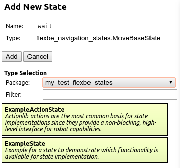
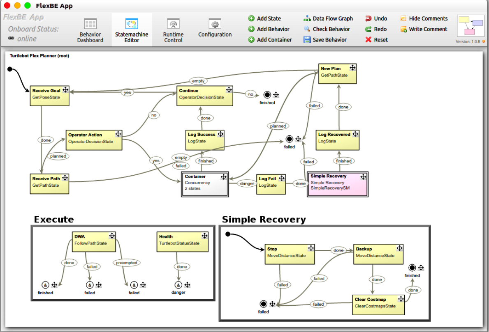

# 开始学习 Flexible Navigation

ROS WIKI：http://wiki.ros.org/flexbe

官方文档：http://philserver.bplaced.net/fbe/documentation.php

## 简介

Flexible Navigation系统为navigation stack的升级版，相比前者其更加灵活，提供了与 FlexBE 兼容的状态机接口。该导航系统将规划和控制分离，以实现更灵活的设计。 

这个包为了将全局规划与局部规划解耦，提供了base_global_planner和base_local_planner插件的分离实现。这些与 ROS 导航堆栈插件完全兼容，但通过 Action 接口与 FlexBE 状态实现对接。  这通过 FlexBE  用户界面提供了完全自主或受监督的协作自主，并允许用户轻松自定义恢复行为。  FlexBE 系统甚至允许在运行时调整行为。

FlexBE 是一种高级行为引擎，可协调机器人的能力以解决复杂的任务。  行为被建模为分层状态机，其中状态对应于活跃的的动作，状态转移描述为对输出结果的反应。 并且将状态机封装成了图形操作界面，大大减少了分层状态机的代码量，可视化界面也便于调试。

## 创建工作空间

官方参考文档：http://philserver.bplaced.net/fbe/download.php

首先创建一个工作ros工作空间，在src文件夹下git clone所需的几个功能包：


然后编译

```
cd ~/catkin_ws
catkin_make
source devel/setup.bash
```

**工作仓库设置**

您可以使用以下准备好的脚本为状态和行为的开发创建自己的存储库。  建议使用此脚本，尤其是当您第一次使用 FlexBE 时。  确保在 catkin 工作区的 /src 文件夹中执行它。  作为项目名称，选择项目特定的内容，不要使用诸如“flexbe”或“behavior”之类的术语（这些将在合理的情况下自动附加）。

```
cd ~/catkin_ws/src
rosrun flexbe_widget create_repo [your_project_name]

# since new packages are created by the above command, build and source again
cd ~/catkin_ws
catkin build
source devel/setup.bash 
```

该脚本将为您的自定义状态和行为创建一个带有本地 git 存储库的新文件夹。   运行此脚本后，您可以将新存储库推送到您选择的任何来源，如终端中所述。  此外，新的 repo 还将包含一个简单的示例行为和两个示例状态。   状态中有大量注释，可以在编写新状态时简要解释最重要的概念，并且是开始开发的良好切入点。

## 系统配置

FlexBE的特点：

 drag&drop behavior creation

 automated code generation

 monitor behavior execution

 adjustable level of autonomy

 runtime-modification of behaviors

### 1.FlexBE Behavior Engine

catkin_workspace，即上述工作空间中已经按教程克隆了一些组件包，其中最重要的就是FlexBE Behavior Engine，它由一些ros功能包组成


- **flexbe_core**

  包含行为引擎的核心部分，如状态继承链和代理发布者/订阅者。	

- **flexbe_input**

  在 onboard behavior executive和任何用户自定义接口之间提供通信通道，以便在运行时提供数据。	

- **flexbe_mirror**
  通过提供完整的信息，对客户端的运行行为进行建模，并从通信协议中抽象出来。

- **flexbe_msgs**
  FlexBE 包之间通信的消息定义。	

- **flexbe_onboard**
  实现板载行为执行程序，是处理状态机运行时的应用程序。

- **flexbe_states**
  提供在行为中使用的独立于系统的默认状态的集合。

- **flexbe_testing**
  单一状态的单元测试框架。

- **flexbe_widget**
  提供实用程序脚本，例如，运行用户界面、启动行为或创建新的行为存储库。

此外，建议或期望将以下 ROS 包驻留在项目的高级控制存储库中：     

 **flexbe_behaviors（必需）**     

保存所有行为清单并引用可用行为。  当您使用 create_repo 脚本时，会自动生成此包。     

**flexbe\_[project]_states**     

与 flexbe_states 类似，您可以创建这样一个包，其中包含所有自定义实现的状态和测试用例。     

**flexbe_launch**    

 如果事情变得更复杂，建议将所有自定义节点和配置文件捆绑在启动文件中以执行行为。     

**behavior_\[name]**

  每个行为都是作为自己的 ROS 包生成的。  在用户界面的配置视图中，您可以根据需要为您的行为设置命名空间。

### 2.FlexBE App

FlexBE 的用户界面提供了强大的行为编辑器以及运行时监控功能。  您可以在离线模式下运行它来开发行为，例如，通过使用快捷图标，或者通过  roslaunch 启动它以访问其全部功能。

 FlexBE App 基于 NWJS 框架。  除了存储库中的源文件之外，它还需要几个 NWJS 二进制文件才能运行。  这些二进制文件在运行 catkin build 时会自动下载到存储库文件夹，但也可以由 rosrun flexbe_app nwjs_install 手动触发。

### 3.Behaviors Repository

默认情况下，第二个存储库是通过运行位于 flexbe_widget 中的 create_repo 脚本创建的。  该存储库将与您的项目一起由您托管，并且基本上包含您为使用 FlexBE 开发的所有自定义内容，主要是状态和行为。  尽管是特定于项目的，但还是有一些共同的部分。  如果您在安装期间尚未初始化行为存储库，请在前往下一个教程之前进行初始化。  选择一个名称，例如“tutorial”，然后在您的 catkin 工作区的 src 文件夹中运行：

```bash
rosrun flexbe_widget create_repo tutorial   # replace "tutorial" by your favorite name if you want
```

最重要的是，ROS 包 tutorial_flexbe_behaviors（或类似名称，如果您更改了上述命令）将出现在您的存储库中，并将成为  FlexBE 的参考点，以便存储您的行为。  它包含一个名为 manifest 的文件夹，其中包含所有行为清单。   行为清单是每个行为定义的抽象接口声明，存储为 XML 文件。  这就是 FlexBE 了解哪些行为可用、在哪里可以找到它们等等的方式。   此外，如果你需要为你的行为存储配置文件，tutorial_flexbe_behaviors 也是一个很好的地方。

如前所述，您的状态和行为是此存储库的主要内容。  对于状态，建议根据自己的目的创建类似于通用状态包 flexbe_states 和捆绑状态的包。


### 用FlexBE app自定义状态机

注：FlexBE 应用程序知道来自各个 ROS 包导出的状态。  如果列表为空，请关闭应用程序，打开一个新终端，确保您找到了工作区（例如，验证 roscd flexbe_states 是否有效）并在此终端中运行应用程序。

比如我创建的行为库会自带两个状态了，如果正确启动app可以找到我的行为库内的行为状态



一系列的状态序列就表示一个小动作，然后再将小动作组合成最大的动作来表示一个过程，即实现分层状态机思想。


## 论文阅读

**title：Flexible Navigation:Finite State Machine-Based Integrated Navigation and Control for ROS Enabled Robots**

### 文章概述

Flexible Navigation导航栈将全局规划、局部规划、控制分开，利用**分层有限状态机（HFSM）**来实现灵活的导航功能。

它**解耦**了move_base的全局规划与局部规划，允许全局规划优先执行、打断运行、重规划，或者开发自己所需的恢复行为。FlexBE允许这些行为在**运行时被修改**，并且**兼容**已有的navigation stack中的规划以及代价地图插件！

Flexible Navigation的两大特点

1.collaborative autonomy 

2.monitoring

### 要点总结

1. 现如今大多现代机器人系统利用高频更新的控制与低频的行为决策、轨迹规划与感知的混合架构。

2. move_base的缺点是将决策规划紧耦合，虽然也是通过插件的形式导入规划模块，但是先做全局规划再做局部规划的这个过程是分不开的；

3. Flexible Navigation的一个设计原则是为了保持对ROS Navigation stack的兼容，并且保证未来的可扩展性。Flexible Navigation的一个重要实现就是将move_base的多个耦合在一起的导航节点解耦，并且用base_global_planner与base_local_planner插件的形式来集成规划模块。解耦后，该框架可提供多层规划场景的灵活设计，并允许用户选择多条规划路径中的一个或者提供规划的后处理功能。

4. 另外一个设计原则是利用Actionlib来实现规划节点与HFSM的接口对接，并且提供允许规划任务抢占、取消、阻塞等消息类型。

5. Flexible Navigation的恢复行为也是通过HFSM实现的，这使得可以重用以前的recovery behavior，并且增加自己的恢复行为。

6. FlexBE 有一个特殊的并发状态实现，支持状态的并行执行，这使得车辆实时运行安全性与监控调试得到保证。

   

   如图所示，多个大的行为动作可以同时进行，这使得同一时间可以处理多个状态与状态转移。

   


