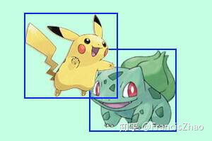

# 碰撞检测

## TEB的碰撞检测方法

### 1.障碍物

teb对障碍物结构的声明放在了Obstacle.h中		

teb共定义了5种障碍物，声明均在Obstacle.h头文件中，分别为：


障碍物外形可分别为圆形、线形、线圆结合形、点形、多边形

每个障碍物类都继承抽象基类Obstacle


#### 1.Obstacle

头文件首先定义Obstacle抽象基类

**类成员变量**

基类共有两个成员变量：

```
bool dynamic_;             //动态障碍物标志
Eigen::Vector2d centroid_velocity_;        //质心速度
```

第一个变量声明障碍物是否是动态的，第二个变量用来表示障碍物的质心速度[vx,vy]

**类成员函数**

下面函数用于获得障碍物质心坐标


下面函数用于判断各种类型的障碍物是否与给定点发生碰撞，获取给定点与障碍物之间的最短距离以及最短点坐标


下面函数用于获得使用恒速模型获得估计的到移动障碍物的最小时空距离，判断是否运动、设置质心速度


下面函数用于将障碍物转换为多边形信息


另外定义了三个智能指针，第一个为障碍物父类指针、第二个是父类常量指针、第三个是障碍物集合


#### 2.PointObstacle

**成员变量**

PointObstacle除了从基类继承的动态标志位、质心速度外，还定义了一个pos\_用于存储障碍物位置坐标

```
bool dynamic_;                                                  //动态障碍物标志位
Eigen::Vector2d centroid_velocity_;        //质心速度
Eigen::Vector2d pos_;                                    //质心坐标
```

#### 3.CircularObstacle

**成员变量**

PointObstacle除了从基类继承的动态标志位、质心速度外，还定义了一个pos\_用于存储障碍物位置坐标和一个radius_用于存储圆形障碍物的半径

```
bool dynamic_;                                                  //动态障碍物标志位
Eigen::Vector2d centroid_velocity_;        //质心速度
Eigen::Vector2d pos_;                                    //质心（原心）坐标
double radius_ = 0.0;                                     //圆形障碍物半径
```

#### 4.LineObstacle

**成员变量**

LineObstacle除了从基类继承的动态标志位、质心速度外，还定义了线段的起点与终点坐标、以及线段的中点坐标

```
bool dynamic_;                                                  //动态障碍物标志位
Eigen::Vector2d centroid_velocity_;        //质心速度
Eigen::Vector2d start_;                                  //线段起点坐标
Eigen::Vector2d end_;	                                //线段终点坐标
Eigen::Vector2d centroid_;                          //线段中点坐标
```

#### 5.PillObstalce

**成员变量**

```
bool dynamic_;                                                  //动态障碍物标志位
Eigen::Vector2d centroid_velocity_;        //质心速度
Eigen::Vector2d start_;                                  //线段起点坐标
Eigen::Vector2d end_;	                                //线段终点坐标
Eigen::Vector2d centroid_;                          //线段中点坐标
double radius_ = 0.0;                                     //圆半径
```

#### 6.PolygonObstacle

**成员变量EquivalenceClassContainerEquivalenceClassContainer**

```
bool dynamic_;                                                  //动态障碍物标志位
Eigen::Vector2d centroid_velocity_;        //质心速度
Point2dContainer vertices_;                        //存储所有的多边形节点
Eigen::Vector2d centroid_;                           //多边形质心坐标
bool finalized_;                                                  //多边形节点是否添加完成
```

### 2.robot_footprint_model

该文件定义了机器人的几何轮廓模型，用于teb优化求解中的**碰撞检测**与rviz可视化。其与costmap中的footprint model不完全一样。轮廓模型类型与参数可以在teb的配置文件中进行配置

轮廓模型类继承关系如下：


轮廓模型分为：

1. 圆（重要）
2. 线
3. 点
4. 多边形（重要）
5. 两个圆的组合

机器人底盘轮廓模型可大致近似为圆（turtlebot）与多边形（无人驾驶车辆），故这两种轮廓模型比较常用。

#### 1.BaseRobotFootprintModel——机器人底盘几何轮廓抽象基类

机器人轮廓模型基类，无成员变量，内有两个用于碰撞检测的纯虚函数需要被每一个子类实现：

第一个函数用于计算机器人在当前轮廓模型、当前位姿下与障碍物的距离

第二个函数用于计算机器人在当前轮廓模型、当前位姿下与**动态障碍物**在**t时刻**的距离


该头文件声明了两个指向抽象基类的共享指针：

```c++
//! Abbrev. for shared obstacle pointers
typedef boost::shared_ptr<BaseRobotFootprintModel> RobotFootprintModelPtr;
//! Abbrev. for shared obstacle const pointers
typedef boost::shared_ptr<const BaseRobotFootprintModel> RobotFootprintModelConstPtr;
```

#### 2.PointRobotFootprint——点轮廓模型

最简单、也是最没用的一种轮廓模型，除非机器人足够小、小到相对局部地图可以看做一个点...实际上基本上是不可能的

点轮廓模型对上面提到了两个用于碰撞检测的纯虚函数的实现是通过obstacles.h中的距离计算函数进行的：


可以看到，这些轮廓模型都是通过障碍物的多态性进行碰撞检测的，即参数是Obstacle父类指针、传入子类对象，即让父类指针指向子类对象，即可满足点轮廓模型对任意类型障碍物进行距离计算！其他轮廓模型的实现是类似的。

#### 3.CircularRobotFootprint——圆轮廓模型

针对圆形底盘的机器人很适用

该类内有个rviz可视化函数,需要用自己的成员变量，即radius_对visualization_msgs::Marker的信息进行写入，这样如果发布对应消息就能在rviz中看到机器人的圆轮廓模型了


#### 4.TwoCirclesRobotFootprint——双圆组合轮廓模型

当车体的前后轮距不一致时可以采用这种模型


#### 5.LineRobotFootprint——线段轮廓模型

线机器人对于在纵向和横向上表现出不同扩展/长度的机器人很有用。


需注意在配置文件中写入线段轮廓模型时，其认为车辆质心在原点[0,0]，故模型参数可配置为：

```
TebLocalPlannerROS:
 footprint_model: # types: "point", "circular", "line", "two_circles", "polygon"
 type: "line"
 line_start: [-0.3, 0.0] 
 line_end: [0.3, 0.0] 
```


#### 6.PolygonRobotFootprint——多边形轮廓模型

阿克曼结构、自动驾驶车辆一般采用这种模型，尤其是矩形外形。

需注意在配置文件中写入线段轮廓模型时，其认为车辆质心在原点[0,0]，故模型参数可配置为：

```
TebLocalPlannerROS:
 footprint_model: # types: "point", "circular", "line", "two_circles", "polygon"
 type: "polygon"
vertices: [[-1,-1],[-1,1],[1,1],[1,-1] ] 
```

注：按顺序写多边形顶点，因为默认两个顶点间存在边，且不用闭合，即默认最后一个节点与第一个节点之间存在边

从代码中可以看到，每增加一个节点（边）就增加了算法时间复杂度，因此轮廓模型的顶点不要太多，这里认为4个就够了，即选取矩形轮廓。

### 3.检测方法

有了障碍物类型的定义与车辆轮廓模型的定义，下面就可以进行障碍物检测了，TEB规划循环中在执行TEB优化求解前需要先更新障碍物序列，这里有三种障碍物更新方式供选择：

1. 用costmap_converter插件将局部代价地图中感知到的障碍物点聚合成多边形
2. 直接利用局部代价地图感知到的障碍物点，即用点模型来进行碰撞检测
3. 利用自定义的障碍物模型来进行碰撞检测，障碍物模型可以定义为上述六种中的任意一种

需要注意方法2中如果直接用栅格点作为点障碍物来进行碰撞检测，则激光雷达上感知范围越广，需要检测的点障碍物越多，效率越低。反之方法一中costmap_converter插件对点进行聚类再转化为多边形，可有效减少障碍物的数量，但同时多边形的碰撞检测也比点障碍物复杂，因此环境越复杂，costmap_converter的转化越有必要。

TEB的碰撞检测算法如下：

1. 设置碰撞检测所需的车辆轮廓模型，一般为矩形轮廓。
2. 遍历每一个TEB状态点
3. 再遍历每一个障碍物，计算当前TEB状态点的车辆轮廓与不同类型障碍物之间的距离
4. 如果当前TEB状态点轮廓模型与当前障碍物距离小于最小安全距离，发生碰撞，则将该障碍物加入到约束项中
5. 通过图优化方法调整状态点位置，使其避开障碍物

对于动态障碍物，由于不知道其与位姿点序列中的哪个点更近，因此对于每个状态点都计算其所在时刻与动态障碍物运动到当前时刻的障碍物距离作为约束项。

## 常用碰撞检测方法

###  **一、包围盒简介**

  三种常见的物体包络框：
OBB—Oriented Bounding Box

AABB—Axis Aligned Bounding Box

SphereBB——sphere Bounding Box


####  球体

 也就是将物体都等效为外接圆/外接球，利用球/圆来检测两个多边形是重合是及其方便的：圆心的距离和半径之和比较即可。


这种方法的优点缺点是如此明显：

> 优点：运算速度快
> 缺点：精度低

这种球体检测的方式在自动驾驶中应用的不多。一是这种方法的精度太低了，相邻车道的车都会检测出碰撞检测。二是感知给出的障碍物大多是方形的，没必要将其转化为圆形。 AABB, 

#### Axis Aligned Bounding Box

从名称中大致能理解其中意思：沿着轴的包围盒子。也就是将物体用方形的盒子包围，这个方形的盒子的四条边都是和坐标轴平行的。



这种方法来判断是否重合的计算量比较小：分别提取每个包围盒的x/y轴的最大值和最小值，变为一维轴上的线段重合检测，如果x轴或者y轴存在不相交的情况，则二者不重合。

这种方法的相比于圆的碰撞检测，精度提高很多，尤其适合形状就是方形的物体（车辆），并且运量并不多，没有三角函数这种耗时大的运算。。

####   OBB，Oriented Bounding Box

但是AABB的碰撞检测精度有限，比如在如下情况：


很明显的是AABB的包围盒与实际相比过大，精度十分有限。因此OBB这种不是一定要沿着坐标轴的包围盒就有优势了。

OBB的定义很简单，就是找一个最小的包围物体的方形。这在自动驾驶中是很自然的，上层的感知给出的数据通常就是这种OBB的图形。

其中OBB的碰撞检测原理就是分离轴定理，示意图如下：


为了判断两个OBB是否发生重叠，可使用分离轴定理。因为分离轴应与A和B的表面正交，可选p, q, s, t为分离轴，然后将OBB投影到这些轴上。如果两个OBB在所有这些轴上的投影相互重叠，则两者相交，否则不相交。因此，为了知道两个OBB是否重叠，只需要找到一条可以使A和B的投影不重叠的轴线即可。肉眼可知，q轴是唯一能将这两个投影分开的轴。

 因此，三者对比：

> 球：运算快，不精确
> OBB:精确，运算慢
> AABB：在以上二者之间

### **二、Apollo碰撞检测方法**

Planning中自车采用OBB方式。在感知领域box用的很多，图像处理、激光雷达分割聚类这些需要对物体标记跟踪，当然，3D的box更复杂了。

```
https://zhuanlan.zhihu.com/p/99911487 ：自动驾驶的碰撞检测原理并不新鲜，和2D游戏中的碰撞检测原理相同，原理大多是超平面分割定理，难点在如何提高碰撞检测的效率或者精度，这个方法和技巧就不简单了
```

**1.建立自车Box**

    const auto& trajectory_point =
        discretized_trajectory.TrajectoryPointAt(static_cast<std::uint32_t>(i));
    double ego_theta = trajectory_point.path_point().theta();
    Box2d ego_box(
        {trajectory_point.path_point().x(), trajectory_point.path_point().y()},
        ego_theta, ego_length, ego_width);
    // 车辆center和车辆的几何中心不重合，所以box需要校正一下
    double shift_distance =
        ego_length / 2.0 - vehicle_config.vehicle_param().back_edge_to_center();
    Vec2d shift_vec{shift_distance * std::cos(ego_theta),
                    shift_distance * std::sin(ego_theta)};
    ego_box.Shift(shift_vec);
这块比较简单，锁定当前轨迹点，构建Box框，由于几何中心和车辆中心不一致(普通乘用车前后配比几乎没有1:1，除了柯尼塞格one:1，别说，说就是五菱宏光)，所以做了一下校正，及ego_box就是我们要的。
**2.快速剔除非碰撞Box**

因为检测过程是根据采样点遍历进行的，可以理解为逐帧进行，后边可以知道精确的碰撞检测其实是比较繁琐的，对于显而易见的不会碰撞，方法也是简单粗暴快捷明了：

```
if (box.max_x() < min_x() || box.min_x() > max_x() || box.max_y() < min_y() ||
      box.min_y() > max_y()) {
    return false;
  }
```

用图说话就是：凡是在灰色区域外障碍物box，都是一定没有发生碰撞的，这是一个充分不必要条件…因为，会有类似t3时刻的发生。上述方法只能用在轴对齐的box中，对于非轴对齐的，只能用于快速粗略的剔除不碰撞Box：


**3.碰撞的精确检测**

第2步中能够快速跳过无碰撞的时刻，对于出现t3时刻的情况，采取了另外的检测方法：分离轴定理。
通俗理解就是—**投影**。如果空间中两个物体，我们想知道是否接触，最直接的方法便是来回绕着看看，确认一下两者间是否有间隙，换个概念就是两个演员拍吻戏，从正面看是亲上了，从侧面看也亲上了，从上面看，额，也亲上了…那就是真亲上了，否则只要有一面是没亲上的，那就是**假戏**～
人是立体的，而且还是凸多面体，这方法可还行？好在Planning中，我们是以上帝视觉观测，是二维空间，事情更加简单，最少投影数：**是几边形，就投几次影**，**apollo中采用的是凸四边形，所以四次投影**，到位，分别是：
**1.在自车纵轴上投影**
**2.在自车横轴上投影**
**3.在障碍物纵轴上投影**
**4.在障碍物横轴上投影**


ap=中心连线构成的向量在投影线上的投影长，bp、cp分别为自车、障碍物在投影线上的投影长度
判断的依据：
												ap≤bp+cp
成立，则说明两者在拍吻戏了…呸，两者有接触或碰撞的可能了。很明显，从下面这张图已经看出它俩是假戏了，并没有发生碰撞，不妨碍进行额外的三次确认，继续：

keep on going…

go go:


从其它三次其实是显示二者有重叠的，所以这四次确认需要一套做完，可以看到第2步粗暴高效的跳过了很多不必要的计算。
**4.具体实现**

    详细可看另一位大神《分离轴定理的应用》，地址：https://zhuanlan.zhihu.com/p/99761177

投影这种计算，向量运算是很便捷的，
确定边界相对于自身坐标系的坐标→转换为笛卡尔坐标(全局)→向量常规运算→得到对应投影长度

Apollo具体代码部分：

```
const double shift_x = box.center_x() - center_.x();
  const double shift_y = box.center_y() - center_.y();

  const double dx1 = cos_heading_ * half_length_;
  const double dy1 = sin_heading_ * half_length_;
  const double dx2 = sin_heading_ * half_width_;
  const double dy2 = -cos_heading_ * half_width_;
  const double dx3 = box.cos_heading() * box.half_length();
  const double dy3 = box.sin_heading() * box.half_length();
  const double dx4 = box.sin_heading() * box.half_width();
  const double dy4 = -box.cos_heading() * box.half_width();
  // 对于OBB边框，使用分离轴定理进行碰撞检测
  return std::abs(shift_x * cos_heading_ + shift_y * sin_heading_) <=
             std::abs(dx3 * cos_heading_ + dy3 * sin_heading_) +
                 std::abs(dx4 * cos_heading_ + dy4 * sin_heading_) +
                 half_length_ &&
         std::abs(shift_x * sin_heading_ - shift_y * cos_heading_) <=
             std::abs(dx3 * sin_heading_ - dy3 * cos_heading_) +
                 std::abs(dx4 * sin_heading_ - dy4 * cos_heading_) +
                 half_width_ &&
         std::abs(shift_x * box.cos_heading() + shift_y * box.sin_heading()) <=
             std::abs(dx1 * box.cos_heading() + dy1 * box.sin_heading()) +
                 std::abs(dx2 * box.cos_heading() + dy2 * box.sin_heading()) +
                 box.half_length() &&
         std::abs(shift_x * box.sin_heading() - shift_y * box.cos_heading()) <=
             std::abs(dx1 * box.sin_heading() - dy1 * box.cos_heading()) +
                 std::abs(dx2 * box.sin_heading() - dy2 * box.cos_heading()) +
                 box.half_width();

```


## 学习costmap_converter

teb_local_planner 包支持 costmap_converter 插件。  **这些插件将占用的 costmap_2d  单元格转换为几何图元（点、线、多边形）作为障碍物**。  **在不激活任何插件的情况下，每个占用的成本图单元都被视为单点障碍。如果地图的分辨率很高，这会导致大量障碍物，并且可能会在计算独特拓扑（取决于障碍物的数量）时引入更长的计算时间或不稳定性**。另一方面，障碍的转换也需要时间。但是，转换时间在很大程度上取决于所选算法，并且可以在单独的线程中执行。据了解，costmap转换是实验性的，未来必须确定效率和导航质量的最佳配置。


参考文档

Costmap conversion

http://wiki.ros.org/teb_local_planner/Tutorials/Costmap%20conversion

costmap_converter

http://wiki.ros.org/costmap_converter

## 参考文档

**自动驾驶运动规划中的碰撞检测**

https://zhuanlan.zhihu.com/p/99911487

**Apollo中Lattice轨迹碰撞检测**

https://blog.csdn.net/weixin_34945803/article/details/106628352

**点在多边形内检测**

https://blog.csdn.net/weixin_33840661/article/details/94599492

**2d碰撞检测**

https://www.spieleprogrammierer.de/wiki/2D-Kollisionserkennung#Kollision_Kreis-Strecke

**计算多边形质心**

*http://de.wikipedia.org/wiki/Geometrischer_Schwerpunkt#Polygon*

**点到线的最短距离**

https://blog.csdn.net/weixin_41316824/article/details/90699499

