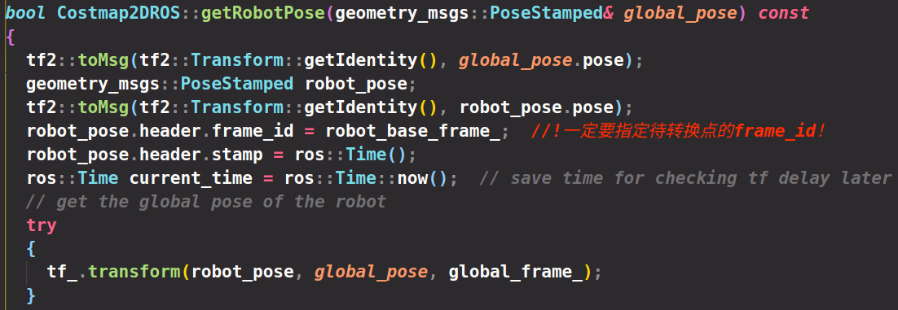

# ROS的TF2坐标变换

今天解决了一个历史遗留问题，就是tf中的坐标变换，对tf进一步加深了了解。

在move_base.cpp与costmap_2d_ros.cpp中都用到了获取当前车辆全局位姿的函数如图：



其中传入的参数也是希望传出的结果，因此采用引用传递。robot_pose是车辆在车身坐标系下的坐标，即坐标原点，所以对其初始化为0，然后对header进行赋值，一定要指定转换前坐标点所在的坐标系！否则无法完成转换且会报错。


global_pose是车辆在全局坐标系下的坐标，做变换前也先给个初始值。

**变换流程**

最重要就是tf2::transform函数，它的作用是将一个坐标系下的坐标点变换到期望坐标系下。它其实是从tf tree上获取得到当前两个坐标之间的坐标变换，因此相当于只需传入两个坐标系的名称与坐标即可完成转换。


函数参数如下

```
in – The object to transform
out – The transformed output, preallocated by the caller.
target_frame – The string identifer for the frame to transform into.
timeout – How long to wait for the target frame. Default value is zero (no blocking).
```

其中第一个参数是待转换点的消息格式，其中一定要指定该点所在的坐标系，即指定frame_id,并指定该点在该坐标系下的坐标。

第二个参数是转换后的结果，这里先对其赋个初值，最后输出的结果会其重新赋值，并且会将期望的坐标id赋给它。

第三个参数就是期望转换到哪个坐标系下。