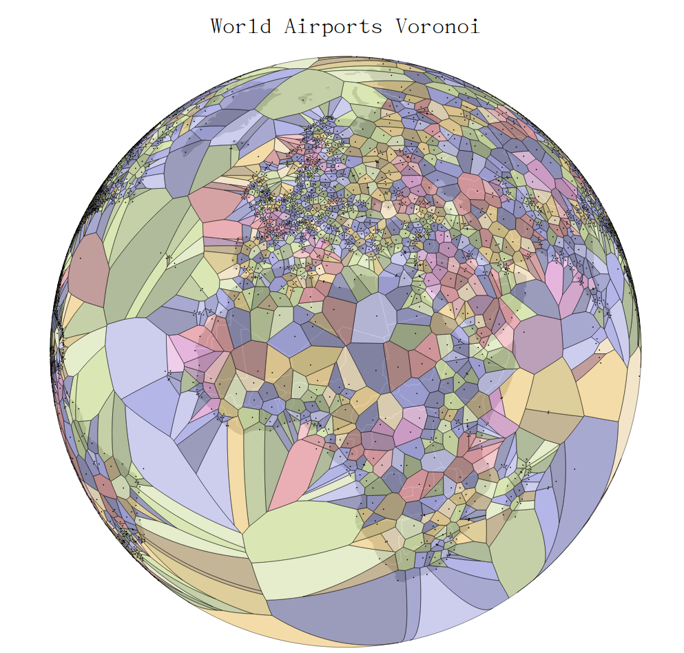
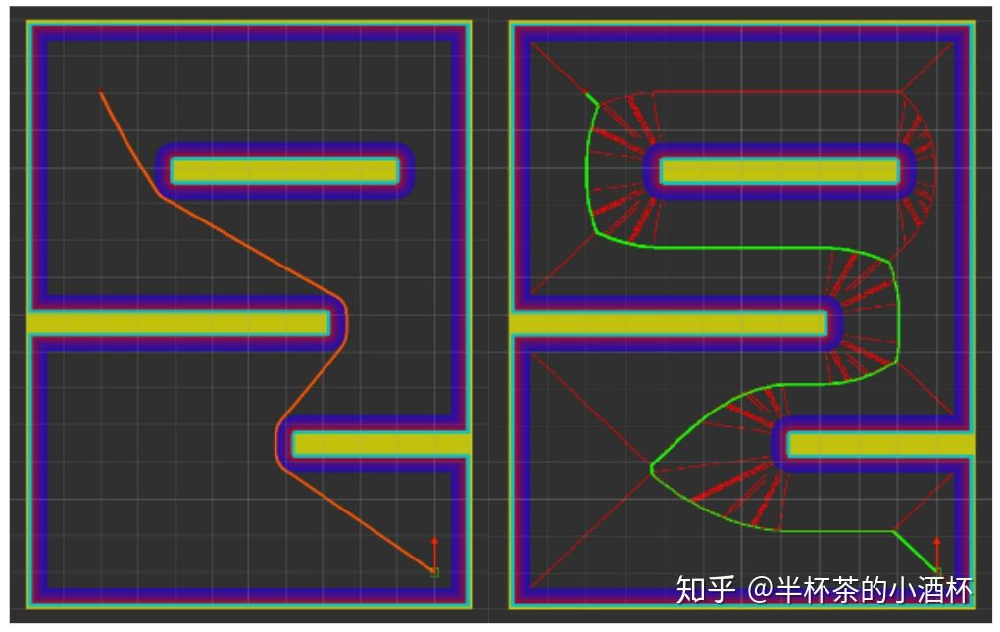

# **自动驾驶路径规划-Voronoi Planner**

参考链接：

b站视频（泰森多边形的构造与应用）：https://www.bilibili.com/video/BV1Ea4y1H7LT

知乎文章（自动驾驶路径规划-Voronoi Planner）：https://zhuanlan.zhihu.com/p/135441089

知乎文章（从自然到空间-认识Voronoi）：https://zhuanlan.zhihu.com/p/48252861

全球机场Voronoi图：https://www.jasondavies.com/maps/voronoi/airports/

Voronoi规划器论文：Local and Global Motion Planning for Unmanned Surface Vehicle 

## Voronoi图简介

Voronoi Diagram(沃罗诺伊图，又称泰森多边形)是由俄国数学家Georgy  Voronoy提出的一种空间分割算法。它通过一系列的种子节点(Seed  Points)将空间切分为许多子区域，每个子区域被称为一个Cell，每个Cell中的所有点到当前Cell中的种子节点(Seed  Points)的距离小于到其它所有种子节点(Seed Points)的距离。

泰森多边形的特性是：

1.每个泰森多边形内仅含有一个离散点数据。

2.泰森多边形内的点到相应离散点的距离最近。

3.位于泰森多边形边上的点到其两边的离散点的距离相等。

泰森多边形可用于邻近分析、接近度分析、可达性分析等。例如，可以用离散点的性质来描述泰森多边形区域的性质；可用离散点的数据来计算泰森多边形区域的数据；判断一个离散点与其它哪些离散点相邻时，可根据泰森多边形直接得出，且若泰森多边形是n边形，则就与n个离散点相邻；当某一数据点落入某一泰森多边形中时，它与相应的离散点最邻近，无需计算距离。

## Voronoi planner

Voronoi Planner最大化的利用了障碍物之间的空隙，确保生成的路径是最大程度远离所有障碍物的安全行驶路径。解决了A*算法趋于找到最短路径从而距离障碍物过近导致的安全问题。

